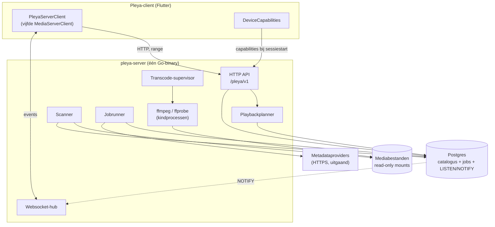
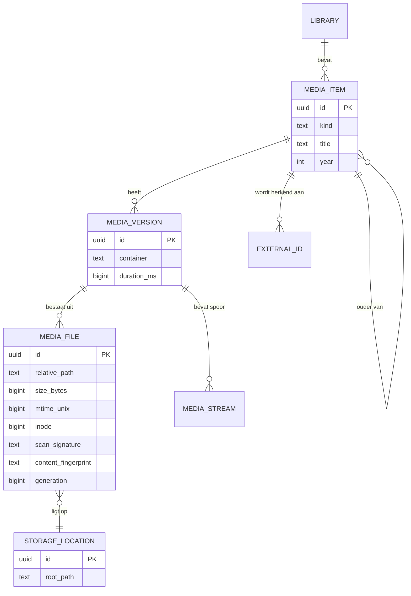
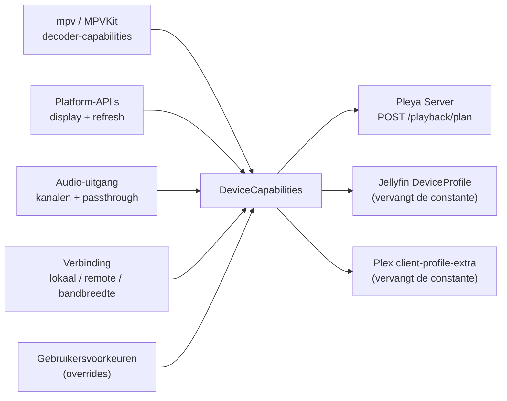
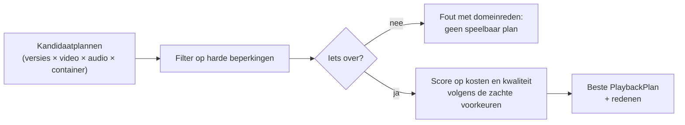
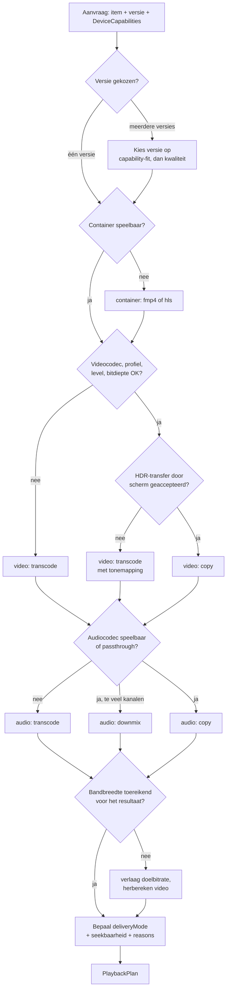
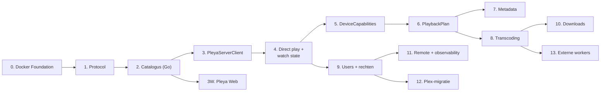

# Pleya Server: onderzoek en architectuurontwerp

**Status:** **architectuurbaseline goedgekeurd, uitvoering niet vrijgegeven.** De hoofdrichting ligt
vast en wordt niet opnieuw geopend. De eerstvolgende beslissing is *wanneer* PS-1 wordt vrijgegeven,
niet hoe dit ontwerp nog beter kan. Vrijgave gebeurt expliciet, na 2.8.0.
**Datum:** 18 augustus 2026
**Auteur:** Michel Knoop
**Scope:** dit document beschrijft een ontwerp. Er is geen servercode geschreven, er is niets
gewijzigd in `lib/`, `share_server/` of `server/`, en het lopende releasewerk aan 2.8.0 is niet
aangeraakt.

**Over de lengte.** Dit bestand staat ruim boven de 500 regels waar ontwikkeldocumentatie in dit project normaal wordt gesplitst. Bewuste uitzondering: het is een onderzoeksverslag dat je één keer lineair leest en daarna via de inhoudsopgave raadpleegt, niet een naslagdocument dat per hoofdstuk wordt opgezocht. Splitsen zou het argument uit elkaar trekken zonder dat er iets makkelijker te vinden wordt.

**Einddoel dat dit hele document dient:** Pleya moet uiteindelijk zelfstandig functioneren zonder
Plex als server, waarbij Plex en Jellyfin optionele adapters blijven en Pleya Share zijn eigen
lichte productrol houdt. Welke capabilities daarvoor aanwezig moeten zijn staat niet hier maar in
[docs/PLEYA-SERVER-REPLACEMENT-MATRIX.md](PLEYA-SERVER-REPLACEMENT-MATRIX.md); de definitie van
"volwaardig" en de gate die hem toetst staan in [hoofdstuk 25](#25-definition-of-done-pleya-server-als-zelfstandig-mediaserverproduct).

---

## Inhoud

1. [Managementsamenvatting](#1-managementsamenvatting)
2. [De grens tussen Pleya Share en Pleya Server](#2-de-grens-tussen-pleya-share-en-pleya-server)
3. [Wat de client vandaag is](#3-wat-de-client-vandaag-is)
4. [Koppelingen met Plex en hun risico](#4-koppelingen-met-plex-en-hun-risico)
5. [Domeinmodel](#5-domeinmodel)
6. [Serverarchitectuur](#6-serverarchitectuur)
7. [Bibliotheek, identiteit en scanner](#7-bibliotheek-identiteit-en-scanner)
8. [Metadata en artwork](#8-metadata-en-artwork)
9. [Device-capabilities in de client](#9-device-capabilities-in-de-client)
10. [De playbackplanner op de server](#10-de-playbackplanner-op-de-server)
11. [Streaming, remux en transcoding](#11-streaming-remux-en-transcoding)
12. [Het protocol en het wire-contract](#12-het-protocol-en-het-wire-contract)
13. [Gebruikers, rechten en kijkstatus](#13-gebruikers-rechten-en-kijkstatus)
14. [Realtime en push](#14-realtime-en-push)
15. [Remote access](#15-remote-access)
16. [Security en dreigingsmodel](#16-security-en-dreigingsmodel)
17. [Opslag en datamodel](#17-opslag-en-datamodel)
18. [Observability en beheer](#18-observability-en-beheer)
19. [Migratie vanaf Plex](#19-migratie-vanaf-plex)
20. [Client- en serververantwoordelijkheden](#20-client--en-serververantwoordelijkheden)
21. [Teststrategie](#21-teststrategie)
22. [Deployment en distributie](#22-deployment-en-distributie)
23. [Roadmap in dertien fasen plus een fundering](#23-roadmap-in-dertien-fasen-plus-een-fundering)
24. [Voorgestelde DEC-besluiten en open vragen](#24-voorgestelde-dec-besluiten-en-open-vragen)
25. [Definition of Done: Pleya Server als zelfstandig mediaserverproduct](#25-definition-of-done-pleya-server-als-zelfstandig-mediaserverproduct)

[Bijlage A: aannames die het onderzoek weerlegt](#bijlage-a-aannames-die-het-onderzoek-weerlegt)

---

## 1. Managementsamenvatting

De opdracht ging uit van een client die diep aan Plex vastzit en die eerst ontkoppeld moet worden
voordat serverontwikkeling verstandig is. Die volgorde klopt niet meer, en dat verandert wat er
ontworpen moet worden.

> **De grootste ontbrekende abstractie in Pleya is niet een generieke media-backend, want die
> bestaat al, maar een expliciet capability- en playback-contract tussen client en server.**

Drie metingen dragen die zin.

**De neutrale laag bestaat.** `lib/media/media_server_client.dart` is een abstracte klasse van 766
regels met ruim tachtig members, een sealed foutcontract in
`lib/exceptions/media_server_exceptions.dart:10`, en per methode een notitie over wat Plex doet en
wat Jellyfin doet. Er zijn vier implementaties: `PlexClient` (4396 regels plus parts),
`JellyfinClient` (362 regels plus negen parts van samen 3590 regels), `LocalFolderClient` (1376) en
`PleyaShareClient` (917). `ConnectionKind` (`lib/connection/connection.dart:8`) kent vier soorten,
`ServerCapabilities` negentien vlaggen, `MediaItem` is een sealed union met per-backend fabrieken,
en `ServerId` is een getypeerde extension type (`lib/media/ids.dart:14`). Over de hele `lib/` staan
125 backend-vertakkingen verspreid over 52 bestanden, en `data_aggregation_service.dart` (623
regels) noemt Plex of Jellyfin alleen nog in commentaar.

**Er draait al een Pleya-mediaserver.** `share_server/` is een headless Dart-server die op de NAS in
Docker draait met read-only mounts, met een scanner (`share_server/lib/src/scanner.dart`),
code-pairing met challenge/response (`pairing.dart`), HTTP range-streaming en kijkvoortgang per gast
(`server.dart`). Dat is precies de fase die de oorspronkelijke opdracht als "later" wegzette, en hij
werkt.

**De greenfield zit in de playbackbeslissing.** De client stelt vandaag geen enkele
device-capability vast die naar een server gaat. Plex' `X-Plex-Client-Profile-Extra`
(`lib/services/plex_client.dart:3072-3110`) en Jellyfins `DeviceProfile`
(`lib/services/jellyfin_client/parts/playback.dart:504-543`) zijn allebei hardgecodeerde constanten,
identiek op Apple TV, Android TV en Windows. De enige knop is `TranscodeQualityPreset`, een enum die
in zijn eigen doc-comment "modeled on Plex Web's custom-quality table" heet
(`lib/models/transcode_quality_preset.dart:1`). HDR, Dolby Vision, passthrough en Atmos worden
uitsluitend client-side afgehandeld en bereiken geen server. Op de vraag of nieuwe
playbackfunctionaliteit te veel Plex-verantwoordelijkheid in de client legt is het antwoord dus
omgekeerd: de client neemt te weinig verantwoordelijkheid en besteedt de beslissing uit aan de
backend die toevallig aan de lijn hangt.

Een vierde vondst stuurt het protocolontwerp. Het bestaande Pleya Share-protocol serveert op
`/library` letterlijk de freezed `MediaItem` als JSON
(`lib/services/pleya_share/pleya_share_protocol.dart:14`), en `viewOffsetMs` en `viewCount` staan in
de antwoorden (`share_server/lib/src/server.dart:330-336`). Het eigen protocol spreekt dus Plex, en
koppelt server en client compile-time aan hetzelfde model. Dat is precies wat een versieerbaar
protocol niet moet doen.

**Wat daaruit volgt voor de bouwvolgorde.** Niet eerst ontkoppelen en dan bouwen, maar: eerst een
wire-contract, dan een read-only catalogus in Go, dan de client als vijfde backend, dan direct play,
en pas daarna capabilities en het playbackplan. Metadata schuift achter de playbackkern, omdat de
architecturale vernieuwing in de playbackbeslissing zit en metadata daar niets van blokkeert.

### 1.1 Het einddoel is niet onderhandelbaar

De bouwvolgorde hierboven gaat over *hoe*. Dit gaat over *waarheen*, en het staat vooraan omdat het
de enige zin is die na dertien fasen nog even hard moet gelden als vandaag.

> **Pleya Server is geen aanvullende backend, geen beperkte homeserver en geen technisch experiment
> naast Plex. Het einddoel is een zelfstandig mediaserverproduct waarmee een Pleya-gebruiker Plex
> Media Server kan uitschakelen zonder voor de afgesproken Pleya-productscope afhankelijk te blijven
> van Plex voor bibliotheekbeheer, metadata, afspelen, transcoding, gebruikers, kijkstatus, gebruik
> buiten huis, downloads of dagelijks serverbeheer.**

De roadmap is incrementeel, en daar hoort één regel bij die de rest beschermt:

> **"Niet in deze fase" is iets anders dan "niet nodig voor het eindproduct".**

Een functie verdwijnt niet uit het eindproduct omdat hij nog geen Phase ID heeft. Waar dat onderscheid
concreet wordt gemaakt is [docs/PLEYA-SERVER-REPLACEMENT-MATRIX.md](PLEYA-SERVER-REPLACEMENT-MATRIX.md):
daar draagt elke serververantwoordelijkheid die Pleya vandaag bij Plex afneemt een bestemming, een
fase, een status en een oordeel of hij de Plex-off gate blokkeert. Dit document beschrijft het
ontwerp; die matrix bewaakt de volledigheid.

Pleya vervangt Plex niet door Plex te klonen. Voor iedere Plex-verantwoordelijkheid bestaat
uiteindelijk precies één van drie besluiten: een eigen Pleya-equivalent, hetzelfde probleem bewust
anders opgelost, of aantoonbaar buiten de productscope. Die laatste categorie is nooit een restbak
voor wat moeilijk bleek.

---

## 2. De grens tussen Pleya Share en Pleya Server

Dit hoofdstuk staat vooraan omdat het de rest bepaalt. Pleya Share is geen voorloper van Pleya
Server en geen legacy. Het is een ander product met een andere levensduur en een ander
vertrouwensmodel.

| | Pleya Share | Pleya Server |
| --- | --- | --- |
| Eigenaar | een toestel dat tijdelijk een map uitleent | het huishouden |
| Levensduur | een sessie of een logeerpartij | permanent |
| Vertrouwen | zescijferige code, roteert na koppeling | accounts, rollen, rechten per bibliotheek |
| Waarheid | de bestandsboom | de catalogus in Postgres |
| Kijkstatus | per gast, JSON op schijf | gezaghebbend, per gebruiker, synchroniseerbaar |
| Metadata | bestandsnaam | providers plus eigen canoniek record |
| Afspelen | direct play met range | plan met direct play, remux of transcode |
| Bereik | LAN, plus relay-fallback | LAN en remote |

Gedeeld wordt het **vocabulaire**, niet de runtime. Itemvorm, kijkvoortgangvorm, range-semantiek,
pairing- en tokenbegrippen horen in één specificatie te staan; de implementaties blijven los. Het
mechanisme daarvoor is een protocolspecificatie in de repo met een profielbegrip:

- **Profiel `minimal`.** Bladeren, streamen met range, kijkvoortgang per gast. Dat is wat
  `share_server` vandaag al doet.
- **Profiel `full`.** Alles uit `minimal`, plus gebruikers, rechten, playbackplannen,
  transcodesessies, realtime, downloads.

Een client leest bij `GET /pleya/v1/info` welk profiel er aan de andere kant staat en welke
capabilities de server aanbiedt. Zo ontstaan er geen twee concurrerende protocollen zonder dat Dart
en Go aan elkaar vastzitten. Het overzetten van `share_server` op dat profiel is een latere,
optionele stap en geen voorwaarde voor Pleya Server v1.

---

## 3. Wat de client vandaag is

### 3.1 De neutrale laag

`MediaServerClient` is de enige poort waarlangs UI-code een server bereikt. De abstractie is niet
theoretisch: hij draagt vandaag vier heel verschillende backends, waaronder er twee (`LocalFolder`,
`PleyaShare`) die geen enkele Plex-eigenschap hebben. Dat is het beste bewijs dat de laag houdt.

| Implementatie | Bestand | Regels | Bijzonderheid |
| --- | --- | --- | --- |
| `PlexClient` | `lib/services/plex_client.dart` | 4396 plus parts | rijkste capability-set, Live TV, DVR, metadata-edit |
| `JellyfinClient` | `lib/services/jellyfin_client.dart` plus negen parts | 362 plus 3590 | per-user scope, eigen sessiemodel |
| `LocalFolderClient` | `lib/services/local_folder_client.dart` | 1376 | geen netwerk, geen metadata |
| `PleyaShareClient` | `lib/services/pleya_share/pleya_share_client.dart` | 917 | eigen protocol, rapporteert zich als `MediaBackend.local` |

`ServerCapabilities` (negentien booleans) is het mechanisme waarmee de UI functionaliteit aan- of
uitzet zonder naar het backendtype te kijken. `data_aggregation_service.dart` fant queries uit over
alle online servers en is daarbij backend-blind; de enige treffers op "Plex" of "Jellyfin" in dat
bestand staan in doc-comments.

### 3.2 Waar de vertakkingen wel zitten

125 plekken vertakken alsnog op `MediaBackend` of `ConnectionKind`, verspreid over 52 bestanden. Dat
is geen bewijs van een lekkende abstractie; een deel is legitiem (Live TV bestaat alleen bij Plex,
Jellyfin heeft per-user scope). Wat wel telt is dat een vijfde backend die 125 plekken langsloopt.
Dart dwingt exhaustieve switches af op enums, dus na het toevoegen van een waarde aan `MediaBackend`
wijst de compiler het merendeel zelf aan. Dat maakt de uitbreiding vervelend maar niet gevaarlijk.

### 3.3 De blinde vlek

Wat nergens bestaat is een beschrijving van het toestel. Er is geen type dat zegt: dit scherm doet
4K, deze uitgang doet Dolby Vision profiel 5 niet maar profiel 8 wel, deze ontvanger neemt E-AC-3
maar geen TrueHD aan, deze verbinding houdt 40 Mbit vol. Alle drie de plekken die zoiets zouden
kunnen dragen zijn constanten:

- `plex_client.dart:3072-3110` bouwt `X-Plex-Client-Profile-Extra` uit een vaste lijst clauses.
- `jellyfin_client/parts/playback.dart:504-543` stuurt een `DeviceProfile` met vaste
  `DirectPlayProfiles` en één `TranscodingProfile`.
- `transcode_quality_preset.dart` biedt een handmatige bitrate-keuze en verder niets.

Op een Apple TV 4K met een Atmos-ontvanger gaat exact dezelfde JSON de lijn over als op een oude
Android-tablet.

---

## 4. Koppelingen met Plex en hun risico

Per koppeling: waar hij zit, wat hij doet, wat er Plex aan is, wat het risico is bij een vijfde
backend, en welke abstractie het oplost. Geen van deze punten wordt in dit spoor gerepareerd.

### 4.1 Profielen kennen alleen Plex Home

| | |
| --- | --- |
| Bestand | `lib/profiles/profile.dart:179`, `lib/providers/user_profile_provider.dart` |
| Symbool | `ProfileKind { local, plexHome }`, `UserProfileProvider._resolvePlexAuth` |
| Verantwoordelijkheid | het actieve profiel binden aan een token waarmee gebruikersinstellingen worden gelezen |
| Plex-afhankelijkheid | de enum heeft geen Jellyfin-variant; de resolutie is een driestapsketen die eindigt bij het account-owner-token (`user_profile_provider.dart:192-268`) |
| Risico | een Pleya Server-profiel past in geen van beide waarden, en de fallback naar het owner-token is bij een backend met echte rollen fout in plaats van onhandig |
| Voorgestelde abstractie | `ProfileKind` verbreden naar een backend-neutrale identiteit met een `ProfileCredentialResolver` per backend; Pleya Server levert een eigen resolver die nooit naar een owner-token terugvalt |

De doc-comment op regel 212 zegt het zelf: het token alleen kan de twee gevallen niet uit elkaar
houden, en beide takken kunnen bij het owner-token eindigen. Dat is precies het soort ambiguïteit
dat bij een rechtenmodel niet mag bestaan.

### 4.2 Plex-getypeerde clientresolvers

| | |
| --- | --- |
| Bestand | `lib/utils/provider_extensions.dart:22-85` |
| Symbool | `_resolveClient`, `_requireClient`, `getPlexClientForServer`, `getPlexClientForLibrary`, `getPlexClientWithFallback`, `tryGetPlexClientForServer` |
| Verantwoordelijkheid | vanuit een `ServerId` of `MediaLibrary` een client ophalen |
| Plex-afhankelijkheid | het retourtype is `PlexClient`, niet `MediaServerClient` |
| Risico | 19 callsites buiten het bestand, waaronder een force-unwrap op `lib/screens/libraries/tabs/library_browse_tab.dart:296` (`manager.getPlexClient(serverId)!`) die alleen veilig is zolang de aanroeper zelf al weet dat de bibliotheek Plex is |
| Voorgestelde abstractie | de neutrale variant wordt de standaard; de Plex-getypeerde helpers blijven bestaan maar krijgen een naam die aankondigt dat ze een Plex-only pad bedienen, en de force-unwrap wordt een expliciete fout met bericht |

Het bestand documenteert de val zelf op regel 68-69. Dat de val bekend is maakt hem niet ongevaarlijk
zodra er een vijfde backend bij komt die ook geen `PlexClient` is.

### 4.3 Eén account levert N servers, één connectie levert er één

| | |
| --- | --- |
| Bestand | `lib/services/multi_server_manager.dart` |
| Symbool | `_plexServers`, `_jellyfinByCompoundId`, `_jellyfinHealthByCompoundId`, `_reconnectDebounce` |
| Verantwoordelijkheid | clients registreren, gezondheid bijhouden, herverbinden |
| Plex-afhankelijkheid | een Plex-account levert een lijst servers met een gedeelde `clientIdentifier`; een Jellyfin-connectie is er precies één, geadresseerd via een compound id |
| Risico | twee parallelle reconnect-paden en twee gezondheidskaarten; een derde model erbij verdubbelt de kans dat een pad achterblijft |
| Voorgestelde abstractie | één registratie-eenheid ("connectie levert nul of meer servers") waar Plex, Jellyfin en Pleya Server allemaal een geval van zijn, met één gezondheidskaart en één reconnect-sweep |

Pleya Server lijkt hier op Jellyfin: één endpoint, één server. Dat maakt fase 3 goedkoop en zegt
niets over of de asymmetrie later opgeruimd moet worden.

### 4.4 Cachescope neemt de server als eenheid

| | |
| --- | --- |
| Bestand | `lib/database/app_database.dart:158-163`, `:318` |
| Symbool | `DownloadedMedia.clientScopeId`, `OfflineWatchProgress.clientScopeId`, `_clientScopePredicate` |
| Verantwoordelijkheid | offline data scheiden per client |
| Plex-afhankelijkheid | het schema is ontstaan met server als scope; Jellyfins per-user scope is er later met een migratie bovenop gelegd |
| Risico | Pleya Server heeft ook per-user scope, dus een `null`-scope betekent straks drie dingen tegelijk |
| Voorgestelde abstractie | scope expliciet maken als getypeerd paar (server, gebruiker) in plaats van een nullable string, met een migratie die bestaande rijen invult in plaats van te raden |

De predicate op regel 318-319 vertaalt `null` naar `IS NULL`. Dat is correct, maar het betekent dat
"nog geen scope" en "bewust geen scope" niet te onderscheiden zijn.

### 4.5 Seek betekent transcode herstarten, en dat weet alleen Plex

| | |
| --- | --- |
| Bestand | `lib/screens/video_player/parts/seeking.dart:17-23` |
| Symbool | `_usesPlexVodTranscodeSeekPolicy`, `_plexTranscodeSeekAction`, `_restartPlexTranscodeAt` |
| Verantwoordelijkheid | bepalen of een seek native mag of dat de stream opnieuw op moet |
| Plex-afhankelijkheid | de conditie test letterlijk `_currentMetadata.backend == MediaBackend.plex` |
| Risico | elke nieuwe backend die transcodeert erft stilzwijgend het verkeerde gedrag (native seek in een stream die dat niet kan) |
| Voorgestelde abstractie | de server vertelt in het playbackplan of de stream seekbaar is en binnen welke grenzen; de client vertakt op die eigenschap, niet op het backendtype |

Dit is het duidelijkste voorbeeld van het thema uit hoofdstuk 1: een eigenschap van de stream is
gecodeerd als een eigenschap van de leverancier.

### 4.6 Er bestaat geen einde van een sessie

| | |
| --- | --- |
| Bestand | de hele `lib/` |
| Symbool | `universal/stop` |
| Verantwoordelijkheid | een transcode-sessie op de server opruimen |
| Bevinding | het aantal treffers op `universal/stop` in `lib/` is nul |
| Risico | Plex ruimt verweesde sessies zelf op na een timeout; een eigen server die dat overneemt zonder afsluit-hook laat ffmpeg-processen staan |
| Voorgestelde abstractie | sessielevenscyclus in het protocol, met een expliciete `DELETE` op de sessie plus een keepalive waarvan het uitblijven de sessie opruimt |

Dit is geen bug in de client maar een gat dat pas ontstaat zodra Pleya Server zelf transcodeert.
Fase 8 bouwt beide kanten tegelijk.

### 4.7 Bijvangst die hier alleen gemeld wordt

`lib/widgets/new_content_badge.dart:36` bepaalt het NEW-label voor films en afleveringen met
`(item.viewCount ?? 0) == 0`. Een titel die half bekeken is maar nooit is uitgekeken heeft
`viewCount == 0` en toont dus "NEW". De juiste bron is de afgeleide kijkstatus (`isWatched` plus
`viewOffsetMs`), niet de teller. **Dit wordt in dit spoor niet gerepareerd**; het staat in
[hoofdstuk 24](#24-voorgestelde-dec-besluiten-en-open-vragen) onder de backlog.

---

## 5. Domeinmodel

### 5.1 Niet opnieuw ontwerpen

`lib/media/` is de basis en blijft dat. Pleya Server sluit erop aan als vijfde `MediaServerClient`.
Wat er moet gebeuren is klein en mechanisch:

- `MediaBackend` (`lib/media/media_backend.dart`) krijgt een vierde waarde, `pleyaServer`. De enum
  heeft nu `plex`, `jellyfin` en `local`; `PleyaShareClient` rapporteert zich als `local`
  (`pleya_share_client.dart:113` en `:160`), wat voor een deel-uit-een-map klopt maar voor een echte
  server niet.
- `ConnectionKind` (`lib/connection/connection.dart:8`) krijgt een vijfde waarde naast `plex`,
  `jellyfin`, `local` en `pleyaShare`.
- `MediaBackend.fromString` heeft een tolerante tak die onbekende waarden op `plex` laat vallen met
  een waarschuwing. Die tak moet `pleyaServer` kennen vóór er ooit een rij mee wordt weggeschreven,
  anders leest een oudere build een Pleya Server-item terug als Plex-item.

Omdat Dart exhaustieve switches afdwingt, wijst de compiler na die twee toevoegingen het merendeel
van de 125 vertakkingen zelf aan. Dat is de goedkoopste vorm van volledigheid die er is.

### 5.2 De naamgevingsschuld blijft staan

Het model draagt Plex-woorden: `ratingKey` als kolomnaam, `leafCount`, `viewedLeafCount`,
`viewOffsetMs`, `viewCount`. Hernoemen levert nu niets op. De namen zijn intern consistent, ze staan
in gegenereerde code en in drift-migraties, en een hernoeming raakt honderden regels zonder één
gedragsverandering. Het moment waarop het wel loont is het moment waarop het protocol eigen
veldnamen krijgt (fase 1): dan bestaat er een tweede vocabulaire dat niet vastzit aan de historische
namen, en kan een latere hernoeming binnen `lib/` gebeuren zonder dat er iets over de lijn verandert.
Tot dan is de regel: **het protocol gebruikt nooit een Plex-woord, ook niet als het interne model dat
wel doet.**

### 5.3 Wordt `MediaServerClient` te breed?

De opdracht vraagt hier een oordeel, geen refactor. Het oordeel:

De klasse heeft ruim tachtig members op 766 regels en draagt vier implementaties. Twee daarvan
(`LocalFolderClient`, `PleyaShareClient`) implementeren een minderheid van de members zinvol en
leunen voor de rest op `ServerCapabilities` om de UI weg te houden. Dat werkt, en het is de reden dat
de laag houdt. Het is ook de reden dat een vijfde implementatie niet gratis is: Pleya Server begint
in fase 3 met bladeren en groeit pas in fase 8 naar transcoding, dus er is een periode waarin de
klasse voor de vijfde keer grotendeels ongeïmplementeerd blijft.

Er zijn drie natuurlijke breuklijnen zichtbaar in de bestaande code: Live TV en DVR zitten al in
aparte types (`live_tv_support.dart`, `live_tv_dvr_support.dart`, `noop_live_tv_support.dart`),
metadata-edit is Plex-only, en playlists en collections zijn optioneel per backend. Een opsplitsing
langs die lijnen zou de kernklasse tot ongeveer de helft terugbrengen.

**Aanbeveling: niet nu.** De reden is meetbaar. Een opsplitsing raakt alle vier de bestaande
implementaties en een onbekend deel van de 125 vertakkingen, terwijl de winst pas zichtbaar wordt
bij de vijfde implementatie die er nog niet is. De juiste volgorde is: eerst Pleya Server erbij als
vijfde, en dán beoordelen welke members bij vijf implementaties structureel leeg blijven. Dat is een
meting in plaats van een voorspelling. Het beoordelingsmoment staat vast in fase 4, met een concreet
criterium: als bij vijf implementaties meer dan een kwart van de members in meer dan de helft van de
implementaties `UnsupportedError` gooit, is de klasse te breed en volgt een aparte opsplitsingsronde.

#### De meting, uitgevoerd in PS-4 op 21 augustus 2026

**Uitkomst: de klasse is te breed.** Achtentwintig van de vierentachtig members (33%) zijn in drie of
meer van de vijf implementaties structureel leeg, tegen een drempel van een kwart.

| Implementatie | Structureel leeg |
| --- | --- |
| Plex | 2 van 84 |
| Jellyfin | 2 van 84 |
| Lokale map | 33 van 84 |
| Pleya Share | 35 van 84 |
| Pleya Server | 42 van 84 |

**Wat "structureel leeg" hier betekent**, want dat is ruimer dan de letterlijke formulering van het
criterium. `UnsupportedError` gooien is in deze codebase juist de uitzondering: het error contract
van de interface schrijft voor dat een read zonder bron leeg antwoordt en een write die niet kan
`false` teruggeeft. Beide tellen mee, want voor een gebruiker betekenen ze hetzelfde. Wat níét
meetelt is een getter met een echt antwoord: `marksWatchedOnPlaybackStopped => false` zegt iets over
dit backend en is geen stub.

**Waar de leegte zit.** Vrijwel volledig in twee clusters: afspeellijsten en verzamelingen
(twaalf members), en de persoonlijke laag plus metadata-uitstapjes (`setFavorite`, `rate`,
`findByIdentity`, `fetchExternalIds`, `fetchExtras`, `fetchPersonMedia`, `fetchRelatedHubs`). Dat
zijn precies twee van de drie breuklijnen die hierboven al benoemd staan, nu met getallen eronder in
plaats van met een vermoeden.

**Wat dit besluit niet is.** Geen opsplitsing in PS-4. Het criterium zegt dat er een aparte ronde
volgt, en dat is bewust een aparte ronde: hij raakt vijf implementaties en de vertakkingen eromheen,
en die diff naast de PS-4-diff leggen maakt allebei onleesbaar. Wat PS-4 opleverde is het getal en
de plek, zodat die ronde kan beginnen met een lijst in plaats van met een inventarisatie.

---

## 6. Serverarchitectuur

### 6.1 Eén binary

Pleya Server is één Go-binary met de scanner, de jobrunner en de transcode-supervisor in hetzelfde
proces. Postgres is de enige verplichte infrastructuurdependency. Jobs staan in diezelfde database,
en fan-out naar websockets loopt over `LISTEN/NOTIFY`.



### 6.2 Waarom geen losse containers bij v1

De verleiding is een aparte transcoder-service, een aparte scanner en een broker ertussen. Dat
verdient zijn plek pas als er workers op een andere machine staan. Tot die tijd koopt splitsen niets
en kost het een jobprotocol, een deploymentverhaal en een tweede plek waar configuratie kan
verlopen. Wat er in v1 staat is een lokale transcode-executor achter een interne aanroep, en verder
niets: geen worker-registratie, geen jobprotocol, geen `transcode_workers`-tabel. Fase 13 voegt die
toe met een migratie, en pas nadat is aangetoond dat één NAS tekortschiet. Een schemawijziging is
goedkoop; een abstractie die drie jaar meeloopt zonder tweede gebruiker is dat niet.

Geen Redis en geen NATS bij v1. Postgres draagt de wachtrij en de fan-out. De prijs daarvan is
bekend en acceptabel: `LISTEN/NOTIFY` heeft een payloadlimiet van 8 kB, dus een notify draagt een id
en geen document, en de ontvanger leest het document zelf. Dat is geen omweg maar de juiste vorm,
omdat de ontvanger daarmee altijd de actuele rij ziet in plaats van een verouderde kopie.

### 6.3 Procesgrenzen die wel bestaan

ffmpeg en ffprobe draaien als kindprocessen, nooit in-process. Drie redenen: een crash in een decoder
mag de server niet meenemen, een transcode moet met een signaal te doden zijn, en resource-limieten
(nice-waarde, aantal threads) zijn per proces in te stellen. De supervisor houdt per sessie een
handle en een watchdog vast, zodat een sessie zonder keepalive gegarandeerd wordt opgeruimd. Zie
[hoofdstuk 11](#11-streaming-remux-en-transcoding).

### 6.4 Schaalpunten die nu al vastliggen

De scanner is I/O-gebonden en draait met een begrensde worker-pool, omdat een NAS met draaiende
schijven bij te veel parallelle statistieken langzamer wordt in plaats van sneller. ffprobe draait
niet op elk bestand bij elke scan, maar alleen op wat aantoonbaar veranderde
([hoofdstuk 7](#7-bibliotheek-identiteit-en-scanner)). Range-requests worden door de kernel
afgehandeld via `sendfile`-achtige paden waar Go dat toestaat, zodat direct play geen geheugen kost
per stream. Het aantal gelijktijdige transcodes is een expliciete configuratiewaarde met een default
die past bij een NAS, niet bij een werkstation.

---

## 7. Bibliotheek, identiteit en scanner

### 7.1 Identiteit los van locatie

De belangrijkste modelbeslissing: een item is niet een bestand. Een film die in 1080p en in 4K op
schijf staat is één item met twee versies, en een versie die over twee bestanden is gesplitst is één
versie met twee bestanden.



Interne ids zijn UUIDv7. De reden voor v7 en niet v4: de tijdsprefix maakt ids sorteerbaar op
aanmaakmoment, wat de index-locality op grote tabellen aanzienlijk beter maakt dan een willekeurige
v4. De reden voor een UUID en niet een serial: ids moeten uitdeelbaar zijn zonder rondgang naar de
database, en een migratiegereedschap moet ids kunnen genereren voordat het schrijft.

Een pad is nooit een identiteit. Een item dat van schijf verhuist behoudt zijn id, zijn kijkstatus en
zijn metadata, omdat alleen de `MEDIA_FILE`-rij verandert.

### 7.2 Drie begrippen die niet door elkaar mogen lopen

Voordat de scanner iets doet, staan hier drie dingen los van elkaar. Ze worden makkelijk verward, en
die verwarring is de bron van stille datacorruptie.

| Begrip | Wat het is | Wat het niet is |
| --- | --- | --- |
| **Scan-signature** (`inode`, `size`, `mtime`, plus een goedkope hash over kop en staart) | een optimalisatie die zegt of er dure controle nodig is | geen bewijs van gelijkheid, en nooit een identiteit |
| **`MediaFile.id`** (UUIDv7) | de persistente interne identiteit van een bestand, waaraan versies, items en kijkstatus hangen | niet afgeleid van pad, inhoud of enige externe eigenschap |
| **Content fingerprint** | sterker bewijs dat twee paden dezelfde bytes dragen, gebruikt bij relocatie tussen mounts en bij herstel na een database-import | geen scanoptimalisatie, want hij is te duur om elke ronde te draaien |

De regel die dit draagt: **een scan-signature mag op zichzelf nooit betekenen "dit is gegarandeerd
hetzelfde bestand".** Een hash over de eerste en laatste megabyte zegt niets over het middenstuk, en
juist bij grote mediabestanden kan een remux of een gerepareerde container het midden veranderen
terwijl kop en staart intact blijven. De signature beslist alleen of er verder gekeken wordt.

### 7.3 Wat de scanner elke ronde doet

Een volledige scan die elk bestand door ffprobe haalt is op een NAS met tienduizenden bestanden
onbruikbaar. De scanner werkt daarom in lagen.

**Laag 1, goedkoop.** Voor elk bestand: `(inode, size, mtime)`. Is de drieslag onveranderd, dan is er
niets te doen. Dit is één `stat` per bestand.

**Laag 2, iets duurder.** Is de drieslag veranderd, of is `inode` niet betrouwbaar (sommige
netwerkmounts hergebruiken inodes), dan volgt de hash over de eerste en de laatste megabyte plus de
grootte. Wijkt die af, dan is het bestand zeker gewijzigd. Komt hij overeen, dan is het bestand
*waarschijnlijk* ongewijzigd, en dat woord is het hele punt van 7.2.

**Laag 3, duur.** Alles wat laag 2 als gewijzigd aanmerkt gaat door ffprobe, en de `generation` van
de `MediaFile` loopt op.

Faalt die analyse, dan levert ze geen versie op en laat ze er ook geen staan. Een `media_version`
draagt `container` en `duration_ms` als `NOT NULL` juist omdat hij pas na een geslaagde ffprobe
ontstaat, en dezelfde regel geldt aan de andere kant: een bestand waarvan de nieuwe inhoud niet te
analyseren is laat zijn versie, zijn duur en zijn sporen los. Het bestand blijft wel bekend, met zijn
foutreden erbij, zodat het niet als nieuw wordt ontdekt en een volgende ronde het opnieuw probeert.
Zie [DEC-047](DECISIONS.md#dec-047-een-mislukte-analyse-laat-de-versie-los).

Een hernoeming binnen dezelfde filesystemcontext wordt herkend aan de inode: hetzelfde bestand op een
nieuw pad houdt zijn `MediaFile.id`, zijn item en zijn kijkstatus. Dat is precies het scenario waarin
Plex vandaag een dubbele entry maakt. Voor relocatie *tussen* mounts, waar de inode niets meer
betekent, is de signature onvoldoende bewijs en volgt de content fingerprint. Die staat in het schema
vanaf v1 als nullable kolom en wordt in fase 2 alleen berekend waar hij gevraagd wordt; wanneer hij
verplicht wordt is een aparte afweging.

De scanner is bovendien **incrementeel via filesystem-events waar dat kan** en valt terug op een
periodieke volledige ronde. Events zijn een versnelling, nooit de enige bron: een gemiste event mag
niet betekenen dat een bestand permanent onzichtbaar blijft.

### 7.4 Wat ffprobe wel en niet betrouwbaar zegt

Dit is het punt waar een mediaserver stil fout gaat, dus de detectiegrenzen staan hier expliciet.

Elk technisch veld draagt in het schema twee dingen naast zijn waarde: een `detectionStatus` en een
`source`. Er is bewust **geen** enkele `confidence`-score van hoog tot laag, want dan moet de planner
zelf verzinnen wat "middel" betekent voor Dolby Vision tegenover wat het betekent voor een
kanaalindeling, en dat verschil is precies wat ertoe doet.

```
detectionStatus: confirmed | inferred | unknown
source:          ffprobe_stream | ffprobe_side_data | bitstream_probe | filename | manual
```

`confirmed` betekent dat de bron het veld expliciet draagt. `inferred` betekent dat het is afgeleid
uit iets anders, bijvoorbeeld een Atmos-vermoeden op grond van een codec plus een bitrate zonder dat
de JOC-substream is gezien. `unknown` betekent dat er niets over te zeggen valt.

| Eigenschap | Bron | Typische status |
| --- | --- | --- |
| Container, duur, resolutie, framerate | `ffprobe_stream` | `confirmed` |
| Videocodec en profiel (H.264 High, HEVC Main 10) | `ffprobe_stream` | `confirmed` |
| Bitdiepte | `ffprobe_stream` (`pix_fmt`) | `confirmed` |
| HDR10 | `ffprobe_stream` (`color_transfer=smpte2084`) plus mastering-metadata | `confirmed` |
| HLG | `ffprobe_stream` (`color_transfer=arib-std-b67`) | `confirmed` |
| Dolby Vision profiel en compatibiliteits-id | `ffprobe_side_data` (`DOVI configuration record`) | `confirmed` als het record er is, anders `unknown`; de laag-structuur blijft vaak `inferred` |
| HDR10+ | `bitstream_probe` over meerdere frames | `inferred` bij een enkele probe |
| Atmos in TrueHD | `ffprobe_side_data` of `bitstream_probe` (JOC) | `confirmed` bij een gezien JOC-veld, anders `inferred` |
| Atmos in E-AC-3 | `bitstream_probe` (JOC-substream) | dezelfde tweedeling |
| Aantal kanalen | `ffprobe_stream` (`channel_layout`) | `confirmed` |
| Exacte kanaalindeling bij ongebruikelijke mixen | `ffprobe_stream` | `inferred` |

Het beleid hangt aan de combinatie van eigenschap en status, niet aan een generieke drempel. Een
`inferred` Dolby Vision-profiel is gevaarlijker dan een `inferred` kanaalindeling: bij het eerste
levert een verkeerde gok een zwart of paars beeld op, bij het tweede hoogstens een suboptimale
downmix. Dat verschil verdwijnt zodra beide "medium confidence" heten. De planner leest daarom per
veld welke status voldoende is om op te bouwen, en `unknown` telt nooit als toestemming.

---

## 8. Metadata en artwork

Metadata staat bewust ná de playbackkern in de roadmap (fase 7). Een catalogus zonder posters is
lelijk maar bruikbaar; een catalogus die niet kan afspelen is niets.

### 8.1 Providerabstractie vanaf de eerste regel

Er is één interface `MetadataProvider` met `Search`, `Details` en `Artwork`, en providers zijn
registreerbaar per bibliotheek. TMDB is de eerste implementatie. TVDB is een optie waar het
licentiemodel dat toelaat, en die afweging is uitdrukkelijk nog niet gemaakt
([hoofdstuk 24](#24-voorgestelde-dec-besluiten-en-open-vragen)).

### 8.2 Providers schrijven nooit op het canonieke record

Elke providertreffer landt in een kandidatenlaag: `metadata_candidates(item_id, provider, payload,
fetched_at, score)`. Het canonieke record wordt daaruit samengesteld met een expliciete
prioriteitsvolgorde, en handmatige correcties door een gebruiker krijgen de hoogste prioriteit en
worden nooit overschreven door een latere providerronde.

Twee dingen die dit oplost. Een provider die zijn API wijzigt of een verkeerde match teruggeeft
beschadigt geen gebruikersdata, want het canonieke record is afgeleid en herbouwbaar. En een
gebruiker die een titel corrigeert ziet die correctie niet terugdraaien bij de volgende scan, wat
een klacht is die bij bestaande servers structureel terugkomt.

### 8.3 Attributie is een productvereiste

TMDB verplicht tot bronvermelding met logo in de interface die de data toont. Dat is geen voetnoot
in een licentiebestand maar een zichtbaar element in de client, en het hoort in de acceptatiecriteria
van fase 7. Wordt TMDB later vervangen, dan verdwijnt de vermelding mee; zolang hij gebruikt wordt,
staat hij er.

### 8.4 Artwork

Artwork wordt lokaal opgeslagen met content-hash als bestandsnaam en geserveerd met een sterke
`ETag` en een lange `Cache-Control`. Afgeleide formaten (poster-thumbnail, achtergrond op
schermbreedte) worden op aanvraag gemaakt en gecachet, niet vooraf voor elk item in elke maat. De
client vraagt een maat en krijgt de dichtstbijzijnde beschikbare of een nieuw gerenderde.

---

## 9. Device-capabilities in de client

Dit hoofdstuk en het volgende zijn samen de kern van het onderzoek. Ze beschrijven wat vandaag
nergens bestaat.

### 9.1 Wat het model beschrijft

`DeviceCapabilities` is een client-side type dat één vraag beantwoordt: wat kan deze combinatie van
app, toestel, uitgang en verbinding op dit moment aan? Vier lagen, elk met een eigen bron van
waarheid:

**Decoder.** Welke videocodecs, profielen, levels en bitdieptes de speler daadwerkelijk decodeert,
en welke **containers** hij als bron accepteert. Bron is de mpv/MPVKit-laag plus platformkennis, niet
een aanname. Een Apple TV 4K en een Apple TV HD verschillen hier.

De containerlijst hangt aan de demuxer en hoort daarom bij deze laag. Hij staat er omdat een browser
MP4 en WebM neemt en geen MKV, terwijl de Flutter-speler vrijwel alles neemt: dat verschil is een
capability en geen clienttype, en
[hoofdstuk 10.4](#104-waar-de-planner-nooit-op-vertakt) verbiedt de planner expliciet om op het
clienttype te vertakken. Zonder de lijst in het model zou een browser alleen te bedienen zijn door
die regel te breken. Vastgelegd in hoofdstuk 11.1 van
[het masterplan](pleya-server-masterplan-proposal.md).

**Weergave.** Resolutie, refresh-rates, HDR-transferfuncties die het aangesloten scherm accepteert.
Op tvOS en Android TV is dit uit het systeem te lezen; op desktop is het deels bekend en deels een
gebruikersinstelling.

**Audio-uitgang.** Aantal kanalen, en per codec of passthrough mogelijk is. Dit is de laag waar het
vandaag het meest misgaat, omdat de app wel weet dat hij multichannel mag aanvragen maar de server
dat nooit hoort.

**Verbinding.** Een gemeten of geschatte bandbreedte plus of de verbinding lokaal is. Lokaal versus
remote is een harde eigenschap, geen heuristiek: een server op hetzelfde subnet is iets anders dan
een server achter een tunnel.

### 9.2 Waar het vandaan komt en waar het heen gaat



De winst zit in die drie pijlen naar rechts. Hetzelfde model voedt Pleya Server, en vervangt tegelijk
de hardgecodeerde `DeviceProfile` op `jellyfin_client/parts/playback.dart:504-543` en de vaste
clause-lijst op `plex_client.dart:3072-3110`. Dat is de reden dat fase 5 losstaat van Pleya Server:
hij verbetert Plex en Jellyfin ook, en is daarmee zelfstandig waardevol als Pleya Server later zou
vertragen.

### 9.3 Gebruikersvoorkeuren zijn overrides, geen bron

Een gebruiker mag zeggen "forceer stereo" of "nooit transcoderen boven 1080p". Dat is een override
op een gedetecteerde capability, en het model houdt beide waarden vast: wat gedetecteerd is en wat
de gebruiker eroverheen heeft gezet. De server ontvangt het resultaat plus de informatie dat het een
override is, zodat een uitlegbare reden ("stereo omdat je dat hebt ingesteld") mogelijk blijft.

`TranscodeQualityPreset` blijft bestaan als bandbreedtevoorkeur en wordt onderdeel van de
verbindingslaag. Wat vervalt is zijn rol als enige signaal richting de server.

### 9.4 Wat het niet is

`DeviceCapabilities` beschrijft geen voorkeur voor een taal, geen ondertitelstijl en geen
afspeelsnelheid. Dat zijn gebruikersinstellingen die al bestaan en die niets met de
playbackbeslissing te maken hebben. De grens is scherp: alleen wat de vraag "kan dit toestel deze
bytes weergeven" beantwoordt hoort erin.

---

## 10. De playbackplanner op de server

### 10.1 De uitkomst is rijker dan een enkel woord

Een planner die "direct play of transcode" antwoordt is te grof, om twee redenen. Video en audio
kunnen onafhankelijk behandeld worden (video kopiëren, audio downmixen is een veelvoorkomend en goed
plan), en de reden van de keuze moet naar de gebruiker.

Een `PlaybackPlan` bevat daarom:

- een videobesluit (`copy`, `transcode`, met doelcodec, doelresolutie en doelbitrate),
- een audiobesluit (`copy`, `transcode`, `downmix`, met doelcodec en kanalen),
- een ondertitelbesluit (`external`, `embed`, `burn`),
- een containerbesluit (`original`, `fmp4`, `hls`),
- de resulterende `deliveryMode` (`directPlay`, `directStream`, `remux`, `transcode`),
- seekbaarheid en de grenzen daarvan,
- een `reason`-lijst met domeinredenen.

Die laatste is niet cosmetisch. Vandaag kan de app niet uitleggen waarom er getranscodeerd wordt, en
dat is de meestgestelde vraag van iedereen die een mediaserver draait.

Een reden is een **domeincode met parameters**, geen vertaalsleutel:

```json
{
  "reason": {
    "code": "audio.truehd_passthrough_unsupported",
    "parameters": { "source_codec": "truehd", "target_codec": "eac3", "channels": 6 }
  }
}
```

De server weet niet hoe de i18n van de client is georganiseerd en mag dat ook niet weten. Een veld
als `reasonKey: "playback.audioUnsupported"` zou de sleutelboom van de Flutter-app tot
protocolcontract maken, waarna het hernoemen van een vertaalsleutel een breaking change is. De keten
is: protocolcode, dan een mapper in de client, dan de lokale vertaling. Een client die een code niet
kent toont een generieke tekst en logt de code, in plaats van niets te tonen.

### 10.2 Harde beperkingen, zachte voorkeuren, en een score

De planner is conceptueel geen boom van `if`-takken maar een filter met een scoring erachter. Dat
onderscheid staat hier al vast, ook als de eerste implementatie eenvoudiger blijft, want het bepaalt
waar nieuwe regels straks landen.

**Harde beperkingen** sluiten een plan uit. Ze zijn niet af te kopen met kwaliteitsverlies en niet te
overrulen door een voorkeur. De decoder kent AV1 niet, het scherm accepteert geen HDR-transfer, de
server heeft geen encoder voor het doelformaat, de bron mist een spoor dat het plan nodig heeft.

**Zachte voorkeuren** sturen de keuze tussen plannen die allemaal mógen. Liever direct play dan
remux, liever de originele audio dan een downmix, liever 1080p direct dan 4K getranscodeerd, niet
boven 20 Mbit op een remote verbinding, en de gebruikersoverrides uit
[hoofdstuk 9.3](#93-gebruikersvoorkeuren-zijn-overrides-geen-bron).



Twee dingen die deze vorm oplevert. Een nieuwe eigenschap is een regel erbij in het filter of een
term erbij in de score, niet een tak in een groeiende boom die met elke toevoeging moeilijker te
overzien wordt. En "er is geen plan" is een expliciete uitkomst met een reden, in plaats van dat de
laatste `else` iets kiest wat toevallig overblijft.

De eerste implementatie mag het besluitpad hieronder letterlijk volgen: bij één versie en een
overzichtelijk aantal codecs komt dat op hetzelfde neer. Zodra er een derde dimensie bij komt
(hardwareversnelling die per doelformaat verschilt, bijvoorbeeld) is het filter-met-score de vorm die
het aankan.

### 10.3 Het besluitpad



Twee eigenschappen van dit pad zijn opzettelijk:

**Versiekeuze komt eerst.** Bij twee versies van dezelfde film kiest de server de versie die het
minste werk kost bij dit toestel, niet automatisch de hoogste kwaliteit. Een 4K HDR-bron naar een
1080p-SDR-toestel transcoderen is duur en zichtbaar slechter dan de 1080p-versie direct afspelen.

**Bandbreedte komt als laatste.** De codec-geschiktheid bepaalt eerst wat er überhaupt kan; daarna
pas knijpt bandbreedte de kwaliteit. Andersom levert het plannen op tegen een limiet die er misschien
niet toe doet.

### 10.4 Waar de planner nooit op vertakt

De planner kijkt nooit naar het clienttype, het platform of de app-versie. Alles wat hij weet komt
uit `DeviceCapabilities` en uit de eigenschappen van de versie. Dat is de directe les uit
[hoofdstuk 4.5](#45-seek-betekent-transcode-herstarten-en-dat-weet-alleen-plex): zodra gedrag aan een
producttype hangt in plaats van aan een eigenschap, erft de volgende backend het verkeerde gedrag.

### 10.5 Tabelgedreven tests

De planner is een pure functie van (versie-eigenschappen, capabilities, beleid) naar plan, en wordt
zo getest. De testtabel dekt minimaal: HEVC Main 10 HDR10 naar een SDR-1080p-toestel; Dolby Vision
profiel 5 naar een toestel dat alleen profiel 8 accepteert; TrueHD Atmos naar een stereo-uitgang;
E-AC-3 5.1 naar een ontvanger met passthrough; AV1 naar een decoder zonder AV1; een container die de
speler niet kent met een codec die hij wel kan; een 4K-bron over een remote verbinding met 8 Mbit;
en de gevallen waarin een veld `inferred` of `unknown` is en de planner dus de veilige kant moet
kiezen, per eigenschap verschillend. Elke rij legt de verwachte `deliveryMode` én de verwachte
`reason.code` vast, want een goed plan om de verkeerde reden is een latente bug. Eén rij dekt het
geval waarin het harde filter niets overlaat: dat hoort een expliciete fout op te leveren en geen
willekeurig laatste plan.

---

## 11. Streaming, remux en transcoding

### 11.1 Direct play is de standaard en het meeste verkeer

Verreweg de meeste bestanden in een huishoudelijke bibliotheek zijn afspeelbaar zoals ze zijn. Het
hoofdpad is dus: `GET /pleya/v1/stream/{versionId}` met volledige HTTP-range-ondersteuning,
`Accept-Ranges: bytes` en correcte `206`-antwoorden. Geen sessie, geen state, geen opruimwerk.

**Over de validator, herzien op 21 augustus 2026.** Dit hoofdstuk beloofde eerder een sterke
validator over `(MediaFile.id, generation)`, met de eis dat de `ETag` verandert zodra de bytes
veranderen. Poort 4 heeft die belofte laten vallen, en
[DEC-050](DECISIONS.md#dec-050-de-etag-op-stream-is-een-zwakke-validator-en-pleya-belooft-geen-byte-identiteit)
legt uit waarom: `generation` loopt alleen op wanneer de drielagige detectie iets aanmerkt, laag 2 is
een steekproef over kop en staart, en een remux die het midden verandert glipt daar doorheen. RFC
9110 §8.8.1 vraagt strict revision control of een collision-resistant hash, en Pleya beheert de
bestanden niet.

Wat er staat is een **zwakke** validator (`W/"..."`) uit `(dev, ino, size, mtime_ns, ctime_ns)` plus
`generation`. Verschillend betekent "er is iets veranderd"; gelijk betekent niets over de bytes.
`If-Range` levert daarom nooit een `206`: de server negeert de `Range` en antwoordt met `200` en het
volledige bestand, de terugval uit RFC 9110 §13.1.5. Een gewone `Range` verandert niet, en dat is het
pad dat elke seek gebruikt, dus afspelen merkt er niets van. Een hash over tachtig gigabyte berekenen
om een header te kunnen zetten blijft uitgesloten: dat is precies het soort werk dat een NAS
onbruikbaar maakt.

**Autorisatie op dit pad kent drie vormen.** Een bearer-header voor de app, een streamtoken in de
querystring voor een externe speler die geen header kan zetten, en sinds
[DEC-051](DECISIONS.md#dec-051-de-browser-krijgt-een-streamsessie-met-een-cookie-per-sessie-en-het-geheim-komt-nooit-in-een-url)
een browser-streamsessie: een niet-geheime `ss` in de URL, met het geheim in een cookie waarvan de
naam die id draagt. De derde bestaat omdat een `<video>`-element zijn range-aanvragen uit `src`
bouwt en een streamtoken van vijf minuten een lange film op de eerste seek breekt.

### 11.2 Wanneer er wel een sessie is

Remux en transcode hebben een sessie, omdat er een proces achter hangt. De vorm hieronder is de
**voorgenomen** vorm en wordt pas als protocoloppervlak vastgelegd in fase 8, de fase die hem
introduceert. Fase 1 specificeert hem niet; zie de scoperegel in
[hoofdstuk 12.2](#122-welk-oppervlak-wanneer-wordt-gespecificeerd). Wat hier staat is de reden dat
het contract er überhaupt moet komen, niet de tekst ervan.

| Stap | Aanroep | Effect |
| --- | --- | --- |
| Openen | `POST /playback/sessions` met het plan | ffmpeg start, sessie-id terug plus stream-URL |
| Levend houden | `POST /playback/sessions/{id}/ping` | watchdog opnieuw gezet |
| Verplaatsen | `POST /playback/sessions/{id}/seek` | binnen de grenzen uit het plan, of herstart |
| Sluiten | `DELETE /playback/sessions/{id}` | proces gedood, tijdelijke bestanden weg |

De afsluitstap is nieuw ten opzichte van alles wat de client vandaag doet: `universal/stop` komt nul
keer voor in `lib/`. Een client die de `DELETE` niet stuurt is geen fout die de server mag laten
lekken, dus de watchdog is de garantie en de `DELETE` de beleefdheid. Een sessie zonder ping
verdwijnt na een vaste periode, ook als de client is gecrasht of het toestel is uitgezet.

### 11.3 fMP4 en HLS, geen DASH

Op het transcode-pad is fMP4 het voorkeursformaat, met HLS waar segmentatie nodig is. DASH wordt
niet gebouwd. De reden is beperkt en eerlijk: de spelerlaag is overal mpv of een platformspeler die
HLS goed ondersteunt, en een tweede manifestformaat levert een tweede plek op waar seek, ondertitels
en audiowissels apart getest moeten worden zonder dat één gebruiker er iets van merkt.

De namen en paden hierboven zijn indicatief. Wat wel nu al vastligt is de eigenschap: er is een
expliciete afsluiting, en de watchdog is de garantie die niet van clientgedrag afhangt.

### 11.4 Seek is een eigenschap van de stream

Het plan zegt of seek binnen de huidige stream mag en tot hoe ver. Bij direct play is dat het hele
bestand. Bij een transcode zonder segmentatie is het het al geproduceerde deel plus een marge; verder
springen betekent de sessie op een nieuw startpunt herstarten. De client vertakt op dat veld, niet op
`backend == plex` zoals `seeking.dart:17-23` vandaag doet. Fase 6 legt het veld vast in het protocol;
fase 8 maakt het waar op de server.

### 11.5 Hardwareversnelling

De supervisor detecteert bij het opstarten welke encoders en decoders beschikbaar zijn (VideoToolbox
op Apple, VAAPI of QSV op Linux-x86, NVENC waar aanwezig) en legt dat vast als servercapability. Een
plan dat transcoding vraagt krijgt het snelste beschikbare pad; ontbreekt hardwareversnelling, dan
wordt dat een zichtbare eigenschap van de server en een reden om het aantal gelijktijdige sessies
lager te zetten. Software-x264 op een NAS-CPU is een geldige uitkomst, maar dan wel eentje waarvan de
gebruiker weet dat hij hem heeft.

---

## 12. Het protocol en het wire-contract

Dit hoofdstuk beschrijft de grens tussen client en server. Alles wat hier niet in staat, mag een
client niet aannemen. Wat er in **fase 1** wordt gespecificeerd is minder dan wat er in dit hoofdstuk
staat, en 12.2 legt uit waar die streep loopt.

### 12.1 Eigen wire-types

Het protocol definieert eigen types. Er gaat nooit een freezed `MediaItem` over de lijn, ook niet als
de vorm toevallig lijkt. De bestaande fout staat in
`lib/services/pleya_share/pleya_share_protocol.dart:14` (`/library` levert `MediaItem`-JSON) en in
`share_server/lib/src/server.dart:330-336` (`viewOffsetMs` en `viewCount` in het antwoord): server en
client zitten daarmee vast aan hetzelfde Dart-model, en een veldwijziging in de app is een
protocolwijziging.

De regel: **wire-types en domeintypes zijn twee dingen, met een expliciete mapper ertussen.** In de
client woont die mapper naast `plex_mappers` en `jellyfin_mappers`. Op de server is het wire-type het
enige dat de HTTP-laag kent.

De veldnamen in het protocol zijn backend-neutraal. `position_ms` in plaats van `viewOffsetMs`,
`episode_count` en `watched_episode_count` in plaats van `leafCount` en `viewedLeafCount`,
`watched` als boolean naast `play_count` als teller. Dat het interne model in `lib/` andere namen
draagt is toegestaan; de mapper vertaalt.

### 12.2 Welk oppervlak wanneer wordt gespecificeerd

**PS-1 specificeert uitsluitend het protocoloppervlak dat nodig is tot en met PS-4. Elk latere
endpoint wordt gespecificeerd in de fase die het introduceert, binnen dezelfde
v1-compatibiliteitsregels.**

Die regel bestaat omdat fase 1 anders stilzwijgend delen van fase 8 ontwerpt. Een sessiecontract voor
transcoding opschrijven voordat er een transcoder is, betekent gokken naar de vorm van iets dat je
nog niet gebouwd hebt, en die gok staat daarna in een specificatie waar compatibiliteitsregels op
rusten.

| Oppervlak | Gespecificeerd in |
| --- | --- |
| `/info`, auth, fouten, pagination, bladeren, zoeken, bibliotheken | PS-1 |
| Streamen met range, kijkstatus | PS-1 |
| `POST /playback/plan` en de `PlaybackPlan`-vorm | PS-6 |
| Transcode-sessies openen, pingen, verplaatsen, sluiten | PS-8 |
| Gebruikers, rollen, bibliotheekrechten | PS-9 |
| Downloads | PS-10 |

Wat fase 1 wél doet voor die latere oppervlakken is ruimte laten: `feature_level` bestaat vanaf dag
één, de foutdomeinen zijn uitbreidbaar, en regel 1 hieronder maakt een optioneel antwoordveld altijd
toegestaan. Ruimte laten is iets anders dan invullen.

### 12.3 Versionering en compatibiliteitsregels

Het pad draagt de majorversie: `/pleya/v1/...`. Binnen v1 gelden zes regels, en ze staan in de
specificatie zelf zodat er niet over te discussiëren valt.

1. Een nieuw optioneel veld in een antwoord is toegestaan. Clients negeren velden die ze niet kennen
   en mogen daar niet op falen.
2. Een veld hernoemen of verwijderen is niet toegestaan binnen dezelfde major. Een vervangen veld
   blijft naast het nieuwe bestaan tot v2, met een `deprecated`-markering in de specificatie.
3. De betekenis van een bestaand veld wijzigen is niet toegestaan, ook niet als het type gelijk
   blijft. Dat is de stilste vorm van breken.
4. Een nieuw verplicht veld in een aanvraag is breken, in de querystring net zo goed als in de body;
   nieuwe aanvraagvelden zijn optioneel met een gedocumenteerde default die het oude gedrag
   reproduceert.
5. Een aanvraagbody is gesloten. Een server die een nieuw optioneel veld niet kent wijst het verzoek
   af, dus een client stuurt zo'n veld pas wanneer `capabilities` of `feature_level` zegt dat de
   server het kent.
6. Een nieuwe enum-waarde is alleen toegestaan waar het veld unknown-safe is. Welke velden dat zijn
   staat in hoofdstuk 3.2 van de specificatie, en `openapi.yaml` draagt het per veld als
   `x-unknown-safe`.

Naast de majorversie draagt de server een `feature_level` als geheel getal, met een strikte
definitie:

> **Feature level N betekent dat de implementatie alle protocolfeatures tot en met N begrijpt.** Het
> zegt niets over een serverversie, een buildnummer of een releasedatum, en het zegt niets over wat
> deze server daadwerkelijk aanbiedt.

Wat een server aanbiedt staat in `capabilities`, en **`capabilities` is altijd leidend**. De twee
velden beantwoorden verschillende vragen: `feature_level` zegt wat de implementatie kán verstaan,
`capabilities` zegt wat er hier aanstaat. Een server op feature level 6 met transcoding uitgezet
ziet er zo uit:

```json
{
  "protocol": { "major": 1, "feature_level": 6 },
  "capabilities": { "playback_plan": true, "transcode": false }
}
```

Een client mag daar nooit uit afleiden dat transcoding bestaat omdat het level hoog genoeg is. De
enige geldige redenering is: staat de capability op `true`, dan is de functie er; anders niet,
ongeacht het level. `feature_level` is bruikbaar voor het omgekeerde geval, namelijk een client die
vaststelt dat een server een nieuwer veld niet zal begrijpen en daarom een oudere vorm stuurt.

### 12.4 Capability negotiation

```
GET /pleya/v1/info        (geen auth vereist)
{
  "protocol": { "major": 1, "feature_level": 3, "profile": "full" },
  "server":   { "id": "..." },
  "capabilities": {
    "browse": true, "search": true, "watch_state": true,
    "playback_plan": true, "transcode": false, "downloads": false,
    "live_tv": false, "realtime": true, "users": true
  },
  "auth": { "methods": ["password", "pairing_code"] }
}
```

Drie eigenschappen van dit antwoord tellen:

Het is bereikbaar zonder authenticatie, want een client moet kunnen weten wat er aan de andere kant
staat voordat hij een inlogpoging doet. Precies daarom staat er zo weinig in. Een `id` om de server
te herkennen tussen opgeslagen verbindingen, het protocol, de capabilities en de auth-methoden, en
verder niets: geen gebruikersgegevens, geen padnamen, en **geen servernaam, versie of buildnummer**.
Die laatste drie zijn nuttig voor foutzoeken en verhuizen daarom naar een tweede antwoord dat pas na
authenticatie beschikbaar is. Voor een huisserver is fingerprinting geen groot risico, maar het is
hier gratis om het netjes te doen, en een versienummer dat aan de buitenkant hangt vertelt een
scanner precies welke bekende zwakke plekken het proberen waard zijn.

`profile` onderscheidt `minimal` van `full` en is de haak waaraan `share_server` later kan hangen
zonder dat er een tweede protocol ontstaat.

`capabilities` is de bron voor `ServerCapabilities` in de client. De vertaling is één mapper en geen
if-op-backend. Een server die transcoding uitzet is voor de client hetzelfde als een server die het
nooit had, en dat is precies het gedrag dat de bestaande capability-laag al aankan.

### 12.5 De auth-grens

Authenticatie levert een kortlevend accesstoken en een langlevend refreshtoken. Het accesstoken gaat
mee in de `Authorization`-header, nooit in een querystring, met één uitzondering die expliciet
benoemd wordt: stream-URL's die aan een externe speler worden doorgegeven kunnen geen header zetten,
en krijgen daarom een streamtoken in de URL.

Dat token is **kortlevend en smal, niet eenmalig**. Eén keer verzilveren zou het onbruikbaar maken:
een speler doet routinematig een `HEAD`, dan een `GET` met `Range: bytes=0-`, dan losse ranges bij
elke seek, plus retries na een netwerkhapering, en bij HLS bovendien een request per segment. Een
token dat na de eerste range vervalt breekt op de tweede.

De eigenschappen die het wél draagt: geldig voor twee tot vijf minuten, gebonden aan één gebruiker,
één mediaresource en waar van toepassing één playbacksessie, en zonder enig recht op de rest van de
API. Het is een capability-token voor bytes, geen accesstoken met een korte houdbaarheid. Verlopen
tijdens een lange film is geen probleem: de bestaande verbinding loopt door, en een nieuwe range
vraagt de client met zijn gewone accesstoken een nieuw streamtoken op.

Elke endpoint in de specificatie draagt expliciet wie hem mag aanroepen: publiek, elke
geauthenticeerde gebruiker, de eigenaar van de sessie, of een beheerder. Er is geen impliciete regel
en geen "wie het pad kent mag het".

### 12.6 Foutmodel

Eén vorm voor elke fout, met een stabiele machineleesbare code:

```
HTTP 409
{
  "error": {
    "code": "playback.version_unavailable",
    "message": "The requested version is offline",
    "retryable": false,
    "details": { "version_id": "..." }
  }
}
```

De code is het contract; het bericht is voor logs en niet voor de UI. De client vertaalt codes naar
tekst en mag nooit op de tekst matchen. De HTTP-status draagt de grofmazige categorie, de code de
precieze reden. `retryable` is een expliciet veld en geen afleiding uit de status, omdat een `503`
soms wel en een `409` soms niet te herhalen is.

De codes worden gegroepeerd per domein (`auth.`, `library.`, `playback.`, `session.`, `storage.`) en
uitbreiden mag; een bestaande code van betekenis veranderen niet. Dit sluit aan op het bestaande
sealed foutcontract in `lib/exceptions/media_server_exceptions.dart:10`, zodat de mapper van
protocolcode naar `MediaServerException` klein blijft.

### 12.7 Pagination

Cursor-gebaseerd, niet offset-gebaseerd. Een offset over een bibliotheek die tijdens het bladeren
verandert slaat items over of toont ze dubbel, en dat is precies wat er gebeurt tijdens een scan.

```
GET /pleya/v1/libraries/{id}/items?limit=100&cursor=<opaque>
{ "items": [...], "next_cursor": "<opaque>|null", "total_estimate": 4821 }
```

De cursor is ondoorzichtig voor de client en codeert serverzijdig de sorteersleutel plus het id van
het laatste item. `total_estimate` is expliciet een schatting, zodat een UI een scrollbar kan tekenen
zonder dat de server een dure `COUNT` per pagina doet.

### 12.8 Wat de specificatie nog meer vastlegt

Tijdstempels zijn RFC 3339 in UTC. Duur is altijd in milliseconden als geheel getal, nooit in
seconden als kommagetal. Ids zijn opaque strings voor de client, ook al zijn het serverzijdig
UUIDv7's. Sorteervolgorde is expliciet in de aanvraag en heeft een gedocumenteerde default per
resource. Een lege lijst is `[]` en nooit `null`.

---

## 13. Gebruikers, rechten en kijkstatus

### 13.1 Het model

Een huishouden heeft gebruikers. Een gebruiker heeft een rol (`owner`, `admin`, `member`, `guest`) en
per bibliotheek een recht (`none`, `read`, `read_write`). Rechten zijn additief noch impliciet: geen
recht betekent dat de bibliotheek niet in de lijst voorkomt, niet dat hij zichtbaar is maar afgeschermd.
Een item dat niet zichtbaar is bestaat voor die gebruiker niet, ook niet in zoekresultaten en ook niet
als hij het id raadt.

Profielen in de client (`lib/profiles/`) bestaan al en modelleren vandaag Plex Home. Pleya Server
sluit daarop aan met een eigen `ProfileKind`-variant; zie [hoofdstuk 4.1](#41-profielen-kennen-alleen-plex-home)
voor waarom de bestaande enum daar niet zonder aanpassing op past.

### 13.1a Bootstrap-identiteit is niet hetzelfde als multi-user

Fase 2 heeft authenticatie nodig, want tokens en de auth-grens zitten in het protocol vanaf fase 1.
Dat is geen reden om het gebruikersmodel naar voren te halen, en de scheiding staat daarom letterlijk
vast:

> **Vóór PS-9 bestaat er precies één server-owner-identiteit. Er zijn geen gebruikers, geen
> profielen, geen rollen en geen bibliotheekrechten.**

| | Bootstrap-identiteit (PS-2 tot PS-8) | Multi-user (vanaf PS-9) |
| --- | --- | --- |
| Wie | één eigenaar, aangemaakt met de setup-code bij eerste start | `users` met rollen |
| Waar | een enkele credential plus de tokensleutel | `users`, `sessions`, `library_permissions` |
| Rechten | impliciet alles | expliciet per bibliotheek |
| Kijkstatus | hangt aan de eigenaar | hangt aan een gebruiker |

Wat dit voorkomt: dat fase 2 alvast een `users`- en `sessions`-tabel bouwt "omdat er toch tokens
nodig zijn". Tokens uitgeven kan tegen één identiteit, en de migratie die daar in fase 9 een echte
gebruiker van maakt is klein. Kijkstatus krijgt vanaf fase 4 wel meteen een gebruikerskolom, met de
eigenaar als enige waarde, omdat die kolom achteraf vullen duurder is dan hem leeg meedragen.

### 13.2 De server is de bron van kijkstatus

Kijkvoortgang, gekeken-vlag en teller staan per (gebruiker, item) in Postgres, en de server is
gezaghebbend. De client houdt een lokale kopie voor offline gebruik, precies zoals
`offline_watch_sync_service` dat vandaag al doet.

**Het conflictmodel is nog niet vastgesteld, en dat is opzet.** De voor de hand liggende regel
("hoogste positie wint") is aantoonbaar fout in een scenario dat gewoon voorkomt: op de tv staat een
film op 85 minuten, iemand begint hem op de telefoon bewust opnieuw en kijkt tot 30 minuten. Hoogste
positie wint zet die kijker terug op 85 en gooit een expliciete handeling weg ten gunste van een
bijproduct.

De richting die wel vaststaat is dat expliciete intentie altijd van heuristiek wint. Een
kijkstatus-update is daarom een gebeurtenis en geen waarde:

```
session_id       welke kijksessie
position_ms      waar
duration_ms      waarvan
updated_at       wanneer
completed        uitgekeken volgens de drempel
explicit_action  none | mark_watched | mark_unwatched | restart | playback_started
cause            user_started | reclaim, alleen bij playback_started
base_revision    de revision waarop de client zijn beeld baseerde
backlog          dit event komt uit een offline wachtrij
```

Met dat onderscheid tussen een passieve voortgangsmelding en een expliciete handeling
(`mark_watched`, `mark_unwatched`, `restart`) is de eerste regel eenvoudig: een expliciete handeling
wint van elke passieve update die ervoor ligt.

**Wat er tussen twee passieve updates gebeurt is beslist op 21 augustus 2026**, in
[DEC-049](DECISIONS.md#dec-049-kijkstatus-heeft-een-eigenaar-met-een-lease-en-causaliteit-loopt-via-base_revision).
De server is eigenaar: per `(subject, item)` houdt hij een monotone `revision` bij, een
eigenaarssessie en een lease op de **serverklok**. Eigendom wordt uitsluitend verworven met
`playback_started` en een `cause`; een passief voortgangsevent verwerft nooit, ook niet bij een
verlopen lease. `base_revision` draagt de causaliteit, zodat een client die op een verouderd beeld
handelde de nieuwere toestand niet overschrijft. Een expliciete handeling negeert de lease en ordent
op serverontvangst. Een offline backlog is geschiedenis zolang `revision > 0` en vestigt de toestand
alleen wanneer er nog geen is. De zes regels voluit staan in DEC-049 en in
[docs/pleya-server-gates.md](pleya-server-gates.md) poort 3.

Wat er niet gebeurt is dat fase 4 stilzwijgend "hoogste positie wint" vastlegt en dat daarna in de
data zit. Wat er ook niet gebeurt: een geweigerd event wordt in PS-4 **niet** bewaard. Duurzame
kijkgeschiedenis is PS-9P, en PS-4 mag niet van een tabel uit een latere fase afhangen.

### 13.3 Wat expliciet niet in v1 zit

Geen gedeelde bibliotheken tussen huishoudens, geen uitnodigingen per e-mail, geen ouderlijk toezicht
met leeftijdsgrenzen. Dat zijn zelfstandige productbeslissingen die het datamodel wel moet toelaten
(de rechtentabel is per bibliotheek en per gebruiker, dus uitbreidbaar) maar die fase 9 niet bouwt.

---

## 14. Realtime en push

Er is vandaag geen enkele server-push in de app. Plex' eventsource wordt niet gebruikt en Jellyfins
websocket evenmin. Dat maakt een websocket op Pleya Server een toevoeging die per definitie niets
breekt: er is geen bestaand push-gedrag om mee te botsen.

De verbinding is één websocket per client op `/pleya/v1/events`, geauthenticeerd met hetzelfde
accesstoken, met een event-envelop die een type, een resource-id en een monotone volgnummer draagt.
Het volgnummer laat een client die kort weg was zien dat hij iets heeft gemist, waarna hij ververst
in plaats van te gokken.

Wat er over gaat: scanvoortgang en scanresultaat, itemwijzigingen, kijkstatuswijzigingen van dezelfde
gebruiker op een ander toestel, sessiestatus, en serverbrede meldingen. Wat er niet over gaat:
volledige documenten. Een event zegt "item X is gewijzigd", en de client haalt X op als hij het in
beeld heeft. Dat past bij de 8 kB-limiet van `LISTEN/NOTIFY` en voorkomt dat er twee waarheden
ontstaan.

Fan-out loopt van een databasetransactie via `NOTIFY` naar elke serverinstantie, en van daar naar de
websockets. De websocket is een optimalisatie, nooit de enige weg: alles wat via een event komt, is
ook via een gewone aanroep op te halen. Een client zonder werkende websocket is trager en niet kapot.

---

## 15. Remote access

**Het architectuurbesluit is productneutraal: Pleya Server bouwt in v1 geen eigen NAT-traversal, geen
eigen relay en geen eigen certificaatuitgifte. Wat de server wel garandeert is correct gedrag achter
HTTPS en achter een omgekeerde proxy.**

Dat betekent concreet: de server vertrouwt `X-Forwarded-For` en `X-Forwarded-Proto` alleen van
geconfigureerde proxy-adressen, genereert absolute URL's op basis van de externe hostnaam en niet van
de interne, ondersteunt een subpad-montage, houdt websockets werkend door proxies die upgrade-headers
doorgeven, en zet geen cookies die aan een intern domein hangen. Streaming over een proxy werkt met
range-requests zonder buffering vooraf, want een proxy die het hele antwoord buffert maakt seeken
onbruikbaar.

Hoe iemand die proxy neerzet is een deploymentrecept en geen architectuurbeslissing. In de
documentatie komen recepten voor de routes die hier al draaien of gangbaar zijn: een tunnel die naar
buiten uitbelt (op de NAS draait er al een voor `pleya.app` en `ice.pleya.app`, zie
[DEC-014](DECISIONS.md#dec-014)), een mesh-VPN, of een eigen omgekeerde proxy met poortforwarding.
Geen daarvan is verplicht en geen daarvan zit in de binary.

De winst is dubbel. Er verdwijnt een groot bouwspoor (NAT-traversal en relay-infrastructuur zijn
zelfstandige projecten), en de belofte dat er geen verplichte cloud is blijft overeind, omdat de
gebruiker zelf kiest of er iets buiten het huis staat.

Fase 11 hardent dit: rate limiting op de auth-endpoints, een expliciete lijst van wat er zonder
authenticatie bereikbaar is, gedrag bij traag netwerk, en een test die aantoont dat range-requests
door de gekozen proxy heen intact blijven.

---

## 16. Security en dreigingsmodel

### 16.1 Het beginpunt is een concrete bevinding

In `share_server` is de item-id het absolute bestandspad, base64url-gecodeerd
(`lib/services/pleya_share/pleya_share_protocol.dart`, `encodeItemId`), en de toegang wordt gedekt
door een lidmaatschapscheck op de catalogus. Dat werkt zolang die check klopt, en het is precies het
soort constructie waar één ontbrekende check volledige bestandssysteemtoegang oplevert.

**Pleya Server adresseert bestanden uitsluitend via opaque ids en gaat nooit rechtstreeks op een pad
af dat uit een aanvraag komt.** Een `versionId` slaat een rij op, die rij bevat een
`storage_location_id` plus een relatief pad, en het uiteindelijke pad wordt serverzijdig samengesteld
en gecontroleerd op containment binnen de geregistreerde root. Symlinks worden opgelost vóór die
controle, niet erna.

### 16.2 Dreigingen en antwoorden

| Dreiging | Antwoord |
| --- | --- |
| Padtraversal via een id | ids zijn opaque, paden komen uit de database, containment-check na symlinkresolutie |
| Brute force op inloggen | rate limiting per account en per bron-IP, oplopende vertraging, geen onderscheid tussen "onbekende gebruiker" en "verkeerd wachtwoord" in het antwoord |
| Gestolen accesstoken | korte levensduur, refresh met rotatie, sessies per toestel intrekbaar |
| Gestolen streamtoken uit een URL | gebonden aan gebruiker, resource en waar van toepassing sessie, geldig twee tot vijf minuten, geen rechten op de rest van de API |
| Een gebruiker die andermans bibliotheek raadt | autorisatie op elke resource, niet alleen op de lijst; onzichtbaar betekent `404` en niet `403`, zodat het bestaan niet lekt |
| Beschadigd mediabestand dat ffprobe laat crashen | ffprobe draait als kindproces met timeout; een crash markeert het bestand en stopt de scan niet |
| Een provider-API die HTML terugstuurt | providerantwoorden landen in de kandidatenlaag en worden gevalideerd voordat er iets canoniek wordt |
| Uploaden van bestanden | bestaat niet in v1; alle mounts zijn read-only |
| Log met inhoud | paden en titels worden in logs afgekort en tokens nooit gelogd |

Het publieke `/info`-antwoord draagt bewust geen servernaam, versie of buildnummer; die staan achter
authenticatie. Zie [hoofdstuk 12.4](#124-capability-negotiation).

### 16.3 Wachtwoorden en geheimen

Wachtwoorden met Argon2id. De configuratie noemt de parameters voor een nieuwe hash en groeit mee met
de hardware; de parameters waarmee een bestaande hash gemaakt is staan in de hash zelf, zodat
verifiëren nooit van de configuratie afhangt en een verhoging geen schemawijziging vraagt. Tokens
zijn ondertekend met een sleutel die bij eerste start wordt gegenereerd en in de eigen persistente
`/data` staat met restrictieve rechten, niet in de database en niet in Git, zodat een databasedump
alleen geen sessies oplevert. Refreshtokens zijn ondoorzichtige geheimen die de server niet bewaart:
in de database staat een identificatie die niet naar het token terug te rekenen is, met het
vervalmoment en de ingetrokken-vlag. Er is geen defaultwachtwoord en geen ingebouwd account: de
eerste start levert een eenmalige setup-code op de console, kortlevend en na inwisseling verlopen, en
zonder die code komt er niemand binnen.

---

## 17. Opslag en datamodel

### 17.1 Postgres draagt alles wat duurzaam is

Catalogus, gebruikers, rechten, kijkstatus, metadata-kandidaten en de jobwachtrij staan in dezelfde
database. Eén transactie kan daarmee een scanresultaat en de bijbehorende vervolgjob atomair
wegschrijven, en dat is de belangrijkste reden voor de keuze: een aparte wachtrij betekent dat "de
scan is klaar" en "de metadata-job staat klaar" twee schrijfacties zijn die kunnen divergeren.

Een jobbibliotheek die op Postgres draait is de kandidaat (River is de voor de hand liggende), maar de
keuze is nog niet vastgezet en staat in de open vragen. Wat wel vastligt is de eigenschap: duurzame
jobs met retries en zichtbaarheid, in dezelfde database, zonder tweede infrastructuurcomponent.

### 17.2 Tabellen in hoofdlijnen

| Groep | Tabellen |
| --- | --- |
| Catalogus | `libraries`, `media_items`, `media_versions`, `media_files`, `media_streams`, `storage_locations`, `external_ids` |
| Metadata | `metadata_candidates`, `artwork`, `people`, `item_people` |
| Gebruikers | `users`, `sessions`, `library_permissions` |
| Kijkstatus | `watch_states`, `play_sessions` |
| Werk | `jobs`, `scan_runs`, `transcode_sessions` |

Er staat bewust **geen** `transcode_workers` in v1. De vorm van die tabel volgt uit keuzes die nog
niet gemaakt zijn: hoe workers zich registreren, welke capabilities ze melden, of scheduling push of
pull is, welke opslag ze zien en hoe segmenten terugstromen. Een tabel ontwerpen zonder die
antwoorden levert een verkeerde tabel op die daarna meereist. Fase 13 voegt hem toe met een migratie,
en dat is het goedkope deel.

### 17.3 Migraties

Voorwaartse migraties met versienummer, uitgevoerd bij het opstarten, met een expliciete
minimum-schemaversie die de binary weigert te onderschrijden. Geen automatische neerwaartse
migraties: terugrollen gebeurt met een back-up, want een gegenereerde down-migratie die data
weggooit is gevaarlijker dan de situatie die hij oplost. Een back-up maken vóór een migratie die
kolommen verwijdert is onderdeel van de opstartprocedure en niet van de documentatie.

---

## 18. Observability en beheer

Gestructureerde logs in JSON met een niveau per subsysteem, en een correlatie-id per aanvraag dat ook
in de logregels van de scanner en de transcode-supervisor terugkomt. Zonder dat laatste is "waarom
duurde deze start zo lang" niet te beantwoorden.

Metrics in Prometheus-formaat op een aparte poort die standaard alleen op loopback luistert: aantal
actieve sessies, verdeling over `deliveryMode`, scanduur en scanresultaat per bibliotheek,
joblatency, foutcodes per domein. De verdeling over `deliveryMode` is de belangrijkste enkele meting
die er is, omdat een onverwacht hoog transcode-aandeel de duidelijkste indicatie is dat de planner of
de capabilities ergens fout zitten.

Een `/healthz` voor liveness en een `/readyz` die pas groen wordt als de database bereikbaar is en de
migraties zijn gedraaid. Een beheerdersoverzicht in de client (fase 11) toont scanstatus, actieve
sessies en de laatste fouten, zodat er geen SSH-sessie nodig is om te zien wat er speelt.

---

## 19. Migratie vanaf Plex

### 19.1 Het matchpatroon bestaat al

`MediaIdentity.pickMatch` (`lib/media/media_identity.dart:40-70`) doet client-side precies de
driestapsmatch die de migratie serverzijdig nodig heeft: eerst op `guid`, dan op een gedeelde externe
id, dan op genormaliseerde titel plus jaar met een kindcontrole. De belangrijkste eigenschap is de
regel die op drie plekken herhaald wordt: **meer dan één kandidaat betekent geen match.** Ambiguïteit
resolvet nooit, ook niet naar de "beste" kandidaat.

Dat patroon wordt overgenomen op de server. Wat een migratie niet eenduidig kan koppelen, komt op een
lijst voor de gebruiker in plaats van dat het geraden wordt.

### 19.2 Wat er overkomt en wat niet

Overkomen: kijkstatus per gebruiker, gekeken-vlaggen, kijkposities, favorieten en verzamelingen waar
een equivalent bestaat. Niet overkomen: Plex' interne ids. `ratingKey` wordt nooit een
Pleya-identiteit, ook niet als vreemde sleutel, ook niet "tijdelijk". Hij mag hooguit als
herkomstannotatie in een migratielogboek staan.

De reden is de kern van [DEC-032](#24-voorgestelde-dec-besluiten-en-open-vragen): een externe id die
identiteit wordt, maakt de externe bron permanent onderdeel van het systeem. Plex hergebruikt
`ratingKey` bovendien na een bibliotheekherbouw, dus de sleutel is niet eens stabiel binnen Plex
zelf.

### 19.3 De vorm van het gereedschap

Een eenmalige import die tegen een draaiende Plex-server praat, een droogloop doet met een rapport
(hoeveel eenduidig gekoppeld, hoeveel ambigu, hoeveel niet gevonden), en pas na bevestiging schrijft.
De droogloop is niet optioneel: een migratie die kijkstatus van jaren aan de verkeerde titels hangt
is niet terug te draaien zonder back-up.

---

## 20. Client- en serververantwoordelijkheden

| Onderwerp | Client | Server | Toelichting |
| --- | --- | --- | --- |
| Bestandskennis | nee | ja | de client ziet nooit een pad |
| Catalogus en zoeken | cache | bron | de client cachet voor offline, de server is gezaghebbend |
| Metadata | toont | haalt op en cureert | providers worden nooit vanuit de client aangeroepen |
| Device-capabilities | bron | ontvangt | alleen de client kent scherm, uitgang en decoder |
| Serverbelasting | nee | ja | aantal actieve transcodes is serverkennis |
| Playbackplan | vraagt aan, mag weigeren | stelt op | gezamenlijk, zie hieronder |
| Versiekeuze | mag voorkeur geven | beslist | de server kent de versies en hun eigenschappen |
| Seekbeleid | voert uit | bepaalt grenzen | eigenschap van de stream, niet van de backend |
| Sessielevenscyclus | opent, pingt, sluit | bewaakt en ruimt op | watchdog is de garantie |
| Kijkstatus | rapporteert, cachet offline | gezaghebbend, lost conflicten op | |
| Ondertitelstijl | volledig | nee | rendering is clientwerk |
| Downloads | beheert de wachtrij | levert bytes en een geschikte versie | |
| Rechten | toont wat mag | handhaaft | de client verbergt, de server weigert |

Het rijtje "playbackplan" is de nuance die telt. De client kent de uitgang en het scherm, de server
kent de bestanden en zijn eigen belasting, en alleen samen kan een plan kloppen. Daarom is het plan
een aanvraag met capabilities en een antwoord met een reden, en geen bevel in één richting. Een
client mag een plan weigeren en om een alternatief vragen (bijvoorbeeld als de gebruiker liever
wacht dan een lagere kwaliteit accepteert), en de server mag een plan intrekken als zijn belasting
verandert.

---

## 21. Teststrategie

**De planner is de zwaarst geteste eenheid.** Pure functie, tabelgedreven, met de gevallen uit
[hoofdstuk 10.5](#105-tabelgedreven-tests). Elke rij legt zowel de uitkomst als de reden vast.

**De scanner wordt getest tegen een echte bestandsboom in een tijdelijke map**, met scenario's voor
hernoemen, verplaatsen, vervangen door een ander bestand van dezelfde grootte, en een bestand dat
tijdens de scan verdwijnt. De eigenschap die bewezen moet worden is dat een hernoeming de item-id en
de kijkstatus behoudt.

**Het protocol krijgt contracttests aan beide kanten.** De specificatie levert voorbeeldantwoorden;
de Go-server wordt getest tegen die voorbeelden en de Dart-client ook. Zo kan geen van beide kanten
afdrijven zonder dat een test rood wordt. Dit is de goedkoopste verzekering tegen het probleem uit
[hoofdstuk 12.1](#121-eigen-wire-types).

**Range-streaming krijgt een eigen testset**: eerste byte, laatste byte, open einde, meerdere ranges,
een range voorbij het einde, `If-Range` met een verouderde validator. Dat zijn de gevallen waarop
spelers struikelen en die met de hand nooit consequent worden nagelopen.

**Migratie wordt getest met een opgenomen Plex-antwoordset**, zodat de driestapsmatch en de
ambiguïteitsregel te reproduceren zijn zonder draaiende Plex-server.

De bestaande gates blijven gelden voor alles wat `lib/` raakt: `scripts/ci_checks.sh`,
`flutter analyze` waarbij waarschuwingen fouten zijn, `flutter test`, en `scripts/codegen.sh` met een
lege gegenereerde diff wanneer modellen wijzigen.

---

## 22. Deployment en distributie

Eén statisch gelinkte Go-binary plus een containerimage. De image bevat ffmpeg en ffprobe in een
vastgezette versie, want een mediaserver waarvan het gedrag afhangt van de ffmpeg van het hostsysteem
is niet reproduceerbaar. Dat is dezelfde redenering als achter de MPVKit-pin in de app: een tag is
een specifieke binary, en een zwevende versie wisselt de decoder onder het product vandaan.

Architecturen: `linux/amd64` en `linux/arm64`, omdat de NAS die hier draait en de meeste
huishoudelijke doelen daaronder vallen. Postgres is een aparte container of een bestaande instantie;
de server maakt zijn eigen schema aan bij de eerste start.

Configuratie via omgevingsvariabelen met een klein bestand als alternatief, en één principe: de
server start met alleen een databaseverbinding en een bibliotheekpad, en al het andere heeft een
werkende default. Mounts zijn read-only, en dat is geen aanbeveling maar de gedocumenteerde
verwachting waar het dreigingsmodel op steunt.

Updates: schemaversie in de binary, migraties bij het opstarten, en een weigering te starten als de
database nieuwer is dan de binary. Terugrollen naar een oudere binary vraagt een back-up, zoals in
[hoofdstuk 17.3](#173-migraties) beschreven.

---

## 23. Roadmap in dertien fasen plus een fundering

### 23.1 De roadmap is een contract

Elke fase heeft één doel. Binnen een fase geldt: geen functionaliteit uit latere fasen meenemen, geen
toevallig gevonden bugs buiten scope repareren, geen algemene refactors omdat ze mooier zijn, geen
nieuwe infrastructuur zonder aantoonbare noodzaak. Zijbevindingen gaan naar de backlog in
[hoofdstuk 24](#24-voorgestelde-dec-besluiten-en-open-vragen) en nergens anders heen.

Eén regel verdient een eigen plek, omdat hij de subtielste vorm van drift afvangt:

> **Een latere fase mag geen datamodel, interface of infrastructuur afdwingen in een eerdere fase,
> uitsluitend om een migratie later te vermijden.**

Bouw voor uitbreidbaarheid, bouw de uitbreiding niet vast vooruit. Een schemawijziging is goedkoop;
een abstractie die jaren meeloopt zonder tweede gebruiker is dat niet, en hij is bovendien meestal
verkeerd omdat hij is ontworpen zonder de kennis die de latere fase nog moest opleveren. Dit is de
regel die de `transcode_workers`-tabel uit v1 houdt
([hoofdstuk 17.2](#172-tabellen-in-hoofdlijnen)) en die fase 1 verbiedt om het sessiecontract van
fase 8 alvast te specificeren.

Die regel kijkt maar één kant op, en dat is niet genoeg. Scope discipline werkt twee kanten op:

> **Bouw geen toekomstige functionaliteit vooruit, maar verwijder, versimpel of herdefinieer ook geen
> toekomstige productvereiste alleen omdat die niet nodig is voor de huidige fase.**

De huidige fase mag klein zijn. Het einddoel blijft een zelfstandige vervanging van Plex Media Server
binnen de afgesproken productscope ([hoofdstuk 1.1](#11-het-einddoel-is-niet-onderhandelbaar)). Maakt
een keuze in de huidige fase een latere essentiële serverfunctie onmogelijk of onevenredig duur, dan
is dat een architectuurblocker en geen toegestane vereenvoudiging. Rapporteren dus, niet doorvoeren.

Samengevat in één zin: **build for extension is niet hetzelfde als build the extension early.** De
eerste helft verbiedt het weggooien van een latere vereiste, de tweede helft verbiedt het vooruit
bouwen ervan, en beide helften zijn nodig.

Blijkt tijdens een fase dat de roadmap zelf niet meer klopt, dan volgt eerst een **Roadmap deviation
proposal** met zes onderdelen: de oorspronkelijke aanname, de nieuwe bevinding, waarom de huidige
roadmap daardoor niet meer klopt, de concrete voorgestelde wijziging, de gevolgen voor latere fasen,
en welke scope hierdoor juist vervalt. Die wijziging wordt niet automatisch doorgevoerd.

Een fase is pas klaar als alle acceptatiecriteria gehaald zijn, en sluit af met een **Roadmap Drift
Check**: is er iets gebouwd dat niet in de scope stond, is er scope blijven liggen, en klopt de
volgende fase nog.

### 23.2 De volgorde en waarom hij zo is



**Wat de twee volgordevelden in de fasetabellen betekenen.** Bindend is uitsluitend
**Afhankelijkheden**, samen met deze graaf. Het veld **Eerstvolgende fase** is een leeswijzer die de
hoofdlijn aanwijst; het is geen uitvoeringsopdracht en geen tweede afhankelijkheidsregel. Waar de
graaf vertakt mag elke fase waarvan de afhankelijkheden gesloten zijn als volgende worden opgepakt.
De gekozen doorloop na PS-4 is PS-5, PS-9, PS-11A, en daarna PS-6, PS-7, PS-8, vastgelegd in
[docs/pleya-server-phase-order-deviation.md](pleya-server-phase-order-deviation.md).

Fase 0 staat vooraan omdat hij niets over het product zegt en alles over de grond eronder. Hij is
toegevoegd nadat de doelhardware gemeten bleek af te wijken van wat hoofdstuk 22 stilzwijgend
aanneemt; zie [docs/pleya-server-ps0-proposal.md](pleya-server-ps0-proposal.md).

Capabilities en het playbackplan staan vóór metadata omdat daar de architecturale vernieuwing zit;
metadata blokkeert de playbackkern niet en kan later. Fase 3 is de eerste die de app raakt, en dan
achter een nieuwe `ConnectionKind` naast de bestaande vier.

PS-3W hangt naast PS-3 en niet erachter. Het is een tweede client op hetzelfde protocol, en de twee
fasen raken elkaars bestanden nergens: PS-3 wijzigt `lib/`, PS-3W wijzigt dat niet en voegt
`pleya_web/` toe plus één statische route in de binary. Daarom houdt de nummering dertien fasen: er
komt geen PS-14 bij, en PS-3W mag vóór of na PS-3 draaien. Toegevoegd als goedgekeurde afwijking, zie
[docs/pleya-server-ps3w-proposal.md](pleya-server-ps3w-proposal.md).

---

### Fase 0. Docker Foundation

| Veld | Inhoud |
| --- | --- |
| Phase ID | PS-0 |
| Status | **gesloten en bevroren, 18 augustus 2026** |
| Doel | aantonen dat een Go-service met Postgres betrouwbaar in Docker op de DS920+ draait, naast de bestaande Plex-container |
| Bijdrage aan einddoel | elke latere fase draait in deze container; onbewezen blijft de uitvoeringsomgeving een aanname die halverwege PS-2 alsnog kan omvallen |
| Afhankelijkheden | geen |
| Eerstvolgende fase | PS-1 |

Toegevoegd als goedgekeurde afwijking, vastgelegd in
[docs/pleya-server-ps0-proposal.md](pleya-server-ps0-proposal.md). PS-1 tot en met PS-13 behouden
hun nummer, doel, scope en stopcriterium.

**Scope.** Een minimale Go-service: configuratie uit omgevingsvariabelen, gestructureerde JSON-logs,
`/healthz`, `/readyz` en graceful shutdown op SIGTERM. Een multi-stage image die non-root draait, op
een runtime waar de gepinde ffmpeg uit [hoofdstuk 22](#22-deployment-en-distributie) later op past.
Een Compose-stack met Postgres zonder hostpoort in een eigen privaat netwerk. Read-only
mediamounts met meerdere roots. Gescheiden schrijfbare mappen voor duurzame state, cache en
transcode-scratch. Lokale verificatie plus een smoketest op de echte NAS met gemeten
resourcegebruik.

**Out of scope.** Geen protocol en geen `/pleya/v1`. Geen schema, geen migraties, geen tabel. Geen
scanner, geen ffprobe, geen ffmpeg. Geen metadata, geen streaming, geen kijkstatus, geen gebruikers,
geen auth. De service is leeg, en dat is het punt: wat hier faalt moet aan de container liggen en
niet aan het product.

**Acceptatiecriteria.**
1. De stack draait op de DS920+ en beide healthchecks zijn groen.
2. De container draait non-root en de mediamounts zijn `:ro`; lezen lukt, schrijven faalt.
3. De data overleven een herstart van de stack.
4. Uitval van de database laat `/healthz` groen en maakt `/readyz` rood; herstel maakt `/readyz`
   weer groen zonder rebuild.
5. Postgres heeft geen hostpoort en is uitsluitend over het interne netwerk bereikbaar.
6. Het idle resourcegebruik is gemeten en gerapporteerd, ook als het tegenvalt.
7. De bestaande Plex-container draait er ongewijzigd naast.

**Stopcriterium.** De fundering draait aantoonbaar en de metingen staan opgeschreven. Alles
daarbuiten is PS-1 of later.

**Risico's.** De kernel van DSM is 4.4 met cgroups v1, en Docker meldt daar alleen AppArmor. Of een
actuele Postgres daarop draait en of `read_only`, `cap_drop` en `no-new-privileges` werkelijk pakken
is een meting, geen aanname. Faalt Postgres, dan wordt eerst het bewijs vastgelegd (exitcode,
databaselog, kernel- of syscallfout, healthcheck) voordat een oudere major wordt geprobeerd, anders
wordt een permissiefout opgelost door te downgraden.

Het tweede risico is uitdijen. Een lege service is saai, en de verleiding om er alvast een tabel of
een endpoint bij te zetten is precies de drift die 23.1 verbiedt.

**Tests.** Configuratie met defaults en met een ontbrekende databaseverbinding, redactie van
credentials in de logs, `/healthz`, `/readyz` met en zonder bereikbare database, en graceful
shutdown. De containerintegratie wordt via een verificatiescript bewezen.

**Roadmap Drift Check.** Staat er een tabel, een endpoint uit het protocol, of een ffmpeg in de
image? Dat hoort in PS-1 of PS-2 en gaat eruit. Is een gemeten belemmering weggeschreven in plaats
van gerapporteerd? Terugdraaien.

#### Uitkomst: gesloten op 18 augustus 2026

Alle zeven acceptatiecriteria zijn gehaald op de echte DS920+, naast een draaiende Plex. De code
staat in [pleya_server/](../pleya_server/README.md), waar ook alle gemeten waarden staan.

| Aanname uit onderdeel 2 van het voorstel | Uitkomst |
| --- | --- |
| Draait een actuele Postgres op kernel 4.4.302 met cgroups v1 | ja, PostgreSQL 18.6, healthcheck groen |
| Kan een non-root container de bibliotheek lezen | ja, als `1026:100`, dezelfde uid/gid als Plex |
| Pakken `read_only` en `cap_drop` op deze DSM | ja, schrijven naar `/` faalt en `CapEff` is `0000000000000000` |
| Houdt de inode-aanname op elk van de vijf mounts | **niet gemeten**, zie hieronder |

Idle gebruikt de stack 0,00% CPU en samen 38 MiB geheugen. Databaseverlies maakt `/readyz` rood en
laat `/healthz` groen; herstel werkt zonder rebuild. SIGTERM geeft exitcode 0.

**Drift check.** Er staat geen tabel, geen endpoint uit het protocol en geen ffmpeg in de image.
`lib/`, `server/` en `share_server/` zijn niet aangeraakt. Er is geen scope blijven liggen.

**Eén meting is bewust niet gedaan.** Getest is `/volume1/Intern_PlexMedia`, btrfs. De
`fuseblk.ntfs`-mount op `/volumeUSB5` is leesbaar voor uid 1026, maar of de verandersdetectie daar
op stabiele inodes kan bouwen is een vraag van PS-2 en niet van de fundering. De server logt daarom
bij elke start het bestandssysteemtype per mediamount, zodat PS-2 die meting kant en klaar aantreft.

**`no-new-privileges` is geen openstaand punt.** Docker past de optie toe, maar de kernel van
DSM 7.3.2 toont het veld `NoNewPrivs` niet in `/proc/<pid>/status`. Dat is een verificatiebeperking
van het platform, niet een onzekerheid over de container: alle capabilities zijn aantoonbaar weg en
het proces draait non-root.

**De fase is bevroren.** Verdere verfijning van de Docker Foundation gebeurt pas wanneer echte
serverfunctionaliteit erom vraagt. De image is 93 MB; die niet verkleinen is een keuze, want de
glibc-basis is gekozen voor de latere ffmpeg- en QuickSync-route en een runtimebasis vervangen kost
meer dan hij aan megabytes oplevert.

#### Wat PS-1 hiervan erft

De volgende rij was voor deze fase een ontwerpaanname en is nu een gemeten deploymentgegeven.

| | |
| --- | --- |
| Runtimedoel | Docker op Linux, `amd64` |
| Eerste productiedoel | Synology DS920+, DSM 7.3.2 |
| Runtimebasis | Debian bookworm, non-root |
| Database | PostgreSQL 18, privaat, geen hostpoort |
| Media | read-only mounts, meerdere roots |
| Serverstate | `/config` duurzaam, `/cache` herbouwbaar, `/transcode` vluchtig |
| Poort in de container | 8080 |
| Hostpoort tijdens ontwikkeling | `127.0.0.1:8832` |
| Liveness en readiness | `/healthz` en `/readyz` |

**Geen van deze gegevens hoort in het protocol.** Ze beschrijven hoe deze server draait, niet wat
een client mag verwachten. `GET /pleya/v1/info` weet niets van Postgres, Synology, Docker,
containerpaden of poortnummers, en een client die dat wel zou kunnen aflezen is aan een specifieke
opstelling vastgeklonken. De regel uit [hoofdstuk 16.2](#162-dreigingen-en-antwoorden) dat het
publieke `/info` geen servernaam, versie of buildnummer draagt geldt hier onverkort: een
deploymentdetail is nooit protocoloppervlak.

---

### Fase 1. Protocolspecificatie en wire-contract

| Veld | Inhoud |
| --- | --- |
| Phase ID | PS-1 |
| Status | **gesloten en bevroren, 18 augustus 2026**: [openapi.yaml](pleya-protocol/v1/openapi.yaml), [proza](pleya-protocol-v1.md), 25 fixtures |
| Doel | een versieerbaar wire-contract dat client en server onafhankelijk kunnen implementeren |
| Bijdrage aan einddoel | zonder eigen protocol blijft elke server een variant op andermans API; dit is de grens waarachter Pleya zelfstandig wordt |
| Afhankelijkheden | geen |
| Eerstvolgende fase | PS-2 |

**Scope.** Eén specificatiedocument in de repo plus machineleesbare schema's, dat **uitsluitend het
protocoloppervlak beschrijft dat nodig is tot en met PS-4** ([hoofdstuk 12.2](#122-welk-oppervlak-wanneer-wordt-gespecificeerd)).
Concreet: resources en endpoints voor bladeren, zoeken, streamen en kijkstatus; het foutmodel met
codes per domein; capability negotiation via `/pleya/v1/info` inclusief het profielbegrip `minimal`
en `full`; de auth-grens met accesstoken, refreshtoken en het kortlevende streamtoken; cursorgebaseerde
pagination; de compatibiliteitsregels plus de strikte definitie van `feature_level` en zijn
ondergeschiktheid aan `capabilities`; conventies voor tijd, duur, ids, sortering en lege lijsten.
Voorbeeldantwoorden per endpoint, bruikbaar als contracttest-fixtures aan beide kanten.

**Out of scope.** Geen implementatie in Go of Dart. Geen `PlaybackPlan`-vorm, geen transcode-sessies
(openen, pingen, seeken, sluiten), geen downloads, geen gebruikers of rechten. Die worden
gespecificeerd in de fase die ze introduceert, binnen dezelfde v1-regels; fase 1 laat er alleen
ruimte voor via `feature_level` en uitbreidbare foutdomeinen. Geen wijziging aan `share_server`.

**Acceptatiecriteria.**
1. Elke endpoint draagt expliciet wie hem mag aanroepen.
2. Elk foutgeval heeft een stabiele code, en geen enkele UI-tekst is nodig om een fout te
   interpreteren.
3. Er staat geen enkel Plex- of Jellyfin-woord in een veldnaam.
4. De voorbeeldantwoorden valideren tegen de schema's, machinaal gecontroleerd.
5. Een lezer kan uit de specificatie alleen een client bouwen zonder de servercode te zien.
6. De specificatie bevat geen endpoint waar PS-2 tot en met PS-4 niet om vraagt.

**Stopcriterium.** De specificatie is compleet voor bladeren, zoeken, streamen en kijkstatus, en de
schema's valideren. Alles daarbuiten is fase 6 of later.

**Risico's.** Overontwerpen is hier het echte gevaar: een specificatie die alle latere fasen al
beschrijft, wordt in fase 6 alsnog herschreven. De tegenmaatregel is `feature_level` plus regel 1
(een optioneel antwoordveld mag er altijd bij).

**Tests.** Schemavalidatie van alle voorbeeldantwoorden in CI.

**Ontwerpcontrole.** De scope hierboven verandert hier niet door, en er komt geen enkele endpoint of
capability bij. Wat er wel bij komt is één vraag die bij elke fundamentele protocolkeuze gesteld
wordt:

> Kan deze keuze later worden uitgebreid naar de capabilities uit de replacement matrix zonder een
> breaking herbouw van het protocol af te dwingen?

Ja betekent doorgaan. Nee betekent de blocker rapporteren, niet hem oplossen door de latere feature
alvast te specificeren. De vraag toetst de vorm van de keuze, niet de inhoud van wat er later op
gebouwd wordt.

**Roadmap Drift Check.** Is er een endpoint gespecificeerd dat pas in PS-6 of later nodig is? Dan
hoort het uit de specificatie en terug naar de fase die het introduceert.

#### Uitkomst: gesloten op 18 augustus 2026

De zes acceptatiecriteria zijn gehaald. `scripts/check_protocol.sh` valideert `openapi.yaml` als
OpenAPI 3.1 (16 paden), controleert dat elke `$ref` uitkomt, toetst alle 25 fixtures tegen het schema
dat het manifest ze toewijst, en voert drie plausibele fouten in om te bewijzen dat de validator
werkelijk afkeurt. De poorten 1 en 2 uit
[docs/pleya-server-gates.md](pleya-server-gates.md) zijn daarmee dicht.

De goedkeuring vroeg per poort een formulering hard te maken voordat het contract dichtging. Drie
regels, elk een compatibiliteits- of beveiligingsinvariant en geen functionaliteit:

| Wat er te ruim stond | Wat er nu staat |
| --- | --- |
| "een veld toevoegen mag altijd" | een nieuw veld mag in een **antwoord**; een nieuw verplicht veld in een **aanvraag** is breken, en omdat elk verzoekschema `additionalProperties: false` draagt wijst een server een nieuw optioneel aanvraagveld af in plaats van het te negeren |
| enums zonder uitspraak | een nieuwe enum-waarde mag alleen waar het veld unknown-safe is; vier velden zijn dat, `openapi.yaml` draagt het als `x-unknown-safe` en de validator weigert een enum zonder markering |
| auth-state benoemd, opslagvorm niet | 6.5 legt vier eigenschappen vast: eenmalige en niet-leesbaar bewaarde setupcode, refreshtokens als ondoorzichtig geheim waarvan alleen een niet-terugrekenbare identificatie in de database staat, Argon2id-parameters in de hash zelf, en de ondertekensleutel uitsluitend in de eigen `/data` |

Geen van de drie voegt een endpoint, een veld of een categorie persistente state toe.

**De fase is bevroren.** Zolang PS-2 gebouwd wordt verandert er niets cosmetisch aan het protocol.
Legt PS-2 een echt probleem in het contract bloot, dan is dat een protocolwijziging die langs de zes
regels uit [hoofdstuk 12.3](#123-versionering-en-compatibiliteitsregels) getoetst wordt, niet een
aanpassing in `openapi.yaml` omdat het zo uitkomt.

**Wat PS-2 erft, en wat nog open is.** PS-2 implementeert een contract dat vastligt, met de
auth-invarianten uit 6.5 als opslageis. De poorten 3 en 4, het conflictmodel voor kijkstatus en de
byte-validator achter de `ETag`-belofte, staan nog open en horen dicht te zijn vóór PS-4. Ze raken
PS-2 niet: de kijkstatus-endpoints en het streampad komen daar niet aan bod.

---

### Fase 2. Read-only catalogus in Go

| Veld | Inhoud |
| --- | --- |
| Phase ID | PS-2 |
| Status | **gesloten en bevroren, 19 augustus 2026**: [pleya_server/](../pleya_server/README.md), elf tabellen, veertien endpoints |
| Doel | een draaiende Go-service die een bestandsboom scant en als catalogus serveert |
| Bijdrage aan einddoel | dit is het eerste stuk Pleya dat zonder enige externe mediaserver een bibliotheek kan tonen |
| Afhankelijkheden | PS-1 |
| Eerstvolgende fase | PS-3 |

**Scope.** Go-binary met Postgres, schema en migraties, `storage_locations`, de scanner met de
drielagige verandersdetectie uit [hoofdstuk 7.3](#73-wat-de-scanner-elke-ronde-doet), ffprobe voor
technische eigenschappen inclusief `detectionStatus` en `source` per veld, en de leesendpoints uit fase 1.
Containerimage met vastgezette ffmpeg. Jobrunner in dezelfde database.

**Out of scope.** Geen client. Geen metadata-providers. Geen streaming, geen transcoding, geen
websocket. En expliciet: **geen gebruikersmodel.** Er is precies één server-owner-identiteit,
aangemaakt met de setup-code bij eerste start ([hoofdstuk 13.1a](#131a-bootstrap-identiteit-is-niet-hetzelfde-als-multi-user)).
Tokens uitgeven tegen die ene identiteit vraagt geen `users`- of `sessions`-tabel, en die aanleggen
"omdat er toch tokens nodig zijn" is precies de drift die de regel in 23.1 verbiedt.

**Acceptatiecriteria.**
1. Een bibliotheek met minimaal duizend bestanden scant volledig en levert items, versies en
   bestanden in Postgres.
2. Een tweede scan zonder wijzigingen draait ffprobe nul keer.
3. Een hernoemd bestand behoudt zijn item-id.
4. De leesendpoints leveren antwoorden die tegen de fase-1-schema's valideren.
5. `/readyz` wordt pas groen na een geslaagde migratie.

**Stopcriterium.** De catalogus is met `curl` te doorbladeren en overleeft een herstart met behoud
van ids.

**Risico's.** Inode-hergebruik op netwerkmounts kan de goedkope laag misleiden; de prefix-hash is de
tegenmaatregel en moet aantoonbaar aanslaan in een test. Een trage NAS kan de scanner laten lijken te
hangen; scanvoortgang moet meetbaar zijn ook zonder websocket.

**Tests.** Scannertests tegen een tijdelijke bestandsboom met hernoemen, verplaatsen, vervangen bij
gelijke grootte, en verdwijnen tijdens de scan. Schemavalidatie van de antwoorden.

**Roadmap Drift Check.** Is er iets gebouwd dat naar een provider belt, of een tabel die meer dan
één identiteit kan dragen? Dat hoort in fase 7 of 9.

#### Uitkomst: gesloten op 19 augustus 2026

De vijf acceptatiecriteria zijn gehaald, gemeten op de DS920+ naast de draaiende Plex-container. De
code staat in [pleya_server/](../pleya_server/README.md), waar ook de installatie en de gemeten
waarden staan.

| Acceptatiecriterium | Uitkomst |
| --- | --- |
| 1. Duizend bestanden scannen tot items, versies en bestanden | 28.986 bestanden gelopen, 6.951 analyses, 7.300 items, nul fouten |
| 2. Tweede scan zonder wijzigingen draait ffprobe nul keer | gehaald, en vastgelegd als test in `internal/scanner` |
| 3. Een hernoemd bestand behoudt zijn item-id | gehaald, via de inode en op een mount waar die niets betekent via de scan-signature |
| 4. De leesendpoints valideren tegen de fase-1-schema's | `scripts/verify-protocol.sh` legt negentien antwoorden van een draaiende server vast en toetst ze tegen hetzelfde `openapi.yaml` als de fixtures, acht schema's gedekt |
| 5. `/readyz` wordt pas groen na een geslaagde migratie | gehaald, met een test in `internal/migrate` en een sectie in `verify-local.sh` |

Honderdeenentwintig Go-tests over dertien pakketten, waarvan de scanner- en catalogustests tegen een
echte Postgres en dezelfde gepinde ffmpeg als de productie-image draaien.

Acht besluiten erbij, [DEC-040](DECISIONS.md#dec-040-grouping-key-en-identiteit-zijn-twee-dingen-in-het-catalogusschema)
tot en met [DEC-047](DECISIONS.md#dec-047-een-mislukte-analyse-laat-de-versie-los). Twee daarvan
raken het contract niet maar wel de belofte eronder: DEC-045 haalt seizoenen uit het standaard
zoekresultaat, DEC-047 laat een mislukte analyse de versie los in plaats van oude metadata te laten
staan bij nieuwe bytes.

**Drift check.** Er is geen provider aangeroepen en er staat geen uitgaande HTTP-client in
`internal/`. De elf tabellen dragen één identiteit: `auth_owner` heeft een unieke rij, er is geen
`users`, geen `sessions`, geen `library_permissions` en geen `watch_states`. `lib/` is niet
aangeraakt. Er is scope blijven liggen die geen scope was: `GET /stream/{version_id}` en beide
kijkstatus-endpoints geven een 404 en `capabilities.watch_state` staat op `false`, precies zoals de
fase voorschrijft.

**Twee dingen die de fase toevoegde aan wat op papier stond.** De eerste is het gevolg van de
PS-1-afwijking: G11 (edities) hoorde volgens die afwijking in PS-2 en is er gekomen, begrensd tot de
`{edition-...}`-conventie in de bestandsnaam. De tweede is de artworkinhoud uit diezelfde afwijking:
de server levert uitsluitend afbeeldingen die de scanner naast de media op schijf tegenkomt. Geen van
beide is nieuwe scope; beide stonden in een goedgekeurd voorstel van vóór de fase.

**De fase is bevroren.** Verdere verfijning van de catalogus gebeurt pas wanneer een latere fase erom
vraagt. Dat geldt ook voor de 543 MB image: 159 MB daarvan is Mesa, LLVM en de DRI-drivers die via
een keten van harde `Depends` vanaf `ffprobe` meekomen, en PS-8 raakt de ffmpeg-bouw toch aan voor
QuickSync ([DEC-044](DECISIONS.md#dec-044-debians-ffmpeg-blijft-in-de-image-en-ps-8-is-het-herzieningsmoment)).

**Wat PS-3 hiervan erft.** Een draaiende catalogus achter een bevroren contract, en twee poorten die
dicht blijven. Poort 3 (het conflictmodel voor kijkstatus) en poort 4 (de byte-validator achter de
`ETag`-belofte) staan nog open en horen dicht vóór PS-4; ze raken PS-3 niet, want bladeren en zoeken
komen niet langs kijkstatus of bytes.

---

### Fase 3. `PleyaServerClient` in de app, bladeren en zoeken

| Veld | Inhoud |
| --- | --- |
| Phase ID | PS-3 |
| Status | **gesloten en bevroren, 21 augustus 2026**: `lib/services/pleya_server_client*`, 188 tests plus drie die alleen met de DS920+ erbij draaien |
| Doel | de vijfde `MediaServerClient`, alleen lezen |
| Bijdrage aan einddoel | vanaf hier is Pleya Server een echte backend in het product en niet een experiment ernaast |
| Afhankelijkheden | PS-1, PS-2 |
| Eerstvolgende fase | PS-4 |

**Scope.** `MediaBackend.pleyaServer` en `ConnectionKind.pleyaServer` toevoegen en de door de
compiler aangewezen vertakkingen invullen. `PleyaServerClient` implementeert bladeren, zoeken en
bibliotheeklijsten; alle andere members melden zich netjes als niet-ondersteund via
`ServerCapabilities`. Een wire-naar-domein-mapper naast de bestaande mappers. Verbinding toevoegen in
`lib/connection/` en registratie in `multi_server_manager`, met hetzelfde één-endpoint-één-server-model
als Jellyfin. Contracttests aan de Dart-kant tegen de fixtures uit fase 1.

**Out of scope.** Geen afspelen. Geen kijkstatus schrijven. Geen opsplitsing van `MediaServerClient`.
Geen aanpassing van de Plex-getypeerde resolvers uit [hoofdstuk 4.2](#42-plex-getypeerde-clientresolvers),
tenzij de compiler daar dwingend op stuit.

**Acceptatiecriteria.**
1. Een Pleya Server-verbinding is toe te voegen, blijft na herstart staan, en toont bibliotheken.
2. Zoeken over meerdere servers levert Pleya Server-resultaten naast Plex- en Jellyfin-resultaten
   zonder dat `data_aggregation_service` een backendcheck nodig heeft.
3. `flutter analyze` is schoon en `scripts/ci_checks.sh` groen.
4. Geen enkele UI-plek toont een lege of kapotte staat door een niet-ondersteunde capability.
5. `MediaBackend.fromString` kent de nieuwe waarde vóór er een rij mee is weggeschreven.

**Stopcriterium.** Bladeren en zoeken werkt op minstens twee vormfactoren, inclusief TV-focus.

**Risico's.** De 125 bestaande vertakkingen: de compiler wijst de exhaustieve switches aan, maar niet
de `if`-ketens. Een gerichte doorloop van de niet-exhaustieve gevallen hoort in deze fase en nergens
anders, want later is de context weg.

**Tests.** Contracttests tegen de fixtures, plus widgettests op de bibliotheek- en zoekschermen met
een Pleya Server-capabilityset.

**Roadmap Drift Check.** Is er een member geïmplementeerd die niet voor bladeren of zoeken nodig is?
Terugdraaien of naar de juiste fase verplaatsen.

#### Stand op 19 augustus 2026: opgeleverd, ter goedkeuring

| Acceptatiecriterium | Stand |
| --- | --- |
| 1. Verbinding toevoegen, overleeft een herstart, toont bibliotheken | toevoegscherm, registratie en herstel staan er, met tests tegen een echte database en een nagebootste server; **nog niet gemeten tegen de DS920+** |
| 2. Zoeken over meerdere servers zonder backendcheck in `data_aggregation_service` | gehaald, en vastgelegd als broncontrole die faalt zodra die laag of `multi_server_provider` op een backend gaat vertakken |
| 3. `flutter analyze` schoon en `scripts/ci_checks.sh` groen | gehaald, alle zeven secties |
| 4. Geen UI-plek toont een lege of kapotte staat door een niet-ondersteunde capability | gehaald voor zover een widgettest dat kan tonen; de capability-resolver eist server én client, en lege hubs worden niet eens opgevraagd |
| 5. `MediaBackend.fromString` kent de nieuwe waarde | gehaald, met een eigen test, en de idlijst komt nu uit `values` in plaats van uit een tweede handgeschreven lijst |

**Wat er staat.** `MediaBackend.pleyaServer` en `ConnectionKind.pleyaServer` met een vijfde
`MediaItem`-variant, handgeschreven wire-types tegen de 25 fixtures, een mapper, een authservice met
rotatie en single-flight verversen, `PleyaServerClient` met capabilities uit `GET /info`, bladeren met
een cursorvertaling, zoeken volgens DEC-045, artwork, en registratie in de manager en de
profielbinder. Honderdachtentachtig tests in `test/pleya_server/`, en de volledige suite staat op 3695.

**Eén nieuw besluit:** [DEC-048](DECISIONS.md#dec-048-artwork-van-een-pleya-server-reist-met-een-header-via-een-register-per-origin).
Artwork accepteert alleen een bearer-header en het contract staat geen token in de querystring toe,
dus de header hecht aan op het ene punt waar elke artwork-download langs komt. Het protocol is niet
aangeraakt.

**Drift check.** Er is geen member geïmplementeerd die niet voor bladeren of zoeken nodig is:
afspelen, kijkstatus, verzamelingen, afspeellijsten, downloads en Live TV antwoorden allemaal
"niet ondersteund" via één mixin, en `MediaServerClient` is niet opgesplitst. `docs/pleya-protocol/`
is niet aangeraakt en `check_protocol.sh` is groen. Er is scope blijven liggen die geen scope was: de
alfabetische sprongbalk en filters kan het bevroren contract niet dragen, en dat staat nu als G13 en
als een gecorrigeerde matrixregel in plaats van als een client-side benadering.

#### Gesloten op 21 augustus 2026, met de meting op de DS920+

De ene ontbrekende meting is gedaan. `test/pleya_server/pleya_server_live_nas_test.dart` legt
dezelfde route die de app loopt tegen de draaiende server op de DS920+, via de relay uit
`pleya_web/scripts/nas-tunnel.ts`, en slaat zichzelf over zonder adres zodat de gewone suite geen
NAS nodig heeft. Drie tests, alle drie groen:

| Wat | Gemeten |
| --- | --- |
| `GET /info` van de echte server | `server=01a016ee-dd33-7000-a1fc-b68096e1bd2f`, `browse`, `search` en `artwork` waar, `watch_state` onwaar, `setup_required` onwaar |
| Inloggen, bibliotheken, bladeren | drie bibliotheken: Films 461 items, Kids 5, Series 97; eerste pagina van 20, 20 en 5 |
| Artwork met de header uit DEC-048 | "21 Jump Street" 312.999 bytes, "2 Broke Girls" 57.358 bytes, beide 200 |
| Zoeken | `q=a`, tien resultaten |
| Herstart | de rij gaat door een echte drift-database heen, een verse client mint met het bewaarde refreshtoken een sessie en haalt opnieuw drie bibliotheken |

Daarmee staat acceptatiecriterium 1 op een toestel en niet op een nabootsing, en het stopcriterium
staat op de twee vormfactoren uit commit `48824fc` plus deze meting. De fase is gesloten en
bevroren.

**Wat het protocolvenster hiermee doet.** Het contract lag bevroren zolang PS-3 liep. Bij het
sluiten gaat het venster open voor precies de wijzigingen die poort 3, 4 en 5 afdwingen
([hoofdstuk 24.2](#242-open-vragen), en `docs/pleya-server-gates.md`), en daarna gaat het weer
dicht voor de duur van PS-4.

---

### Fase 3W. Pleya Web: schil, bladeren en zoeken

| Veld | Inhoud |
| --- | --- |
| Phase ID | PS-3W |
| Status | **gesloten en bevroren, 19 augustus 2026**: [pleya_web/](../pleya_web/README.md), in de binary via `//go:embed` |
| Doel | een meegeleverde webclient in de Pleya-designtaal, op de endpoints die vandaag draaien |
| Bijdrage aan einddoel | Pleya Server wordt bruikbaar zonder dat er iets geïnstalleerd hoeft te worden, en het beheeroppervlak krijgt de plek waar het straks in landt |
| Afhankelijkheden | PS-1, PS-2 |
| Eerstvolgende fase | geen; PS-3W hangt naast PS-3 en blokkeert niets |

Toegevoegd als goedgekeurde afwijking, vastgelegd in
[docs/pleya-server-ps3w-proposal.md](pleya-server-ps3w-proposal.md). PS-1 tot en met PS-13 behouden
hun nummer, doel, scope en stopcriterium, en er komt geen fase bij in de nummering.

**Scope.** Een SvelteKit 5-applicatie in TypeScript strict, `adapter-static` in SPA-modus, in
`pleya_web/`, gebouwd in een extra stage van `pleya_server/Dockerfile` en met `//go:embed` in de
binary geserveerd achter de protocolroutes. Een designsysteem dat de tokens uit
`lib/theme/mono_theme.dart` en `lib/utils/layout_constants.dart` letterlijk overneemt: kleur per
themamodus met OLED als standaard, radii, ruimte, typografische maten, de drie duren, de
poster-aspecten en de vier breakpoints, plus één breekpunt erbij aan de smalle kant omdat een browser
320 px moet halen. Een uit `openapi.yaml` gegenereerde API-client met tokenvernieuwing en het
foutcodenregister. De bootstrap- en inlogflow inclusief `retry_after_ms` uit de rate limiter. Een
schil met zijbalk op breed en bottom bar op smal, capability-gestuurd uit `GET /info`. Home met
`recently_added`, bibliotheken met cursorpaginering, een detailpagina voor film, serie, seizoen en
aflevering, en zoeken volgens [DEC-045](DECISIONS.md#dec-045-zoeken-levert-standaard-films-series-en-afleveringen-geen-seizoenen).
Artwork via `fetch` met token en een blob-URL, met de meting uit acceptatiecriterium 6. Eén
serveroverzicht uit `GET /server` en `GET /info`, in dezelfde schil en met dezelfde componenten als
de mediakant.

**Out of scope.** Geen afspelen en geen `<video>`. Geen kijkstatus, lezen noch schrijven. Geen
filters, verzamelingen, afspeellijsten, downloads en Live TV. Geen beheerendpoint: scans starten,
jobs bekijken en bibliotheken toevoegen zijn G6 en G7 en hebben eerst een fase nodig. Geen wijziging
in `docs/pleya-protocol/v1/openapi.yaml`, in de handlers, in het schema of in `lib/`. Geen
TV-focusmodel: een browservenster is geen televisie, en `lib/focus/` wordt niet nagebouwd. Geen
tweede designtaal voor het beheergedeelte.

**Acceptatiecriteria.**
1. De bundel wordt door de Go-binary geserveerd en `/pleya/v1/*`, `/healthz` en `/readyz` worden niet
   overschaduwd, bewezen met een test in `internal/web`.
2. Een releasebuild met een ontbrekende of plaatshoudende frontend faalt hard in plaats van stil een
   lege pagina mee te leveren.
3. Setup-code inwisselen, inloggen, bladeren, een detailpagina openen en zoeken werken tegen de echte
   API zonder mocks, op de vijf breedtes uit de responsive strategie.
4. Elke route is volledig met het toetsenbord te bedienen en levert geen axe-overtreding op.
5. De gegenereerde API-client komt aantoonbaar uit `openapi.yaml`, met dezelfde
   versheidscontrole als `scripts/codegen.sh` die voor Dart doet.
6. De artworkmeting is gedaan op een raster van vijfhonderd posters en getoetst aan de drie
   voorwaarden uit onderdeel 4.2 van het voorstel.
7. Het serveroverzicht toont uitsluitend wat `GET /server` en `GET /info` dragen, en er is geen
   menu-item dat naar een leeg scherm leidt.

**Stopcriterium.** De webclient draait op de DS920+, geserveerd door de binary, en iemand kan er de
bibliotheek mee doorbladeren en doorzoeken zonder de app te installeren.

**Risico's.** Een webclient nodigt uit tot vooruitbouwen: de browser kan `<video>`, dus een speler is
technisch dichtbij terwijl poort 3 en poort 4 openstaan. De scopetabel uit het voorstel is de
tegenmaatregel. Het tweede risico is typografisch: de app levert Inter in 400, 500 en 700
(`pubspec.yaml:157-164`) maar gebruikt op tientallen plekken `w600`, `w800` en `w900`, die Flutter
synthetiseert en een browser niet. De variabele Inter meeleveren is onderdeel van de scope, want het
paritydoel is expliciet. Het derde is dat een gedeelde container uitnodigt tot een `/internal/`-route
of een directe query; DEC-046 sluit dat.

**Tests.** Unit- en componenttests met vitest en `@testing-library/svelte`, waaronder de
gegenereerde client tegen de fixtures uit `docs/pleya-protocol/v1/examples/` als vaste antwoorden.
Toegankelijkheid en end-to-end met Playwright plus `axe-core` tegen een echte stack via
`pleya_server/scripts/test-db.sh`. Go-tests voor de statische route en de SPA-fallback.
Visuele vergelijking met de appschermen op 390, 768, 1280 en 1600 pixels breed. Het contract blijft
getoetst door `scripts/check_protocol.sh` en `pleya_server/scripts/verify-protocol.sh`; een tweede, halve
OpenAPI-validator in vitest bewijst niets extra en loopt na verloop van tijd uit de pas.

**Roadmap Drift Check.** Staat er een `<video>`-element, een kijkstatusaanroep, een beheerendpoint of
een regel in `lib/`? Dan is er vooruitgebouwd. Is er een route naar de database of naar `/internal/`?
Dan is DEC-046 overtreden.

#### Uitkomst: gesloten op 19 augustus 2026

De zeven acceptatiecriteria zijn gehaald. Wat er staat is een SvelteKit-applicatie in
[pleya_web/](../pleya_web/README.md), gebouwd tot een statische bundel en met `//go:embed` in
dezelfde binary geserveerd achter de protocolroutes.

| Acceptatiecriterium | Uitkomst |
| --- | --- |
| 1. De bundel wordt geserveerd en overschaduwt de protocolroutes niet | `internal/web` en `internal/api/web_routes_test.go`; een onbekend pad onder `/pleya/v1` krijgt de foutvorm van het protocol en geen HTML |
| 2. Een releasebuild zonder frontend faalt hard | `-tags release` maakt `dist/index.html` een `//go:embed`-patroon, en dat faalt op de compiler in plaats van een lege pagina mee te leveren |
| 3. Setup, inloggen, bladeren, detail en zoeken tegen de echte API | Playwright tegen een echte binary met een echte Postgres en een echte ffprobe, geen mocks, op 390, 768, 1024, 1280 en 1600. 62 tests groen tegen de wegwerpstack en dezelfde 62 tegen de DS920+ met de echte bibliotheek van 563 items |
| 4. Elke route met het toetsenbord bedienbaar en zonder axe-overtreding | axe plus een toetsenbordroute per opgeleverde route: sla-over-link als eerste tabstop, zichtbare focus, reduced motion |
| 5. De API-client komt aantoonbaar uit `openapi.yaml` | `scripts/check-api-types.sh` genereert opnieuw en vergelijkt byte voor byte; `schema.test.ts` toetst de bron-hash in de kop |
| 6. De artworkmeting op vijfhonderd posters | gemeten met `measure-artwork.ts`: 28 van 104 cellen bij binnenkomst, 500 posters met 500 uitstaande object-URL's en 7,3 MB heap tijdens het raster, 0 object-URL's en 1,8 MB erna, en 0,2 MB verschil tussen ronde 1-5 en 6-10 van tien keer heen en weer. Alle drie de voorwaarden gehaald |
| 7. Het serveroverzicht toont uitsluitend `GET /server` en `GET /info` | gehaald, en er is geen menu-item dat naar een leeg scherm leidt: de navigatie draait op `capabilities` |

Eén besluit erbij,
[DEC-046](DECISIONS.md#dec-046-pleya-web-is-een-protocolclient-en-co-distributie-geeft-geen-extra-rechten):
samen uitgeleverd worden geeft geen extra rechten. Wat Pleya Web toont gaat over `/pleya/v1`, en dus
kan de Flutter-client het morgen ook.

**Het stopcriterium is gehaald op de DS920+.** De binary daar serveert de bundel op `/`, een
frontendroute krijgt dezelfde app terug, en `/healthz`, `/readyz` en `/pleya/v1` houden voorrang: een
onbekend pad onder het protocol krijgt de foutvorm en geen HTML. De gehashte bestanden staan op een
jaar en `index.html` op `no-cache`, de securityheaders staan er en een CORS-header staat er niet,
want bundel en API delen hun origin. Door `nas-tunnel.ts` heen bladert een browser de drie echte
bibliotheken (Films 461, Kids 5, Series 97) en levert zoeken op `sea` 24 treffers zonder seizoenen,
conform [DEC-045](DECISIONS.md#dec-045-zoeken-levert-standaard-films-series-en-afleveringen-geen-seizoenen).
Dezelfde 62 end-to-end-tests die tegen de wegwerpstack draaien zijn ook tegen die server groen.

**De meting kan niet meer stil de verkeerde bibliotheek pakken.** De eerste ronde koos een
bibliotheek van twee items terwijl die van vijfhonderd er al stond, en het oordeel kwam op GEHAALD
uit: twee posters ruimen altijd netjes op. `measure-artwork.ts` stopt nu met een fout zodra de
grootste bibliotheek kleiner is dan het doelaantal, want een meting die er geslaagd uitziet en niets
bewijst is erger dan geen meting.

**Drift check.** Er staat geen `<video>` in `pleya_web/src`, geen kijkstatusaanroep, geen
beheerendpoint en geen regel in `lib/`. De enige treffer op `watch-state` staat in de gegenereerde
`schema.d.ts` en komt dus uit het contract, niet uit een aanroep. Er is geen route naar de database
en geen `/internal/`; DEC-046 staat.

**Wat er bewust niet in kwam.** `continue_watching` en `next_up` worden niet opgevraagd, want
`capabilities.watch_state` is `false` en dan levert de server per definitie lege lijsten. Samenvatting,
genres, cast en beoordelingen zitten niet in `Item` en komen in PS-7. Scans, jobs, opslag en
bibliotheekbeheer hebben geen endpoint: dat zijn G6 en G7 en die krijgen eerst een fase. Er staat
daarom nergens een knop die niets doet.

**Twee dingen die geen scope waren en toch nodig bleken.** De fonts zijn omgezet naar woff2, want 1,8
MB aan OTF is over een LAN de eerste seconde van elk bezoek; dat is een hercodering en geen andere
letter. En `nas-tunnel.ts` bestaat omdat de server op de NAS alleen op 127.0.0.1 luistert terwijl de
sshd van DSM poortdoorgifte weigert, waardoor de NAS-verificatie anders niet uit te voeren was. Aan de
NAS verandert daar niets door.

**De fase is bevroren.** PS-3W blokkeert niets en wordt niet uitgebreid tot een fase erom vraagt.
Afspelen in de browser hangt aan PS-4 en PS-6, de beheerkant aan G6 en G7.

---

### Fase 4. Direct play, range-streaming en kijkstatus

| Veld | Inhoud |
| --- | --- |
| Phase ID | PS-4 |
| Status | **gesloten 21 augustus 2026**: twee migraties, drie endpoints, `internal/watch/` en `lib/services/pleya_server_client/parts/playback.dart`. Desktop, mobiel en TV zijn alle drie op echte hardware bewezen |
| Doel | afspelen vanaf Pleya Server met de server als bron van kijkstatus |
| Bijdrage aan einddoel | dit is het punt waarop Pleya Server een Plex-server functioneel kan vervangen voor het meest voorkomende gebruik |
| Afhankelijkheden | PS-3 |
| Eerstvolgende fase | PS-5 |

**Scope.** Streaming-endpoint met volledige range-ondersteuning en een **zwakke** validator uit de
bestandsmetadata plus `MediaFile.generation`, waarbij `If-Range` altijd `200` levert (DEC-050).
Kijkstatus als gebeurtenis met `session_id`, positie, duur, tijdstempel, `completed` en
`explicit_action`, gebonden aan de bootstrap-eigenaar uit fase 2, met rapportage vanuit de speler en
terugsynchronisatie vanuit de offline-laag.

**Scope erbij uit de poortbesluiten van 21 augustus 2026.** Deze drie horen bij PS-4 en niet bij een
latere fase, omdat ze alle drie op `GET /stream` of op `/watch-state` landen:

- **eigendom van de kijkstatus** (DEC-049): `revision`, `owner_session_id`, `owner_lease_until`,
  `last_explicit_at` en `last_explicit_kind` op `watch_states`, met de zes regels en de capability
  `watch_state_ownership`. Een geweigerd event wordt **niet** bewaard; kijkgeschiedenis is PS-9P;
- **de zwakke validator** (DEC-050), inclusief het gedrag dat `If-Range` de `Range` negeert;
- **de browser-streamsessie** (DEC-051): `POST /auth/stream-session`, de `ss`-parameter op
  `GET /stream`, de vijf validaties per aanvraag en de grens van acht actieve sessies per subject.
  De queryparameter zit op een PS-4-endpoint, dus het validatiepad hoort hier en niet in PS-4W.

**Poorten vóór deze fase begint:** poort 3, 4 en 5 staan alle drie dicht, met DEC-049, DEC-050 en
DEC-051 eronder en de redenering in [docs/pleya-server-gates.md](pleya-server-gates.md). Het
conflictmodel is dus niet als bijproduct van de implementatie ontstaan. De beoordeling van
`MediaServerClient` uit [hoofdstuk 5.3](#53-wordt-mediaserverclient-te-breed) valt in deze fase, als
meting met het daar genoemde criterium.

**Out of scope.** Geen transcoding, geen remux, geen sessies. Een bestand dat het toestel niet
aankan, faalt hier zichtbaar en met een duidelijke melding; dat is de bedoeling en niet een gat.
Geen `DeviceCapabilities`. Geen gebruikersmodel: de kijkstatustabel krijgt wel een gebruikerskolom,
met de bootstrap-eigenaar als enige waarde, omdat die kolom achteraf vullen duurder is dan hem leeg
meedragen.

**Acceptatiecriteria.**
1. Een direct-play-bestand speelt op desktop, mobiel en TV, met werkende seek.
2. Seeken naar een willekeurige positie in een groot bestand gebeurt zonder de stream opnieuw op te
   bouwen.
3. Kijkpositie overleeft het afsluiten van de app en verschijnt op een tweede toestel.
4. Het gekozen conflictmodel is opgeschreven vóór de eerste regel code, en offline gekeken materiaal
   synchroniseert terug volgens dat model, met een test per regel. Minimaal gedekt: een expliciete
   handeling wint van elke passieve update die ervoor ligt, en het herstart-scenario uit 13.2 zet de
   kijker niet terug. De zes regels van DEC-049 vragen zes tests, met het tv/telefoon-scenario en de
   backlog bij een verlopen lease er letterlijk tussen.
5. De `MediaServerClient`-beoordeling is uitgevoerd en de uitkomst staat opgeschreven.
6. `If-Range` levert `200` en nooit een `206`, en geen enkele test beweert dat een gelijke zwakke
   `ETag` iets over de bytes bewijst.
7. Twee gelijktijdige browser-streamsessies breken elkaar niet, verlengen onafhankelijk, en de
   negende actieve sessie wordt geweigerd in plaats van dat de oudste stil sneuvelt. Geen geheim komt
   voor in een teruggegeven URL of in een logregel.

**Stopcriterium.** Een huishouden kan een avond films kijken vanaf Pleya Server, mits de bestanden
direct speelbaar zijn. Gemeten op de DS920+ en niet op een wegwerpstack: de fase raakt de NAS, en
hoofdstuk 17 van het masterplan maakt dat de norm.

**Risico's.** Range-gedrag verschilt per speler en per platform; de testset uit
[hoofdstuk 21](#21-teststrategie) is hier de gate. Kijkstatusconflicten zijn moeilijk reproduceerbaar
en verdienen expliciete tests in plaats van handmatige controle.

**Tests.** Range-testset, conflictregeltests, en een handmatige ronde op tvOS omdat focus en seek
daar het meest afwijken.

**Roadmap Drift Check.** Is er een transcode-pad ontstaan omdat een bestand niet speelde? Dat is fase
8, en de juiste uitkomst hier is een foutmelding.

#### Stand op 21 augustus 2026: gesloten

| Acceptatiecriterium | Stand |
| --- | --- |
| 1. Een direct-play-bestand speelt op desktop, mobiel en TV, met werkende seek | **gehaald op alle drie de vormfactoren.** macOS, iPhone en Apple TV hebben elk op echte hardware dezelfde film gespeeld, met beeld, geluid en een forse seek; zie de rondes hieronder |
| 2. Seeken naar een willekeurige positie zonder de stream opnieuw op te bouwen | gehaald en gemeten: een bereik van 1 MB vanaf byte 1.469.339.787 in een bestand van 1,87 GB kwam in 164 ms terug, zonder tweede verbinding |
| 3. Kijkpositie overleeft het afsluiten en verschijnt op een tweede toestel | **gehaald op twee echte toestellen.** De macOS-app schreef 2.435.371 ms; vijf uur later nam een iPhone hetzelfde item over met `playback_started`, hervatte daar en speelde door tot 2.459.687 ms, met een eigen `owner_session_id` en `revision` 29 naar 31 |
| 4. Het conflictmodel is opgeschreven vóór de eerste regel code, met een test per regel | gehaald. DEC-049 dateert van vóór de implementatie; `internal/watch/watch_test.go` heeft achttien tests, waaronder een per regel, het tv/telefoon-scenario en de backlog bij een verlopen lease |
| 5. De `MediaServerClient`-beoordeling is uitgevoerd en de uitkomst staat opgeschreven | gehaald, en de uitkomst is dat de klasse te breed is: 28 van de 84 members zijn in drie of meer van de vijf implementaties structureel leeg, tegen een drempel van 21. Zie [hoofdstuk 5.3](#53-wordt-mediaserverclient-te-breed) |
| 6. `If-Range` levert `200` en nooit een `206` | gehaald, en getest tegen de echte server: `If-Range` met de eigen validator gaf `200` met `Content-Length` 2.012.794.229 en geen `Content-Range` |
| 7. Twee gelijktijdige streamsessies breken elkaar niet; de negende wordt geweigerd | gehaald. Elf tests plus de meting op de NAS: acht actieve sessies, de negende geweigerd met `session.stream_session_limit`, en de oudste bleef daarna gewoon bytes leveren |

**Wat er staat.** Twee voorwaartse migraties (`watch_states`, `stream_sessions`), het conflictmodel
uit DEC-049 als pure functie met zijn opslag eromheen, `GET /stream/{version_id}` met volledige
range-ondersteuning en de zwakke validator uit DEC-050, `POST /auth/stream-session` met het
cookie-per-sessie-model uit DEC-051, beide kijkstatus-endpoints, en aan de clientkant een
`PleyaServerClient` die afspeelt en kijkstatus schrijft. 182 Go-tests, 214 Dart-tests in
`test/pleya_server/`, de volledige Flutter-suite op 3721, `verify-local.sh` op 72 controles, en 32
controles tegen de draaiende server op de DS920+.

**De desktopronde, uitgevoerd op 21 augustus 2026.** De macOS-app heeft een echte film gespeeld
vanaf de Pleya Server op de DS920+, via `PleyaServerClient` en niet via Plex of Jellyfin. Pleya
v2.8.0+227 uit deze werkkopie, macOS 26.5.1 op een Apple M4 Pro, verbinding naar
`https://web.pleya.app`, dat via een Cloudflare-tunnel dezelfde instantie bedient (`/info` geeft
server id `01a016ee-dd33-7000-a1fc-b68096e1bd2f`). Titel: *21 Jump Street*, versie
`01a016f7-497f-7000-9fcb-424704a22317`, HEVC 1920x804 met AAC 5.1 in een mkv van 2.012.794.229 bytes.

mpv opende `/pleya/v1/stream/{version_id}` met de `Authorization`-header uit `streamHeaders`, koos
`Video --vid=1 (hevc 1920x804 23.976 fps)` en `Audio --aid=1 (aac 6ch 48000 Hz)`, decodeerde via
videotoolbox en gaf audio uit op `avfoundation` in 5.1. Beeld en geluid zijn door de gebruiker
waargenomen; dat deel is geen meting op de lijn en kan dat ook niet zijn.

De seek is het punt waar criterium 2 van een curl-meting naar een spelermeting gaat. Er zijn er twee
gedaan. De eerste, naar 931,5 s, gaf `stream level seek from 181969932 to 285698380` en `seek done`
na 76 ms. De tweede, naar 2377,7 s, gaf `stream level seek from 355718208 to 737729721`, dus naar
byte 737.729.721 in dat bestand van 2 GB, en `seek done` na 161 ms, gevolgd door
`playback restart complete @ 2381.150000, audio=playing, video=playing`. De server antwoordde op elk
`/stream`-verzoek met `206` en op geen enkel verzoek met `200`.

De kijkstatus liep mee zoals DEC-049 hem beschrijft: `playback_started` bij de start, daarna
voortgangsrapportages op een vast ritme van tien seconden, `revision` die opliep tot 21, en
`owner_lease_until` telkens precies 90 seconden voor de serverklok uit, de ondergrens uit regel 4.
Na het verlaten stond de canonieke positie op 2.401.045 ms. Een tweede afspeelronde in dezelfde app
verwierf het eigendom opnieuw met een nieuwe `session_id` en liep door naar 2.435.371 ms bij
`revision` 29.

**De mobiele ronde en het cross-device-bewijs, 21 augustus 2026.** Een iPhone met
TestFlight-build 239 (de eerste build waarin `PleyaServerClient` zit) verbond met
dezelfde server op `https://web.pleya.app` en speelde hetzelfde item. Beeld,
geluid en seek zijn door de eigenaar waargenomen. Serverzijdig: één login, 44
bibliotheekaanvragen, 366 artworkaanvragen, acht `206`-antwoorden op
`/pleya/v1/stream/` en twee geaccepteerde `POST /watch-state`.

Daarmee is criterium 3 in zijn geheel gemeten, en niet meer op protocolniveau
beredeneerd. De macOS-app liet de canonieke stand om 16:58 op 2.435.371 ms staan
bij `revision` 29, met `owner_session_id` `8acbd3d2-…`. Om 21:39 nam de iPhone
hetzelfde item over met `playback_started`, kreeg een eigen `owner_session_id`
`0b134b18-…`, hervatte op de positie die de Mac had achtergelaten en speelde door
tot 2.459.687 ms bij `revision` 31. Vierentwintig seconden voortgang bovenop een
positie van vijf uur oud, op een ander toestel, zonder dat er iets handmatig is
overgezet.

**De TV-ronde, 21 augustus 2026.** Een Apple TV met TestFlight-build 240 logde om
21:47:32 in en startte om 21:48:07 hetzelfde item, met een eigen
`owner_session_id` `c786c4f5-…`, het derde toestel in de keten. Beeld en geluid
zijn door de eigenaar waargenomen. De positie sprong van de 2.459.687 ms die de
iPhone had achtergelaten naar 2.931.700 ms bij `revision` 38: bijna acht minuten
vooruit binnen 23 seconden wandkloktijd, dus een seek met de afstandsbediening
en geen afspeeltijd. Drie `206`-antwoorden op `/stream/`, waarvan één van 22,7
seconden, en zeven geaccepteerde watch-state-writes.

Daarmee is de kijkpositie over drie toestellen achter elkaar meegereisd: Mac
naar iPhone naar Apple TV, met `revision` 29 naar 31 naar 38 en telkens een
nieuwe eigenaar.

**Wat er bij het sluiten open bleef.** Het
eigendomsscenario uit DEC-049 is niet op twee echte clients tegelijk gespeeld:
de zes regels zijn met achttien tests in `internal/watch/watch_test.go` gedekt en
het overnemen is één keer in het echt gezien (de iPhone nam over van de Mac),
maar de reeks waarin de oude eigenaar blijft rapporteren en na de lease
terugkomt is niet doorlopen. Wie dat alsnog wil meten, heeft er twee toestellen
en tien minuten voor nodig; de fase is er niet op blijven wachten.

**Drift check.** Er is geen `PlaybackPlan`, geen transcoder, geen ffmpeg in het streamingpad, geen
metadataprovider, geen gebruikersmodel, geen `play_history`, geen browserspeler en geen beheer-API.
`TestScopeBoundaryAfterPS4` houdt zes endpoints van latere fasen op 404,
`internal/migrate/migrate_test.go` somt de veertien tabellen uitputtend op, en `verify-local.sh`
controleert allebei tegen een draaiende stack. Eén grens is tijdens deze fase actief hersteld: het
masterplan schreef een geweigerd kijkstatusevent naar `play_history`, en die tabel hoort bij PS-9P;
PS-4 mag daar niet van afhangen, dus zo'n event wordt beantwoord en gelogd en niet bewaard.

---

### Fase 5. `DeviceCapabilities` in de client

| Veld | Inhoud |
| --- | --- |
| Phase ID | PS-5 |
| Status | **opgeleverd 23 augustus 2026, nog niet gesloten**: acht commits, `lib/media/device_*.dart`, `lib/services/device_capabilities_service.dart` en de twee builders. Acceptatiecriterium 4 vraagt hardware en is open, bewust uitgesteld wegens gebrek aan tijd. Blokkeert het starten van PS-9 niet, zie [DEC-064](DECISIONS.md#dec-064-het-openstaande-hardwarecriterium-van-ps-5-blokkeert-ps-9-niet) |
| Doel | de client stelt vast wat dit toestel aankan, en stuurt dat naar elke backend |
| Bijdrage aan einddoel | dit is de ontbrekende abstractie uit de samenvatting; hij is zelfstandig waardevol, ook zonder Pleya Server |
| Afhankelijkheden | PS-4 (voor de Pleya Server-kant), verder geen |
| Eerstvolgende fase | PS-9, en daarna PS-11A; PS-6 volgt op de terugweg. Zie [de volgorde-afwijking](pleya-server-phase-order-deviation.md) |

**Scope.** Het model uit [hoofdstuk 9](#9-device-capabilities-in-de-client) met vier lagen: decoder,
weergave, audio-uitgang, verbinding. Detectie per platform, met gebruikersoverrides die naast de
detectie bestaan in plaats van eroverheen. Het model vervangt de hardgecodeerde `DeviceProfile` op
`jellyfin_client/parts/playback.dart:504-543` en de vaste clause-lijst op
`plex_client.dart:3072-3110`. `TranscodeQualityPreset` wordt onderdeel van de verbindingslaag en
verliest zijn rol als enige signaal.

**Out of scope.** Geen serverzijdige planner. Geen wijziging aan het afspeelgedrag zelf, behalve wat
er uit een beter profiel volgt. Geen nieuwe instellingen-UI buiten wat nodig is om een override te
zetten.

**Acceptatiecriteria.**
1. Twee verschillende toestellen leveren aantoonbaar verschillende capabilities, vastgelegd in een
   test met een gemocked platform.
2. De Jellyfin- en Plex-profielen worden uit het model afgeleid, en de oude constanten bestaan niet
   meer.
3. Een gebruikersoverride is zichtbaar als override, en de gedetecteerde waarde blijft bekend.
4. Geen regressie op bestaand afspeelgedrag bij Plex en Jellyfin, aangetoond op echte hardware voor
   minimaal tvOS en één desktopplatform.

**Stopcriterium.** Het model is de enige bron voor alle drie de profielen.

**Risico's.** Dit raakt bestaand afspeelgedrag bij Plex en Jellyfin, en dat is de gevaarlijkste
eigenschap van deze fase. Een verkeerd afgeleid profiel levert stilte of een zwart beeld op, geen
compilefout. Daarom hoort hier runtimebewijs op hardware, in de geest van
[DEC-025](DECISIONS.md#dec-025).

**Tests.** Tabeltests op de afleiding van elk van de drie profielen uit een gegeven capabilityset,
plus hardwareverificatie op minimaal Apple TV met een multichannel-uitgang.

**Roadmap Drift Check.** Is er iets in het model geslopen dat geen antwoord geeft op "kan dit toestel
deze bytes weergeven"? Dat is een gebruikersinstelling en hoort elders.

**Uitkomst van de drift check, 23 augustus 2026.** Nee. De vier lagen dragen codecs, containers,
resolutie, refresh-rates, HDR-transfers, kanalen, passthrough, locality en bandbreedte, en verder
niets. Taal, ondertitelstijl en afspeelsnelheid zijn er niet in gekomen.
`TranscodeQualityPreset` houdt zijn tweede rol buiten het model: `playback_source_resolver.dart`
leest hem rechtstreeks om te bepalen of de gedownloade kopie voorgaat op de serverstream, en dat is
een bronkeuze en geen capability.

Wat er in de andere richting is blijven liggen, en met opzet: de spelerconfiguratie vertakt nog
steeds per platform (`_getHwdecValue`, de `Player()`-factory, shaders, ambient lighting, PiP,
display-matching, buffer- en heaptiers). Dat is geen profiel richting een backend en het hoort niet
in dit model.

Twee dingen zijn gemeld in plaats van weggeschreven. De decoderlaag is `inferred` en niet `detected`,
omdat niets in deze app `decoder-list`, `audio-device-list` of `hwdec-interop` aan mpv vraagt; dat
markeert waar de volgende winst zit in plaats van hem te verbergen. En de audiolaag meldt `unknown`
op kanalen buiten Apple, want er is geen Android-equivalent van `AppleAudioRoute`; Android TV en Fire
TV krijgen in PS-5 dus geen betere audio. Het model hoeft daar niet voor te veranderen, er komt een
bron bij.

**De vijf acceptatiecriteria, per stuk.**

| # | Criterium | Stand |
| --- | --- | --- |
| 1 | twee toestellen, aantoonbaar verschillende capabilities, in een test met een gemocked platform | gehaald. `test/media/device_capabilities_fixtures.dart` draagt vijf toestellen, en `device_capabilities_service_test.dart` draait de detectie met de host als argument in plaats van uit `Platform.is…` |
| 2 | de Jellyfin- en Plex-profielen komen uit het model, de oude constanten bestaan niet meer | gehaald. `buildJellyfinDeviceProfile` en `buildPlexTranscodeParams` zijn pure functies; de constante in `jellyfin_client/parts/playback.dart` en de clause-lijst in `plex_client.dart` zijn weg |
| 3 | een override is zichtbaar als override, en de gedetecteerde waarde blijft bekend | gehaald. `Capability.observed` houdt de waarneming vast, `isOverride` maakt hem zichtbaar, en de confidence blijft die van de waarneming: een override van een `inferred` waarde wordt geen meting |
| 4 | geen regressie op bestaand afspeelgedrag, aangetoond op echte hardware voor tvOS plus één desktopplatform | **open, bewust uitgesteld.** Build 242 staat al op TestFlight voor alle drie de platforms; alleen de ronde op toestellen ontbreekt, en daar is nu geen tijd voor. Blokkeert PS-9 niet, zie [DEC-064](DECISIONS.md#dec-064-het-openstaande-hardwarecriterium-van-ps-5-blokkeert-ps-9-niet). Moet alsnog gedraaid worden vóór de eerstvolgende publieke release die PS-5- of PS-9-gedrag meeneemt |
| 5 | (stopcriterium) het model is de enige bron voor alle drie de profielen | gehaald voor de twee die bestaan. Het derde profiel is het Pleya Server-oppervlak, en dat is PS-6-scope: het protocol kent geen `DeviceCapabilities`-schema en is niet aangeraakt |

**Twee bewuste gedragswijzigingen, elk in een eigen commit.** `truehd` in de Jellyfin
direct-play-audiolijst op mpv-platforms, en de resolutiecap van de gebruiker als `Width`- en
`Height`-conditie. Beide zijn los terug te draaien als de deviceronde krap wordt. Wat er
uitdrukkelijk **niet** in zit: Plex `location` blijft `lan`, omdat een privé-adrescheck op de
server-URL geen bewijs is en Plex het als harde invoer behandelt; en HDR blijft volledig van de lijn,
omdat alleen Windows het paneel kan bevragen.

---

### Fase 6. `PlaybackPlan` en versieselectie op de server

| Veld | Inhoud |
| --- | --- |
| Phase ID | PS-6 |
| Doel | de server beslist wat er moet gebeuren, en legt uit waarom |
| Bijdrage aan einddoel | hiermee heeft Pleya een eigen playbackcontract in plaats van dat van Plex of Jellyfin |
| Afhankelijkheden | PS-5 |
| Eerstvolgende fase | PS-7 |

**Scope.** `POST /pleya/v1/playback/plan` met capabilities in en een plan uit, plus de specificatie
van dat oppervlak (fase 1 heeft het bewust niet beschreven). De planner uit
[hoofdstuk 10](#10-de-playbackplanner-op-de-server): kandidaatplannen, filteren op harde
beperkingen, scoren op zachte voorkeuren, en dan pas kiezen. Inclusief versieselectie, het gescheiden
video- en audiobesluit, seekbaarheid met grenzen, en redenen als domeincode met parameters. De client vertakt op
seekbaarheid uit het plan in plaats van op `backend == plex` zoals `seeking.dart:17-23` nu doet, voor
het Pleya Server-pad. Protocoluitbreiding binnen v1 met een verhoogd `feature_level`.

**Out of scope.** Geen uitvoering van transcode of remux. Een plan dat `transcode` zegt, levert in
deze fase een nette "nog niet ondersteund"-fout op. Geen wijziging aan het Plex-seekpad.

**Acceptatiecriteria.**
1. De tabelgedreven tests uit [hoofdstuk 10.5](#105-tabelgedreven-tests) draaien groen, inclusief de
   `inferred`- en `unknown`-gevallen waar de veilige uitkomst moet winnen, met per eigenschap een
   eigen drempel in plaats van één generieke.
2. Bij twee versies van hetzelfde item kiest de planner aantoonbaar de goedkoopste passende versie en
   niet de hoogste kwaliteit.
3. Elk plan draagt minimaal één reden als `{code, parameters}`, de client mapt die zelf naar tekst,
   en een onbekende code levert een generieke melding op in plaats van een lege UI. Er staat nergens
   een i18n-sleutel van de app in een serverantwoord.
4. Een lege verzameling na het harde filter geeft een expliciete fout met reden, niet een willekeurig
   overgebleven plan.
5. Direct play blijft het resultaat voor alles wat in fase 4 al direct speelde, aangetoond met een
   regressietest over dezelfde bestandenset.

**Stopcriterium.** De planner beslist correct, en de client handelt naar het plan voor het direct
play-pad.

**Risico's.** De planner die te agressief transcode kiest, maakt het product langzamer dan fase 4.
Criterium 4 is daar de bewaking op. Ondertitelbesluiten zijn ondergesneeuwd bij video en audio en
verdienen expliciete rijen in de testtabel.

**Tests.** De tabel, de regressieset uit fase 4, en een test die aantoont dat de planner nooit op
clienttype vertakt (bijvoorbeeld door dezelfde capabilities onder twee verschillende user-agents in
te sturen en hetzelfde plan te eisen).

**Roadmap Drift Check.** Is er ffmpeg aangeraakt? Dat is fase 8.

---

### Fase 7. Metadata en artwork

| Veld | Inhoud |
| --- | --- |
| Phase ID | PS-7 |
| Doel | een catalogus met titels, samenvattingen en beeld |
| Bijdrage aan einddoel | zonder metadata is Pleya Server bruikbaar maar niet aantrekkelijk; dit maakt hem een volwaardig alternatief |
| Afhankelijkheden | PS-2 |
| Eerstvolgende fase | PS-8 |

**Scope.** De providerabstractie met TMDB als eerste implementatie. De kandidatenlaag, de
prioriteitsvolgorde, handmatige correcties die niet worden overschreven. Artwork met content-hash,
afgeleide formaten op aanvraag, sterke `ETag`. Attributie zichtbaar in de client. Matching op de
driestapsregel uit [hoofdstuk 19.1](#191-het-matchpatroon-bestaat-al), met ambiguïteit die nooit
resolvet.

**Out of scope.** Geen tweede provider. Geen automatische correctie van verkeerde matches. Geen
handmatige metadata-editor buiten het bevestigen of afwijzen van een kandidaat.

**Acceptatiecriteria.**
1. Een bibliotheek met gemengde naamgeving levert een gerapporteerd matchpercentage, en de niet
   eenduidig gematchte titels staan op een lijst in plaats van verkeerd gekoppeld te zijn.
2. Een handmatige correctie overleeft drie opeenvolgende metadata-rondes.
3. Het canonieke record is volledig herbouwbaar uit de kandidatenlaag plus de correcties.
4. De TMDB-attributie is zichtbaar op elk scherm dat TMDB-data toont.

**Stopcriterium.** Posters en samenvattingen staan in de client, en correcties blijven staan.

**Risico's.** Rate limits bij de provider maken een eerste scan van een grote bibliotheek traag;
jobretries met exponentiële vertraging horen erbij. Een verkeerde match is erger dan geen match, en
dat moet in het beleid terugkomen.

**Tests.** Matchtests met opgenomen providerantwoorden, inclusief ambigue gevallen. Een test die
bewijst dat een correctie een providerronde overleeft.

**Roadmap Drift Check.** Is er provider-logica in de HTTP-laag beland in plaats van in een job? Dan
staat de server straks te wachten op een externe API tijdens een gebruikersaanvraag.

---
### Fase 8. Remux, transcoding en sessielevenscyclus

| Veld | Inhoud |
| --- | --- |
| Phase ID | PS-8 |
| Doel | uitvoeren wat de planner besluit, met een sessie die gegarandeerd wordt opgeruimd |
| Bijdrage aan einddoel | hiermee speelt Pleya Server alles af wat Plex afspeelt, ook op toestellen die de bron niet aankunnen |
| Afhankelijkheden | PS-6 |
| Eerstvolgende fase | PS-9 |

**Scope.** De specificatie van het sessieoppervlak (fase 1 heeft het bewust opengelaten), plus de
implementatie: een lokale transcode-executor met ffmpeg als kindproces, fMP4 en HLS op het
transcode-pad, hardwaredetectie bij het opstarten, en een expliciete limiet op gelijktijdige sessies.
Het sessiecontract uit [hoofdstuk 11.2](#112-wanneer-er-wel-een-sessie-is), inclusief de `DELETE` die
in de client vandaag nergens bestaat (`universal/stop` komt nul keer voor in `lib/`) en de watchdog
die de garantie levert. Seek binnen de grenzen uit het plan, met herstart daarbuiten.

**Out of scope.** Geen DASH. Geen vooraf gegenereerde varianten. Geen aanpassing van het
Plex-transcodepad in `seeking.dart`. En expliciet: **geen worker-abstractie.** De executor is een
interne aanroep, geen geregistreerde worker; er komt geen `transcode_workers`-tabel en geen
jobprotocol. Fase 13 voegt die toe met een migratie op het moment dat er iets te verdelen valt.

**Acceptatiecriteria.**
1. Een bestand dat het toestel niet direct aankan speelt via remux of transcode, met een reden in
   beeld.
2. Een client die zonder afsluiten wegvalt, laat na de watchdog-periode geen ffmpeg-proces en geen
   tijdelijke bestanden achter, aangetoond met een test die het proces hard afbreekt.
3. Seek binnen de grenzen gebeurt zonder herstart; daarbuiten herstart de sessie zonder dat de
   gebruiker de speler opnieuw hoeft te openen.
4. Het aantal gelijktijdige sessies respecteert de limiet, en een aanvraag boven de limiet krijgt een
   duidelijke foutcode in plaats van een trage stream.

**Stopcriterium.** Elk bestand in een testbibliotheek speelt, op elk ondersteund toestel, via het pad
dat de planner koos.

**Risico's.** Verweesde processen zijn de klassieke fout hier, en criterium 2 is er expliciet op
gericht. Hardwareversnelling die stil terugvalt op software maakt een NAS onbruikbaar zonder dat
iemand het merkt; dat moet een zichtbare servercapability zijn en een metric.

**Tests.** Sessielevenscyclustests inclusief hard afbreken, een test per `deliveryMode`, en een
belastingtest op het sessiemaximum.

**Roadmap Drift Check.** Is er een worker-, registratie- of schedulingbegrip ontstaan waar één
lokale executor volstaat? Dat is fase 13, en het valt onder de regel in 23.1.

---

### Fase 9. Gebruikers, profielen en rechten

| Veld | Inhoud |
| --- | --- |
| Phase ID | PS-9 |
| Doel | een huishouden met meerdere mensen, elk met eigen rechten en eigen kijkstatus |
| Bijdrage aan einddoel | een server zonder gebruikers vervangt Plex niet voor een gezin |
| Afhankelijkheden | PS-4 |
| Eerstvolgende fase | PS-10 |

**Scope.** `users`, `sessions` en `library_permissions`. Rollen en rechten per bibliotheek met de
regel dat onzichtbaar `404` oplevert en niet `403`. Argon2id, tokenrotatie, intrekbare sessies per
toestel. De setup-code bij eerste start. Aan de clientkant: een `ProfileKind`-variant voor Pleya
Server met een eigen credential-resolver die nooit naar een owner-token terugvalt, zie
[hoofdstuk 4.1](#41-profielen-kennen-alleen-plex-home). Kijkstatus wordt per gebruiker in plaats van
per server.

**Out of scope.** Geen gedeelde bibliotheken tussen huishoudens, geen uitnodigingen per e-mail, geen
leeftijdsgrenzen. Geen herstructurering van `UserProfileProvider` voor Plex of Jellyfin.

**Acceptatiecriteria.**
1. Twee gebruikers zien verschillende bibliotheken en verschillende kijkstatus.
2. Een gebruiker zonder recht op een bibliotheek krijgt `404` op een direct id, ook op stream- en
   plan-endpoints.
3. Een ingetrokken sessie is onmiddellijk ongeldig, ook voor een lopende stream met een streamtoken.
4. Er bestaat geen defaultwachtwoord en geen ingebouwd account; zonder setup-code komt niemand
   binnen.
5. De bestaande Plex- en Jellyfin-profielpaden zijn ongewijzigd, aangetoond met de bestaande tests.

**Stopcriterium.** Een gezin kan de server delen zonder elkaars kijkstatus of bibliotheken te zien.

**Risico's.** Autorisatie die alleen op lijstniveau zit is de meest voorkomende fout; criterium 2 is
daar de gate op. De `clientScopeId`-ambiguïteit uit [hoofdstuk 4.4](#44-cachescope-neemt-de-server-als-eenheid)
wordt hier scherper, en de migratie die scope expliciet maakt hoort in deze fase.

**Tests.** Autorisatietests per endpoint met een gebruiker zonder recht. Migratietest op de
scope-kolommen met bestaande rijen.

**Roadmap Drift Check.** Is er een rechtenmodel gebouwd dat verder gaat dan bibliotheekniveau? Dat is
niet gevraagd en maakt het model moeilijker uitlegbaar.

---

### Fase 10. Downloads vanaf Pleya Server

| Veld | Inhoud |
| --- | --- |
| Phase ID | PS-10 |
| Doel | offline meenemen wat op de server staat |
| Bijdrage aan einddoel | offline gebruik is een bestaande belofte van de app en mag niet aan Plex hangen |
| Afhankelijkheden | PS-8, PS-9 |
| Eerstvolgende fase | PS-11 |

**Scope.** De bestaande downloadlaag (`lib/database/download_operations.dart`, de offline providers)
uitbreiden naar Pleya Server. De server levert een geschikte versie voor het doeltoestel op basis van
capabilities, en desgewenst een vooraf getranscodeerde variant. Kijkstatus uit de offline-laag
synchroniseert terug volgens de regels uit fase 4.

**Out of scope.** Geen syncregels of automatische downloads voor Pleya Server. Geen wijziging aan de
Plex- of Jellyfin-downloadpaden.

**Acceptatiecriteria.**
1. Een download is offline af te spelen, met de juiste scope in de lokale database.
2. Offline gekeken materiaal synchroniseert terug bij herverbinding.
3. Een download die op de server verdwijnt, geeft een duidelijke staat in plaats van een stille
   fout.

**Stopcriterium.** Een vlucht zonder netwerk werkt met materiaal van Pleya Server.

**Risico's.** De scope-kolommen uit fase 9 moeten hier kloppen, anders vermengen downloads van
verschillende gebruikers zich.

**Tests.** Downloadtests met scope, en een terugsynchronisatietest na kunstmatige netwerkonderbreking.

**Roadmap Drift Check.** Is er een syncregel-engine gebouwd? Niet in scope.

---

### Fase 11. Remote hardening en observability

| Veld | Inhoud |
| --- | --- |
| Phase ID | PS-11 |
| Doel | veilig en zichtbaar draaien buiten het eigen netwerk |
| Bijdrage aan einddoel | zonder remote gebruik is een eigen server een halve vervanging van Plex |
| Afhankelijkheden | PS-9 |
| Eerstvolgende fase | PS-12 |

**Scope.** Correct gedrag achter een omgekeerde proxy zoals beschreven in
[hoofdstuk 15](#15-remote-access): vertrouwde proxy-adressen, externe hostnaam in gegenereerde URL's,
subpad-montage, websockets door de proxy, range-requests zonder buffering. Rate limiting op
auth-endpoints. Een expliciete, geteste lijst van wat zonder authenticatie bereikbaar is.
Gestructureerde logs met correlatie-id, Prometheus-metrics op loopback, `/healthz` en `/readyz`, en
een beheerdersoverzicht in de client. Deploymentrecepten in de documentatie voor een uitbellende
tunnel, een mesh-VPN en een eigen proxy.

**Out of scope.** Geen eigen NAT-traversal, geen eigen relay, geen certificaatuitgifte in de binary.
Geen ingebouwde afhankelijkheid van een specifieke tunnelaanbieder.

**Acceptatiecriteria.**
1. Range-requests blijven intact door minimaal twee verschillende proxy-opstellingen, gemeten met de
   range-testset.
2. De lijst met niet-geauthenticeerde endpoints is één regel in de code en één test, en `/info` is
   het enige dat gegevens teruggeeft.
3. De metric met de verdeling over `deliveryMode` is zichtbaar en klopt met een handmatig
   gecontroleerde sessie.
4. Een brute-force-poging wordt aantoonbaar afgeremd zonder een geldige gebruiker uit te sluiten.

**Stopcriterium.** De server draait remote met dezelfde functionaliteit als lokaal, en een beheerder
ziet zonder SSH wat er speelt.

**Risico's.** Een proxy die buffert breekt seek zonder foutmelding; criterium 1 is daar de bewaking
op. Metrics die op een publieke poort luisteren zijn zelf een lek.

**Tests.** Range-testset door de proxy, een test op de lijst met publieke endpoints, en een test op
de rate limiter.

**Roadmap Drift Check.** Is er een relay of tunnelclient in de binary beland? Dat is een expliciet
afgewezen richting.

---

### Fase 12. Migratiegereedschap vanaf Plex

| Veld | Inhoud |
| --- | --- |
| Phase ID | PS-12 |
| Doel | jaren kijkgeschiedenis meenemen naar Pleya Server |
| Bijdrage aan einddoel | zonder migratie is overstappen duur genoeg om niet te gebeuren |
| Afhankelijkheden | PS-9 |
| Eerstvolgende fase | PS-13 |

**Scope.** Een eenmalige import die tegen een draaiende Plex-server praat, kijkstatus per gebruiker,
gekeken-vlaggen, kijkposities, favorieten en verzamelingen waar een equivalent bestaat. De
driestapsmatch met de ambiguïteitsregel uit [hoofdstuk 19](#19-migratie-vanaf-plex). Verplichte
droogloop met een rapport voordat er iets wordt weggeschreven.

**Out of scope.** Geen migratie vanaf Jellyfin. Geen overname van Plex' interne ids in welke vorm dan
ook. Geen doorlopende synchronisatie tussen Plex en Pleya Server.

**Acceptatiecriteria.**
1. De droogloop rapporteert eenduidig gekoppeld, ambigu en niet gevonden, met aantallen en een lijst.
2. Een ambigue titel wordt nooit automatisch gekoppeld.
3. `ratingKey` komt in geen enkele tabel voor als sleutel of vreemde sleutel.
4. Een tweede uitvoering van dezelfde import verandert niets (idempotent).

**Stopcriterium.** Een echte Plex-bibliotheek is gemigreerd met een gecontroleerd rapport.

**Risico's.** Een verkeerde koppeling van kijkstatus is niet te herstellen zonder back-up; de
droogloop is daarom verplicht en niet aan te zetten met een vlag die hem overslaat.

**Tests.** Migratietests met een opgenomen Plex-antwoordset, inclusief ambigue gevallen en een
idempotentietest.

**Roadmap Drift Check.** Is er een doorlopende synchronisatie ontstaan in plaats van een eenmalige
import? Dat is een ander product.

---

### Fase 13. Externe transcode-workers

| Veld | Inhoud |
| --- | --- |
| Phase ID | PS-13 |
| Doel | transcoding verplaatsen naar een machine die er beter geschikt voor is |
| Bijdrage aan einddoel | dit haalt de laatste hardwarebeperking weg voor huishoudens met een zwakke NAS |
| Afhankelijkheden | PS-8, plus een gemeten tekortkoming |
| Eerstvolgende fase | geen |

**Scope.** De migratie die `transcode_workers` toevoegt, plus de omzetting van de lokale
transcode-executor uit fase 8 naar de eerste rij daarin. Externe workers registreren
zich, melden hun hardware en capaciteit, en krijgen werk toegewezen. Een jobprotocol tussen server en
worker. Segmenten stromen terug naar de client via de server of rechtstreeks, afhankelijk van de
gekozen topologie.

**Out of scope.** Alles zolang het criterium niet gehaald is.

**Acceptatiecriteria.**
1. Er is een gemeten situatie waarin één NAS aantoonbaar tekortschiet (sessies die de limiet raken,
   of transcodes die niet realtime halen), vastgelegd met de metrics uit fase 11.
2. Een externe worker neemt werk over zonder wijziging aan de client.
3. Uitval van een externe worker degradeert naar de lokale worker in plaats van naar een fout.

**Stopcriterium.** Deze fase begint pas als criterium 1 gehaald is. Zonder die meting wordt hij niet
ingepland.

**Risico's.** Dit is de fase met de grootste kans op vroegtijdig bouwen. Het schedulingmodel is
bovendien nog een open vraag, zie [hoofdstuk 24](#24-voorgestelde-dec-besluiten-en-open-vragen).

**Tests.** Workeruitval tijdens een lopende sessie, en een verdelingstest over twee workers.

**Roadmap Drift Check.** Is er iets in fase 6 of 8 gebouwd dat alleen zin heeft met externe workers?
Terugdraaien.

---

## 24. Voorgestelde DEC-besluiten en open vragen

### 24.1 Voorgestelde besluiten

`DEC-030` tot en met `DEC-037` **zijn geschreven** op 18 augustus 2026, bij het inplannen van fase 1,
en staan in [docs/DECISIONS.md](DECISIONS.md). Hieronder blijft de kern staan als toelichting; de
besluiten zelf zijn daar leidend.

**DEC-030: Go als serverruntime.** Er draait al Go in dit project (`server/` is de relay achter
`ice.pleya.app`), en de eigenschappen die een mediaserver nodig heeft (één statische binary,
voorspelbaar geheugengebruik bij honderden gelijktijdige range-requests, goedkope processupervisie
voor ffmpeg) zijn precies waar de taal sterk in is. Dart zou het ook kunnen, en `share_server`
bewijst dat, maar dan met een runtime die naast de app-toolchain onderhouden moet worden op een
platform waar hij verder niets doet.

**DEC-031: twee producten, één protocolvocabulaire.** Pleya Share en Pleya Server blijven aparte
runtimes met een gedeelde specificatie en een profielbegrip (`minimal`, `full`). Zie
[hoofdstuk 2](#2-de-grens-tussen-pleya-share-en-pleya-server). Het overzetten van `share_server` op
het profiel is optioneel en geen voorwaarde voor v1.

**DEC-032: eigen identiteiten, los van locatie en van externe ids.** Interne UUIDv7's, een pad is
nooit een identiteit, en `ratingKey` of een TMDB-id wordt nooit primaire sleutel. Externe ids leven
in `external_ids` als herkenningsmiddel.

**DEC-033: Postgres is de enige verplichte infrastructuurdependency voor v1, inclusief duurzame
lokale jobs.** Catalogus, gebruikers, kijkstatus en de lokale jobwachtrij staan in dezelfde database,
zodat een scanresultaat en zijn vervolgjob in één transactie passen. Dit sluit niet uit dat externe
transcode-workers in fase 13 een ander schedulingmechanisme krijgen; die keuze staat open.

**DEC-034: het protocol is de grens, dus eigen wire-types.** Er gaat nooit een freezed `MediaItem`
over de lijn. De bestaande fout in het Pleya Share-protocol is de aanleiding. Bij dit besluit hoort
dat `capabilities` leidend is boven `feature_level`, en dat elke fase alleen het oppervlak
specificeert dat hij zelf introduceert.

**DEC-035: device-capabilities horen in de client, het plan op de server.** De client is de enige die
scherm, uitgang, decoder en verbinding kent; de server is de enige die de bestanden en zijn eigen
belasting kent. Het plan is een aanvraag met een antwoord en een reden, geen bevel in één richting.
De planner filtert op harde beperkingen en scoort daarna op zachte voorkeuren, en een reden is een
domeincode met parameters en nooit een vertaalsleutel van de client.

**DEC-036: direct play met HTTP-range is de standaard.** Remux en transcode zijn uitzonderingen met
een sessie en een levenscyclus. fMP4 en HLS op het transcode-pad, geen DASH.

**DEC-037: Pleya Server bouwt geen eigen NAT-traversal of relay.** Het architectuurbesluit is dat de
server correct werkt achter HTTPS en achter een omgekeerde proxy; hoe die proxy tot stand komt is een
deploymentrecept en staat in de documentatie, niet in de binary.

### 24.2 Open vragen

Twee daarvan waren **gates**: de fase die eronder staat begint niet voordat de vraag beantwoord en
opgeschreven is. Bij het inplannen van fase 1 zijn er twee bijgekomen, en het masterplanonderzoek van
21 augustus 2026 leverde er een vijfde op. **Alle vijf staan dicht**, met hun stand en hun redenering
in [docs/pleya-server-gates.md](pleya-server-gates.md):

| Poort | Dicht vóór | Besluit |
| --- | --- | --- |
| Het wire-contract | PS-2 | DEC-038, 18 augustus 2026 |
| De bootstrap-authflow | PS-2 | DEC-039, 18 augustus 2026 |
| Het conflictmodel voor kijkstatus | PS-4 | [DEC-049](DECISIONS.md#dec-049-kijkstatus-heeft-een-eigenaar-met-een-lease-en-causaliteit-loopt-via-base_revision), 21 augustus 2026 |
| De byte-validator en `generation` | PS-4 | [DEC-050](DECISIONS.md#dec-050-de-etag-op-stream-is-een-zwakke-validator-en-pleya-belooft-geen-byte-identiteit), 21 augustus 2026 |
| De browser playback session | PS-4 | [DEC-051](DECISIONS.md#dec-051-de-browser-krijgt-een-streamsessie-met-een-cookie-per-sessie-en-het-geheim-komt-nooit-in-een-url), 21 augustus 2026 |

De vierde was de zwaarste. De belofte in hoofdstuk 11.1 dat de `ETag` verandert zodra de bytes
veranderen volgt **niet** uit `(MediaFile.id, generation)`, omdat `generation` alleen oploopt wanneer
de drielagige detectie iets aanmerkt en laag 2 een steekproef over kop en staart is. Precies het
geval dat hoofdstuk 7.2 zelf noemt, een remux die het midden verandert, glipt daar doorheen. De
uitkomst is dat de belofte weggaat: DEC-050 vervangt hem door een zwakke validator, en `If-Range`
antwoordt voortaan altijd met `200` en het volledige bestand.

De rest hieronder is een gewone open vraag met een beslismoment. Eén gate staat er nog:

| Gate | Moet beslist zijn vóór |
| --- | --- |
| De regel voor de content fingerprint | de eerste scannerlogica die relocatie gebruikt, dus vóór de relocatiepaden in PS-2 of waar ze later landen. |

Die krijgt bewust geen ADR tot er meer bekend is. Hij deelt zijn mechanisme met poort 4 maar niet
zijn faalkost: een gemiste wijziging in de `ETag` kost een verouderde cache-entry, een verkeerde
fingerprint-match hangt kijkstatus aan het verkeerde item.

**Metadata-providers.** TMDB is de eerste keuze, maar de vraag welke providers daarnaast horen en
onder welk licentiemodel is niet beantwoord. TVDB heeft een ander model, muziekmetadata is een apart
verhaal, en de attributieverplichtingen verschillen per bron. Beslismoment: het begin van fase 7.

**Schedulingmodel voor externe transcode-workers.** Push vanuit de server, pull door de worker, of
een wachtrij waar workers uit trekken, en of segmenten via de server terugstromen of rechtstreeks
naar de client. Dit hangt af van de topologie die in de praktijk voorkomt. Beslismoment: fase 13, en
alleen als die fase begint.

**Wanneer de content fingerprint verplicht wordt.** De kolom staat er vanaf fase 2 en wordt alleen
berekend waar hij gevraagd wordt. Of hij bij elke scan gevuld moet worden, en met welk algoritme over
hoeveel bytes, hangt af van hoe vaak relocatie tussen mounts in de praktijk voorkomt. **Dit is een
gate:** de regel moet vastliggen voordat er scannerlogica wordt geschreven die op relocatie leunt,
want een fingerprint die later van definitie verandert maakt elke eerder vastgelegde koppeling
onbetrouwbaar. Zolang de scanner alleen inode-hernoemingen afhandelt, blijft de vraag open. Zie
[hoofdstuk 7.2](#72-drie-begrippen-die-niet-door-elkaar-mogen-lopen).

**Jobbibliotheek.** Een Postgres-gebaseerde jobrunner is de vorm; welke bibliotheek precies is nog
open en wordt bij de start van fase 2 vastgesteld tegen actuele documentatie.

**Opsplitsing van `MediaServerClient`.** De meting staat in fase 4 met een concreet criterium
([hoofdstuk 5.3](#53-wordt-mediaserverclient-te-breed)). De uitkomst bepaalt of er een aparte
opsplitsingsronde komt.

### 24.3 Backlog uit dit onderzoek

Gevonden tijdens het onderzoek, bewust niet gerepareerd, hier vastgelegd zodat het niet verdwijnt.

| Bevinding | Plaats | Voorstel |
| --- | --- | --- |
| NEW-badge gebruikt `viewCount` in plaats van de kijkstatus, waardoor een half gekeken titel "NEW" kan tonen | `lib/widgets/new_content_badge.dart:36` | los oppakken, buiten dit spoor |
| Force-unwrap op een Plex-client in een gedeeld scherm | `lib/screens/libraries/tabs/library_browse_tab.dart:296` | vervangen door een expliciete fout met bericht |
| `clientScopeId` is nullable en betekent straks drie dingen | `lib/database/app_database.dart:318` | expliciet paar (server, gebruiker), migratie in fase 9 |
| Twee parallelle reconnect-paden | `lib/services/multi_server_manager.dart` | één registratie-eenheid, niet vóór fase 3 |
| Pleya Share-protocol serveert `MediaItem` als wire-type | `lib/services/pleya_share/pleya_share_protocol.dart:14` | optioneel overzetten op het `minimal`-profiel, na fase 1 |
| Geen enkele workflow in `.github/workflows/` noemt `pleya_server`, `go` of `check_protocol`; alle serververificatie is lokaal en handmatig | `.github/workflows/` | eigen spoor, bewust buiten PS-3W gehouden zodat die fase geen CI-modernisering wordt |
| Twee kleuren staan buiten het palet: teal `#54B9C5` en rood `#F42B1F`, dat net naast `kAccent` `#E5140F` zit | `lib/widgets/hub_section.dart:547`, `lib/widgets/video_controls/tv_info_panel/tv_panel_widgets.dart:15` | design debt; app en web samen rechttrekken, niet eenzijdig in de webclient |
| De play-knop in de hover-overlay op een mediakaart zet de app vast op `Bad state: ProfileNavigationScope is required for profile routes.` De overlay hangt in de root-overlay, dus de knop navigeert vanuit een context zonder profielnavigator, en het detailscherm vult daarna het hele venster met die fout | `lib/widgets/hover_boxart_overlay.dart:109`, `lib/widgets/media_card.dart:395` | gedeelde code, raakt elke backend even hard en dateert van vóór PS-4; los oppakken |
| `_postJson` in de Pleya-client vangt elke fout af en geeft `null` terug, dus een mislukte `POST /watch-state` komt niet als fout bij de aanroeper aan. De client ziet een geslaagde schrijving en de kijkpositie verdwijnt zonder spoor. Bij de PS-4-ronde bleef dat verborgen omdat de verbinding in een connect-timeout liep en de deadline van de speler alsnog aansloeg. Wat daardoor nog stil wegvalt: 404, elke 5xx, en een snelle verbindingsweigering (geen route, DNS). De duurzame opslag van het laatste stoprapport is dus alleen bewezen bij een timeout of bij een fout die de tracker bereikt | `lib/services/pleya_server_client.dart:325` en `:370`, gebruikt door `lib/services/pleya_server_client/parts/playback.dart:262` | de watch-state-schrijving hoort haar fout door te geven zodat de bestaande offline-wachtrij hem opvangt, met een regressietest voor een snelle 5xx door `PleyaServerClient` heen. Raakt elke aanroep van de client, dus los oppakken en niet binnen PS-5 |
| `probe_attempts` wordt opgehoogd en nergens gelezen, dus een blijvend onanalyseerbaar bestand gaat elke ronde opnieuw door ffprobe | `pleya_server/internal/catalog/store_write.go:178` | begrensde backoff in `judge`, niet vóór PS-4 tenzij nieuw bewijs de prioriteit verandert |
| Een mislukte `attach` legt niet dezelfde foutstatus vast als `RecordProbeFailure`, waardoor ook dat pad elke ronde opnieuw geanalyseerd wordt | `pleya_server/internal/scanner/scanner.go:558` | beide faalpaden semantisch gelijktrekken, samen met de backoff hierboven |

---

## 25. Definition of Done: Pleya Server als zelfstandig mediaserverproduct

Hoofdstuk 23 zegt wanneer een fase klaar is. Dit hoofdstuk zegt wanneer het product klaar is, en dat
is een andere vraag. Dertien geslaagde fasen zijn geen bewijs dat Plex uit kan.

### 25.1 De definitie

> **Pleya Server is volwaardig wanneer alle capabilities die in de replacement matrix als Plex-off
> blocker staan de status Productgereed hebben, en de `PLEX_OFFLINE_REPLACEMENT_GATE` slaagt zonder
> ook maar één runtimeaanroep naar Plex.**

Daarnaast draagt elke overige capability op dat moment precies één expliciete status: Productgereed,
Bewust anders opgelost, of Bewust buiten scope. **Geen enkele capability mag bij de vrijgave van de
replacement-release op onbekend staan.** De lijst zelf staat in
[docs/PLEYA-SERVER-REPLACEMENT-MATRIX.md](PLEYA-SERVER-REPLACEMENT-MATRIX.md) en wordt daar
bijgehouden.

Een zin als "ongeveer dezelfde functies als Plex" telt niet als definitie, omdat hij per lezer iets
anders betekent en achteraf altijd waar te maken is.

### 25.2 Technisch gereed is niet productgereed

Een capability telt voor de gate pas als productgereed wanneer dagelijks gebruik dat niveau vraagt.
Het verschil is niet cosmetisch:

| Niveau | Voorbeeld |
| --- | --- |
| Technische capability | de scanner indexeert media |
| Productgereed | een beheerder voegt een bibliotheek toe, start een scan, ziet de voortgang en begrijpt een fout, zonder de database aan te raken en zonder SSH |

Vier fasen kunnen technisch gereed zijn terwijl het product dat niet is: PS-2, PS-4, PS-7 en PS-11.
De mapping per fase staat in
[hoofdstuk 6 van de replacement matrix](PLEYA-SERVER-REPLACEMENT-MATRIX.md#6-roadmapmapping-per-fase).

### 25.3 `PLEX_OFFLINE_REPLACEMENT_GATE`

```
Plex-container stoppen
        ↓
Pleya Server blijft zelfstandig functioneren
        ↓
Pleya-clients blijven bruikbaar
        ↓
geen enkele Plex-aanroep op het normale Pleya Server-pad
```

Zeven categorieën, en één rode maakt de hele gate rood: **catalogus**, **playback**, **persoonlijke
state**, **remote**, **offline**, **beheer** en **migratie**. De meetpunten per categorie staan in
[hoofdstuk 9 van de replacement matrix](PLEYA-SERVER-REPLACEMENT-MATRIX.md#9-de-plex-off-acceptance-gate),
zodat de criteria op één plek leven en niet in twee documenten uit elkaar kunnen lopen.

Een release van Pleya Server mag pas als volwaardige Plex-vervanging worden aangeduid wanneer deze
gate aantoonbaar slaagt. Tot dat moment is hij een backend naast Plex, en dat is een eerlijke en
bruikbare tussenstand, maar het is niet hetzelfde.

### 25.4 Geen Plex-runtimeafhankelijkheid na de gate

> **Zolang een Pleya Server-verbinding actief is, mag geen normale Pleya Server-functionaliteit
> runtime afhankelijk zijn van Plex.**

Dus geen catalogus van Pleya Server met metadata van Plex, geen afspelen van Pleya Server met
kijkstatus van Plex, geen gebruikers van Pleya Server met identiteit van Plex, en geen zoekopdracht
op Pleya Server die stilletjes terugvalt op een Plex-bibliotheek.

Drie dingen mogen Plex wél lezen, en die uitzonderingen zijn uitputtend: het migratiegereedschap uit
[hoofdstuk 19](#19-migratie-vanaf-plex), de Plex-adapter zelf, en een tijdelijke fallback die
expliciet in de scope van een migratiefase beschreven staat. Alles daarbuiten is een schending. **De
gate accepteert geen verborgen fallback**, en een fallback die alleen in de code bestaat en niet in
de fasebeschrijving is per definitie verborgen.

### 25.5 Plex en Jellyfin blijven adapters

De eindarchitectuur is een client met vijf backends:

```
Pleya Client
    │
    └── lib/media
          ├── Plex adapter
          ├── Jellyfin adapter
          ├── Local Folder
          ├── Pleya Share
          └── Pleya Server
```

Pleya Server wordt de zelfstandige first-class backend. Plex en Jellyfin blijven optioneel en worden
niet uitgefaseerd. **"Plex vervangen" betekent dat Pleya Plex niet meer nodig heeft, niet dat
Plex-ondersteuning verdwijnt.** Dat onderscheid staat hier omdat het bij elke latere opruimronde
opnieuw verward zal worden.

Pleya Share blijft een apart product met een eigen eigenaar, levensduur, waarheidsbron en
vertrouwensmodel, zoals [hoofdstuk 2](#2-de-grens-tussen-pleya-share-en-pleya-server) beschrijft.
Gedeeld wordt het protocolvocabulaire, niet de productscope. Pleya Share wordt geen halve Pleya
Server om duplicatie te vermijden.

### 25.6 Wat er vandaag nog niet klopt

Het opstellen van de replacement matrix leverde zevenendertig capabilities op die aan geen enkele
fase hangen, waarvan tweeëntwintig een Plex-off blocker zijn, plus elf open productbesluiten. Ze
staan in [hoofdstuk 7](PLEYA-SERVER-REPLACEMENT-MATRIX.md#7-roadmap-gaps) en
[hoofdstuk 8](PLEYA-SERVER-REPLACEMENT-MATRIX.md#8-open-productbesluiten) van dat document.

**Dit hoofdstuk wijzigt de roadmap niet.** De dertien fasen staan zoals ze stonden. Een gat wordt
pas een fase via een Roadmap deviation proposal met de zes onderdelen uit
[23.1](#231-de-roadmap-is-een-contract), en dat voorstel wordt niet automatisch doorgevoerd.

---

## Bijlage A: aannames die het onderzoek weerlegt

De oorspronkelijke opdracht ging uit van een aantal dingen die niet blijken te kloppen. Ze staan hier
apart, zodat de afwijkingen zichtbaar blijven in plaats van stil in de tekst te verdwijnen.

**"De client zit diep aan Plex vast en moet eerst ontkoppeld worden."** De neutrale laag bestaat en
draagt al vier backends, waarvan twee zonder enige Plex-eigenschap.
`lib/media/media_server_client.dart` is 766 regels met ruim tachtig members, `ServerCapabilities`
heeft negentien vlaggen, en `data_aggregation_service.dart` (623 regels) noemt Plex en Jellyfin
alleen nog in commentaar. Er zijn 125 backend-vertakkingen over 52 bestanden, en een deel daarvan is
legitiem omdat de backends echt verschillen. Ontkoppelen is niet de eerste stap; er bij komen wel.

**"Fase B (een eigen mediaserver) moet nog beginnen."** `share_server/` draait op de NAS in Docker
met read-only mounts, met een scanner, code-pairing met challenge/response, HTTP range-streaming en
kijkvoortgang per gast. Het is beperkter dan Pleya Server wordt, en dat is een productkeuze en geen
tekortkoming.

**"Nieuwe playbackfunctionaliteit legt te veel Plex-verantwoordelijkheid in de client."** Het
omgekeerde is waar. De client stelt geen enkele capability vast en stuurt op elk toestel dezelfde
hardgecodeerde profielen (`plex_client.dart:3072-3110`,
`jellyfin_client/parts/playback.dart:504-543`). De beslissing ligt volledig bij de backend die
toevallig aan de lijn hangt. De client neemt te weinig verantwoordelijkheid, niet te veel.

**"Het domeinmodel moet opnieuw worden ontworpen voor een eigen server."** `lib/media/` is bruikbaar
zoals het is. Wat er nodig is, is een waarde bij twee enums en een mapper. De Plex-namen in het model
(`ratingKey`, `leafCount`, `viewOffsetMs`) zijn een schuld die het protocol omzeilt door eigen
veldnamen te gebruiken, niet een reden om het model te herbouwen.

**"Pleya Share is de voorloper van Pleya Server."** Het zijn twee producten met een andere eigenaar,
levensduur, waarheidsbron en vertrouwensmodel, zie [hoofdstuk 2](#2-de-grens-tussen-pleya-share-en-pleya-server).
Ze delen een vocabulaire en geen runtime.

**"Metadata is een vroege fase."** Metadata blokkeert de playbackkern niet, en de architecturale
vernieuwing zit in het capability- en playbackcontract. In de roadmap staat metadata daarom op zeven,
achter capabilities en het plan.

**"Remote access vraagt een eigen relay."** De NAS draait al een uitbellende tunnel voor `pleya.app`
en `ice.pleya.app` ([DEC-014](DECISIONS.md#dec-014)), en een mesh-VPN is een gelijkwaardige route.
Wat de server moet leveren is correct gedrag achter een proxy; de rest is een recept.

**Wat het onderzoek juist bevestigt.** Dat een eigen server nodig is als Pleya zelfstandig moet
kunnen bestaan, dat Postgres het juiste fundament is voor een catalogus die identiteit los van
locatie houdt, en dat de sessielevenscyclus rond transcoding een echt gat is: `universal/stop` komt
nul keer voor in `lib/`.
