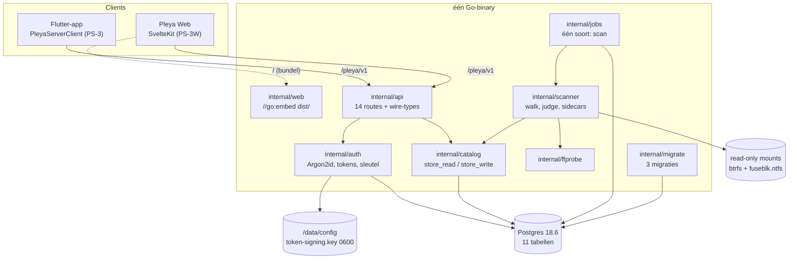
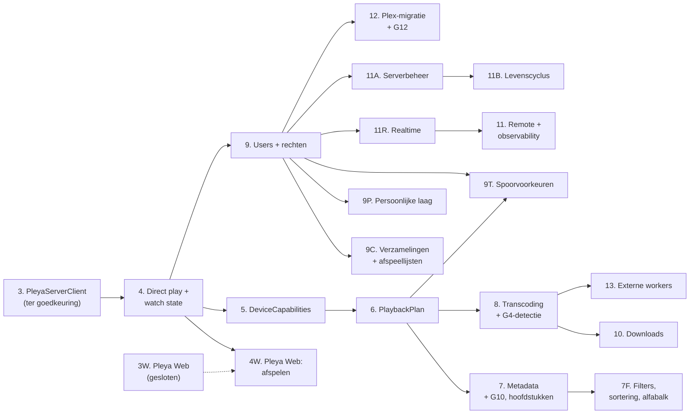

# Pleya Server op Plex-niveau: masterplan

**Datum:** 21 augustus 2026
**Werkkopie:** `/Users/michelknoop/.supacode/repos/plezy-main/feat/pleyaserver`
**Branch:** `feat/pleyaserver`, HEAD `2c3e07d`, worktree schoon
**Status:** **goedgekeurd, 21 augustus 2026.** Tweede versie na architectuurreview. Wat er ten
opzichte van de eerste versie veranderd is staat in hoofdstuk 0.

De goedkeuring geldt de richting en de omvang: acht nieuwe fasen, vijf uitgebreide bestaande fasen,
en de uitkomst van poort 3, 4 en 5. Vanaf hier is dit geen voorstel meer maar de bron waar
`docs/pleya-server-architecture.md`, `docs/pleya-server-gates.md` en `docs/DECISIONS.md` naartoe
bijgewerkt worden. Wat er sinds de goedkeuring daadwerkelijk is doorgevoerd staat in hoofdstuk 23.

## Context

Pleya Server heeft vier gesloten fasen (PS-0, PS-1, PS-2, PS-3W) en één opgeleverde fase
die op goedkeuring wacht (PS-3). Er staat een catalogus in Go, een bevroren protocol, een
Flutter-client en een meegeleverde webclient. Er is geen afspelen, geen kijkstatus, geen
metadata, geen gebruikersmodel en geen beheer.

De vraag is niet of de roadmap klopt. Die is goedgekeurd en loopt tot PS-13. De vraag is of
hij bij PS-13 uitkomt op een product dat Plex Media Server plus Plex Web kan vervangen. Het
antwoord staat al in de repository: hoofdstuk 25.6 van de architectuurbaseline en hoofdstuk 7
van de replacement matrix melden **zevenendertig capabilities die aan geen enkele fase hangen,
waarvan tweeëntwintig een Plex-off blocker zijn**, plus elf open productbesluiten. De roadmap
leidt vandaag dus aantoonbaar niet naar het einddoel.

Dit document sluit dat gat. Het houdt de nummering en de doelen van PS-4 tot en met PS-13 intact,
voegt acht fasen toe op de plekken waar de gaten liggen, breidt bestaande fasen uit waar een
poortbesluit dat afdwingt, en ontwerpt de eindstaat van Pleya Web die vandaag alleen tot PS-3W
reikt.

### Legenda

Door het hele document staat het bewijsniveau erbij.

| Markering | Betekenis |
| --- | --- |
| **FEIT** | gemeten in deze sessie, met bestand, regel of commando |
| **AFLEIDING** | conclusie uit meerdere feiten, expliciet als redenering |
| **VOORSTEL** | nieuw, vraagt uw besluit; nog geen enkel voorstel is doorgevoerd |
| **VASTGELEGD** | staat al in een goedgekeurd document; hier alleen aangehaald |

---

# 0. Revisie na architectuurreview

Deze versie is de tweede. De review keurde de richting goed en hield de uitvoering tegen op tien
punten: vier blockers, drie belangrijke correcties, twee kleinere en één procespunt. Daarna kwamen
er vier aanvullende correcties bij, op poort 3, op poort 4, en op de manier waarop dit hoofdstuk
zelf de omvang van de revisie beschrijft. Wat hieronder staat is de landingsplaats per punt, zodat
een lezer die de eerste versie kent niet 2.400 regels opnieuw hoeft door te nemen.

| # | Punt | Wat er veranderd is | Waar |
| --- | --- | --- | --- |
| 1 | **Blocker, poort 4.** De sterke `ETag`-belofte was intern tegenstrijdig: een steekproef die toegeeft dat hij dingen mist kan geen strong validator dragen | de belofte gaat uit het contract. Zwakke validator uit `(dev, ino, size, mtime_ns, ctime_ns)` plus `generation`, `If-Range` antwoordt altijd `200`, gewone `Range` blijft ongewijzigd, en de steekproef houdt alleen zijn scanner- en fingerprintrol. RFC 9110 §8.8.1 en §13.1.5 staan bij de claim | 11.4, plus 6.B, 13.2, 20 (R12), 21.6, 22 |
| 2 | **Blocker, poort 3.** Ordenen op `session_first_seen` maakt van last-write-wins een last-session-start-wins, en het tv/telefoon-scenario breekt dat | server-authoritative eigendom: `revision`, `owner_session_id`, `owner_lease_until`, `last_explicit_at`, `last_explicit_kind`, met zes regels en een doorgerekende scenariotabel. `session_first_seen` staat er alleen nog als afgewezen model | 12.1, plus 10, 13.2, 20 (R15), 21.5 |
| 3 | **Blocker, poort 5.** Eén cookie op `Path=/pleya/v1/stream/` breekt bij twee gelijktijdige streams, want cookies met dezelfde naam, domein en pad vervangen elkaar en `Path` is geen securitygrens (MDN, Set-Cookie) | een browser playback session met een cookienaam per sessie, de niet-geheime sessie-id in de URL, vier validaties per aanvraag, onafhankelijke verlenging, een bovengrens van acht, en de LAN-afweging hardop | 11.5, plus 8.8, 13.2, 13.3, 20 (R1, R16), 21.5, 22 |
| 4 | **Blocker, PS-4W.** `<track>` accepteert alleen WebVTT, terwijl `GET /subtitles/{id}` SRT en SSA levert | de conversieroute erbij, met het blob-patroon dat `Artwork.svelte:81-85` al gebruikt, conversieregels, gedrag per formaat, twee acceptatiecriteria en een testregel met randgevallen | PS-4W in 16.3 |
| 5 | **Belangrijk.** PS-9P droeg geschiedenis én spoorvoorkeuren, terwijl die twee verschillende afhankelijkheden hebben | gesplitst. PS-9P houdt geschiedenis, favorieten, waarderingen, de vlag "uit Verder kijken" en de uitgekeken-drempel en hangt aan PS-9. PS-9T krijgt de spoorvoorkeuren en hangt aan PS-9 **en** PS-6. Beide dragen de negentien onderdelen | 16.3, plus 5.1, 6.C, 7.5, 8.2, 10, 13.3, 16.1, 21.4, 21.5, 21.6 |
| 6 | **Belangrijk.** PS-11R blokkeerde PS-11A, terwijl PS-11R zelf zegt dat een client zonder websocket volledig functioneel blijft | de afhankelijkheid is weg. Voortgang gaat via polling, realtime verruilt hem wanneer de capability aanstaat, en acceptatiecriterium 3 test de pollweg met een geweigerde verbinding | PS-11A in 16.3, plus 16.1, 22 |
| 7 | **Belangrijk.** `feature_level` liep per fase op en werd daarmee een releaseteller met een onbedoelde faseordening | alle tellers weg. Eén regel legt vast wanneer hij omhoog mag: alleen bij een globale protocolsemantiek. Additieve resources onderhandelen via `capabilities`, en de volledige capabilityset staat er | 9.2, plus PS-7F, PS-9C, PS-9P, PS-9T en PS-11A in 16.3 |
| 8 | **Correctie.** Tekens weren was het securitycriterium, en dat is geen SQL-veiligheid; het breekt bovendien een genre als `Rock 'n' Roll` | parameterisatie is het criterium. Een injectietest met `Drama'; DROP TABLE media_items; --` verwacht `200`, nul resultaten, een intact schema en één geparameteriseerde query in het log; een tweede test bewijst dat leestekens gewoon werken. `400` blijft voor vormfouten | PS-7F in 16.3 |
| 9 | **Correctie.** Het backupmanifest stond in een tabel die bij het scenario waarvoor de back-up bestaat juist weg is | het manifest is een bestand in het archief, met een checksum per onderdeel en over zichzelf. `backups` blijft als UI-geschiedenis. Twee acceptatiecriteria erbij | PS-11B in 16.3 |
| 10 | **Procespunt.** De discipline was beweerd en niet aantoonbaar | gate G0 in de ledger noemt het skillpad, het gatespad en de telling van `gate-check.mjs` | de gate-ledger onderaan |
| 11 | **Aanvulling op poort 3.** Eigendomsverwerving was impliciet, waardoor een passief voortgangsevent na een lease-expiratie stil de toestand kon overnemen | verwerving gebeurt alleen met `playback_started`, met `user_started` of `reclaim` als reden. Regel 2 zegt expliciet dat een passief event nooit verwerft, ook niet bij een verlopen lease | 12.1, regel 1 en 2 |
| 12 | **Aanvulling op poort 3.** Er was geen causaliteit, alleen volgorde | elke schrijving draagt `base_revision`, en de server accepteert hem alleen bij gelijkheid met de actuele `revision`. Een offline backlog is geschiedenis zolang `revision > 0`, ook bij een verlopen lease, en vestigt de toestand alleen bij `revision = 0` | 12.1, regel 3 en 6 |
| 13 | **Aanvulling op poort 4.** Een gelijke zwakke `ETag` werd nog als grond voor hervatten gebruikt | gelijkheid geeft geen informatie over de bytes, en de gevallen waarin dat misgaat staan erbij. Nergens in Pleya wordt op die grond geplakt; de speler vraagt een nieuw bereik, en de enige plek waar byte-identiteit telt is de downloadhervatting in PS-10, met een digest als bewijs | 11.4 onderdeel 4, plus 21.5 waar PS-10 dat criterium erbij krijgt |
| 14 | **Aanvulling op de omvang.** De eerste opzet van deze revisie beweerde dat de roadmapstructuur, de capabilitymatrix en hoofdstuk 2 tot en met 8 ongewijzigd bleven | die bewering staat er niet meer, want ze klopt niet. Wat er wél verandert staat hieronder | deze tabel plus de opsomming eronder |

**Wat er buiten hoofdstuk 9 tot en met 22 verandert, expliciet.** De splitsing en de drie
poortbesluiten lopen door in de vroege hoofdstukken, dus die zijn niet ongemoeid gebleven:

- **hoofdstuk 1** telt acht nieuwe fasen in plaats van zeven, en zegt dat PS-4 scope erbij krijgt;
- **hoofdstuk 2.9** draagt een gecorrigeerd regelnummer: `serverFavorites` en `numericUserRating`
  staan op `lib/services/pleya_server_capabilities.dart:72-73`, niet op 75-76. Opnieuw gemeten,
  niet overgenomen;
- **hoofdstuk 5.1** splitst G3 over PS-9P en PS-9T;
- **hoofdstuk 6.B** herformuleert twee succescriteria, want poort 4 en poort 5 hebben nu een
  uitkomst; **6.C** verwijst voor de taalkeuze naar PS-9T;
- **hoofdstuk 7.5** verwijst naar PS-9T in plaats van PS-9P;
- **hoofdstuk 8.2** hangt `/settings/playback` aan PS-9T; **8.8** noemt vijf opties bij poort 5.

De **capabilityset** verandert mee: `watch_state_ownership` komt erbij uit poort 3, en de vlag voor
de browser playback session volgt uit poort 5. De **roadmapstructuur** verandert op twee punten:
een achtste nieuwe fase (PS-9T), en één rand minder in de afhankelijkheidsgraaf (PS-11R naar
PS-11A).

**Wat er niet is aangeraakt.** `docs/pleya-protocol/v1/openapi.yaml`,
`docs/pleya-server-gates.md`, `docs/DECISIONS.md` en `docs/pleya-server-architecture.md`. Het
contract is bevroren zolang PS-3 loopt, en de twee brekende wijzigingen die dit plan identificeert
zijn voorstellen voor het venster ná het sluiten van PS-3. Het gates-document telt vandaag vier
poorten en beschrijft poort 4 nog als "een strategie die de belofte aantoonbaar waarmaakt"; dat
bijwerken is een gevolg van goedkeuring en geen onderdeel van deze revisie.

---

# 1. Executive summary

## Wat er vandaag staat

**FEIT.** Drie codebases dragen Pleya Server samen. `pleya_server/` is 13.222 regels Go over
14 pakketten met 123 testfuncties. `pleya_web/` is een SvelteKit 5-applicatie van 2.721 regels
Svelte plus 6.835 regels TypeScript, CSS en JSON, met 112 unit- en componenttests en 27
end-to-end-tests. In `lib/` staat sinds PS-3 een vijfde `MediaServerClient` van 1.169 regels
met 165 tests in `test/pleya_server/`.

**FEIT.** Het protocol telt 16 paden met 17 operaties
(`docs/pleya-protocol/v1/openapi.yaml`). Veertien daarvan zijn geïmplementeerd
(`pleya_server/internal/api/server.go:78-118`). De drie die ontbreken zijn
`GET /stream/{version_id}` en beide operaties op `/watch-state`. Dat is opzet: die horen bij
PS-4, en twee poorten eronder staan nog open.

**FEIT.** Het schema draagt elf tabellen in drie migraties
(`pleya_server/internal/migrate/sql/`). Er is geen `users`, geen `sessions`, geen
`watch_states`, geen `external_ids` en geen `transcode_sessions`.

## Waar we naartoe gaan

Het einddoel staat vast en wordt hier niet heropend: een zelfstandig mediaserverproduct waarmee
Plex Media Server uit kan, met Plex en Jellyfin als optionele adapters. Wat dit document
toevoegt is de weg daarheen voor de capabilities die nu nergens landen, plus een tweede product
dat de baseline niet uitwerkt: **Pleya Web als volwaardige media- én beheerinterface**, niet als
de leesschil die PS-3W opleverde.

## Wat er fundamenteel moet veranderen

Vier dingen, en geen daarvan is een implementatiedetail.

**Beheer moet het protocol in.** **FEIT.** Bibliotheken worden vandaag uitsluitend
gedefinieerd via de omgevingsvariabele `PLEYA_SERVER_LIBRARIES`
(`pleya_server/internal/config/libraries.go`), er is één jobsoort, en er bestaat geen enkel
beheerendpoint. Een bibliotheek toevoegen is `.env` wijzigen en de container herstarten. Dat is
de grootste enkele afstand tot Plex, en het is de categorie **Beheer** van de Plex-off gate.

**De catalogus mist zijn navigatielaag.** **FEIT.** `/libraries/{id}/items` kent `limit`,
`cursor` en `sort` en geen enkele filterparameter (`internal/catalog/cursor.go:20-40`,
`store_read.go:38-95`). Er is geen `firstCharacter`-equivalent, geen verzameling en geen
afspeellijst. De Flutter-client meldt die vier expliciet als niet-ondersteund
(`lib/services/pleya_server_client/parts/unsupported.dart:24-50`). Een bibliotheek van
duizenden titels zonder filter is geen bibliotheek.

**De persoonlijke laag is half ontworpen.** PS-4 levert positie en gekeken-vlag. Geschiedenis,
favorieten, waarderingen en spoorvoorkeuren per gebruiker hangen aan geen enkele fase, terwijl
`MediaServerClient` er schrijfmethodes voor heeft.

**Pleya Web houdt op waar het product begint.** **FEIT.** PS-3W levert setup, inloggen,
bladeren, zoeken, detail en een serveroverzicht: negen routes
(`pleya_web/src/routes/`). Er is geen `<video>`, geen kijkstatus, geen instelling en geen
beheerscherm. De fase is bevroren en dat is correct; wat ontbreekt is de fase die verder gaat.

## De omvang van het voorstel

**VOORSTEL.** Acht nieuwe fasen, vijf uitgebreide bestaande fasen, één nieuwe poort, en
aanbevelingen voor de open poorten en de elf open productbesluiten. PS-4 tot en met PS-13 behouden
hun nummer, doel en stopcriterium; PS-4 krijgt scope erbij uit poort 3 en poort 5 (21.5).

---

# 2. Verified current state

Alles in dit hoofdstuk is gemeten in deze sessie. De meetmethode staat erbij, omdat een telling
zonder methode niet te reproduceren is.

## 2.1 Git

**FEIT.** `git rev-parse --abbrev-ref HEAD` geeft `feat/pleyaserver`. `git rev-parse HEAD` geeft
`2c3e07d038c1df07b576b79aed0ae508fd225663`. `git status --porcelain` is leeg.

**FEIT.** De briefing noemde `f127eca` als vermoedelijke HEAD. Er zitten **elf commits** tussen
`f127eca` en `2c3e07d` (`git rev-list --count f127eca..HEAD`), samen 83 bestanden, 9.011
toevoegingen en 4.082 verwijderingen.

| Commit | Wat er veranderde |
| --- | --- |
| `f7dbdb7` | PS-2 en PS-3W gesloten in de documentatie, matrixtelling bijgewerkt |
| `cfc6323` | PS-3W-stopcriterium gemeten op de NAS |
| `c6544d9` t/m `48824fc` | PS-3: acht commits die de vijfde backend bouwen |
| `2c3e07d` | PS-3 opgeleverd, ter goedkeuring |

**AFLEIDING.** De briefing beschreef de toestand vóór PS-3. PS-3 is er sindsdien in zijn geheel
bij gekomen. Elke uitspraak in de briefing over "de server implementeert 14 van 16 endpoints" en
"de webclient kan authenticeren, bladeren, zoeken" klopt nog; de uitspraak dat de Flutter-client
er nog niet mee praat niet meer.

**FEIT.** `feat/pleyaserver` staat niet op de remote. `git ls-remote --heads github` geeft vier
branches: `main`, `redesign/phase-0-rebrand`, `test`, `ui/settings-requests-restyle`. De
waarschuwing uit de briefing is dus juist en de lokale worktree is de enige bron.

**FEIT.** Er zijn zes worktrees op deze repository, waarvan vijf `locked`. Twee ervan
(`fix/ps2-integriteit` op `340e61c`, `feat/tautilli-recommended` op `8fea407`) staan op oudere
commits van hetzelfde werk.

## 2.2 Twee telfouten in `pleya_server/README.md`

**FEIT.** Twee zinnen in de README spreken de tabel eronder tegen. Beide zijn met één commando
te reproduceren.

| Plaats | Wat er staat | Wat er is | Bewijs |
| --- | --- | --- | --- |
| `pleya_server/README.md:51` | "Twaalf tabellen, in drie migraties" | elf | `grep -c '^CREATE TABLE' internal/migrate/sql/*.sql` geeft 3+6+2 |
| `pleya_server/README.md:83` | "Negen endpoints van de zeventien" | veertien | de tabel eronder heeft veertien regels |

**AFLEIDING.** Beide zijn stale zinnen, geen inhoudelijke fout: `docs/pleya-server-architecture.md:1727`
zegt correct "elf tabellen, veertien endpoints", en `README.md:24` zegt zelf "dezelfde veertien
endpoints". Dit is exact het patroon dat de matrix in hoofdstuk 9.1 beschrijft ("een telling die
met de hand bijgewerkt werd terwijl de tabel eronder verschoof"). Ze horen in de eerstvolgende
fase die de README aanraakt rechtgezet te worden, niet als losse commit.

## 2.3 Het protocoloppervlak, geteld

**FEIT.** `grep -cE "^  /" docs/pleya-protocol/v1/openapi.yaml` geeft **16 paden**.
`grep -cE "^    (get|post|put|patch|delete):"` geeft **17 operaties**. Het verschil is
`/watch-state`, dat zowel `GET` als `POST` draagt.

**FEIT.** Veertien operaties zijn geregistreerd in `internal/api/server.go`:

| Route | Klasse | Handler |
| --- | --- | --- |
| `GET /info` | public | `handleInfo` |
| `POST /auth/setup`, `/auth/login`, `/auth/refresh` | public | `handleSetup`, `handleLogin`, `handleRefresh` |
| `POST /auth/stream-token` | authenticated | `handleStreamToken` |
| `GET /server` | authenticated | `handleServer` |
| `GET /libraries`, `/libraries/{library_id}/items` | authenticated | `handleLibraries`, `handleLibraryItems` |
| `GET /items/{item_id}`, `/items/{item_id}/children` | authenticated | `handleItem`, `handleChildren` |
| `GET /search`, `/hubs/{hub_id}` | authenticated | `handleSearch`, `handleHub` |
| `GET /artwork/{artwork_id}` | authenticated | `handleArtwork` |
| `GET /subtitles/{subtitle_id}` | authenticated of streamtoken | `handleSubtitle` |

Buiten het protocol staan twee operationele routes (`GET /healthz`, `GET /readyz`), een
catch-all op `/pleya/v1/` die de foutvorm van het protocol teruggeeft, en `/` voor de webbundel.

**FEIT.** Er zijn 26 bestanden in `docs/pleya-protocol/v1/examples/`, waarvan één het manifest
is. De documentatie noemt consequent 25 fixtures; dat klopt met het manifest meegeteld als
niet-fixture.

## 2.4 Het schema

**FEIT.** Elf tabellen, drie migraties, alle voorwaarts.

| Migratie | Tabellen |
| --- | --- |
| `0001_bootstrap.sql` | `server_instance`, `auth_owner`, `auth_refresh_tokens` |
| `0002_catalog.sql` | `libraries`, `storage_locations`, `media_items`, `media_versions`, `media_files`, `media_streams` |
| `0003_work.sql` | `jobs`, `scan_runs` |

**FEIT.** `media_files` draagt `content_fingerprint` als nullable kolom die nergens gevuld
wordt, en `generation` met een comment dat er bewust nog geen `ETag` aan hangt
(`0002_catalog.sql`, regels bij `generation`). `media_versions.detection` en
`media_streams.detection` zijn `jsonb` met de drie statussen en vijf bronnen uit hoofdstuk 7.4.

**FEIT.** `probe_attempts` wordt opgehoogd en nergens gelezen. Dat staat al als backlogregel in
`docs/pleya-server-architecture.md:2566`, met de tweede helft ervan op `:2567`: een mislukte
`attach` legt niet dezelfde foutstatus vast als `RecordProbeFailure`. Beide betekenen dat een
blijvend onanalyseerbaar bestand elke ronde opnieuw door ffprobe gaat.

## 2.5 De catalogus-leeslaag

**FEIT.** `internal/catalog/cursor.go:20-40` definieert zeven sorteerwaarden: `title`,
`added_at`, `year`, hun aflopende varianten, plus `index` als interne default voor kinderen.
`ParseSort` accepteert de eerste zes uit een aanvraag.

**FEIT.** `store_read.go:38-95` bouwt de itemquery. De `WHERE` kent bibliotheek, soort, ouder en
een `ILIKE` op titel voor zoeken. **Er is geen filterparameter.** Geen genre, geen jaar, geen
kijkstatus, geen resolutie.

**AFLEIDING.** Dit is G13 uit de matrix, en het is geen implementatieschuld maar een
contractgat: `openapi.yaml` heeft de parameter niet, en het contract is bevroren.

## 2.6 De scanner

**FEIT.** `internal/scanner/scanner.go` is 745 regels. `judge` (`:359`) past laag 1 en 2 toe,
`processMedia` (`:448`) draait ffprobe op wat overblijft, `attach` (`:591`) maakt of vindt item
en versie. `inodeMeasurement` (`:316-357`) meet per root wat de inode waard is en logt het
zonder de instelling te wijzigen.

**FEIT.** Verandersdetectie is drielaags zoals hoofdstuk 7.3 beschrijft. Laag 2 is een hash over
de eerste en de laatste megabyte plus de grootte (`internal/scanner/signature.go`, 71 regels).

**AFLEIDING.** Chapter 7.2 van de baseline zegt zelf dat zo'n signature nooit gelijkheid bewijst,
en noemt het geval: een remux die het midden verandert. Dat is precies poort 4, en het is
gemeten waar: `signature.go` leest kop en staart en niets ertussen.

## 2.7 Auth

**FEIT.** Zes bestanden in `internal/auth/`, samen 631 regels plus 243 regels test.
`password.go` doet Argon2id in PHC-vorm, `token.go` ondertekent access-, refresh- en
streamtokens, `key.go` beheert de sleutel op schijf, `store.go` bewaart de bootstrap-identiteit.
`internal/api/limiter.go` is 69 regels in-memory rate limiting.

**FEIT.** `streamAuthorized` (`server.go:170-205`) is het enige pad dat een token uit de
querystring accepteert, en alleen voor `/subtitles/{id}`. Het token draagt een `Resource` die
tegen de gevraagde resource wordt gehouden.

## 2.8 Pleya Web

**FEIT.** Negen routes in `pleya_web/src/routes/`: `/`, `/login`, `/setup`, `/search`,
`/server`, `/libraries`, `/libraries/[id]`, `/items/[id]`, plus `+layout.svelte`.

**FEIT.** Tien componenten in `src/lib/components/`: `Artwork` (241 regels), `NavRail` (186),
`HubRail` (193), `StateView` (133), `Hero` (126), `MediaCard` (111), `BottomBar` (97),
`MediaGrid` (82), `NavIcon` (57), `ThemePicker` (43).

**FEIT.** De API-client (`src/lib/api/client.ts`, 320 regels) is getypeerd tegen
`schema.d.ts`, dat uit `openapi.yaml` gegenereerd wordt. Hij doet single-flight
tokenvernieuwing met een retry-markering tegen lussen (`:99-142`), en `artworkBlob` (`:279-320`)
haalt afbeeldingsbytes met een header op omdat `` er geen kan zetten.

**FEIT.** State is één `SessionState`-klasse met Svelte 5 runes
(`src/lib/stores/session.svelte.ts`, 115 regels), plus `theme` (61) en `viewport` (26).
Navigatie-items komen uit capabilities (`navItems.ts`), niet uit een vaste tabel.

## 2.9 De Flutter-kant van PS-3

**FEIT.** `lib/services/pleya_server_client.dart` is 322 regels met vijf parts: `browse` (480),
`unsupported` (240), `artwork` (59), `search` (40), `seam` (28). In dezelfde map staan
`pleya_server_auth_service.dart` (280), `pleya_server_mappers.dart` (282),
`pleya_server_session.dart` (190), `pleya_server_api_cache.dart` (122),
`pleya_server_capabilities.dart` (109), `pleya_server_cursor_ledger.dart` (79).

**FEIT.** `MediaServerClient` telt 64 methodedeclaraties plus 12 getters, samen 76 members over
766 regels. `unsupported.dart` bevat 45 stubs. **AFLEIDING.** Voor Pleya Server antwoordt dus
ongeveer 59% van de interface "niet ondersteund". Dat is de gemeten invoer voor het criterium
uit hoofdstuk 5.3 dat in PS-4 beoordeeld moet worden; de andere vier implementaties zijn nog
niet gemeten.

**FEIT.** Backend-vertakkingen: 175 treffers op `MediaBackend.*` of `ConnectionKind.*` over 55
bestanden in `lib/`. De baseline noemde 125 over 52, gemeten vóór PS-3. **AFLEIDING.** De vijfde
backend heeft de vertakking met ongeveer veertig plekken laten groeien; de baseline voorspelde
dat en noemde het "vervelend maar niet gevaarlijk" omdat Dart exhaustieve switches afdwingt.

## 2.10 Tests, geteld met methode

**FEIT.** Meetmethode: `grep -hoE '^func Test[A-Za-z0-9_]+'` voor Go,
`grep -hoE "^[[:space:]]*(it|test)\("` voor TypeScript,
`grep -rhoE "^[[:space:]]*(test|testWidgets)\("` voor Dart. Dat telt toplevel-tests, geen
subtests en geen tabelrijen.

| Oppervlak | Aantal | Bestanden of pakketten |
| --- | --- | --- |
| Go (eigen pakketten, zonder `.gocache`) | 123 | 14 pakketten |
| Pleya Web unit en component (vitest) | 112 | 16 bestanden |
| Pleya Web end-to-end (Playwright) | 27 | 4 bestanden |
| Flutter `test/pleya_server/` | 165 | 12 bestanden |
| Flutter volledige suite | 3.667 | hele `test/` |

**AFLEIDING.** De documentatie noemt 121 Go-tests over dertien pakketten en 188 Flutter-tests in
`test/pleya_server/`. Het verschil komt uit de telmethode: `internal/web` kwam er met PS-3W bij
als veertiende pakket, en subtests tellen in de documentatie wel mee. Geen van beide is een
fout; wie de getallen vergelijkt moet de methode erbij hebben.

## 2.11 Wat er aantoonbaar niet is

**FEIT.** Gecontroleerd met grep over `pleya_server/internal/` en `pleya_web/src/`:

- geen `users`-, `sessions`-, `watch_states`-, `external_ids`-, `metadata_candidates`- of
  `transcode_sessions`-tabel;
- geen uitgaande HTTP-client in `internal/` (geen provider);
- geen websocket en geen server-sent events;
- geen `<video>` in `pleya_web/src`;
- geen beheerendpoint, geen tweede jobsoort naast scannen;
- geen CI-workflow die `pleya_server`, `go` of `check_protocol` noemt.

---

# 3. Architecture map

## 3.1 De huidige keten



## 3.2 Wat deze plaat niet toont, en dat is het punt

**AFLEIDING.** Vergelijk met de doelplaat in hoofdstuk 6.1 van de baseline. Daar staan een
websocket-hub, een playbackplanner, een transcode-supervisor en metadataproviders. Geen van vier
bestaat. De keten `storage → scanner → database → domeinmodel → API → clients` is compleet en
werkt; de keten `metadata → playback → watch state → beheer` bestaat nog nergens.

## 3.3 Clientintegratie

**FEIT.** Beide clients praten uitsluitend over `/pleya/v1`. `DEC-046` legt vast dat
co-distributie geen extra rechten geeft, en `pleya_web/src/lib/api/client.ts:1-12` herhaalt dat
in het bestandscommentaar. De client compileert alleen tegen paden die het contract kent, omdat
`schema.d.ts` gegenereerd is.

**FEIT.** De capability-resolvers aan beide kanten eisen twee dingen tegelijk. In Dart doet
`PleyaServerCapabilityResolver._offered(advertised, implementedHere:)`
(`lib/services/pleya_server_capabilities.dart:36`) een `&&` tussen wat de server aanbiedt en wat
deze build kan. In de web doet `navItems()` hetzelfde voor navigatie. **AFLEIDING.** Dat patroon
is de reden dat er nergens een knop staat die niets doet, en het moet in elke volgende fase
overeind blijven.

---

# 4. Plex benchmark

De volledige capabilitymatrix bestaat al en wordt hier niet overgeschreven:
`docs/PLEYA-SERVER-REPLACEMENT-MATRIX.md` telt **18 domeinen en 162 capabilities**, elk met een
Plex-bron, een Pleya-bestemming, een fase, een status en een blocker-oordeel.

**FEIT (uit hoofdstuk 9.1 van de matrix, 19 augustus 2026).**

| Meting | Aantal |
| --- | --- |
| Capabilities totaal | 162 |
| Technisch gereed | 17 |
| Plex-off blockers | 96 |
| Blockers met een fase | 72 |
| Blockers zonder fase | 22 |
| Roadmap gaps totaal | 37 |
| Open productbesluiten | 11 |
| Bewust buiten scope | 12 |

Wat hieronder staat is de benchmark op productgebiedniveau, in de door u gevraagde vorm, met de
matrix als bron en dit plan als de kolom "fase".

| # | Productgebied | Pleya nu | Plex-lat | Pleya-doel | Fase |
| --- | --- | --- | --- | --- | --- |
| 1 | Onboarding en serversetup | setupcode op de console, bibliotheken uit `.env` | webwizard, bibliotheek in de UI | wizard in Pleya Web, bibliotheek via het protocol | **PS-11A** |
| 2 | Libraries | lijst en inhoud, cursorpaginering | plus toevoegen, verwijderen, instellingen | idem | PS-3 / **PS-11A** |
| 3 | Scanning | draait, alleen bij start of interval | starten, volgen, afbreken, forceren | beheerendpoint plus voortgang | **PS-11A**, **PS-11R** |
| 4 | Metadata | bestandsnaam en ffprobe | agents, matching, correctie | TMDB via kandidatenlaag | PS-7 |
| 5 | Artwork | wat op schijf ligt | providers, schalen, kiezen | providers plus afgeleide maten | PS-7 |
| 6 | Films | items, versies, edities | plus samenvatting, cast, beoordeling | idem | PS-7 |
| 7 | Series, seizoenen, afleveringen | volledige hiërarchie, tellers | plus volgende aflevering | idem | PS-3 / PS-4 |
| 8 | Muziek | niet ondersteund | volledige muziekbibliotheek | **bewust buiten scope** (matrix 5.18) | n.v.t. |
| 9 | Collections | ontbreekt | lezen en schrijven | eigen resource | **PS-9C** |
| 10 | Playlists | ontbreekt | lezen, schrijven, herordenen | eigen resource | **PS-9C** |
| 11 | Zoeken | vrije tekst, DEC-045 | plus filters en scope | idem plus filters | PS-3 / **PS-7F** |
| 12 | Filters | **geen enkele** | genre, jaar, kijkstatus, resolutie | filterparameters plus facetten | **PS-7F** |
| 13 | Sortering | title, added_at, year | plus rating, duur, laatst bekeken | uitbreiden bij PS-7 | PS-3 / **PS-7F** |
| 14 | Recent toegevoegd | hub `recently_added` | idem | idem | PS-3 |
| 15 | Verder kijken | lege lijst (`watch_state: false`) | gevuld | uit kijkstatus | PS-4 |
| 16 | Watch state | ontbreekt | positie, gekeken, teller | gebeurtenismodel | PS-4 |
| 17 | Watched/unwatched | ontbreekt | markeren beide kanten | `explicit_action` | PS-4 |
| 18 | Playback | ontbreekt | direct play, remux, transcode | idem | PS-4, PS-8 |
| 19 | Streamkeuze | ontbreekt | versiekeuze door de server | `PlaybackPlan` | PS-6 |
| 20 | Ondertitels | sidecars in de catalogus | ingebed, extern, inbranden, zoeken | plan plus sessie | PS-4, PS-6, PS-8 |
| 21 | Audiosporen | in de catalogus | kiezen op elk pad | plan plus sessie | PS-6, PS-8 |
| 22 | Kwaliteitskeuze | ontbreekt | bitrate-tabel | verbindingslaag in capabilities | PS-5, PS-6 |
| 23 | Direct play | ontbreekt | standaard | `GET /stream` met range | PS-4 |
| 24 | Transcoding | ontbreekt | universal transcoder | ffmpeg-supervisor | PS-8 |
| 25 | Playbacksessies | ontbreekt | openen, pingen, sluiten | sessiecontract plus watchdog | PS-8 |
| 26 | Gebruikers | één bootstrap-eigenaar | Plex Home | `users` met vier rollen | PS-9 |
| 27 | Profielen | ontbreekt | profiel met pincode | eigen credential-resolver | PS-9 |
| 28 | Ouderlijk toezicht | ontbreekt | leeftijdsgrenzen | **bewust buiten v1** (13.3) | n.v.t. |
| 29 | Serverinstellingen | omgevingsvariabelen | webinstellingen | beheerendpoint plus scherm | **PS-11A** |
| 30 | Bibliotheekinstellingen | `.env`-string | per bibliotheek in de UI | idem | **PS-11A** |
| 31 | Activity en jobs | `scan_runs` in psql | `/activities` plus afbreken | jobendpoint plus scherm | **PS-11A** |
| 32 | Server health | `/healthz`, `/readyz` | statuspagina | plus metrics en foutlijst | PS-11 |
| 33 | Remote access | LAN, `127.0.0.1` | `plex.direct` plus relay | proxy of tunnel | PS-11 |
| 34 | Multi-device state | ontbreekt | overal dezelfde positie | server-authoritative | PS-4, PS-9 |
| 35 | Metadatacorrecties | ontbreekt | fix-match, veldvergrendeling | **besluit B1 en B2** | PS-7 |
| 36 | Rescan en refresh | interval en herstart | knop per bibliotheek | beheerendpoint | **PS-11A** |
| 37 | Error recovery | per geval | Plex varieert | faalpaden als set | **PS-11B** |
| 38 | Grote bibliotheken | 28.986 bestanden gemeten | Plex schaalt | meetbare doelen, hoofdstuk 14 | doorlopend |

**Capabilities die Pleya nodig heeft en Plex niet als voorbeeld levert.**

| Capability | Waarom Plex hem niet levert | Fase |
| --- | --- | --- |
| Uitleg waarom er getranscodeerd wordt, als domeincode met parameters | Plex toont dit niet aan de gebruiker | PS-6 |
| `detectionStatus` en `source` per technisch veld | Plex geeft één waarde zonder herkomst | PS-2, gereed |
| Meegeleverde webinterface die dezelfde designtokens draagt als de app | Plex Web is een los ontworpen product | PS-3W, gereed |
| `/readyz` die pas groen wordt na een geslaagde migratie | Plex kent geen readiness | PS-2, gereed |
| Een gemeten inodebetrouwbaarheid per opslagroot | Plex neemt aan | PS-2, gereed |

---

# 5. Gap analysis

## 5.1 De tien gaten die nergens landen

**VASTGELEGD** in matrix hoofdstuk 7. **VOORSTEL** is de laatste kolom.

| Gat | Inhoud | Blocker | Matrix zegt "hoort in" | Dit plan wijst toe |
| --- | --- | --- | --- | --- |
| G1 | Verzamelingen en afspeellijsten, lezen en schrijven | ja | catalogusfase naast PS-7 of uitbreiding PS-3 | **PS-9C** |
| G2 | Kijkgeschiedenis en "Bekeken door" | ja | PS-9 | **PS-9P** |
| G3 | Favorieten, waarderingen, spoorvoorkeuren per gebruiker | ja | PS-9 | **PS-9P** (favorieten, waarderingen) plus **PS-9T** (spoorvoorkeuren) |
| G4 | Intro en aftiteling overslaan | ja | PS-7 opslag, na PS-8 detectie | **PS-7 uitbreiding** plus **PS-8 uitbreiding**, na besluit B7 |
| G6 | Bibliotheekbeheer vanuit de client | ja | PS-11, endpoints in PS-2 | **PS-11A** |
| G7 | Back-up, restore, upgrade, terugrollen | ja | PS-11 | **PS-11B** |
| G8 | Faalpaden als samenhangend geheel | ja | PS-11 als acceptatiecriterium | **PS-11B** |
| G10 | Beoordelingen (critici, publiek, bronlogo) | ja | PS-7 | **PS-7 uitbreiding** |
| G12 | Afspeellijsten migreren | ja | PS-12 | **PS-12 uitbreiding** |
| G13 | Filters op een bibliotheek | ja | catalogusfase, of contractvraag vóór PS-7 | **PS-7F** |

**AFLEIDING.** G5, G9 en G11 zijn eerder toegewezen via
`docs/pleya-server-ps1-scope-deviation.md` (goedgekeurd 18 augustus 2026) en staan niet meer
open. Dat voorstel raakte G1, G2, G3, G4, G6, G7, G8, G10 en G12 expliciet niet, en G13 bestond
toen nog niet.

## 5.2 De realtime-laag

**FEIT.** Hoofdstuk 14 van de baseline beschrijft een websocket-hub met volgnummers op
`/pleya/v1/events`. PS-2 zet hem expliciet buiten scope. PS-11 gaat ervan uit dat hij bestaat
("websockets door de proxy", acceptatiecriterium bij fase 11). Geen enkele fase bouwt hem.

**AFLEIDING.** Dit is geen blocker (alles wat via een event komt is ook op te halen), maar het
is wel een tegenstrijdigheid tussen twee fasen die vóór PS-11 opgelost moet zijn. De matrix
zegt dat met zoveel woorden op regel 463.

**VOORSTEL.** **PS-11R** bouwt hem, vóór PS-11. Daarmee is de tegenstrijdigheid weg en heeft
PS-11A meteen zijn scanvoortgang.

## 5.3 De webclient voorbij PS-3W

**FEIT.** PS-3W is bevroren en heeft geen opvolger in de roadmap. De baseline noemt PS-3W op
regel 1899 expliciet "geen eerstvolgende fase; PS-3W hangt naast PS-3 en blokkeert niets".

**AFLEIDING.** Er is dus geen fase die de webclient naar afspelen, kijkstatus, instellingen of
beheer brengt, terwijl PS-3W-voorstel 5.4 vastlegt dat **Pleya Web de primaire beheerinterface
wordt**. Die twee kunnen niet allebei waar blijven zonder een fase ertussen.

**VOORSTEL.** Twee fasen: **PS-4W** (afspelen en kijkstatus in de browser) en het webdeel van
**PS-11A** (beheer). Beide volgen dezelfde vorm als PS-3W: een tweede client op hetzelfde
protocol, zonder eigen API.

## 5.4 Wat wel gedekt is en dat is de meerderheid

**AFLEIDING.** 72 van de 96 blockers hangen aan een bestaande fase. Dit plan raakt die 72 niet.
Wat het toevoegt is de 22 zonder fase, plus de realtime-laag, plus de webclient. Dat is de
volledige lijst; er is geen capability in de matrix die na dit plan nog op `geen` staat, met
uitzondering van de elf die eerst een productbesluit vragen.

---

# 6. Product north-star

> **Pleya Server is een zelfstandige mediaserver waarmee een huishouden zijn eigen bibliotheek
> beheert, ontdekt en afspeelt zonder Plex of Jellyfin, waarbij Pleya-apps en Pleya Web dezelfde
> server via één protocol gebruiken en beheer net zo goed door het protocol loopt als afspelen.**

De laatste bijzin is de toevoeging van dit plan. Beheer via SSH is de stilste manier waarop een
mediaserver "technisch gereed" kan zijn zonder productgereed te worden, en het is de categorie
waar de Plex-off gate vandaag het verst vanaf staat.

## A. Media engine

Van bestand tot bruikbaar media-item.

| Succescriterium | Meetbaar aan |
| --- | --- |
| Een bibliotheek van 30.000 bestanden scant volledig zonder handmatige tussenkomst | de meting die PS-2 al deed: 28.986 bestanden, 6.951 analyses, nul fouten |
| Een tweede ronde zonder wijzigingen draait ffprobe nul keer | bestaande test in `internal/scanner` |
| Hernoemen, verplaatsen en vervangen behouden identiteit en kijkstatus | scannertest per scenario, plus relocatie tussen mounts |
| Een onanalyseerbaar bestand wordt begrensd opnieuw geprobeerd, niet elke ronde | nieuw: backoff op `probe_attempts` |
| Titels, samenvattingen, cast en beoordelingen staan er zonder handmatig werk | PS-7 criterium 1 |
| Een handmatige correctie overleeft drie providerrondes | PS-7 criterium 2 |
| Een bibliotheek is zonder SSH toe te voegen, te scannen en te volgen | PS-11A |

## B. Playback engine

Van capability negotiation tot de juiste stream.

| Succescriterium | Meetbaar aan |
| --- | --- |
| Direct play speelt en seekt op desktop, mobiel, TV en in de browser | PS-4 criterium 1 en 2, PS-4W |
| De server kiest de goedkoopste passende versie, niet de hoogste kwaliteit | PS-6 criterium 2 |
| Elk plan draagt een reden als `{code, parameters}` | PS-6 criterium 3 |
| Een bestand dat het toestel niet aankan speelt via remux of transcode | PS-8 criterium 1 |
| Elke sessie wordt opgeruimd, ook na een harde clientcrash | PS-8 criterium 2 |
| Een onderbroken stream levert nooit half oude en half nieuwe bytes | **poort 4**: de server antwoordt op `If-Range` altijd `200`, en niets in Pleya plakt bytes aan elkaar op grond van een gelijke validator (11.4) |
| Een browser speelt een lange film zonder dat de autorisatie hem onderbreekt, ook met twee streams tegelijk | **poort 5**, nieuw in dit plan (11.5) |

## C. Personal state

Voortgang, voorkeuren en profieldata correct over apparaten.

| Succescriterium | Meetbaar aan |
| --- | --- |
| Kijkpositie overleeft het afsluiten en verschijnt op een tweede toestel | PS-4 criterium 3 |
| Een bewuste herstart zet de kijker niet terug | **poort 3**, nog open |
| Offline gekeken materiaal synchroniseert terug volgens het vastgelegde model | PS-10 criterium 2 |
| Twee gebruikers zien elkaars status en bibliotheken niet | PS-9 criterium 1 en 2 |
| Dezelfde serie start op elk toestel met dezelfde taalkeuze | **PS-9T** |
| Geschiedenis en "Bekeken door" zijn gevuld | **PS-9P** |
| Favorieten en waarderingen overleven een profielwissel | **PS-9P** |

## D. Server administration

Bibliotheken, scans, storage, jobs, health en settings beheersbaar.

| Succescriterium | Meetbaar aan |
| --- | --- |
| Een bibliotheek toevoegen, hernoemen en verwijderen gebeurt in de UI | **PS-11A** |
| Een scan starten, volgen en afbreken gebeurt in de UI | **PS-11A** |
| Vrije ruimte per opslagroot is zichtbaar vóór een schijf vol is | **PS-11A** |
| Een scanfout is te begrijpen zonder logbestand | **PS-11A** |
| Een back-up maken en terugzetten is één handeling met een controleerbare uitkomst | **PS-11B** |
| Een upgrade over twee schemaversies slaagt, en terugrollen weigert luid | **PS-11B** |
| Volle schijf, database weg, transcode-crash en kapot bestand geven elk een begrijpelijke fout | **PS-11B** |

## E. Pleya experience

Een webclient die niet voelt als een beheerinterface.

| Succescriterium | Meetbaar aan |
| --- | --- |
| Home, bibliotheek, detail en zoeken dragen dezelfde tokens als de app | PS-3W, gereed en gemeten |
| Een film start in de browser en onthoudt zijn positie | **PS-4W** |
| Elke route is met het toetsenbord te bedienen en levert geen axe-overtreding op | PS-3W criterium 4, uitbreiden per fase |
| Het beheergedeelte gebruikt dezelfde designsysteemlaag als de mediakant | **PS-11A**, harde eis |
| Er staat nergens een knop die niets doet | capability-gestuurde navigatie, bestaand patroon |

---

# 7. Target backend architecture

## 7.1 Domeinmodel: houdbaar, met twee toevoegingen

**FEIT.** Het huidige onderscheid file / version / item / streams draagt vandaag films, series,
seizoenen, afleveringen, meerdere encodes, externe ondertitels, edities en artwork.
`media_items.kind` kent vier waarden, `media_items.parent_id` draagt de hiërarchie, en
`media_files.role` onderscheidt media, ondertitel en artwork.

**AFLEIDING.** Toetsing tegen de lijst uit uw opdracht:

| Vereiste | Draagt het model dit? | Bewijs of gat |
| --- | --- | --- |
| Films | ja | `kind = 'movie'`, `parent_id IS NULL` |
| Series, seizoenen, afleveringen | ja | `media_items_parent_kind`-constraint |
| Meerdere encodes | ja | `media_versions` per item, `UNIQUE (item_id, grouping_key)` |
| Externe ondertitels | ja | `media_streams.is_external` plus `file_id` naar het `.srt` |
| Edities | ja | `media_versions.edition`, gevuld uit `{edition-...}` |
| Specials | **gedeeltelijk** | seizoen 0 past in de hiërarchie; er is geen expliciete markering |
| Verzamelingen | **nee** | geen tabel, geen relatie |
| Metadataproviders | **nee** | geen `external_ids`, geen `metadata_candidates` |

**VOORSTEL.** Twee toevoegingen, allebei additief:

1. Een many-to-many tussen items en verzamelingen (**PS-9C**). Een verzameling is geen item met
   kinderen: een item hoort in meerdere verzamelingen tegelijk, en `parent_id` is één kolom.
2. De metadatatabellen uit hoofdstuk 17.2 (**PS-7**), zoals de baseline ze al noemt.

**VOORSTEL.** Specials krijgen geen kolom. Seizoen 0 is de conventie die de scanner al kan
herkennen, en een aparte vlag zou een tweede waarheid opleveren naast `item_index`. Dit is een
bewuste keuze, geen weglating.

## 7.2 Scanner: drie verbeteringen, geen herbouw

**AFLEIDING.** De scanner haalt zijn doelen. Wat ontbreekt is niet snelheid maar begrenzing en
zichtbaarheid.

| Onderwerp | Vandaag | Doel | Fase |
| --- | --- | --- | --- |
| Incrementeel | drie lagen, gemeten | ongewijzigd | gereed |
| Filesystem identity | inode plus signature per root, gemeten | ongewijzigd | gereed |
| Rename en move | binnen een root via inode of signature | plus tussen mounts via fingerprint | **poort 4-besluit** |
| Verwijderde bestanden | `missing_since` | ongewijzigd | gereed |
| Gedeeltelijke fouten | per bestand vastgelegd | plus begrensde retry | **PS-11B** |
| Annuleren | geen | scan afbreken vanuit de UI | **PS-11A** |
| Parallelisme | begrensde pool | ongewijzigd | gereed |
| Hervatbaarheid | job met `max_attempts` | ongewijzigd | gereed |
| Voortgang | `scan_runs` plus logregels | plus event en scherm | **PS-11R**, **PS-11A** |
| Reconciliatie | per ronde | ongewijzigd | gereed |
| Sidecars | media, ondertitel, artwork in één tabel | ongewijzigd | gereed |
| ffprobe-caching | draait alleen op wat veranderde | plus backoff bij blijvend falen | **PS-11B** |
| Instellingen per bibliotheek | uit `.env` | in de database, via het protocol | **PS-11A** |

**VOORSTEL (raakt poort 4).** `signature.go` leest vandaag kop en staart. Vervang dat door een
**deterministische steekproef op N vaste offsets afgeleid van de bestandsgrootte**, waarbij kop
en staart twee van die N zijn. Kosten blijven constant per bestand (N megabyte, ongeacht een
bestand van 2 GB of 80 GB), en het sluit precies het gat dat hoofdstuk 7.2 zelf benoemt: een
remux die het midden verandert. Zie hoofdstuk 11.4 voor de volledige onderbouwing en het
restrisico.

## 7.3 Metadata: vier bronnen met een vaste volgorde

**VASTGELEGD** in hoofdstuk 8 van de baseline: providers schrijven nooit op het canonieke
record, correcties winnen van elke providerronde, en attributie is een productvereiste.

**VOORSTEL.** De prioriteitsvolgorde expliciet, omdat PS-7 hem anders als bijproduct vastlegt:

| Prioriteit | Bron | Voorbeeld | Overschrijfbaar door |
| --- | --- | --- | --- |
| 1 (hoogst) | handmatige correctie | gebruiker corrigeert de titel | niets |
| 2 | lokale sidecar | `movie.nfo` naast het bestand | alleen 1 |
| 3 | online provider | TMDB | 1 en 2 |
| 4 | ingebedde metadata | tag in de container | 1, 2 en 3 |
| 5 (laagst) | bestandsnaam en pad | `Blade Runner (1982)` | alle andere |

**AFLEIDING.** Laag 4 en 5 werken zonder netwerk. Daarmee is een bibliotheek bruikbaar voordat
er ooit een provider is aangeroepen, en dat is precies de eis uit uw opdracht dat externe
metadata geen harde voorwaarde wordt. PS-2 draait vandaag op laag 5 en dat werkt aantoonbaar:
7.300 items uit bestandsnamen, nul fouten.

## 7.4 Playback: de beslisboom, en waar hij ophoudt

**VASTGELEGD** in hoofdstuk 10.3 van de baseline. De volledige boom
`direct play → remux → audio transcode → video transcode` staat er, met versiekeuze eerst en
bandbreedte laatst.

**VOORSTEL.** De verdeling over fasen, omdat uw opdracht vraagt wat waar hoort:

| Beslisdimensie | Fase die hem introduceert |
| --- | --- |
| Container speelbaar | PS-6 (besluit), PS-8 (uitvoering) |
| Videocodec, profiel, level, bitdiepte | PS-6, PS-8 |
| HDR-transfer en tonemapping | PS-6, PS-8 |
| Bitrate en resolutie | PS-6, PS-8 |
| Audiocodec, kanalen, passthrough | PS-6, PS-8 |
| Ondertitel: extern, ingebed, inbranden | PS-6, PS-8 |
| Meerdere versies | PS-6 |
| Browserclients | PS-6 levert het plan, **PS-4W** voert direct play uit, PS-8 de rest |
| Flutter-clients | PS-5 levert de capabilities, PS-6 het plan |

**AFLEIDING.** Wat vandaag in de roadmap thuishoort is niets van deze lijst: PS-4 doet direct
play zonder plan, en dat is correct. Wat er wél nu al bij hoort is poort 5 (hoofdstuk 11.5),
omdat de browser een streamingprobleem heeft dat de Flutter-client niet heeft.

## 7.5 Watch state en track preferences

Zie hoofdstuk 12. Beide vragen een besluit dat vóór PS-4 respectievelijk PS-9T moet vallen.

## 7.6 Users en profiles

**VASTGELEGD.** PS-9 levert `users`, `sessions` en `library_permissions`, met vier rollen en
drie rechten per bibliotheek, en de regel dat onzichtbaar `404` oplevert en niet `403`. De
protocolklassen `public`, `authenticated`, `owner` en `admin` staan nu al uit elkaar
(`docs/pleya-protocol-v1.md:151-168`) precies zodat PS-9 geen betekenis hoeft te wijzigen.

**VOORSTEL.** Eén toevoeging: `POST /pleya/v1/auth/logout`. Dat is al geregistreerd in
PS-3W-voorstel 5.2 als een protocolgat dat niet gedicht werd. Het is een nieuw endpoint, dus
niet-brekend, en het voegt geen categorie persistente state toe omdat de ingetrokken-vlag al
bestaat. Het hoort bij PS-9.

---

# 8. Target Pleya Web architecture

## 8.1 Uitgangspunt

**VASTGELEGD** (PS-3W-voorstel 5.4): de capability hoort in `/pleya/v1`, en Pleya Web wordt de
primaire beheerinterface. Nadrukkelijk niet: beheer verhuist naar Pleya Web. De Flutter-client
blijft technisch in staat dezelfde beheercapabilities te gebruiken.

**AFLEIDING.** Daaruit volgt de harde eis voor elk webscherm dat dit plan toevoegt: het praat
uitsluitend over `/pleya/v1`, en elk endpoint dat het nodig heeft komt in het protocol, niet in
een webspecifieke API.

## 8.2 Informatiearchitectuur, eindstaat

```
/                          Home: cinematic hero + rijen
/libraries                 bibliotheekkiezer
/libraries/[id]            raster, filters, sortering, alfabalk
/items/[id]                detail: film, serie, seizoen, aflevering
/items/[id]/play           speler (fullscreen route, eigen shell)
/search                    zoeken, gegroepeerd
/collections               verzamelingen                       (PS-9C)
/collections/[id]          inhoud van een verzameling          (PS-9C)
/playlists                 afspeellijsten                      (PS-9C)
/playlists/[id]            inhoud, herordenen                  (PS-9C)
/history                   kijkgeschiedenis                    (PS-9P)
/favorites                 favorieten                          (PS-9P)
/settings                  persoonlijke instellingen
/settings/playback         taalvoorkeuren, kwaliteit           (PS-9T)
/setup                     onboarding-wizard                   (PS-11A, uitgebreid)
/login                     inloggen
/admin                     beheeroverzicht                     (PS-11A)
/admin/libraries           bibliotheken beheren                (PS-11A)
/admin/libraries/[id]      instellingen per bibliotheek        (PS-11A)
/admin/storage             opslagroots, vrije ruimte           (PS-11A)
/admin/activity            lopende scans en jobs               (PS-11A)
/admin/users               gebruikers en rechten               (PS-9)
/admin/server              serverinstellingen                  (PS-11A)
/admin/logs                gestructureerde logs, foutlijst     (PS-11B)
/admin/maintenance         back-up, restore, upgrade           (PS-11B)
```

**VOORSTEL.** Negen routes vandaag, vierentwintig in de eindstaat. Geen enkele route komt er
eerder dan het endpoint eronder. Dat is dezelfde regel die PS-3W hanteerde en die de reden is
dat er nu nergens een lege knop staat.

## 8.3 Onboarding

**FEIT.** Vandaag: de eerste start drukt een setupcode af op de console, de gebruiker wisselt
die in via `/setup`, en bibliotheken komen uit `PLEYA_SERVER_LIBRARIES` in `.env`.

**VOORSTEL (PS-11A).** De wizard krijgt vier stappen na het inwisselen van de setupcode:

1. **Eigenaar aanmaken.** Bestaat al (`/setup`, `POST /auth/setup`).
2. **Opslagroot kiezen.** Nieuw endpoint dat de gemounte paden opsomt die de server kan lezen.
   Bewust een opsomming en geen vrije padinvoer: het dreigingsmodel steunt erop dat paden nooit
   uit een aanvraag komen (hoofdstuk 16.1 van de baseline).
3. **Bibliotheek maken.** Slug, titel, soort, en een of meer roots uit stap 2.
4. **Scan starten en volgen.** Voortgang uit `scan_runs`, live via de websocket uit PS-11R.

**AFLEIDING.** Stap 2 is de plek waar dit ontwerp van Plex afwijkt en dat moet zo. Plex laat een
beheerder door het bestandssysteem bladeren. Pleya laat de server zeggen welke roots hij heeft,
en de beheerder kiest eruit. Dat kost flexibiliteit en levert op dat er nooit een pad uit een
aanvraag het bestandssysteem raakt.

## 8.4 Home

**VOORSTEL.** Rijen worden getoond zodra de bouwsteen eronder bestaat, en niet eerder.

| Rij | Bron | Zichtbaar vanaf |
| --- | --- | --- |
| Hero | eerste item uit `recently_added` | vandaag |
| Verder kijken | `hubs/continue_watching` | PS-4 (`capabilities.watch_state`) |
| Nieuwe afleveringen | `hubs/next_up` | PS-4 |
| Recent toegevoegd | `hubs/recently_added` | vandaag |
| Per bibliotheek | `hubs/recently_added?library_id=` | vandaag |
| Verzamelingen | `/collections` | PS-9C |
| Aanbevelingen | client-side motor op de bouwstenen | PS-7 (genres nodig) |

**FEIT.** `HubRail.svelte` (193 regels) en `Hero.svelte` (126) bestaan al en dragen `recently_added`.
De uitbreiding is data, geen component.

## 8.5 Library

**VOORSTEL (PS-7F).** Wat de bibliotheekpagina in de eindstaat draagt:

| Onderdeel | Endpoint of parameter | Fase |
| --- | --- | --- |
| Posterraster | `/libraries/{id}/items` | gereed |
| Compacte lijst | dezelfde data, andere weergave | PS-7F |
| Filters (genre, jaar, kijkstatus, resolutie) | nieuwe optionele queryparameters | PS-7F |
| Filterwaarden met tellingen | nieuw facetten-endpoint | PS-7F |
| Sorteren | `sort=` | gereed, uitbreiden bij PS-7 |
| Alfabetische sprongbalk | nieuw endpoint met telling per beginletter | PS-7F |
| Oneindig laden | `cursor=` | gereed |
| Bibliotheek wisselen | `/libraries` | gereed |
| Snelzoeken binnen de bibliotheek | `search?library_id=` | PS-7F |

**AFLEIDING, en dit is een correctheidspunt.** Een filterparameter is een nieuw optioneel
queryveld. Regel 5 van de compatibiliteitsregels sluit een aanvraagbody af met
`additionalProperties: false` juist zodat een server een onbekend veld afwijst in plaats van het
stil te laten vallen. Een querystring kent die bescherming niet: een oudere server negeert
`?genre=drama` geruisloos en levert een **ongefilterde lijst die de client als gefilterd
presenteert**. Filters moeten daarom achter een capabilityvlag (`capabilities.filters`) en de
client stuurt ze pas als die vlag `true` is. Zonder die regel is de feature stil fout.

## 8.6 Media detail

**FEIT.** `src/routes/items/[id]/+page.svelte` is 296 regels en dekt vandaag film, serie,
seizoen en aflevering met backdrop, artwork, titel, technische informatie en kinderen.

**VOORSTEL.** Wat erbij komt, met de fase:

| Onderdeel | Fase |
| --- | --- |
| Samenvatting, genres, studio, kijkwijzer | PS-7 |
| Cast en crew met doorklik | PS-7 |
| Beoordelingen met bronlogo | PS-7 (G10) |
| Afspeelknop en hervatten | **PS-4W** |
| Voortgangsbalk per item en per aflevering | **PS-4W** |
| Audio- en ondertitelkeuze vóór het starten | PS-6, **PS-4W** |
| Versiekiezer bij meerdere versies | PS-6 |
| Verwante titels | PS-7 |
| In verzameling, aan afspeellijst toevoegen | **PS-9C** |
| Favoriet en waardering | **PS-9P** |

## 8.7 Search

**FEIT.** `src/routes/search/+page.svelte` is 181 regels, doet server-side zoeken met
cursorpaginering en volgt DEC-045 (geen seizoenen in het standaardresultaat).

**VOORSTEL.** Groepering per soort, een scope-kiezer per bibliotheek (PS-7F), en zoeken op
persoon zodra PS-7 mensen levert. Toetsenbordbediening en lege staten bestaan al.

## 8.8 Player

Dit is de zwaarste nieuwe component en hij hangt aan een besluit dat nog niet genomen is.

**FEIT.** `GET /stream/{version_id}` accepteert een bearer-header of `?stream_token=` in de
querystring (`docs/pleya-protocol-v1.md:608`). Het streamtoken is volgens specificatie 6.4
"geldig voor twee tot vijf minuten".

**AFLEIDING, nieuw in dit plan.** Een `<video>`-element kan geen Authorization-header zetten,
dus de browser moet het streamtoken in de URL gebruiken. Maar een `<video>`-element beheert zijn
eigen HTTP-verkeer: bij elke seek stuurt het een nieuwe range-aanvraag met **de URL die het bij
het instellen van `src` heeft gekregen**. Na twee tot vijf minuten is dat token verlopen, en dan
faalt de eerstvolgende seek in een film van twee uur. De redenering in specificatie 6.4 ("de
bestaande verbinding loopt door, en voor een nieuwe range vraagt de client een nieuw
streamtoken op") gaat op voor een Flutter-client die zijn eigen HTTP-laag bestuurt, en niet voor
een native `<video>`.

Dit is dus **poort 5**, en het staat in hoofdstuk 11.5 met vijf opties en een aanbeveling.

**VOORSTEL, stack.** Onderzocht tegen de bestaande architectuur:

| Strategie | Werkt voor | Waarom wel of niet |
| --- | --- | --- |
| Native `<video>` op `/stream` met range | MP4/H.264/AAC, WebM | het eenvoudigste pad, en direct play is verreweg het meeste verkeer. **Aanbevolen voor PS-4W.** |
| MSE plus hls.js | fMP4 en HLS uit PS-8 | nodig zodra er getranscodeerd wordt; Safari doet HLS native, de rest via hls.js. **PS-8.** |
| MSE met eigen range-fetch | alles wat MSE accepteert | lost poort 5 op omdat de fetch een header kan zetten, maar werkt niet op MKV en vraagt eigen buffering. **Niet aanbevolen als hoofdpad.** |
| WebCodecs | theoretisch alles | vraagt eigen demuxer, eigen buffering en eigen A/V-synchronisatie. Geen enkel voordeel hier. **Afgewezen.** |
| DASH | n.v.t. | DEC-036 wijst DASH expliciet af. **Afgewezen.** |

**AFLEIDING.** Browsers spelen MKV niet, en de bibliotheek op de NAS is grotendeels MKV. PS-4W
levert dus een speler die werkt voor wat de browser aankan, en toont voor de rest een
begrijpelijke melding tot PS-8 de remux levert. Dat is dezelfde vorm als PS-4 op de Flutter-kant:
zichtbaar falen is de bedoeling, geen gat.

## 8.9 Serverbeheer

**VOORSTEL.** Compacter dan de mediakant, en op dezelfde designsysteemlaag. Concreet betekent
dat: dezelfde `tokens.css`, dezelfde `StateView` voor laden, leeg en fout, dezelfde focusregels,
en een `DataTable`-primitive die er nu niet is. Geen tweede kleurenschema, geen tweede radius,
geen adminframework.

| Scherm | Wat het toont | Fase |
| --- | --- | --- |
| `/admin` | scanstatus, actieve sessies, laatste fouten, vrije ruimte | PS-11A |
| `/admin/libraries` | lijst, toevoegen, hernoemen, verwijderen | PS-11A |
| `/admin/libraries/[id]` | roots, scaninterval, scan starten, metadata forceren | PS-11A |
| `/admin/storage` | roots met bestandssysteemtype, inodevertrouwen, vrije ruimte | PS-11A |
| `/admin/activity` | jobwachtrij, lopende scan met voortgang, afbreken | PS-11A |
| `/admin/users` | gebruikers, rollen, rechten per bibliotheek | PS-9 |
| `/admin/server` | naam, tokenlevensduren, transcodelimiet | PS-11A |
| `/admin/logs` | gestructureerde logs met correlatie-id, foutlijst per domein | PS-11B |
| `/admin/maintenance` | back-up maken, terugzetten, schemaversie, upgradepad | PS-11B |

---

# 9. Protocol strategy

## 9.1 Eén protocol, geen tweede API

**VASTGELEGD.** PS-3W-voorstel 5.4 legt vast dat beheercapabilities in `/pleya/v1` horen.
DEC-046 legt vast dat co-distributie geen extra rechten geeft.

**VOORSTEL, en dit is het antwoord op uw vraag 10.** Er komt **geen aparte Pleya Server
Administration API**. Beheer wordt een klasse binnen hetzelfde protocol, en die klasse bestaat
al: `admin` staat sinds PS-1 in hoofdstuk 4 van de specificatie, naast `public`,
`authenticated` en `owner`.

Drie redenen, in de volgorde van uw beslisregels:

1. **Correctness.** Twee API's betekent twee autorisatiemodellen, en de tweede erft de eerste
   nooit helemaal. Het rechtenmodel van PS-9 zou op twee plekken moeten kloppen.
2. **Bestaand Pleya-contract.** De klasse `admin` is er al en is er precies voor. Hem niet
   gebruiken zou betekenen dat PS-1 een klasse specificeerde die nooit iets bedient.
3. **Gebruikerservaring.** De Flutter-app moet een bibliotheek kunnen toevoegen. Zet je beheer
   in een aparte API, dan moet de app die tweede API ook implementeren, of beheer wordt
   web-only. Dat laatste is precies wat 5.4 verbiedt.

**AFLEIDING.** De grens die wél bestaat is niet tussen twee API's maar tussen twee klassen. Een
beheerendpoint draagt `admin` en is voor PS-9 identiek aan `owner`, omdat er één identiteit is.
Dat is dezelfde constructie die de specificatie al gebruikt en hij vraagt geen nieuw begrip.

## 9.2 Toetsing per nieuwe feature

Voor elke feature in dit plan, langs de vragen uit uw opdracht:

| Feature | Hoort in v1? | Additief? | Capability nodig? | Nieuwe versie? |
| --- | --- | --- | --- | --- |
| `GET /stream`, `/watch-state` | ja, staat er al | n.v.t. | `watch_state` bestaat | nee |
| Filters op bibliotheek | ja | ja, optionele queryparameters | **ja, `filters`** | nee |
| Facetten met tellingen | ja | ja, nieuw endpoint | ja, `filters` | nee |
| Alfabalk-tellingen | ja | ja, nieuw endpoint | ja, `filters` | nee |
| Verzamelingen | ja | ja, nieuwe resource | ja, `collections` | nee |
| Afspeellijsten | ja | ja, nieuwe resource | ja, `playlists` | nee |
| Geschiedenis | ja | ja, nieuwe resource | ja, `history` | nee |
| Favorieten en waarderingen | ja | ja, velden op `user_state` plus schrijfendpoint | ja, `user_data` | nee |
| Spoorvoorkeuren | ja | ja, nieuwe resource | ja, `track_preferences` | nee |
| Beheer: bibliotheken, scans, jobs, opslag | ja, klasse `admin` | ja, nieuwe resources | ja, `administration` | nee |
| Back-up en restore | ja, klasse `admin` | ja | ja, `maintenance` | nee |
| Websocket-events | ja | ja, nieuw endpoint | ja, `realtime` bestaat al | nee |
| `POST /auth/logout` | ja | ja, nieuw endpoint | nee, altijd veilig aan te roepen | nee |
| `PlaybackPlan` | ja | ja | `playback_plan` bestaat al | nee |
| Transcode-sessies | ja | ja | `transcode` bestaat al | nee |
| Downloads | ja | ja | `downloads` bestaat al | nee |

**AFLEIDING.** Geen enkele feature in dit plan vraagt v2. Alles is additief binnen v1, mits elke
uitbreiding achter een capabilityvlag komt. Dat is niet toevallig: PS-1 heeft `feature_level` en
uitbreidbare foutdomeinen precies hiervoor ingebouwd.

**VOORSTEL, en dit corrigeert een eerdere versie van dit plan.** Een eerdere lezing liet elke fase
`feature_level` een stapje ophogen, van 2 bij de filters tot 5 bij het beheer. Dat maakt er een
releaseteller van, en specificatie 3.1 zegt letterlijk het tegenovergestelde: feature level N
betekent dat de implementatie alle protocolfeatures tot en met N begrijpt, het zegt niets over een
serverversie, en **`capabilities` is altijd leidend**. Een teller die per fase oploopt introduceert
bovendien een volgorde die niemand bedoeld heeft: PS-9C zou dan feature level 3 vragen en dus
impliciet na PS-7F moeten, terwijl die twee fasen niets met elkaar te maken hebben.

**De regel.** `feature_level` gaat alleen omhoog wanneer een **globale protocolsemantiek** verandert
die een client als geheel moet begrijpen, zoals de betekenis van een bestaande header of de
volgordebelofte van een aanvraagschema. Een additieve resource onderhandelt via `capabilities` en
raakt het feature level niet. De vlaggen staan los van elkaar, zodat fasen parallel kunnen landen.
Van de twee brekende wijzigingen die dit plan identificeert (de `ETag`-semantiek uit 11.4 en de
uitbreiding van `WatchStateEvent` uit 12.1) is de eerste zo'n globale semantiekwijziging en is dat
dus de enige kandidaat in dit hele plan.

De capabilityset die dit plan draagt: `filters`, `collections`, `playlists`, `history`,
`user_data`, `track_preferences`, `administration`, `maintenance`, `realtime`, `playback_plan`,
`transcode`, `downloads`, `watch_state_ownership` (poort 3), en de vlag die uit poort 5 volgt voor
de browser playback session.

## 9.3 Wanneer het contract weer open mag

**FEIT.** Het contract is bevroren "zolang PS-3 loopt"
(`docs/pleya-server-gates.md`, poort 1). PS-3 is opgeleverd en wacht op goedkeuring.

**VOORSTEL.** Het contract gaat open bij het sluiten van PS-3, en dan uitsluitend voor de
uitbreidingen die een vrijgegeven fase nodig heeft. Elke uitbreiding gaat langs de zes regels
uit hoofdstuk 3 en krijgt een `x-unknown-safe`-markering waar er een enum bij komt, want
`scripts/check_protocol.sh` weigert een enum zonder die markering.

---

# 10. Data-model evolution

Per fase, met de reden. Geen SQL, behalve waar de vorm het ontwerp draagt.

| Fase | Tabellen erbij | Kolommen erbij | Waarom nu en niet eerder |
| --- | --- | --- | --- |
| **PS-4** | `watch_states` | `watch_states.revision`, `.owner_session_id`, `.owner_lease_until`, `.last_explicit_at`, `.last_explicit_kind` (poort 3, 12.1); `media_files.etag_basis` uit `(dev, ino, size, mtime_ns, ctime_ns)` plus `generation` (poort 4, 11.4) | kijkstatus krijgt meteen een gebruikerskolom met de eigenaar als enige waarde: die achteraf vullen is duurder dan hem leeg meedragen (13.1a). De eigendomskolommen horen erbij vanaf de eerste rij, want ze achteraf invullen betekent raden wie welke positie schreef |
| **PS-7** | `metadata_candidates`, `artwork`, `people`, `item_people`, `external_ids` | `media_items.summary`, `.genres`, `.studio`, `.content_rating`, `.rating_*` (G10); `media_versions.chapters` | de kandidatenlaag bestaat vanaf de eerste provider, want een canoniek record dat een provider rechtstreeks schrijft is niet herbouwbaar |
| **PS-7F** | `library_facets` (materialized of view) | index op genre en jaar | een facettelling per aanvraag over 30.000 items is te duur; de vorm (tabel of view) volgt uit een meting |
| **PS-8** | `transcode_sessions` | `media_versions.hw_hint` | staat al in 17.2 |
| **PS-9** | `users`, `sessions`, `library_permissions` | `watch_states.user_id` wijst naar `users` | de migratie die van de bootstrap-eigenaar een echte gebruiker maakt is klein, precies zoals 13.1a voorspelt |
| **PS-9C** | `collections`, `collection_items`, `playlists`, `playlist_items` | `playlist_items.position` als stabiele sleutel | een verzameling is many-to-many en past niet in `parent_id` |
| **PS-9P** | `play_history`, `user_item_data` | `user_item_data` draagt favoriet, waardering en de vlag "uit Verder kijken" | twee schrijfacties uit `MediaServerClient` die vandaag nergens landen |
| **PS-9T** | `track_preferences` | | de voorkeur is pas bruikbaar als `PlaybackPlan` hem kan resolveren, en dat is PS-6 |
| **PS-11A** | `server_settings`, `library_settings` | `libraries.managed` (uit config of uit de database) | zolang bibliotheken uit `.env` komen is er niets te bewaren |
| **PS-11B** | `backups` (UI-geschiedenis; het manifest zelf zit in het archief) | `schema_migrations.backup_ref` | een restore moet slagen wanneer juist de database weg is, dus de bron van waarheid kan niet in Postgres staan |
| **PS-13** | `transcode_workers` | | expliciet uitgesteld in 17.2 tot er iets te verdelen valt |

**VOORSTEL, migratie van bibliotheekconfiguratie (PS-11A).** Dit is de enige migratie in de lijst
die bestaande werking verandert, dus hij verdient zijn eigen regel. `PLEYA_SERVER_LIBRARIES`
blijft werken en wordt de **bron bij eerste start**. Bij de eerste start na de PS-11A-migratie
worden de bibliotheken uit de variabele in de database gezet, met `managed = 'config'`. Wie de
variabele daarna laat staan houdt precies wat hij had. Wie via de UI een bibliotheek toevoegt
krijgt `managed = 'api'`. Een bibliotheek met `managed = 'config'` is in de UI zichtbaar en niet
bewerkbaar, met de reden erbij. Zo breekt geen enkele bestaande opstelling en is de overgang
zichtbaar in plaats van stil.

---

# 11. Playback architecture

## 11.1 Van capabilities naar plan

**VASTGELEGD.** PS-5 levert `DeviceCapabilities` met vier lagen (decoder, weergave,
audio-uitgang, verbinding). PS-6 levert `POST /playback/plan`. De planner filtert op harde
beperkingen en scoort daarna op zachte voorkeuren.

**VOORSTEL.** Eén toevoeging aan `DeviceCapabilities` die de baseline nog niet noemt: een
**clientsoort-onafhankelijke containerlijst**. De browser accepteert MP4 en WebM en geen MKV; de
Flutter-speler accepteert vrijwel alles. Dat verschil is een capability en geen clienttype, en
het hoort dus in het model en niet in een `if` op de user-agent. Hoofdstuk 10.4 verbiedt dat
laatste expliciet, en zonder deze toevoeging zou de planner die regel moeten breken om een
browser te bedienen.

## 11.2 Wat PS-4 wel en niet doet

**VASTGELEGD.** PS-4 doet direct play met range, zonder plan en zonder capabilities. Een bestand
dat het toestel niet aankan faalt zichtbaar. Dat is de bedoeling.

**VOORSTEL.** PS-4W doet hetzelfde in de browser, met dezelfde grens. De speler probeert
`<video>` op `/stream`, en toont bij een `error`-event een melding die zegt dat de browser dit
formaat niet speelt en dat een latere fase het omzet. Geen stille fallback en geen spinner die
blijft draaien.

## 11.3 Externe spelers

**FEIT.** De streamtoken-route bestaat en werkt al voor `/subtitles/{id}`
(`server.go:170-205`). Voor `/stream` is de code er nog niet, maar het contract is er wel.

## 11.4 Poort 4: de validator

**FEIT.** De belofte staat in specificatie 13.2: "De `ETag` verandert zodra de bytes van de versie
veranderen." De header heet in het contract letterlijk "Sterke validator"
(`docs/pleya-protocol/v1/openapi.yaml:524-528`), en 13.2 hangt er de `If-Range`-redenering aan:
een server die `206` antwoordt terwijl de bytes ondertussen zijn veranderd levert een stream die
half oud en half nieuw is.

**FEIT, bron bij de claim.** RFC 9110 §8.8.1 eist van een strong validator twee dingen tegelijk:
hij wijzigt bij elke wijziging van de representation data, en hij blijft uniek over alle versies
van die resource. Als onderbouwing noemt de RFC strict revision control over de representatie of
een collision-resistant hash over de bytes. RFC 9110 §13.1.5 hangt daar het gedrag aan: `If-Range`
met een validator die niet sterk is, is geen geldige grond voor een deelantwoord.

**FEIT.** Pleya beheert de bestanden niet. Ze staan op mounts die buiten Pleya om vervangen worden,
en de scanner ziet zo'n vervanging pas in de volgende ronde.

**AFLEIDING.** Zestien vensters van 64 kB dragen geen strong validator. Het eerdere voorstel in dit
hoofdstuk zei dat in dezelfde alinea zelf al, door te accepteren dat een wijziging buiten de
vensters gemist wordt. Een validator die aantoonbaar iets mist en tegelijk "sterk" heet is geen
strategie die de belofte waarmaakt; het is een belofte die met de gekozen opslagvorm niet waar te
maken is. Poort 4 vraagt om een strategie, en de eerlijke uitkomst is dat de belofte weggaat in
plaats van dat er een steekproef onder geschoven wordt.

**VOORSTEL: optie 3, de belofte gaat uit het contract.** Vijf onderdelen.

1. **Zwakke validator.** Specificatie 13.2 en de `ETag`-header gaan naar `W/"..."`, afgeleid uit
   `(dev, ino, size, mtime_ns, ctime_ns)` van het bestand plus `generation` van de versie. Het
   document schrijft er expliciet bij dat Pleya geen byte-identity-garantie aanbiedt zolang de
   media buiten Pleya's eigen revision control staan. Dat is geen verzwakking van wat er werkte,
   maar het opschrijven van wat er is.
2. **Gewone `Range` blijft ongewijzigd.** Eén bereik per aanvraag levert `206`, meerdere bereiken
   leveren `200`. Dat pad hangt van geen enkele validator af, en het is het pad dat elke seek
   gebruikt. Afspelen verandert dus niet.
3. **`If-Range` levert nooit een `206`.** Zonder strong validator negeert de server de
   `Range`-header en antwoordt hij `200` met de volledige representatie. Dat is de terugval die
   RFC 9110 §13.1.5 voorschrijft en geen omweg. Een conformante client stuurt `If-Range` sowieso
   niet met een zwakke validator.
4. **Hervatten na een onderbreking gaat via een gewone `Range`, en nergens via bytecontinuïteit.**
   De zwakke validator is een change *detector* met bewijs in één richting. Een **verschillende**
   `ETag` betekent: er is iets veranderd, gooi de buffer weg. Een **gelijke zwakke `ETag` geeft
   geen informatie** over de bytes, want `(dev, ino, size, mtime_ns, ctime_ns)` kan gelijk blijven
   terwijl de inhoud veranderde: een schrijver die de mtime terugzet, een in-place overschrijving
   van gelijke lengte, of een bestandssysteem met grovere tijdstempelresolutie dan de vergelijking
   aanneemt. Gelijkheid mag daarom nergens in Pleya dienen als grond om ontvangen bytes aan later
   ontvangen bytes te plakken. De speler heeft dat ook niet nodig: hij vraagt een nieuw bereik en
   speelt daar verder, zonder ooit te beweren dat de twee stukken uit hetzelfde bestand komen.
   Het enige pad waar byte-identiteit echt telt is een onderbroken download in PS-10, en dat pad
   krijgt zijn bewijs uit een digest over het samengestelde bestand bij voltooiing, niet uit een
   HTTP-header. Dat is een PS-10-criterium en het staat hier zodat het daar niet opnieuw ontdekt
   hoeft te worden.
5. **De steekproef blijft, met een andere rol.** Zestien vensters van 64 kB op deterministische
   offsets, uitsluitend voor scanner-changedetectie en voor de content fingerprint. Kop en staart
   blijven twee van de zestien. Kosten: 1 MB per bestand ongeacht de grootte, tegen de huidige
   2 MB, dus goedkoper dan wat er nu staat en met meer dekking. Er komt geen full-file hashing die
   alleen HTTP bedient.

**Wat hiermee vervalt.** Twee beweringen uit de vorige versie van deze sectie gaan eruit. De eerste
is dat `(MediaFile.id, generation)` de belofte draagt; onder onderdeel 1 is er geen belofte meer om
te dragen. De tweede is de bijvangst "één mechanisme, twee poorten dicht".

**De content fingerprint is een andere vraag.** Hij deelt het mechanisme en niet de faalkost. Een
gemiste wijziging in de `ETag` kost een verouderde cache-entry. Een verkeerde fingerprint-match
hangt kijkstatus aan het verkeerde item, en dat is data die niemand terugvindt omdat hij er
plausibel uitziet. De fingerprint vraagt daarom zijn eigen drempel en zijn eigen besluit, met een
regel die zegt wanneer twee bestanden dezelfde inhoud zijn en wanneer een relocatie een nieuw item
oplevert. Dat besluit hoort bij de scannerlogica die relocatie gebruikt en niet bij deze poort.

**Dit is een brekende protocolwijziging.** Getoetst tegen de zes regels van hoofdstuk 3 van de
specificatie: regel 3 verbiedt het wijzigen van de betekenis van een bestaand veld, en de
`ETag`-header gaat van "sterke validator" naar "zwakke validator". Het antwoordgedrag op
`If-Range` verandert mee. Dat valt onder DEC-038 en het moet dus in het venster waarin het contract
opengaat bij het sluiten van PS-3, niet in een latere ronde. Er is vandaag geen consument die op de
sterke semantiek leunt: `pleya_web` heeft geen `<video>` en de Flutter-client is leesalleen. Op
papier brekend, in het veld leeg, mits nu uitgevoerd.

## 11.5 Poort 5, nieuw: de browser playback session

**FEIT.** Specificatie 6.4 geeft het streamtoken twee tot vijf minuten. **FEIT.** Een
`<video>`-element stuurt bij elke seek een nieuwe range-aanvraag met de URL uit `src`.
**AFLEIDING.** Een film van twee uur in de browser breekt op de eerste seek na vijf minuten.

**Waarom dit een poort is.** Het antwoord bepaalt of het authcontract verandert, en dat contract
raakt PS-4, PS-4W, PS-8 en PS-9 tegelijk. Een keuze die tijdens PS-4W ontstaat zit daarna in het
protocol.

| Optie | Werkt | Kost |
| --- | --- | --- |
| A. Langer streamtoken voor browsers | ja | verzwakt de eigenschap die 6.4 juist vastlegt, en "langer voor browsers" is een vertakking op clienttype |
| B. Service worker die de header injecteert | nee op een LAN | vraagt een secure context; `http://nas:8832` is dat niet, exact het probleem dat artwork al had |
| C. `src` vervangen vlak vóór expiratie, positie herstellen | gedeeltelijk | zichtbare hapering, en een seek precies op dat moment faalt alsnog |
| D. Eén kortlevende cookie op `Path=/pleya/v1/stream/` | nee bij twee streams tegelijk | zie hieronder |
| E. **Browser playback session: een cookie per sessie, sessie-id in de URL** | ja | nieuw authmechanisme in het contract |

**Waarom D niet volstaat, met de bron erbij.** MDN's Set-Cookie-documentatie beschrijft twee dingen
die hier samenvallen. Een cookie wordt geïdentificeerd door naam, domein en pad, dus een tweede
`Set-Cookie` met diezelfde drie waarden vervangt de eerste. En `Path` is geen securitygrens: het
beperkt alleen bij welke aanvragen de cookie meegaat. Eén cookienaam op één pad betekent dus één
levend credential per browser. Twee tabbladen, picture-in-picture, of het voorladen van de volgende
aflevering laten stream B het credential van stream A overschrijven, en dan breekt A op zijn
volgende seek. Dat is precies het gedrag dat deze poort moest voorkomen.

**VOORSTEL: optie E.** Een streamsessie is een eigen, kortlevend object.

- `POST /auth/stream-session` antwoordt met `{stream_session_id, expires_at}` en zet
  `Set-Cookie: pleya_ss_<stream_session_id>=<geheim>; HttpOnly; SameSite=Strict;
  Path=/pleya/v1/stream/; Max-Age=<kort>`, met `Secure` waar de context dat toelaat. De sessie
  zit in de cookienaam, dus twee gelijktijdige sessies overschrijven elkaar niet.
- De media-URL draagt de niet-geheime helft: `GET /stream/{version_id}?ss=<stream_session_id>`.
  Het credential zelf komt nooit in een URL en is voor JavaScript onbereikbaar.
- De server valideert vier dingen op elke range-aanvraag: de cookie met die naam bestaat, het
  geheim klopt in een constant-time vergelijking, de binding `(subject, version_id)` klopt, en de
  sessie is niet verlopen of ingetrokken.
- Verlengen gaat per sessie en zet uitsluitend die ene cookie opnieuw. Elke stream roteert dus
  onafhankelijk, en verlengen van de ene raakt de andere niet.
- Beëindigen gebeurt bij `ended` of bij unmount van de speler, met een TTL-opruiming als vangnet
  voor een tabblad dat hard verdwijnt.
- Er hoort een bovengrens bij: maximaal acht gelijktijdige streamsessies per subject, waarbij de
  oudste vervalt. Een cookienaam per sessie schaalt niet ongelimiteerd, want browsers begrenzen
  het aantal cookies per domein en een lek van sessies zou die grens opsouperen.
- CSRF blijft klein: het pad kent alleen `GET`, levert alleen bytes, staat op `SameSite=Strict`,
  en de sessie-id in de URL is niet te raden.

**Wat dit op een LAN wél kost, hardop.** Op `http://nas:8832` is er geen secure context, dus
`Secure` is niet te zetten en het geheim reist in klare tekst over het lokale netwerk. Dat is niet
slechter dan het streamtoken in de querystring dat vandaag hetzelfde doet, en het is beter op één
punt: JavaScript op de pagina kan er niet bij, en het staat niet in browsergeschiedenis, logs of
referrers. Die afweging hoort in het besluit te staan en niet in een voetnoot.

**Wat dit niet is.** Het is geen vervanging van het streamtoken in de querystring. Dat blijft
bestaan voor externe spelers, die geen cookiejar delen met de browser. De twee mechanismen staan
naast elkaar en bedienen twee verschillende clients.

**Fasegevolg, en dit corrigeert de eerdere plaatsing.** De queryparameter `ss` zit op
`GET /stream/{version_id}`, en dat endpoint is PS-4 en niet PS-4W. Een validatiepad dat PS-4 al
kent is goedkoper dan een tweede autorisatievorm die er in PS-4W bovenop komt. **Poort 5 hoort
daarom dicht vóór PS-4**, samen met poort 3 en poort 4, en niet pas vóór PS-4W.

---

# 12. Personal state architecture

## 12.1 Poort 3: het conflictmodel

**FEIT.** De drie voor de hand liggende regels falen elk in een scenario dat voorkomt
(`docs/pleya-server-gates.md`, poort 3): hoogste positie faalt bij een bewuste herstart, laatste
update faalt bij een scheve klok of een late offline-sync, en per sessie bijhouden vraagt een
sessiebegrip in de UI dat er niet is.

**AFLEIDING.** Alle drie falen om dezelfde reden: ze ordenen gebeurtenissen op de verkeerde as.
Positie is geen tijdsas. Clienttijd is niet betrouwbaar. Het sessiebegrip is wél aanwezig in de
data (`session_id` staat in elk event, specificatie 14.1), alleen niet in de UI.

**Een vierde model, hier eerder voorgesteld en hier afgewezen: ordenen op `session_first_seen`.**
De regel luidde dat tussen twee sessies de later begonnen sessie wint, gemeten aan het moment dat
de server de sessie voor het eerst zag. Eén scenario haalt dat onderuit. De tv begint om 20:00 en
kijkt door tot 21:30. De telefoon opent om 20:15, kijkt vijf minuten en stopt. De telefoonsessie
begon later, dus anderhalf uur tv-voortgang blijft ondergeschikt aan een sessie die om 20:20 al
gestopt was. Last-write-wins is daarmee vervangen door last-session-start-wins, en dat ordent
alleen het begin van kijkbeurten in plaats van te bepalen wie de toestand bezit.

**VOORSTEL: server-authoritative eigendom.** De sleutel is `(user_id, item_id)` en daaraan hangen
vier dingen: een monotone `revision`, een eigenaar met een lease, de laatste expliciete handeling,
en een causaliteitsclaim per schrijving.

Kolommen op `watch_states`:

| Kolom | Betekenis |
| --- | --- |
| `revision` | monotoon, uitsluitend serverzijdig toegekend, start op 0 |
| `owner_session_id` | de sessie die vandaag de canonieke positie schrijft, of leeg |
| `owner_lease_until` | tot wanneer dat eigendom geldt, op de serverklok |
| `last_explicit_at` | serverontvangst van de laatste expliciete handeling |
| `last_explicit_kind` | welke handeling dat was |

**Zes regels.**

1. **Eigendom wordt alleen expliciet verworven.** De verwerving is een eigen gebeurtenis,
   `playback_started`, met een reden erbij. Bij `cause: user_started` heeft iemand op afspelen
   gedrukt en neemt die sessie het eigendom over, ongeacht de lease van een ander. Bij
   `cause: reclaim` heropent een sessie die zelf nog speelt haar eigendom, en dat wordt alleen
   toegekend wanneer de lease van de huidige eigenaar verlopen is. Elke toekenning verhoogt
   `revision`.
2. **Een passief voortgangsevent verwerft nooit eigendom.** Niet wanneer er geen eigenaar is, en
   ook niet wanneer de lease van de eigenaar verlopen is. Een verlopen lease maakt het item
   beschikbaar voor een volgende `playback_started`, en meer niet. Een voortgangsevent van een
   niet-eigenaar verplaatst de canonieke positie niet. Dit is de regel die verhindert dat een
   achtergrondrapportage stilletjes de toestand overneemt van het toestel waar iemand naar zit te
   kijken.

   **Wat er met zo'n event gebeurt is een fasegrens en geen detail.** Een eerdere versie van deze
   regel schreef hem naar `play_history`, en die tabel hoort bij PS-9P. PS-4 correct laten zijn ten
   koste van een tabel uit een latere fase is precies de drift die 23.1 verbiedt, en het zou PS-9P
   bovendien opzadelen met geschiedenisrijen die geen enkel scherm heeft opgevraagd. In PS-4 wordt
   een niet-canoniek event dus **niet bewaard**: de server antwoordt met de actuele toestand en logt
   de weigering met reden, zodat de client bijtrekt. Duurzame, gebruikerszichtbare geschiedenis en
   "Bekeken door" zijn PS-9P, en die fase bepaalt zelf wat hij vastlegt.
3. **Causaliteit loopt via `base_revision`.** Elke schrijving draagt de `revision` waarop de client
   zijn beeld baseerde. De server accepteert hem alleen wanneer `base_revision` gelijk is aan
   `watch_states.revision`. Wijkt hij af, dan handelde de client op een toestand die niet meer
   bestaat: het event wordt niet toegepast, de server antwoordt met de actuele `revision` en de
   actuele toestand, en de client synchroniseert. Elke geaccepteerde schrijving verhoogt `revision`
   met één, en de eigenaar leest de nieuwe waarde uit het antwoord van zijn vorige schrijving.
   Ontbreekt `base_revision`, dan doet het event geen causale claim: dan wordt het alleen
   geaccepteerd van de huidige eigenaar met een geldige lease, en anders is het geschiedenis. Zo
   blijft een oudere client werken zonder dat het veld verplicht wordt.
4. **De lease is een schrijfrecht met een houdbaarheidsdatum.** Zolang de eigenaar hem houdt
   schrijft alleen hij de canonieke positie, en elk geaccepteerd event verzet
   `owner_lease_until` naar nu plus de lease. De lease is tweemaal het rapportage-interval met een
   ondergrens van 90 s, gemeten op de serverklok, zodat een scheve clientklok er niets aan
   verandert.
5. **Een expliciete handeling negeert de lease.** `mark_watched`, `mark_unwatched` en `restart`
   nemen het eigendom over en verhogen `revision`. Ze ordenen onderling op serverontvangst en niet
   op `occurred_at`. Een expliciete handeling met een verouderde `base_revision` wordt wél
   toegepast zolang hij live binnenkomt: iemand handelde op het scherm dat hij zag, en een
   achtergrondping van een ander toestel hoort dat niet te blokkeren. De server antwoordt met de
   nieuwe `revision`, zodat het toestel dat achterliep meteen bijtrekt in plaats van stil door te schrijven.
6. **Een offline backlog is geschiedenis, tenzij er nog niets is.** De backlog komt binnen als een
   gemarkeerde batch. Hij verwerft nooit eigendom en verplaatst de canonieke toestand niet zolang
   `revision > 0`, ook niet wanneer de lease van de eigenaar verlopen is en ook niet wanneer het de
   eerste keer is dat de server deze sessie ziet. De uitzondering is `revision = 0`: dan is er geen
   canonieke toestand om te beschermen en vestigt het laatste event uit de batch hem alsnog. Deze
   regel is de reden dat regel 1 en regel 2 gescheiden zijn: zonder haar zou een backlog die
   toevallig na een lease-expiratie arriveert een nieuwere toestand kunnen terugzetten.

**Waarom dit werkt op de scenario's.**

| Scenario | Uitkomst onder deze regels |
| --- | --- |
| Film op 85 min op de tv, daarna bewust opnieuw op de telefoon tot 30 min | de telefoon stuurt `playback_started` met `user_started` plus `restart`, neemt het eigendom over en verhoogt `revision`. 30 min wint. Regel 1 en 5 |
| Tv 20:00 tot 21:30, telefoon 20:15 tot 20:20 | de telefoon bezit het item van 20:15 tot 90 s na haar laatste event. De tv ziet zijn schrijving geweigerd, herkent dat aan het antwoord, en heroverneemt om 20:21:30 met `cause: reclaim`. De rest van de film wordt gewoon canoniek weggeschreven. Regel 1, 2 en 4 |
| Toestel met een scheve klok | `occurred_at` ordent niets; `revision`, de lease en de serverontvangst doen dat. Regel 3, 4 en 5 |
| Late offline-sync van een oude kijkbeurt, terwijl niemand meer kijkt | de lease is verlopen, maar de batch is geschiedenis en de canonieke toestand blijft staan. Regel 6 |
| Twee toestellen tegelijk dezelfde film | het toestel waar iemand op afspelen drukte bezit hem; het andere rapporteert in de geschiedenis en mag pas heroveren als de lease vervalt. Regel 1 en 2 |
| Een achtergrondclient die na een crash blijft rapporteren | hij verwerft niets, want hij stuurt alleen voortgang. Regel 2 |

**Protocolgevolg, en dit corrigeert de eerdere bewering "geen protocolwijziging".** Onder dit
model verandert het contract op twee plekken, en beide zijn getoetst tegen de zes regels van
hoofdstuk 3 van de specificatie.

| Wijziging | Regel | Uitkomst |
| --- | --- | --- |
| `revision` in `UserState` en in het antwoord op een event | regel 1 | additief en toegestaan; een client die het veld negeert blijft correct |
| `base_revision`, `playback_started` en de backlog-markering in `WatchStateEvent` | regel 4 en 5 | brekend. `WatchStateEvent` draagt `additionalProperties: false` (`openapi.yaml:936`), dus een server die het veld niet kent wijst het verzoek af in plaats van het te negeren |
| `playback_started` als waarde van `ExplicitAction` | regel 6 | brekend. `ExplicitAction` staat op `x-unknown-safe: false` (`openapi.yaml:925-928`) |

**AFLEIDING.** De aanvraagkant gaat dus achter een capability, voorstel `watch_state_ownership`,
en een client stuurt de nieuwe velden pas wanneer die op `true` staat. Dat is exact de constructie
die regel 5 voorschrijft. Omdat het een aanvraagschema raakt, hoort het in hetzelfde venster als
poort 4: bij het sluiten van PS-3, niet later.

**Kosten.** `watch_states` draagt vijf kolommen meer. Er is per sessie een rij nodig om de
lease en de laatste ontvangst bij te houden, en dat is `play_sessions` uit 17.2, dus geen nieuwe
tabel. De server krijgt één extra beslissing per event, op een index die hij toch al raakt.

**Dit is een voorstel.** Poort 3 hoort dicht vóór PS-4 begint, met een besluit in
`docs/DECISIONS.md` en een test per regel in PS-4 acceptatiecriterium 4. De zes regels vragen zes
tests, en het tv/telefoon-scenario en de backlog-bij-verlopen-lease horen daar allebei letterlijk
tussen te staan.

## 12.2 Track preferences

**AFLEIDING.** Uw vraag is of Pleya Server de synchronisatielaag hiervoor moet zijn. Ja, en het
bewijs staat in de matrix: "Spoorkeuze onthouden per titel en gebruiker" is een **blocker**, met
als bewijsregel "dezelfde serie start op elk toestel met dezelfde taalkeuze". Client-side
bewaren haalt dat niet, want een tweede toestel weet het niet.

**VOORSTEL. Twee niveaus, expliciet gescheiden.**

| Niveau | Wat het draagt | Sleutel | Wint van |
| --- | --- | --- | --- |
| Profielvoorkeur | audiotaal, ondertiteltaal, ondertitels aan of uit | `(user_id)` | de serverdefault |
| Itemvoorkeur | gekozen audiospoor, gekozen ondertitelspoor, aan of uit | `(user_id, item_id)` | de profielvoorkeur |

Twee regels die het onderscheid dragen:

1. **Een itemvoorkeur ontstaat alleen door een expliciete keuze.** Automatisch de default van
   het bestand overnemen levert een itemvoorkeur op die de profielvoorkeur permanent
   overschrijft, en dat is een klacht die bij bestaande servers structureel terugkomt.
2. **Een itemvoorkeur op een aflevering erft naar de serie.** Wie op aflevering 1 Nederlands
   kiest wil dat op aflevering 2 ook. De sleutel is dus `(user_id, item_id)` met een
   overervingsregel naar de dichtstbijzijnde ouder, niet een kopie per aflevering.

**Een derde regel, en die is een scoperegel.** **Een voorkeur wordt semantisch opgeslagen, nooit
als streamindex.** Wat persistent is, is taal, ondertitelmodus (aan, uit, alleen bij vreemde taal)
en bij een expliciete override een spooridentiteit die een nieuwe encode overleeft: taal plus
kanaalindeling plus codec voor audio, taal plus soort (volledig, forced, SDH) voor ondertitels. De
planner resolveert die voorkeur naar de actuele sporen van de versie die hij kiest. Een opgeslagen
`stream_index = 3` wijst na een remux, een nieuwe encode of een metadata-refresh naar een ander
spoor, en het resultaat is een gebruiker die Nederlands koos en Hongaars krijgt zonder dat er iets
kapot lijkt. Deze regel krijgt een acceptatiecriterium en een regel in de Roadmap Drift Check van
PS-9T.

**Fase.** PS-9T, want de spoorvoorkeur wordt pas waar wanneer `PlaybackPlan` hem als invoer kan
gebruiken, en dat is PS-6. Geschiedenis, favorieten en waarderingen hangen alleen aan PS-9 en
blijven in PS-9P.

## 12.3 Geschiedenis, favorieten en waarderingen

**FEIT.** `MediaServerClient` heeft `setFavorite` en `rate`; `PleyaServerClient` beantwoordt ze
vandaag met een stub (`unsupported.dart`). `ServerCapabilities.serverFavorites` en
`numericUserRating` staan op `_offered(wire.users, implementedHere: false)`
(`lib/services/pleya_server_capabilities.dart:72-73`), dus de app zet ze aan zodra beide helften
kloppen.

**AFLEIDING.** De clientkant is al voorbereid. Wat ontbreekt is de server en het protocol. Dat is
één fase werk, niet een verbouwing.

---

# 13. Security architecture

Per dreiging: wat er vandaag staat, wat er bij komt, en in welke fase.

## 13.1 Wat al staat, gemeten

| Onderwerp | Stand | Bewijs |
| --- | --- | --- |
| Wachtwoordopslag | Argon2id in PHC-vorm, parameters in de hash | `internal/auth/password.go` |
| Ondertekensleutel | op schijf in `/data/config`, 0600, niet in Postgres | `internal/auth/key.go` |
| Refreshtokens | ondoorzichtig geheim, alleen SHA-256 in de database | `0001_bootstrap.sql`, tabel `auth_refresh_tokens` |
| Rotatie met hergebruikdetectie | ja, hele keten intrekbaar | `internal/auth/store.go` |
| Geen defaultwachtwoord | ja, eenmalige setupcode, kortlevend | `auth_owner.setup_code_hash` |
| Rate limiting | in het geheugen, per proces, op de auth-endpoints | `internal/api/limiter.go` |
| Padtraversal | ids zijn opaque, paden komen uit de database | `store_read.go:391-429` |
| Uploads | bestaan niet, mounts zijn read-only | `compose.yaml` |
| Bestaan lekt niet | `library.not_found` in plaats van `403` | specificatie 7.1 |
| CSP | meta-tag uit `svelte.config.js`, `style-src 'self'` zonder `unsafe-inline` | `pleya_web/README.md` |
| `frame-ancestors` | Go-header, want een meta-tag mag hem niet dragen | `internal/web/web.go` |
| CORS | geen header, want bundel en API delen hun origin | PS-3W-uitkomst |

## 13.2 Wat er bij komt, per fase

| Dreiging | Antwoord | Fase |
| --- | --- | --- |
| Gelekt streamtoken uit een URL | kort, smal, gebonden aan resource; plus de browser playback session uit poort 5, waarin het geheim in een `HttpOnly`-cookie zit en alleen de niet-geheime sessie-id in de URL staat | PS-4, **poort 5** |
| Refreshtoken in `localStorage` bij XSS | `HttpOnly`-refreshcookie met CSRF-afweging | **PS-9**, geregistreerd in PS-3W 4.2 |
| Client kan zijn eigen sessie niet beëindigen | `POST /auth/logout` | **PS-9** |
| Brute force vanaf meerdere bronnen | rate limiting per account én per bron-IP, oplopende vertraging | PS-11 |
| Rate limiter overleeft geen herstart | verplaatsen naar de database of accepteren met reden | **PS-11** |
| Beheerendpoint bereikbaar voor een gewone gebruiker | klasse `admin`, getest per endpoint | **PS-11A** |
| Padinvoer via een beheerendpoint | opsomming van gemounte roots, geen vrije padinvoer | **PS-11A** |
| Back-up bevat de ondertekensleutel | expliciet besluit: wel of niet, en wat dat betekent | **PS-11B** |
| Providerantwoord dat HTML is | kandidatenlaag, validatie vóór canoniek | PS-7 |
| Artwork-upload | bestaat niet in v1 | besluit B3 |
| Token in een logregel | tokens nooit, paden afgekort | PS-11 |
| Websocket zonder authenticatie | zelfde accesstoken, klasse `authenticated` | **PS-11R** |
| Een passieve rapportage overschrijft de kijkpositie van een ander toestel | eigendom alleen via `playback_started`, causaliteit via `base_revision` | PS-4, **poort 3** |
| Twee streamsessies in één browser overschrijven elkaars credential | een cookienaam per sessie, met een bovengrens per gebruiker | PS-4, **poort 5** |
| Een filterwaarde belandt via concatenatie in SQL | uitsluitend geparameteriseerde queries, bewezen met een injectietest | **PS-7F** |
| Een back-up is niet terug te zetten omdat de administratie in de verloren database stond | het manifest zit in het archief, met een checksum per onderdeel | **PS-11B** |
| Proxy-headers van een onvertrouwde bron | alleen van geconfigureerde adressen | PS-11 |
| Dependency-scanning | geen enkele CI-poort dekt `pleya_server` | **backlog, eigen spoor** |
| Migratie die data weggooit | geen neerwaartse migraties, back-up vóór een kolomverwijdering | **PS-11B** |

**FEIT en tekortkoming.** Geen enkele workflow in `.github/workflows/` noemt `pleya_server`,
`go` of `check_protocol`. Alle serververificatie is lokaal en handmatig
(`pleya_server/CLAUDE.md`, sectie "Geen enkele CI-poort dekt deze map"). Dat staat al als
backlogregel en het is bewust buiten PS-3W gehouden. **VOORSTEL.** Het blijft een eigen spoor,
maar het hoort te draaien vóór PS-11, want een remote bereikbare server zonder
dependency-scanning is een ander risico dan een LAN-server zonder.

## 13.3 Security-acceptatiecriteria per fase

| Fase | Hard criterium |
| --- | --- |
| PS-4 | een streamtoken voor versie A geeft `401` op versie B, getest |
| PS-4 | een streamsessie voor versie A geeft `401` op versie B, en twee gelijktijdige sessies blijven allebei geldig |
| PS-4W | de speler stuurt nooit een accesstoken of een streamgeheim in een URL, getest op de netwerklaag |
| PS-7 | een providerantwoord dat geen JSON is beschadigt geen canoniek record |
| PS-9 | elk endpoint weigert een gebruiker zonder recht met `404`, één test per endpoint |
| PS-9C | een afspeellijst van gebruiker A is onzichtbaar voor B, ook op een geraden id |
| PS-9P | de geschiedenis van A is onzichtbaar voor B, behalve waar "Bekeken door" expliciet aan staat |
| PS-9T | de spoorvoorkeur van A is onbeschrijfbaar voor B, ook op een geraden `item_id` |
| PS-11A | elk beheerendpoint weigert klasse `authenticated`, één test per endpoint |
| PS-11A | geen enkel beheerendpoint accepteert een pad uit de aanvraag |
| PS-11B | een back-up terugzetten op een lege server levert catalogus en kijkstatus ongeschonden, ook zonder `backups`-rij |
| PS-11 | de lijst met niet-geauthenticeerde endpoints is één regel code en één test |

---

# 14. Performance and scalability

## 14.1 De gemeten basis

**FEIT.** Gemeten op een Synology DS920+ (Celeron J4125, 4 cores, 19,4 GiB), DSM 7.3.2, naast
een draaiende Plex-container.

| Bibliotheek | Bestanden | Items | Analyses ronde 1 | Ronde 1 | Ronde in rust |
| --- | --- | --- | --- | --- | --- |
| Films | 3.044 | 460 | 461 | 860 s | 204 s |
| Series | 25.809 | 6.835 | 6.357 | 5.477 s | 807 s |
| Kids | 133 | 5 | 133 | 40 s | 0 s |

**AFLEIDING.** Kids staat op btrfs met vertrouwde inodes en kost nul seconden in rust. Films en
Series staan grotendeels op `fuseblk.ntfs` waar de inode niet vertrouwd wordt, dus laag 2 draait
voor elk bestand: samen 10,7 GB aan reads over USB. Dat is de grootste post in die 204 en 807
seconden. **Het voorstel uit 11.4 halveert die post**, want zestien vensters van 64 kB is 1 MB
per bestand tegen de huidige 2 MB.

## 14.2 Testbibliotheken

**VOORSTEL.** Vier maten, geijkt op wat er werkelijk staat en op wat een gebruiker kan hebben.

| Maat | Bestanden | Items | Waar hij vandaan komt |
| --- | --- | --- | --- |
| Klein | ~150 | ~10 | de Kids-bibliotheek, bestaat |
| Middelgroot | ~3.000 | ~460 | de Films-bibliotheek, bestaat |
| Groot | ~29.000 | ~7.300 | de volledige NAS-bibliotheek, bestaat |
| Zeer groot | ~100.000 | ~25.000 | synthetisch, met `testsupport` gegenereerd |

**AFLEIDING.** De eerste drie bestaan en zijn al gemeten. De vierde moet gemaakt worden, want
niemand heeft hem, en zonder hem is elke uitspraak over schaalbaarheid een voorspelling. Hij
hoort bij PS-7F, want dat is de fase waar facetten en tellingen bij komen en waar een lineaire
query het eerst pijn doet.

## 14.3 Meetbare doelen

**VOORSTEL.** Doelen op de grote bibliotheek (29.000 bestanden), op de DS920+, over LAN.

| Meting | Doel | Waarom deze waarde |
| --- | --- | --- |
| Cold start tot `/readyz` groen | < 5 s | migraties plus verbinding; de scan mag daarna |
| `GET /info` | < 20 ms p95 | leest één rij, moet nooit de reden zijn dat een client wacht |
| `GET /libraries` | < 50 ms p95 | elf rijen plus een telling |
| `GET /libraries/{id}/items?limit=100` | < 150 ms p95 | de duurste gewone leesquery |
| `GET /search?q=` | < 250 ms p95 | vandaag een sequentiële scan; boven dit doel komt er een trigram-index |
| `GET /items/{id}` | < 100 ms p95 | inclusief versies, sporen en artwork |
| `GET /artwork/{id}` | < 30 ms p95 | een `sendfile`-pad, geen verwerking |
| Facettelling (PS-7F) | < 300 ms p95 | boven dit doel wordt het een gematerialiseerde tabel |
| Eerste render van Home in de browser | < 1,5 s op LAN | inclusief bundel, fonts en de eerste rij |
| Webbundel, gzip | < 250 kB voor de eerste route | vandaag ruim daaronder; het doel bewaakt groei |
| Scanner in rust, grote bibliotheek | < 400 s | vandaag 807 s op Series; 11.4 halveert de leespost |
| Geheugen in rust | < 150 MiB voor de server | vandaag 38 MiB voor de hele stack |
| Gelijktijdige direct-play-streams | 6 zonder meetbare degradatie | vier cores, `sendfile`, geen verwerking per stream |
| Gelijktijdige transcodes | 1 software, 2 met QuickSync | PS-8 meet dit; de default hoort bij een NAS |

**AFLEIDING.** Deze doelen zijn geen belofte maar een alarm. Ze horen als script in
`pleya_server/scripts/` te draaien tegen de grote bibliotheek, en een overschrijding hoort een
gesprek te zijn en niet een stille achteruitgang.

## 14.4 NAS-realiteit

**FEIT.** De DS920+ heeft vier Celeron-cores en `/dev/dri` is aanwezig maar uitgeschakeld:
`compose.yaml` draagt een uitgecommentarieerd blok met `group_add: "937"`, de groep
`videodriver` zoals op deze NAS gemeten.

**AFLEIDING.** Software-x264 op deze CPU haalt geen realtime 1080p-transcode voor meer dan één
stream. QuickSync is dus geen optimalisatie maar de voorwaarde waaronder PS-8 bruikbaar is. Dat
maakt de ffmpeg-bouw uit DEC-044 een blokkerende afhankelijkheid van PS-8 en niet een
opruimklus.

---

# 15. Observability

## 15.1 Wat er staat

**FEIT.** Gestructureerde JSON-logs (`internal/logging/`, 51 regels), een correlatie-id per
aanvraag dat in elke logregel staat (`server.go:225-250`), `/healthz` en `/readyz`, en
scanvoortgang in `scan_runs` met elf tellers.

## 15.2 Wat er bij komt

**VOORSTEL.** Per signaal: waar het heen gaat, en wie het leest.

| Signaal | Machineleesbaar | In Pleya Web | Alleen in logs | Fase |
| --- | --- | --- | --- | --- |
| Request-id per aanvraag | ja | bij een fout, als kopieerbare code | ja | bestaat |
| Scan-id met voortgang | ja, `scan_runs` | ja, live via de websocket | ja | **PS-11R**, **PS-11A** |
| Job-id met status en retry | ja, `jobs` | ja, `/admin/activity` | ja | **PS-11A** |
| Playbacksessie-id | ja | ja, actieve sessies | ja | PS-8, PS-11 |
| Verdeling over `deliveryMode` | ja, Prometheus | ja, als grafiek | nee | PS-8, PS-11 |
| Transcode-diagnostiek (ffmpeg-uitvoer) | nee | samenvatting plus reden | volledig | PS-8 |
| Laatste fouten per domein | ja | ja, `/admin/logs` | ja | **PS-11B** |
| Opslagstatus per root | ja | ja, `/admin/storage` | nee | **PS-11A** |
| Databasestatus | `/readyz` | ja, `/admin` | ja | bestaat, tonen in PS-11A |
| Scannergezondheid (bestanden die blijven falen) | ja | ja, met het pad | ja | **PS-11B** |
| Wachtrijlengte | ja, Prometheus | ja | nee | **PS-11A** |
| Prometheus-metrics | ja, loopback | nee | nee | PS-11 |

**AFLEIDING.** De regel die dit ordent: **wat een gebruiker moet kunnen diagnosticeren staat in
Pleya Web, wat een beheerder moet kunnen correleren staat in de logs, en wat een grafiek moet
kunnen tekenen staat in de metrics.** Een fout die alleen in de logs staat is een fout die
alleen via SSH te vinden is, en dat is precies de categorie waar de gate op meet.

## 15.3 Het criterium

**VOORSTEL.** Eén zin als acceptatiecriterium voor PS-11B: *een gebruiker die een film niet ziet
afspelen kan in Pleya Web achterhalen of het aan het bestand, aan de scan, aan de opslag of aan
de server ligt, zonder een logbestand te openen en zonder Go-code te lezen.*

---

# 16. Complete phased roadmap

## 16.1 De volgorde



## 16.2 Correctie op de voorgestelde volgorde uit de opdracht

Uw opdracht noemde een afhankelijkheidsketen van zestien stappen en vroeg hem te corrigeren
tegen de echte roadmap. Drie correcties:

| Uw stap | Correctie | Reden |
| --- | --- | --- |
| 8. gebruikers na web playback | gebruikers hangt aan **PS-4**, niet aan playback | `docs/pleya-server-architecture.md:2265` noemt PS-4 als enige afhankelijkheid van PS-9 |
| 10. metadata enrichment na track preferences | metadata (**PS-7**) hangt aan **PS-2** en kan naast PS-5 en PS-6 lopen | PS-7 heeft alleen de catalogus nodig |
| 13. transcoding na library management | transcoding (**PS-8**) hangt aan **PS-6** en komt vóór beheer | beheer hangt aan PS-11, dat aan PS-9 hangt |

Voor de rest klopt uw keten met de roadmap.

## 16.3 De acht nieuwe fasen

Elke fase hieronder draagt de negentien onderdelen die u vroeg. Bestaande fasen PS-4 t/m PS-13
staan in `docs/pleya-server-architecture.md` hoofdstuk 23 en worden hier niet herhaald; hun
uitbreidingen staan in 16.4.

---

### PS-4W. Pleya Web: afspelen en kijkstatus

| Veld | Inhoud |
| --- | --- |
| **Phase ID** | PS-4W |
| **Doel** | een film starten, hervatten en uitkijken in de browser |
| **Gebruikerswaarde** | Pleya Server is bruikbaar zonder dat er een app geïnstalleerd is, precies zoals Plex Web dat is |
| **Afhankelijkheden** | PS-4. Poort 5 is dan al gesloten en in PS-4 geïmplementeerd, want de sessieparameter zit op `GET /stream` (11.5). Sinds [DEC-106](DECISIONS.md) ook PS-4E, dat de rijen en de voortgangsbalk eerder aflevert |
| **Eerstvolgende fase** | geen; PS-4W hangt naast PS-4 zoals PS-3W naast PS-3 |

**Geknipt op 24 augustus 2026.** Twee scope-items zijn naar PS-4E verhuisd, vastgelegd in
[docs/pleya-server-ps4e-proposal.md](pleya-server-ps4e-proposal.md) onderdeel 4.3 en in
[DEC-106](DECISIONS.md). Phase ID, doel en de rest van de scope blijven staan. De grens tussen de
twee fasen:

> PS-4E leest bestaande watch state en toont die waar de app dat ook doet. PS-4E introduceert geen
> nieuwe watch-state-writes vanuit de browser. PS-4W is en blijft verantwoordelijk voor seek- en
> playbackrapportage en voor het bijwerken van die state tijdens browserplayback.

Reden: een voortgangsbalk is presentatie van `user_state`, dat al op elk item- en hubantwoord
meekomt via `hydrateItems`, zonder één regel spelercode. Aan de speler vastgebonden zou een
gebruiker die alleen bladert in de browser en kijkt in de app zijn voortgang nooit op de webclient
zien. Bovendien stond PS-4W's eigen "Backendwijzigingen: geen" op gespannen voet met
acceptatiecriterium 5, dat leunde op een hub die vandaag leeg is; die reparatie hoort bij PS-4 en is
daar als defect gecorrigeerd.

**Scope.** Een spelerroute `/items/[id]/play` met een eigen schil (geen zijbalk, geen bottom
bar). Direct play met een native `<video>` op `GET /stream/{version_id}`, geautoriseerd volgens
de uitkomst van poort 5. Bediening: afspelen, pauzeren, seeken met een tijdlijn, volume,
fullscreen, en een toetsenbordlaag (spatie, pijlen, `f`, `m`, cijfers voor percentages).
Kijkstatus rapporteren als gebeurtenis met een client-gegenereerd `session_id`, op een interval
en bij elke toestandswisseling, met `playback_started` bij de start en `base_revision` uit de
laatst gelezen toestand (12.1). Hervatten vanaf `user_state.position_ms`. Externe ondertitels via
de conversieroute hieronder. De Media Session API voor toetsenbord- en systeembediening.
Foutstaten: onbereikbaar, formaat niet ondersteund, versie met meer dan één bestand.

**Expliciet out of scope.** Geen transcoding en geen HLS: een MKV die de browser niet speelt
levert een melding op en geen omweg. Geen `PlaybackPlan` (PS-6). Geen versiekiezer, geen
audiospoorwissel tijdens het afspelen, geen ondertitel-inbranding. Geen Picture-in-Picture, geen
Chromecast. Geen wijziging aan `lib/`. Geen wijziging aan de handlers of het schema.

**Ondertitels: de conversieroute, en waarom ze er moet zijn.** **FEIT.**
`GET /subtitles/{subtitle_id}` levert `application/x-subrip`, `text/x-ssa` of `text/vtt`
(`docs/pleya-protocol/v1/openapi.yaml:379-381`), en `SubtitleStream.format` kent
`srt, ass, ssa, vtt, pgs, dvdsub` (`openapi.yaml:808-811`). **FEIT.** MDN's documentatie bij het
`<track>`-element is eenduidig: het `src`-attribuut wijst naar een WebVTT-bestand, en WebVTT is het
enige formaat dat browsers voor tekstsporen accepteren. **AFLEIDING.** "Externe ondertitels als
`<track>` uit `GET /subtitles/{id}`" werkt daarmee niet op de SRT's die Pleya vandaag
catalogiseert, en dat is de meerderheid van de sidecars.

De route volgt het patroon dat `pleya_web` al gebruikt voor artwork
(`pleya_web/src/lib/components/Artwork.svelte:81-85`): geauthenticeerde fetch, de tekst lezen,
converteren, `new Blob([vtt], { type: 'text/vtt' })`, `URL.createObjectURL`, dat als `<track src>`,
en `URL.revokeObjectURL` bij spoorwissel en bij unmount.

Conversieregels: een `WEBVTT`-kop vooraan, de komma in de tijdstempels naar een punt, cue-nummers
weg, CRLF en een BOM normaliseren, ASS-restanten als `{\anN}` strippen, en een cue die niet te
parseren is overslaan in plaats van het hele spoor te laten vallen.

Per formaat: `vtt` gaat rechtstreeks door, `srt` wordt geconverteerd, `ass` en `ssa` vallen buiten
PS-4W en tonen een zichtbare reden op het spoor in plaats van een stil ontbrekend menu-item, en
`pgs` en `dvdsub` zijn bitmapformaten die `<track>` nooit kan tonen.

**Backendwijzigingen.** Geen. Poort 5 landt in PS-4.

**Databasewijzigingen.** Geen.

**Protocol en API.** Geen. De browser playback session uit 11.5 is onderdeel van PS-4; PS-4W
gebruikt hem alleen.

**Webfrontend.** Nieuwe primitives: `Player`, `PlayerControls`, `Timeline`, `VolumeControl` en
`SubtitleMenu`. `ProgressBar`, de voortgangsbalk op `MediaCard` en de twee extra `HubRail`-rijen
komen uit PS-4E en worden hier alleen bijgewerkt tijdens playback.

**Flutter-clientimpact.** Geen.

**Security.** Acceptatiecriterium: de speler stuurt nooit een accesstoken of een streamgeheim in
een URL, aangetoond op de netwerklaag. Wat er wél in de URL staat is de niet-geheime
`stream_session_id` uit 11.5. Verlopende autorisatie tijdens een lange film leidt niet tot een
zichtbare onderbreking, en twee gelijktijdige streams in twee tabbladen storen elkaar niet.

**Tests.** Componenttests op de bediening en de toetsenbordlaag. End-to-end tegen de echte
binary met een echt mediabestand dat de browser kan spelen: starten, seeken, positie bewaren,
opnieuw openen en hervatten. Eén test die een MKV probeert en de melding verwacht. Een
conversietest op de randgevallen: een BOM aan het begin, CRLF-regeleinden, een tijdstempel met
uren, twee overlappende cues, en een cue zonder tekst. Een test met twee spelers tegelijk die
aantoont dat beide streamsessies blijven werken. Axe op de spelerroute.

**Performance.** Time-to-first-frame op LAN onder 2 s voor een direct-play-bestand.

**Migraties.** Geen.

**Deployment.** Geen wijziging; de bundel gaat mee zoals nu.

**Documentatie.** `pleya_web/README.md` krijgt een sectie over de speler en over de gekozen
autorisatievorm.

**Acceptatiecriteria.**
1. Een direct-play-bestand speelt in Chrome, Firefox en Safari, met werkende seek.
2. De kijkpositie overleeft het sluiten van het tabblad en verschijnt op de detailpagina.
3. Een seek na meer dan tien minuten afspelen slaagt, aangetoond in een end-to-end-test die de
   klok vooruit zet.
4. Een bestand dat de browser niet speelt geeft een melding met een reden, geen spinner.
5. De rijen Verder kijken en Nieuwe afleveringen, die PS-4E al heeft neergezet, werken bij na een
   kijksessie in de browser. PS-4W bewijst de bijwerking, niet het bestaan van de rijen.
6. Elke spelerbediening is met het toetsenbord bereikbaar, zonder axe-overtreding.
7. Een extern SRT-spoor toont cues met de juiste timing in Chrome, Firefox en Safari.
8. Een ASS-spoor levert een zichtbare reden op het spoor en geen leeg ondertitelmenu.

**Browser-playability-poort.** Vóór het stopcriterium als gehaald geldt, moet er een read-only
meting op de echte NAS-bibliotheek liggen met minstens: containerverdeling, videocodec, audiocodec,
ondertitelformaat, en de indeling in vier emmers (direct afspeelbaar, video wel maar audio niet,
container niet compatibel, overig), apart voor films en voor afleveringen. Er is geen harde
percentagegrens, wel een harde regel:

> PS-4W wordt niet afgesloten met de claim "Pleya Web kan media afspelen" zonder dat percentage
> gemeten en gerapporteerd te hebben.

Valt het aandeel direct afspeelbare media laag uit, dan is dat een terugmelding vóór verdere
implementatie dat de productmijlpaal zonder een deel van PS-6 of PS-8 niet haalbaar is. Het is geen
reden om de speler alsnog op te leveren en het probleem in productie te laten opvallen.

**Stopcriterium.** Iemand kijkt een film uit in een browser, sluit het tabblad, en hervat de
volgende dag op de plek waar hij bleef, met de poort hierboven gemeten en gerapporteerd.

**Risico's.** Poort 5 verkeerd beslissen levert een speler op die bij lange films breekt en pas
in productie opvalt. Criterium 3 is daar de gate op. Het tweede risico is uitdijen richting
transcoding, want een MKV die niet speelt vraagt erom; criterium 4 is de tegenmaatregel.

**Roadmap Drift Check.** Staat er een HLS-parser, een transmuxer of een aanroep naar een
plan-endpoint? Dan is PS-6 of PS-8 vooruitgebouwd. Is de SRT-conversie uitgegroeid tot een
ASS-renderer met positionering en stijlen? Dat is inbranding en dus PS-8.

---

### PS-7F. Catalogusfilters, sortering en alfabalk

| Veld | Inhoud |
| --- | --- |
| **Phase ID** | PS-7F |
| **Doel** | een bibliotheek van duizenden titels doorzoekbaar maken zonder te scrollen |
| **Gebruikerswaarde** | filteren op genre, jaar, kijkstatus en resolutie, en springen naar een letter |
| **Afhankelijkheden** | PS-7 (genres komen daar vandaan), PS-4 (kijkstatus) |
| **Eerstvolgende fase** | geen |

**Scope.** Protocoluitbreiding achter de capability `filters`: optionele filterparameters op
`/libraries/{id}/items` en `/search`, een facetten-endpoint dat per filtercategorie de waarden
met tellingen levert, en een endpoint met de telling per beginletter. Een capabilityvlag
`filters` waarachter alle drie staan. Serverzijdige implementatie met de indexen die een meting
op de zeer grote testbibliotheek nodig maakt. Uitbreiding van de sorteerlijst met
`last_played_at`, `duration` en `rating`. Aan de webkant een `FilterBar`, een alfabalk en een
compacte lijstweergave. Aan de Flutter-kant: de vier stubs in `unsupported.dart` vervangen door
echte implementaties, en `AlphaBarMode` van `none` naar de werkende waarde.

**Expliciet out of scope.** Geen slimme afspeellijsten (besluit B5). Geen opgeslagen filters.
Geen filter op een veld dat PS-7 niet levert. Geen client-side filteren als terugval: dat is
precies het foute antwoord dat de matrix in hoofdstuk 7 afwijst.

**Backendwijzigingen.** `internal/catalog/store_read.go` krijgt een filterlaag in `Items`.
`internal/catalog/cursor.go` krijgt de nieuwe sorteerwaarden. Nieuwe handlers in
`internal/api/handlers_library.go`.

**Databasewijzigingen.** Indexen op genre en jaar. Mogelijk een `library_facets`-tabel; de vorm
volgt uit de meting en niet uit dit plan.

**Protocol en API.** Additief: nieuwe optionele queryparameters, twee nieuwe endpoints, één
capabilityvlag `filters`. Geen wijziging aan `feature_level`, want er verandert geen globale
semantiek (9.2). Alle enums die erbij komen krijgen `x-unknown-safe`.

**Webfrontend.** `FilterBar`, `AlphaBar`, `ListView`, `FilterSheet` op smal.

**Flutter-clientimpact.** Vier stubs vervangen, `alphaBar` aanzetten,
`fetchLibraryFiltersWithValues` en `fetchFirstCharacters` implementeren. De schermen bestaan al
en zijn voor Plex en Jellyfin in gebruik.

**Security.** Een filterwaarde is nooit SQL, en de manier waarop dat bewezen wordt is
parameterisatie en niet het weren van tekens. Filterwaarden gaan uitsluitend als queryparameter de
database in, nooit via string-concatenatie. Tekens afwijzen zou bovendien een echte bibliotheek
kapotmaken: een genre als `Rock 'n' Roll` hoort gewoon zijn items te leveren.

`400` blijft bestaan voor contractfouten, en dat is validatie op vorm: een onbekende filternaam,
een niet-parseerbaar jaartal, een waarde boven de lengtelimiet. Het coderegister houdt
`library.filter_invalid` voor precies die gevallen.

**Tests.** Contracttests op de nieuwe endpoints. Een injectietest met
`Drama'; DROP TABLE media_items; --` als genrewaarde: `200`, nul resultaten, de tabel bestaat nog,
en het querylog toont één geparameteriseerde query. Een tweede test met `Rock 'n' Roll` die
aantoont dat een geldige waarde met leestekens gewoon zijn items levert. Een test die aantoont dat
een client zonder de capabilityvlag geen filter stuurt. Een test op de zeer grote bibliotheek die de facettelling
binnen het doel houdt. Widgettests op de filtersheet met een Pleya Server-capabilityset.

**Performance.** Facettelling onder 300 ms p95 op 25.000 items. Een gefilterde pagina niet trager
dan een ongefilterde plus 50 ms.

**Migraties.** Eén migratie voor de indexen, en eventueel een tweede voor de facettentabel.

**Deployment.** Geen wijziging.

**Documentatie.** `docs/pleya-protocol-v1.md` krijgt een hoofdstuk over filteren, en het
coderegister een `library.filter_invalid`.

**Acceptatiecriteria.**
1. Filteren op genre en jaar levert dezelfde telling als de facetten beloofden.
2. De alfabalk springt naar de juiste positie in een bibliotheek van 25.000 items, niet naar een
   gefilterde lijst.
3. Een client die de capabilityvlag niet ziet stuurt geen filterparameter, aangetoond met een
   test tegen een server die de vlag uit heeft.
4. `flutter analyze` is schoon en de vier stubs bestaan niet meer.
5. De facettelling haalt het performancedoel op de zeer grote testbibliotheek.
6. Een genrewaarde met een aanhalingsteken en een `;` levert `200` met nul resultaten, laat het
   schema intact, en komt als parameter in het querylog terecht.

**Stopcriterium.** Iemand vindt in een bibliotheek van 25.000 titels alle ongekeken Nederlandse
films uit de jaren negentig, in de app en in de browser.

**Risico's.** Een facettelling per aanvraag over 25.000 items is te duur, en dat blijkt pas op
de zeer grote bibliotheek. Die bibliotheek moet er dus zijn vóór de implementatie begint, niet
erna. Het tweede risico is de stille-onwaarheid uit hoofdstuk 8.5: een oudere server negeert een
onbekende queryparameter en levert een ongefilterde lijst. Criterium 3 is daar de gate op.

**Roadmap Drift Check.** Is er een regelmodel voor slimme lijsten ontstaan? Dat is B5 en het
heeft nog geen besluit.

---

### PS-9C. Verzamelingen en afspeellijsten

| Veld | Inhoud |
| --- | --- |
| **Phase ID** | PS-9C |
| **Doel** | G1 dichten: verzamelingen en afspeellijsten, lezen en schrijven |
| **Gebruikerswaarde** | wie zijn afspeellijsten kwijtraakt bij de overstap, stapt niet over |
| **Afhankelijkheden** | PS-9 (een afspeellijst hoort bij een gebruiker) |
| **Eerstvolgende fase** | PS-12 gebruikt dit voor G12 |

**Scope.** Vier tabellen (`collections`, `collection_items`, `playlists`, `playlist_items`).
Protocoluitbreiding met twee resources, elk met lezen, maken, vullen, opschonen en verwijderen,
plus herordenen op afspeellijsten met een stabiele positiesleutel. Twee capabilityvlaggen.
Verzamelingen zijn bibliotheekbreed, afspeellijsten horen bij een gebruiker. Aan de webkant vier
routes. Aan de Flutter-kant `serverSidePlaylists` aanzetten; de schermen bestaan al voor Plex.

**Expliciet out of scope.** Geen slimme verzamelingen en geen slimme afspeellijsten (B5). Geen
verzameling-artwork uit een provider (PS-7 levert dat, of niet). Geen gedeelde afspeellijsten
tussen gebruikers.

**Backendwijzigingen.** Nieuw pakket `internal/catalog/collections.go` en `playlists.go`, of een
uitbreiding van de bestaande store. Nieuwe handlers.

**Databasewijzigingen.** Vier tabellen. `playlist_items.position` als fractionele of
lexicografische sleutel, zodat één item verplaatsen niet elke rij herschrijft.

**Protocol en API.** Additief. Twee capabilityvlaggen, `collections` en `playlists`. Geen
wijziging aan `feature_level` (9.2).

**Webfrontend.** `/collections`, `/collections/[id]`, `/playlists`, `/playlists/[id]`. Een
`ReorderableList`-primitive. Toevoegknoppen op de detailpagina.

**Flutter-clientimpact.** `serverSidePlaylists: true`, en de stubs voor verzamelingen en
afspeellijsten vervangen.

**Security.** Een afspeellijst van gebruiker A is onzichtbaar voor B, ook op een geraden id, en
dat levert `404` en niet `403`.

**Tests.** CRUD-tests per resource. Een herordeningstest die aantoont dat de volgorde een
herstart overleeft. Autorisatietests met een tweede gebruiker.

**Performance.** Een afspeellijst van 5.000 items pagineert binnen hetzelfde doel als een
bibliotheek.

**Migraties.** Eén migratie met vier tabellen.

**Deployment.** Geen wijziging.

**Documentatie.** Protocolhoofdstuk plus coderegister.

**Acceptatiecriteria.**
1. Een verzameling en een afspeellijst overleven een herstart met hun inhoud en volgorde.
2. Slepen bewaart de volgorde, aangetoond met een test die één item van positie 1 naar 400
   verplaatst en de andere 399 rijen ongewijzigd laat.
3. Een tweede gebruiker ziet de afspeellijst niet, ook niet op een direct id.
4. Het tabblad Verzamelingen en het tabblad Afspeellijsten zijn gevuld in app en browser.

**Stopcriterium.** Een gebruiker maakt een afspeellijst in de browser, herordent hem in de app,
en ziet dezelfde volgorde op beide.

**Risico's.** Positiebeheer met gehele getallen dwingt een herschrijving van de hele lijst bij
elke verplaatsing. Criterium 2 is daar de gate op.

**Roadmap Drift Check.** Is er een regelmodel of een query-taal ontstaan? Dat is B5.

---

### PS-9P. Persoonlijke laag: geschiedenis, favorieten en waarderingen

| Veld | Inhoud |
| --- | --- |
| **Phase ID** | PS-9P |
| **Doel** | G2 dichten, plus het niet-spoordeel van G3 |
| **Gebruikerswaarde** | de geschiedenis is er, favorieten en waarderingen blijven staan, en een rij is uit Verder kijken te halen zonder de kijkstatus te vervalsen |
| **Afhankelijkheden** | PS-9 |
| **Eerstvolgende fase** | geen; PS-9T kan erna of ernaast |

**Scope.** Twee tabellen (`play_history`, `user_item_data`). Kijkgeschiedenis per gebruiker, met
"Bekeken door" binnen het huishouden. Favoriet en waardering per (gebruiker, item). De vlag
"uit Verder kijken gehaald" naast de kijkstatus, zodat de rij op te ruimen is zonder de kijkstatus
te wijzigen. Een serverinstelling voor de uitgekeken-drempel met een werkende default. Aan de
webkant `/history` en `/favorites`. Aan de Flutter-kant `serverFavorites` en `numericUserRating`
aanzetten; die staan vandaag op `_offered(wire.users, implementedHere: false)`
(`lib/services/pleya_server_capabilities.dart:72-73`), dus de clientkant is voorbereid en wacht op
de serverhelft.

**Expliciet out of scope.** Geen spoorvoorkeuren; die zijn PS-9T en hangen aan PS-6. Geen
aanbevelingen op basis van geschiedenis (de client heeft een motor). Geen geschiedenis exporteren.
Geen waardering die naar een tracker gaat, dat blijft client-side.

**Backendwijzigingen.** Nieuwe handlers voor geschiedenis en gebruikersdata, en de kijkstatuslaag
uit PS-4 krijgt de "uit Verder kijken"-vlag erbij.

**Databasewijzigingen.** Twee tabellen plus de drempelinstelling in `server_settings`.

**Protocol en API.** Additief. Twee capabilityvlaggen, `history` en `user_data`. Geen wijziging aan
`feature_level` (9.2).

**Webfrontend.** `/history`, `/favorites`. Een `RatingControl` en een `FavoriteToggle`.

**Flutter-clientimpact.** Twee capabilityvlaggen aan, `setFavorite` en `rate` implementeren.

**Security.** Geschiedenis van A is onzichtbaar voor B, behalve waar "Bekeken door" dat expliciet
toont binnen het huishouden. Dat laatste is een productkeuze en hoort in de instellingen te staan,
niet impliciet aan.

**Tests.** CRUD-tests op favoriet en waardering. Een test die aantoont dat uit Verder kijken halen
de kijkstatus ongemoeid laat. Een test op de uitgekeken-drempel rond de grenswaarde.
Autorisatietests met een tweede gebruiker.

**Performance.** Geschiedenis pagineert cursorgebaseerd; geen `COUNT` per pagina.

**Migraties.** Eén migratie.

**Deployment.** Geen wijziging.

**Documentatie.** Protocolhoofdstuk over geschiedenis en gebruikersdata.

**Acceptatiecriteria.**
1. De geschiedenis is gevuld na een kijksessie en toont de juiste gebruiker.
2. Een favoriet overleeft een profielwissel.
3. Uit Verder kijken halen verandert de kijkstatus niet.
4. "Bekeken door" toont alleen de huisgenoten die de instelling aan hebben staan.
5. De uitgekeken-drempel is instelbaar en de rij verdwijnt precies op die drempel.

**Stopcriterium.** Iemand ziet terug wat hij vorige week keek, markeert een film als favoriet, en
haalt een serie uit Verder kijken zonder hem als gekeken te markeren.

**Risico's.** "Bekeken door" is de enige plek in dit plan waar de status van gebruiker A zichtbaar
wordt voor B. Standaard uit, en criterium 4 is de gate.

**Roadmap Drift Check.** Is er een aanbevelingsmotor op de server ontstaan? Die zit in de client en
hoort daar te blijven. Staat er een `track_preferences`-tabel? Dat is PS-9T.

---

### PS-9T. Spoorvoorkeuren over toestellen heen

| Veld | Inhoud |
| --- | --- |
| **Phase ID** | PS-9T |
| **Doel** | het spoordeel van G3 dichten: dezelfde serie start op elk toestel met dezelfde taalkeuze |
| **Gebruikerswaarde** | wie één keer Nederlandse ondertiteling kiest, krijgt hem overal, ook op een toestel dat de serie nog nooit zag |
| **Afhankelijkheden** | PS-9 (de voorkeur hangt aan een gebruiker) **en PS-6** (`PlaybackPlan` moet de voorkeur als invoer kunnen gebruiken) |
| **Eerstvolgende fase** | geen |

**Scope.** Eén tabel (`track_preferences`) met de twee niveaus uit hoofdstuk 12.2: een
profielvoorkeur op `(user_id)` en een itemvoorkeur op `(user_id, item_id)` met overerving naar de
dichtstbijzijnde ouder. Een voorkeur wordt **semantisch** opgeslagen: taal, ondertitelmodus, en bij
een expliciete override een spooridentiteit die een nieuwe encode overleeft. `PlaybackPlan`
resolveert die voorkeur naar de actuele sporen van de gekozen versie. Externe ondertitelsporen
krijgen een identiteit die stabiel is over een rescan heen, zodat "dit spoor" ook na het
verplaatsen van een sidecar hetzelfde spoor betekent. Aan de webkant `/settings/playback`. Aan de
Flutter-kant `trackPreferencePersistence` aanzetten.

**Expliciet out of scope.** Geen per-toestelvoorkeur: de hele reden voor deze fase is dat de
voorkeur juist niet aan een toestel hangt. Geen automatische taaldetectie uit kijkgedrag. Geen
voorkeur voor videokwaliteit; dat is een `PlaybackPlan`-invoer en hoort bij PS-6.

**Backendwijzigingen.** Nieuwe handlers voor lezen en schrijven van beide niveaus, plus de
resolutiestap in de planner uit PS-6.

**Databasewijzigingen.** Eén tabel. Geen kolom die een streamindex bewaart, en dat is een
ontwerpregel en geen bijzaak.

**Protocol en API.** Additief. Eén capabilityvlag, `track_preferences`. Geen wijziging aan
`feature_level` (9.2).

**Webfrontend.** `/settings/playback` met de profielvoorkeur, en een spoormenu in de speler dat een
keuze als itemvoorkeur vastlegt wanneer de gebruiker hem maakt.

**Flutter-clientimpact.** `trackPreferencePersistence` aan, en het bestaande spoormenu schrijft
zijn keuze door naar de server in plaats van alleen lokaal.

**Security.** De voorkeur van A is onzichtbaar en onbeschrijfbaar voor B, ook op een geraden
`item_id`, en dat levert `404` en niet `403`.

**Tests.** Een test per niveau, inclusief de overervingsregel van aflevering naar serie. Een test
die aantoont dat een itemvoorkeur alleen door een expliciete keuze ontstaat en niet door het
starten van afspelen. Een test die de sporen van een versie hernummert en aantoont dat de opgeslagen
voorkeur daarna nog steeds hetzelfde spoor kiest. Een test met twee toestellen die dezelfde serie
op verschillende afleveringen openen.

**Performance.** De resolutie kost geen extra aanvraag: de voorkeur reist mee in het
`PlaybackPlan`-antwoord.

**Migraties.** Eén migratie.

**Deployment.** Geen wijziging.

**Documentatie.** Protocolhoofdstuk plus een DEC over de twee niveaus en over de semantische
opslag.

**Acceptatiecriteria.**
1. Aflevering 1 met Nederlandse ondertiteling laat aflevering 2 op een ander toestel ook
   Nederlands starten.
2. Een profielvoorkeur wijzigen verandert niets aan een item waar een expliciete keuze op staat.
3. Een versie opnieuw encoden met een andere spoorvolgorde levert nog steeds dezelfde taal,
   aangetoond met een test die de spoorindexen omwisselt.
4. Het starten van afspelen zonder een keuze te maken laat geen itemvoorkeur achter.

**Stopcriterium.** Twee mensen in één huishouden kijken dezelfde serie met verschillende
taalinstellingen zonder elkaar te storen, op vier toestellen.

**Risico's.** Automatisch een itemvoorkeur aanmaken bij het starten is de klassieke fout en levert
een voorkeur op die niet meer weg te krijgen is. Criterium 4 is de gate. Het tweede risico is dat
de voorkeur alsnog als streamindex in de database belandt omdat dat de kortste implementatie is;
criterium 3 is daar de gate op.

**Roadmap Drift Check.** Staat er ergens een opgeslagen `stream_index`? Dan is de semantische
opslagregel uit 12.2 overtreden. Kiest de server zelf een spoor buiten `PlaybackPlan` om? Dan is er
een tweede planner ontstaan.

---

### PS-11R. Realtime: de websocket-hub

| Veld | Inhoud |
| --- | --- |
| **Phase ID** | PS-11R |
| **Doel** | de tegenstrijdigheid oplossen tussen hoofdstuk 14, PS-2 en PS-11 |
| **Gebruikerswaarde** | scanvoortgang beweegt zonder pollen, en een tweede toestel ziet een pauze meteen |
| **Afhankelijkheden** | PS-9 (events zijn per gebruiker gescoped) |
| **Eerstvolgende fase** | PS-11 |

**Scope.** Eén websocket op `/pleya/v1/events`, geauthenticeerd met hetzelfde accesstoken, met
een envelop die type, resource-id en een monotoon volgnummer draagt. Fan-out van een
databasetransactie via `LISTEN/NOTIFY`. Eventtypes: scanvoortgang, scanresultaat, itemwijziging,
kijkstatuswijziging van dezelfde gebruiker, jobstatus, serverbrede melding. Aan beide clientkanten
een verbinding met herverbinden en met een gemist-volgnummer dat een verversing uitlokt.

**Expliciet out of scope.** Geen volledige documenten in een event: de payloadlimiet van
`LISTEN/NOTIFY` is 8 kB en een event zegt "X is gewijzigd". Geen server-sent events als tweede
weg. Geen push naar buiten het netwerk.

**Backendwijzigingen.** Nieuw pakket `internal/events/`. `internal/jobs` en `internal/scanner`
publiceren.

**Databasewijzigingen.** Geen tabel; `NOTIFY` op bestaande transacties.

**Protocol en API.** Additief: één endpoint, `capabilities.realtime` bestaat al en gaat op
`true`.

**Webfrontend.** Een `events`-store die de sessie voedt. Voortgang in `/admin/activity`.

**Flutter-clientimpact.** Optioneel in deze fase; de app heeft vandaag geen enkele server-push
en breekt dus niet.

**Security.** Dezelfde autorisatie als de REST-kant: een event over een bibliotheek die de
gebruiker niet mag zien bereikt hem niet.

**Tests.** Een test die aantoont dat een client zonder werkende websocket volledig functioneel
blijft. Een test op het volgnummer na een onderbreking.

**Performance.** Een event kost minder dan 1 ms serverzijdig; de websocket is nooit het pad van
een gebruikersaanvraag.

**Migraties.** Geen.

**Deployment.** Websockets moeten door de proxy; dat is PS-11 en wordt daar getest.

**Documentatie.** Protocolhoofdstuk 18.

**Acceptatiecriteria.**
1. Een client zonder websocket is trager en niet kapot, aangetoond met een test die de
   verbinding weigert.
2. Een client die kort weg was ziet aan het volgnummer dat hij iets miste en ververst.
3. Scanvoortgang beweegt in `/admin/activity` zonder pollen.
4. Een event bereikt nooit een gebruiker zonder recht op de resource.

**Stopcriterium.** De voortgangsbalk van een scan beweegt in de browser terwijl de scan loopt.

**Risico's.** Een websocket verleidt tot het versturen van documenten. De 8 kB-limiet is de
harde grens en criterium 4 de autorisatiegate.

**Roadmap Drift Check.** Draagt een event een volledig item? Dan zijn er twee waarheden.

---

### PS-11A. Serverbeheer via het protocol

| Veld | Inhoud |
| --- | --- |
| **Phase ID** | PS-11A |
| **Doel** | G6 dichten: bibliotheken, scans, jobs, opslag en serverinstellingen zonder SSH |
| **Gebruikerswaarde** | dit is de grootste enkele afstand tot Plex en de zwakste categorie van de gate |
| **Afhankelijkheden** | PS-9 (klasse `admin` heeft een rollenmodel nodig). **Niet PS-11R**: voortgang werkt via polling, zie de scope |
| **Eerstvolgende fase** | PS-11B |

**Scope.** Beheerendpoints van klasse `admin`: bibliotheken opsommen, maken, hernoemen,
verwijderen; opslagroots opsommen die de server kan lezen, met bestandssysteemtype,
inodevertrouwen en vrije ruimte; een scan starten, volgen en afbreken; metadata forceren te
verversen; de jobwachtrij lezen en een job afbreken; serverinstellingen lezen en schrijven.
Voortgang komt uit een `GET` die de UI pollt; staat `capabilities.realtime` op `true`, dan
verruilt de UI de polling voor events uit PS-11R. De pollweg blijft de correcte weg en wordt
getest, ook wanneer realtime bestaat. PS-11R zegt zelf dat een client zonder werkende websocket
volledig functioneel blijft, en dat verdraagt geen harde afhankelijkheid in de andere richting.
Bibliotheekconfiguratie verhuist van `PLEYA_SERVER_LIBRARIES` naar de database volgens de
migratieregel uit hoofdstuk 10, **met een overname-actie erbij**. Een bibliotheek uit de
omgevingsvariabele is zichtbaar als "beheerd via .env" en draagt een knop die hem overneemt in de
database (`managed=db`), met dezelfde id en dezelfde slug. Daarna negeert de server de
`.env`-regel voor die bibliotheek en meldt dat bij het opstarten in de logs. Zonder die actie zou
`managed=config` een bestaande installatie dwingen eerst met de hand een `.env` te bewerken voordat
bibliotheekbeheer via de browser werkt, en dat botst met het stopcriterium "zonder terminal" van
deze fase zelf. Aan de webkant zes routes onder `/admin`, plus de uitgebreide
onboarding-wizard uit hoofdstuk 8.3. Aan de Flutter-kant: `refreshLibraryMetadata` implementeren.

**Expliciet out of scope.** Geen bestandsbrowser: de server somt zijn roots op en de beheerder
kiest eruit. Geen bibliotheek verwijderen inclusief bestanden (mounts zijn read-only, matrix 5.1).
Geen back-up en restore (PS-11B). Geen gebruikersbeheer (PS-9 levert dat scherm).

**Backendwijzigingen.** Nieuw `internal/api/handlers_admin.go`. `internal/config/libraries.go`
wordt bron-bij-eerste-start in plaats van bron-bij-elke-start. `internal/jobs` krijgt annuleren.
`internal/mounts` (147 regels, bestaat al) levert de vrije ruimte; `statfs_linux.go` doet het
werk al.

**Databasewijzigingen.** `server_settings`, `library_settings`, en `libraries.managed`.

**Protocol en API.** Additief, klasse `admin`, capabilityvlag `administration`. Geen wijziging
aan `feature_level` (9.2).

**Webfrontend.** `/admin`, `/admin/libraries`, `/admin/libraries/[id]`, `/admin/storage`,
`/admin/activity`, `/admin/server`. Nieuwe primitives: `DataTable`, `SettingsSection`,
`ConfirmDialog`, `ServerStatus`.

**Flutter-clientimpact.** Eén stub vervangen. De app krijgt geen beheerscherm in deze fase; de
capability is er en wordt in de app pas gebruikt wanneer een fase daarom vraagt. Dat is het
verschil dat PS-3W-voorstel 5.4 bewaakt.

**Security.** Elk beheerendpoint weigert klasse `authenticated`, één test per endpoint. Geen
enkel beheerendpoint accepteert een pad uit de aanvraag. Een root toevoegen kan alleen uit de
opsomming die de server zelf geeft.

**Tests.** Een test per endpoint met een gebruiker zonder recht. Een migratietest die aantoont
dat een bestaande `.env`-opstelling na de migratie exact dezelfde bibliotheken met dezelfde ids
houdt. Een overnametest: een `.env`-bibliotheek overnemen, herstarten met de oude regel er nog in,
en aantonen dat er één bibliotheek staat en niet twee. Een voortgangstest met een geweigerde
websocket. Een end-to-end-test die de hele onboarding doorloopt: setupcode, eigenaar, root kiezen,
bibliotheek maken, scan starten, voortgang zien, items zien.

**Performance.** Een beheerpagina laadt binnen hetzelfde doel als een mediapagina. Vrije ruimte
opvragen kost één `statfs` per root en wordt gecachet.

**Migraties.** Eén migratie voor de drie schemawijzigingen, plus de eenmalige overname van
`PLEYA_SERVER_LIBRARIES`.

**Deployment.** `.env` blijft werken. De README krijgt de nieuwe weg erbij en de oude blijft
gedocumenteerd.

**Documentatie.** Protocolhoofdstuk over beheer, README-sectie over de wizard, en de twee
telfouten uit hoofdstuk 2.2 worden in deze fase rechtgezet.

**Acceptatiecriteria.**
1. Een nieuwe bibliotheek is aan te maken, te scannen en te doorbladeren zonder SSH en zonder SQL.
2. Een bestaande `.env`-opstelling houdt na de migratie dezelfde bibliotheken met dezelfde ids.
3. Een lopende scan is af te breken en de voortgang beweegt zonder websocket, aangetoond met een
   test die de verbinding weigert. Met realtime aan komt dezelfde voortgang binnen zonder poll.
4. Vrije ruimte per opslagroot is zichtbaar, en een root die niet gemount is meldt zich als
   zodanig.
5. Elk beheerendpoint weigert een gebruiker zonder beheerrecht met `404`.
6. Er is geen enkel beheerendpoint dat een pad uit de aanvraag gebruikt.
7. Een bibliotheek uit `.env` is via de browser over te nemen, houdt daarna dezelfde id, en een
   herstart met de oude `.env`-regel maakt geen tweede bibliotheek.

**Stopcriterium.** Iemand zet een lege Pleya Server op, voegt via de browser een bibliotheek toe,
start een scan, ziet hem lopen, en bladert daarna door zijn films. Zonder terminal.

**Risico's.** De migratie van `.env` naar de database is het enige punt in dit hele plan waar
een bestaande opstelling stil kan breken. Criterium 2 is de gate en de migratietest is niet
optioneel. Het tweede risico is een bestandsbrowser die er via een omweg toch komt; de scope zegt
opsomming en het securitycriterium 6 is de bewaking.

**Roadmap Drift Check.** Accepteert een endpoint een pad? Is er een tweede API ontstaan naast
`/pleya/v1`? Beide zijn overtredingen van een vastgelegd besluit.

---

### PS-11B. Levenscyclus: back-up, restore, upgrade en de faalpaden

| Veld | Inhoud |
| --- | --- |
| **Phase ID** | PS-11B |
| **Doel** | G7 en G8 dichten |
| **Gebruikerswaarde** | terugrollen leunt vandaag op een back-up die niemand bouwt |
| **Afhankelijkheden** | PS-11A |
| **Eerstvolgende fase** | geen |

**Scope.** Een back-up maken met een controleerbare uitkomst: catalogus, kijkstatus, gebruikers,
instellingen en de ondertekensleutel, in één archief met een manifest en een checksum. Terugzetten
op een lege server. De schemaversie en het upgradepad zichtbaar. Een expliciete weigering te
starten op een nieuwere database, met een begrijpelijke melding in plaats van een stacktrace. De
faalpaden als samenhangende set: volle schijf, database weg, opslag weg, kapot mediabestand,
provider offline, transcode-crash. Elk met een foutcode per domein, een testscenario en een
zichtbare melding in `/admin/logs`. De begrensde backoff op `probe_attempts` en het gelijktrekken
van de twee faalpaden uit de backlog.

**Expliciet out of scope.** Geen automatische back-up op schema (dat is een deploymentrecept).
Geen back-up naar een externe dienst. Geen neerwaartse migraties: die bestaan bewust niet.

**Backendwijzigingen.** Nieuw `internal/backup/`. `internal/migrate/migrate.go` krijgt een
begrijpelijke weigering. `internal/scanner/scanner.go:558` en
`internal/catalog/store_write.go:178` worden gelijkgetrokken.

**Databasewijzigingen.** `backups` blijft bestaan, maar als **UI-geschiedenis** en niet als bron
van waarheid. Het manifest is een bestand **in het archief**: naam, schemaversie, aanmaakmoment,
een checksum per onderdeel, en een checksum over het manifest zelf. Het scenario waarvoor deze
back-up bestaat is juist dat de database weg of corrupt is, dus een restore leest het manifest uit
het archief en niet uit een tabel die er dan misschien niet meer is.

**Protocol en API.** Additief, klasse `admin`, capabilityvlag `maintenance`.

**Webfrontend.** `/admin/maintenance`, `/admin/logs`.

**Flutter-clientimpact.** Geen.

**Security.** De back-up bevat de ondertekensleutel, en dat is een expliciet besluit met
gevolgen: wie de back-up heeft kan sessies maken. Het archief hoort daarom versleuteld te zijn
of de sleutel hoort erbuiten te blijven, en het besluit hoort in `docs/DECISIONS.md`.

**Tests.** Een back-up maken, een lege server opzetten, terugzetten, en aantonen dat de
item-ids, de kijkstatus en de gebruikers identiek zijn. Een restore van een archief waarvan geen
`backups`-rij bestaat. Een restore van een archief waarin één onderdeel is gemanipuleerd. Een upgradetest over twee schemaversies.
Een test die de binary op een nieuwere database start en de melding controleert. Eén test per
faalpad.

**Performance.** Een back-up van de grote bibliotheek binnen vijf minuten.

**Migraties.** Eén migratie.

**Deployment.** De README krijgt de back-upprocedure, en `scripts/verify-local.sh` een sectie.

**Documentatie.** Een DEC over de sleutel in de back-up.

**Acceptatiecriteria.**
1. Een back-up terugzetten op een lege server levert catalogus, kijkstatus en gebruikers
   ongeschonden, met identieke ids.
2. Een upgrade over twee schemaversies slaagt zonder handmatige stap.
3. De binary weigert te starten op een nieuwere database, met een melding die zegt wat er aan de
   hand is en wat te doen.
4. Elk van de zes faalpaden levert een foutcode uit het juiste domein en een melding in
   `/admin/logs`.
5. Een restore op een lege server slaagt met een archief waarvan geen `backups`-rij bestaat.
6. Een archief met een gemanipuleerd onderdeel wordt geweigerd op de checksum uit het manifest,
   met een melding die zegt welk onderdeel het betreft.
7. Een bestand dat blijvend niet te analyseren is gaat niet elke ronde opnieuw door ffprobe,
   aangetoond met een test over drie rondes.

**Stopcriterium.** Een gebruiker die een film niet ziet afspelen achterhaalt in Pleya Web of het
aan het bestand, de scan, de opslag of de server ligt, zonder een logbestand te openen.

**Risico's.** Een back-up die niet terug te zetten is, is erger dan geen back-up, want hij wekt
vertrouwen. Criterium 1 test de restore en niet de back-up.

**Roadmap Drift Check.** Is er een neerwaartse migratie ontstaan? Die is expliciet afgewezen.

---

## 16.4 Uitbreidingen op bestaande fasen

Deze tabel gaat over de uitbreidingen die uit de gatenanalyse volgen. PS-4 en PS-10 krijgen
daarnaast scope uit de poortbesluiten in hoofdstuk 11 en 12; die staan in 21.5 en niet hier, want
ze sluiten geen gat maar volgen uit een besluit.

| Fase | Uitbreiding | Reden | Gat |
| --- | --- | --- | --- |
| **PS-7** | beoordelingen (critici, publiek, bronlogo) op het canonieke record | de beoordelingschip staat vandaag op het detailscherm en blijft anders leeg | G10 |
| **PS-7** | hoofdstukken uit ffprobe bij de scan | ffprobe levert ze al; ze niet opslaan is de duurdere keuze | matrix 5.8 |
| **PS-7** | markeropslag voor intro en aftiteling | de opslag is goedkoop, de detectie niet | G4, na besluit B7 |
| **PS-8** | detectie van intro en aftiteling | vraagt de analysecapaciteit die PS-8 toch al opbouwt | G4, na besluit B7 |
| **PS-12** | afspeellijsten migreren | volgt uit PS-9C; PS-12 noemt ze vandaag niet | G12 |

**AFLEIDING.** PS-7 en PS-8 krijgen hun uitbreiding pas als B7 beslist is. Staat B7 op (C), dan
vervalt de markeropslag en de detectie, en dan is G4 gesloten met een expliciet besluit in plaats
van met een fase. Dat is een geldige uitkomst.

---

# 17. Per-phase acceptance gates

De criteria staan per fase in 16.3. Wat hier staat is de vorm waarin ze getoetst worden, zodat
"gehaald" niet per fase iets anders betekent.

| Soort criterium | Bewijsvorm | Voorbeeld |
| --- | --- | --- |
| Functioneel | end-to-end tegen de echte stack, zonder mocks | PS-4W criterium 1 |
| Contract | het antwoord van een draaiende server tegen `openapi.yaml` | `verify-protocol.sh` |
| Autorisatie | één test per endpoint met een identiteit zonder recht | PS-11A criterium 5 |
| Migratie | een test met bestaande rijen, vóór en na | PS-11A criterium 2 |
| Performance | een script tegen een benoemde testbibliotheek, met het getal in de uitkomst | PS-7F criterium 5 |
| Runtime op hardware | gemeten op de DS920+, met de meting opgeschreven | PS-11A stopcriterium |
| Toegankelijkheid | axe plus een toetsenbordroute per nieuwe route | PS-4W criterium 6 |
| Drift | een broncontrole die faalt bij een verboden patroon | PS-3 heeft er al een |

**VOORSTEL, en dit is een verzwaring.** PS-3 is "opgeleverd, ter goedkeuring" en niet gesloten,
precies omdat acceptatiecriterium 1 en het stopcriterium op tests staan en niet op een toestel.
Die eerlijkheid hoort de norm te worden: **een fase die de NAS raakt sluit pas na een meting op
de NAS.** Dat geldt voor PS-4, PS-4W, PS-7F, PS-11A en PS-11B.

---

# 18. Test strategy

## 18.1 Wat er al staat

**FEIT.** 123 Go-tests over 14 pakketten, 112 vitest-tests over 16 bestanden, 27
Playwright-tests, 165 Dart-tests in `test/pleya_server/`. De end-to-end-tests draaien tegen de
echte binary met een echte Postgres en een echte ffprobe, niet tegen mocks
(`pleya_web/README.md`, sectie Tests). De scannertests maken hun eigen mediabestanden met
ffmpeg, omdat een test die de analyse namaakt niets over de analyse bewijst.

**AFLEIDING.** De teststrategie is al goed. Wat ontbreekt is dekking op wat er nog niet is, plus
één structureel gat: er is geen CI die iets van dit alles draait.

## 18.2 Backend, per laag

| Laag | Wat er getest wordt | Bestaat | Fase die het toevoegt |
| --- | --- | --- | --- |
| Unit | nameparse, id, cursor, ffprobe-omzetting | ja | doorlopend |
| Repository | store_read en store_write tegen een echte Postgres | ja | doorlopend |
| Migratie | elke migratie vooruit, plus de weigering op een nieuwere database | ja | PS-11B verzwaart |
| Scannerfixtures | hernoemen, verplaatsen, vervangen bij gelijke grootte, verdwijnen | ja | poort 4 voegt de middenwijziging toe |
| Filesystem | echte bestandsboom in een tijdelijke map | ja | doorlopend |
| ffprobe | echte binary in dezelfde gepinde versie | ja | doorlopend |
| API-contract | antwoorden tegen `openapi.yaml`, in Python | ja | elke fase die het contract uitbreidt |
| Auth | Argon2id, rotatie, hergebruikdetectie, streamtoken-scope | ja | PS-9 breidt uit |
| Playbackplan | tabelgedreven, uitkomst én reden per rij | nee | PS-6 |
| Range | eerste byte, laatste byte, open einde, meerdere ranges, voorbij het einde, en `If-Range` dat altijd `200` levert omdat de validator zwak is (11.4) | nee | PS-4 |
| Stream | echte bytes, echte seek | nee | PS-4 |
| Watch state | één test per conflictregel uit hoofdstuk 12.1, dus zes, met het tv/telefoon-geval en de backlog bij een verlopen lease erbij | nee | PS-4 |
| Concurrency | twee sessies tegelijk op hetzelfde item, en twee streamsessies tegelijk in één browser (11.5) | nee | PS-4 |
| Kapotte media | ffprobe-crash, timeout, nul bytes | ja | PS-11B breidt uit |
| Foutherstel | de zes faalpaden als set | nee | PS-11B |

## 18.3 Frontend, per laag

| Laag | Bestaat | Fase |
| --- | --- | --- |
| Component (vitest plus testing-library) | ja, 112 | elke webfase |
| State (session, theme, viewport) | ja | elke webfase |
| API-client tegen de fixtures | ja | elke webfase |
| Toegankelijkheid (axe) | ja, per route | elke webfase |
| Responsive (390, 768, 1024, 1280, 1600) | ja | elke webfase |
| Toetsenbord | ja, per route | elke webfase |
| Browsers | Chromium; **Firefox en WebKit ontbreken** | **PS-4W** |
| Visuele regressie | nee | **VOORSTEL: PS-4W** |
| End-to-end | ja, 27 tegen de echte stack | elke webfase |

**VOORSTEL.** Twee toevoegingen. Firefox en WebKit horen bij PS-4W, want `<video>` is precies de
plek waar browsers verschillen. Visuele regressie hoort erbij zodra er een tweede designoppervlak
komt (`/admin`), want dat is het moment waarop "admin template"-drift kan ontstaan zonder dat een
functionele test het merkt.

## 18.4 End-to-end tegen een echte stack

**FEIT.** `pleya_web/scripts/e2e-stack.sh` en `pleya_server/scripts/test-db.sh` zetten al een
echte stack op: binary, Postgres, ffprobe, browser. Dezelfde 62 tests draaiden tegen de
wegwerpstack en tegen de DS920+ met 563 echte items.

**VOORSTEL.** Dat patroon uitbreiden per fase: PS-4W voegt een echt mediabestand toe dat de
browser kan spelen, PS-7F voegt de zeer grote testbibliotheek toe, PS-11A voegt een lege server
toe voor de onboardingtest, PS-11B voegt een back-up- en een restoreronde toe.

**AFLEIDING.** Uw eis dat er minstens één echte browser-playbacktest bestaat waar playback wordt
toegevoegd, is met PS-4W criterium 1 gedekt, en dat criterium noemt drie browsers.

## 18.5 Het CI-gat

**FEIT.** Geen enkele workflow in `.github/workflows/` noemt `pleya_server`, `go` of
`check_protocol`. `scripts/ci_checks.sh` is Flutter en Dart. Go-wijzigingen komen ongetoetst door
de pre-commit-hook heen.

**VOORSTEL.** Een eigen spoor, niet in een fase, met een minimum van vier poorten: `go vet` en
`go test` op de eigen pakketten, `check_protocol.sh`, `bun run check` plus `bun run test` voor de
web, en `check-api-types.sh`. Dat is de goedkoopste verzekering tegen afdrijven en het moet
draaien vóór PS-11, want een remote bereikbare server zonder testpoort is een ander risico dan
een LAN-server zonder.

---

# 19. Migration and deployment strategy

## 19.1 Wat er niet mag breken

**FEIT.** Er draait één Pleya Server, op de DS920+, met een bibliotheek van 28.986 bestanden en
7.300 items waarvan de ids na een herstart byte-identiek bleven. Die ids zijn de enige
onvervangbare data in het systeem: kijkstatus, favorieten en spoorvoorkeuren gaan er straks aan
hangen.

**VOORSTEL.** Eén regel boven alle andere: **geen enkele migratie in dit plan mag een item-id
wijzigen.** Elke migratie die dat zou kunnen, krijgt een test die vóór en na dezelfde ids
aantoont.

## 19.2 De risicovolle migraties

Van de tien schemawijzigingen in hoofdstuk 10 zijn er twee die bestaand gedrag raken.

| Migratie | Risico | Tegenmaatregel |
| --- | --- | --- |
| PS-9: `watch_states.user_id` wijst naar `users` | de bootstrap-eigenaar wordt een rij; verkeerd koppelen betekent kijkstatus kwijt | de migratie maakt eerst de gebruiker en koppelt dan; test met bestaande rijen |
| PS-11A: bibliotheken van `.env` naar de database | een verkeerde overname maakt nieuwe ids en dus een nieuwe bibliotheek | de slug is de matchsleutel en blijft dat; test die de ids vóór en na vergelijkt. De overname-actie zet `managed=db` op dezelfde rij, en de server negeert daarna de `.env`-regel voor die slug en logt dat bij het opstarten; een tweede test toont dat een herstart met de oude regel geen tweede bibliotheek maakt |

**AFLEIDING.** De andere acht voegen alleen tabellen of nullable kolommen toe en kunnen op een
draaiende database zonder gedragswijziging.

## 19.3 Upgrade en terugrollen

**FEIT.** Migraties gaan alleen vooruit, genummerd, onder een advisory lock, met een checksum
per toegepaste migratie. `MinVersion` in `migrate.go` staat op 3 en is de ondergrens; de binary
weigert te starten op een nieuwere database.

**VOORSTEL.** PS-11B maakt die weigering leesbaar en bouwt de back-up eronder. Tot die fase blijft
terugrollen een handmatige `docker compose down` plus een databasedump, en dat hoort in de README
te staan als de procedure die het is, niet als een aanname.

## 19.4 Deployment

**FEIT.** `pleya_server/deploy-nas.sh` bouwt Pleya Web, verstuurt de bronnen, laat de NAS de
binary bouwen en wacht tot `/readyz` groen is. De containerbuild eist de webbundel via
`-tags release`; ontbreekt hij, dan faalt de compiler luid.

**AFLEIDING.** Die constructie houdt en hoeft niet te veranderen. Wat er per fase bijkomt is
alleen meer bundel, en de release-eis blijft dezelfde.

**VOORSTEL.** Eén toevoeging bij PS-8: QuickSync vraagt `/dev/dri` en `group_add: "937"`. Het
blok staat uitgecommentarieerd in `compose.yaml` en is inert. Aanzetten hoort bij PS-8 en niet
eerder, en de README hoort te zeggen wat er gebeurt als de groep op een andere NAS anders heet.

---

# 20. Risks and trade-offs

Alleen risico's die uit deze repository volgen. Geen generieke.

| # | Risico | Bewijs dat het echt is | Tegenmaatregel |
| --- | --- | --- | --- |
| R1 | Poort 5 wordt tijdens PS-4W opgelost in plaats van ervoor, en de keuze zit daarna in het authcontract | poort 3 en 4 zijn om exact deze reden poorten geworden | poort 5 formaliseren in `docs/pleya-server-gates.md` en sluiten vóór **PS-4**, want de sessieparameter zit op `GET /stream` (11.5) |
| R2 | Filters komen zonder capabilityvlag en een oudere server levert stil een ongefilterde lijst | de querystring kent de `additionalProperties: false`-bescherming van regel 5 niet | PS-7F criterium 3 |
| R3 | De migratie van `.env` naar de database maakt nieuwe bibliotheek-ids | de slug is vandaag de matchsleutel en dat is de enige reden dat ids een herstart overleven | PS-11A criterium 2 met een idvergelijking |
| R4 | De facettelling blijkt te duur, en dat blijkt pas in productie | de grootste gemeten bibliotheek is 7.300 items; 25.000 is nooit gemeten | de zeer grote testbibliotheek bestaat vóór PS-7F begint |
| R5 | `probe_attempts` blijft ongelezen en een onanalyseerbaar bestand kost elke ronde ffprobe | staat als backlogregel op `architecture.md:2566`, met 108 zulke bestanden gemeten in rust | PS-11B criterium 7 |
| R6 | Het beheergedeelte drijft af naar een admin-template-look | het is het eerste oppervlak met tabellen en formulieren | dezelfde `tokens.css`, plus visuele regressie vanaf PS-4W |
| R7 | Er ontstaat een tweede API voor beheer omdat het protocol zwaarder voelt | DEC-046 en PS-3W 5.4 verbieden het, maar de verleiding groeit met elk beheerendpoint | PS-11A drift check |
| R8 | Software-transcoding op de Celeron maakt PS-8 onbruikbaar zonder dat iemand het merkt | vier cores, en `/dev/dri` staat uit | hardwareversnelling is een zichtbare servercapability plus een metric, PS-8 |
| R9 | Go-code komt ongetoetst door de pre-commit-gate | gemeten: geen workflow noemt `pleya_server` | eigen CI-spoor vóór PS-11 |
| R10 | De 175 backend-vertakkingen in `lib/` groeien per fase verder | van 125 naar 175 over 55 bestanden sinds PS-3 | de meting uit hoofdstuk 5.3 in PS-4 uitvoeren, met 45 stubs op 76 members als invoer |
| R11 | Twee kleuren buiten het palet (teal `#54B9C5`, rood `#F42B1F`) worden per oppervlak anders opgelost | staat als design debt in 24.3 en is bewust niet in PS-3W rechtgezet | app en web samen, in één ronde, vóór het beheeroppervlak erbij komt |
| R12 | De belofte in specificatie 13.2 blijft staan terwijl geen enkele implementatie hem kan waarmaken, en een client leidt er byte-identiteit uit af | `signature.go` leest kop en staart; RFC 9110 §8.8.1 vraagt strict revision control of een collision-resistant hash, en Pleya beheert de bestanden niet | het voorstel in 11.4: de belofte weghalen, zwakke validator, `If-Range` altijd `200`. Besloten vóór PS-4, in het contractvenster bij het sluiten van PS-3 |
| R15 | Een passief voortgangsevent van een achtergrondclient neemt de kijkpositie over van het toestel waar iemand naar zit te kijken | het tv/telefoon-scenario in 12.1 breekt elk model dat op sessiestart of laatste update ordent | eigendom wordt alleen verworven met `playback_started`, en causaliteit loopt via `base_revision` (12.1, regel 1, 2 en 3) |
| R16 | Twee gelijktijdige browserstreams delen één cookie en breken elkaar op de eerste seek | cookies met dezelfde naam, domein en pad vervangen elkaar (MDN, Set-Cookie) | een cookienaam per streamsessie, met een bovengrens van acht (11.5) |
| R13 | De rate limiter is in het geheugen en per proces | `internal/api/limiter.go`, en de README zegt het zelf | expliciet besluit in PS-11: acceptabel voor een huisserver, of naar de database |
| R14 | Een back-up bevat de ondertekensleutel en geeft daarmee sessies weg | de sleutel staat bewust buiten Postgres om precies die reden | expliciet besluit in PS-11B, in `docs/DECISIONS.md` |

## Trade-offs die dit plan bewust maakt

| Keuze | Wat het kost | Waarom toch |
| --- | --- | --- |
| Beheer in `/pleya/v1` en geen aparte admin-API | het protocol wordt breder en de klasse `admin` moet overal kloppen | twee autorisatiemodellen is erger, en de Flutter-app moet beheer kunnen |
| Opsomming van roots in plaats van een bestandsbrowser | minder flexibel dan Plex | geen pad uit een aanvraag raakt ooit het bestandssysteem |
| Native `<video>` in PS-4W in plaats van MSE | MKV speelt niet tot PS-8 | zichtbaar falen is de bedoeling; MSE bouwen voor een pad dat PS-8 toch vervangt is vooruitbouwen |
| Een zwakke validator en geen byte-identity-belofte (poort 4) | `If-Range` levert nooit meer een `206`, dus een client die dat pad gebruikte krijgt een volledig antwoord | een belofte die de opslagvorm niet kan waarmaken is gevaarlijker dan geen belofte; de steekproef blijft waar hij wel iets waard is, in de scanner |
| Server-authoritative eigendom met een lease (poort 3) | de server draagt vijf kolommen meer en één beslissing per event, en de client moet `base_revision` bijhouden | het is het enige model waarin een passieve rapportage de toestand niet stil kan overnemen |
| Een cookie per streamsessie in plaats van één cookie op één pad | de server houdt tot acht sessies per gebruiker bij en ruimt ze op | één cookie breekt bij twee tabbladen, en dat is precies het geval dat de poort moest afdekken |

---

# 21. Roadmap Drift Check

Dit hoofdstuk is de zes-onderdelen-toets uit hoofdstuk 23.1 van de baseline, toegepast op dit
plan als geheel.

## 1. De oorspronkelijke aanname

De roadmap van dertien fasen plus een fundering leidt naar een product dat Plex Media Server kan
vervangen binnen de afgesproken scope, en de replacement matrix bewaakt de volledigheid.

## 2. De nieuwe bevinding

De matrix zelf weerlegt de eerste helft. **FEIT:** hoofdstuk 9.1 telt 96 Plex-off blockers,
waarvan er 24 aan geen enkele fase hangen en 22 na aftrek van de twee die eerst een
productbesluit vragen. Hoofdstuk 25.6 van de architectuur zegt hetzelfde vanaf de andere kant:
zevenendertig capabilities zonder fase. Daarbovenop drie bevindingen uit deze sessie:

- de realtime-laag wordt door PS-11 verondersteld en door geen enkele fase gebouwd;
- PS-3W-voorstel 5.4 maakt Pleya Web de primaire beheerinterface, terwijl geen enkele fase Pleya
  Web voorbij lezen brengt;
- het streamtoken van twee tot vijf minuten is onverenigbaar met een native `<video>` op een
  lange film, en dat raakt het authcontract.

## 3. Waarom de huidige roadmap daardoor niet meer klopt

De gate in hoofdstuk 25.3 is groen wanneer zeven categorieën slagen. Twee daarvan,
**Beheer** en **Persoonlijke state**, kunnen na PS-13 niet slagen omdat de capabilities die ze
meten aan geen enkele fase hangen. De roadmap eindigt dus in een toestand waarin de gate
structureel rood blijft, en dat is niet wat hij bedoelt te meten.

## 4. De concrete voorgestelde wijziging

Acht fasen erbij (PS-4W, PS-7F, PS-9C, PS-9P, PS-9T, PS-11R, PS-11A, PS-11B), vijf bestaande fasen
uitgebreid (PS-4, PS-7, PS-8, PS-10, PS-12), en één nieuwe poort (poort 5) vóór PS-4. PS-4 en
PS-10 krijgen hun uitbreiding niet uit een gat in de matrix maar uit de uitkomst van poort 3, 4 en
5; de tabel in 21.5 zegt per fase wat het is. PS-4 tot en met PS-13
behouden hun nummer, doel, scope en stopcriterium. De nummering volgt de conventie die PS-0 en
PS-3W al gebruikten: een letter achter een bestaand nummer, zodat er niets hernummerd wordt.

## 5. De gevolgen voor latere fasen

| Fase | Gevolg |
| --- | --- |
| PS-4 | scope erbij: de kolommen en de eigendomsregels uit poort 3 (12.1), en het validatiepad van de browser playback session uit poort 5 (11.5), want de sessieparameter zit op `GET /stream`. Poort 3, 4 en 5 zijn alle drie voorwaarde |
| PS-5, PS-6 | ongewijzigd, plus één capabilityveld voor de containerlijst. PS-6 wordt daarnaast voorwaarde voor PS-9T |
| PS-7 | scope erbij: beoordelingen, hoofdstukken, markeropslag |
| PS-8 | scope erbij: markerdetectie; plus een webacceptatiecriterium |
| PS-9 | ongewijzigd, plus `POST /auth/logout` en de refreshcookie |
| PS-10 | criterium erbij: een onderbroken download hervat alleen onder een digest over het samengestelde bestand, want een gelijke zwakke `ETag` bewijst niets over de bytes (11.4, onderdeel 4) |
| PS-11 | ongewijzigd, maar krijgt PS-11R als voorwaarde in plaats van een aanname |
| PS-12 | scope erbij: afspeellijsten migreren |
| PS-13 | ongewijzigd |

## 6. Welke scope hierdoor vervalt

Eén ding, en het is een productbelofte en geen fase. Onder poort 4 (11.4) verdwijnt de belofte uit
specificatie 13.2 dat de `ETag` verandert zodra de bytes veranderen, en daarmee de sterke
validator en het `206`-antwoord op `If-Range`. Dat is geen versimpeling om deze ronde te halen: de
belofte is met media op mounts die buiten Pleya om vervangen worden niet waar te maken, en RFC 9110
§8.8.1 zegt wat er wél voor nodig zou zijn. Wat blijft is een zwakke validator die als change
detector werkt, plus de regel dat niets in Pleya bytes aan elkaar plakt op grond van een gelijke
validator.

Verder wordt er scope toegevoegd en verdwijnt er niets. Wat wel expliciet begrensd is:
PS-4W dekt uitsluitend direct play, PS-7F uitsluitend filters op velden die PS-7 levert, PS-9C
uitsluitend statische lijsten, PS-9P uitsluitend de niet-spoorkant van de persoonlijke laag, PS-9T
uitsluitend semantische spoorvoorkeuren, PS-11A uitsluitend beheer zonder padinvoer, en PS-11B
uitsluitend back-up en faalpaden zonder externe opslag.

## Wat er níét in dit plan staat en dat is opzet

- Geen herontwerp van PS-0, PS-1, PS-2 of PS-3W. Die zijn gesloten en bevroren, en er is in deze
  sessie geen bewijs gevonden dat ze heropend moeten worden.
- Geen wijziging aan `openapi.yaml`. Het contract is bevroren en gaat pas open bij het sluiten
  van PS-3. Dit plan identificeert twee **brekende** wijzigingen voor dat venster, elk getoetst
  tegen de zes regels van hoofdstuk 3 van de specificatie: de `ETag`-semantiek (11.4, regel 3) en
  de uitbreiding van `WatchStateEvent` met `base_revision`, `playback_started` en de
  backlog-markering (12.1, regel 4, 5 en 6). Ze zijn voorstellen en niet doorgevoerd.
- Geen oordeel over PS-3. Die wacht op uw goedkeuring en dit plan neemt hem als opgeleverd aan.
- Geen invulling van de elf productbesluiten. Hoofdstuk 22 geeft per besluit een aanbeveling; het
  besluit is aan u.

---

# 22. Recommended next phase

## De aanbeveling

**Sluit eerst PS-3, en begin daarna niet met een fase maar met de drie poorten.**

## Waarom niet meteen PS-4

**FEIT.** PS-4 kan volgens de baseline pas beginnen als poort 3 (het conflictmodel) beantwoord
en opgeschreven is, en poort 4 (de validator) hoort er ook dicht te zijn. **FEIT.** Beide
staan open sinds 18 augustus 2026. **AFLEIDING.** Beginnen aan PS-4 zonder die twee betekent dat
het conflictmodel als bijproduct van de implementatie ontstaat, en dat is precies wat de poort
verhindert.

Daar komt poort 5 bij, die dit onderzoek heeft opgeleverd. Hij blokkeert PS-4 en niet alleen
PS-4W, want de sessieparameter zit op `GET /stream` (11.5).

## De concrete volgorde

| Stap | Wat | Waarom nu |
| --- | --- | --- |
| 1 | **PS-3 goedkeuren of afkeuren** | de fase staat op "ter goedkeuring" omdat criterium 1 op tests staat en niet op de DS920+. Dat is één meting werk: de stack uitrollen en een verbinding leggen |
| 2 | **Dit plan beoordelen** als Roadmap deviation proposal | acht fasen erbij is een besluit, geen bijwerking |
| 3 | **Poort 3 sluiten** met het voorstel uit hoofdstuk 12.1, of een alternatief | vóór PS-4, want daarna zit de semantiek in de data |
| 4 | **Poort 4 sluiten** met het voorstel uit hoofdstuk 11.4 | het is een brekende contractwijziging en moet dus in het venster dat bij het sluiten van PS-3 opengaat |
| 5 | **Poort 5 formaliseren** en sluiten met het voorstel uit hoofdstuk 11.5 | raakt het authcontract op `GET /stream`, dus vóór **PS-4** en niet pas vóór PS-4W |
| 6 | **PS-4 uitvoeren** | de langste keten in de roadmap loopt hierdoorheen: PS-4 → PS-5 → PS-6 → PS-8 → PS-10, en PS-4 → PS-9 → alles daarachter |

## Wat stap 3 tot en met 5 kosten

**AFLEIDING.** Elk van de drie poorten is een document met een besluit, geen implementatie.
Poort 1 en 2 zijn op deze manier gesloten en dat kostte per poort een sectie in
`docs/pleya-server-gates.md`, een DEC in `docs/DECISIONS.md`, en waar nodig een scherpere
formulering in de specificatie.

De kosten liggen anders dan een eerdere versie van dit hoofdstuk aannam. Die noemde poort 4 de
zwaarste omdat het voorstel `signature.go` en dus de gemeten scantijd zou raken. Onder het besluit
in 11.4 verschuift het gewicht van scanner-IO naar het contract: de steekproef wordt goedkoper dan
wat er nu staat, en wat er te doen valt is een **brekende** wijziging van de `ETag`-semantiek in
`openapi.yaml` en in specificatie 13.2, plus de regel dat `If-Range` altijd `200` antwoordt. Poort
3 is om dezelfde reden zwaarder geworden dan hij leek: het aanvraagschema `WatchStateEvent` gaat
open. Beide horen daarom in hetzelfde venster als het sluiten van PS-3, en een NAS-meting is
daarvoor niet de bepalende stap.

## Waarom deze volgorde en niet het beheer eerst

Beheer is de zwakste categorie van de gate, en de verleiding is groot om PS-11A naar voren te
halen. Dat gaat maar tot op zekere hoogte: PS-11A hangt aan PS-9 voor de klasse `admin`, en PS-9
hangt aan PS-4. Die keten is echt. Wat wél weg kan is de tweede schakel: PS-11A hing in een
eerdere versie ook aan PS-11R voor de scanvoortgang, terwijl PS-11R zelf vastlegt dat een client
zonder websocket volledig functioneel blijft. Voortgang via polling maakt PS-11A onafhankelijk van
de realtime-laag, en dat verkort het kritieke pad naar volledig beheer met een hele fase.

Wat wel eerder kan, en wat ik apart aanbeveel: **het CI-spoor**. Het hangt aan niets, het kost
een dag, en het bewaakt vanaf dat moment elke fase die erna komt. Vandaag komt Go-code
ongetoetst door de pre-commit-gate heen, en dat is gemeten.

---

# Verificatie van dit plan

Zo controleert u de feiten in hoofdstuk 2 zelf.

```sh
cd /Users/michelknoop/.supacode/repos/plezy-main/feat/pleyaserver

# 2.1 Git
git rev-parse --abbrev-ref HEAD && git rev-parse HEAD && git status --porcelain
git rev-list --count f127eca..HEAD
git ls-remote --heads github

# 2.2 De twee telfouten
grep -c '^CREATE TABLE' pleya_server/internal/migrate/sql/*.sql
sed -n '51p;83p' pleya_server/README.md

# 2.3 Protocoloppervlak
grep -cE "^  /" docs/pleya-protocol/v1/openapi.yaml
grep -cE "^    (get|post|put|patch|delete):" docs/pleya-protocol/v1/openapi.yaml
grep -cE 's\.mux\.(Handle|HandleFunc)\("(GET|POST) "\+p' pleya_server/internal/api/server.go

# 2.5 Sorteerwaarden, en geen enkele filterparameter
grep -nE "Sort(Title|AddedAt|Year|Index)" pleya_server/internal/catalog/cursor.go
grep -nE "\"genre\"|\"year\"|\"watched\"|\"resolution\"" pleya_server/internal/catalog/store_read.go \
  || echo "geen filterparameter (de enige treffer op 'filter' is een comment op ItemCount:363)"

# 2.9 Interface-breedte
wc -l lib/media/media_server_client.dart
grep -cE "^\s+[A-Za-z<>,\?\s\[\]]+\s+[a-zA-Z_][A-Za-z0-9_]*\(.*\);\s*$" lib/media/media_server_client.dart
grep -cE "=>\s|async \{" lib/services/pleya_server_client/parts/unsupported.dart

# 2.10 Tests
find pleya_server -name '*_test.go' -not -path '*/.gocache/*' -print0 \
  | xargs -0 grep -hoE '^func Test[A-Za-z0-9_]+' | wc -l
find pleya_web/src -name '*.test.ts' -print0 \
  | xargs -0 grep -hoE "^[[:space:]]*(it|test)\(" | wc -l
grep -rhoE "^[[:space:]]*(test|testWidgets)\(" test/pleya_server/ | wc -l

# 2.11 Wat er niet is
grep -rn "users\|sessions\|watch_states" pleya_server/internal/migrate/sql/ || echo "geen"
grep -rn "<video" pleya_web/src || echo "geen"
grep -rln "pleya_server\|check_protocol" .github/workflows/ || echo "geen CI-poort"

# 11.4 en 12.1: de contractregels achter de twee brekende voorstellen
sed -n '524,528p' docs/pleya-protocol/v1/openapi.yaml      # "Sterke validator"
sed -n '925,936p' docs/pleya-protocol/v1/openapi.yaml      # ExplicitAction + additionalProperties
sed -n '636,650p' docs/pleya-protocol-v1.md                # specificatie 13.2

# 16.3 PS-4W: wat GET /subtitles levert, en waar het blob-patroon al staat
sed -n '379,381p' docs/pleya-protocol/v1/openapi.yaml
sed -n '808,811p' docs/pleya-protocol/v1/openapi.yaml
sed -n '81,85p' pleya_web/src/lib/components/Artwork.svelte

# 16.3 PS-9P: de twee capabilityvlaggen die op de clientkant al klaarstaan
grep -n "serverFavorites\|numericUserRating" lib/services/pleya_server_capabilities.dart
```

De normatieve claims over HTTP en over browsergedrag komen niet uit deze repository en dragen
daarom hun bron op de plek van de claim: **RFC 9110 §8.8.1** (wat een strong validator is) en
**§13.1.5** (wat `If-Range` met een zwakke validator doet) in hoofdstuk 11.4, **MDN's
Set-Cookie-documentatie** (cookie-identiteit is naam plus domein plus pad, en `Path` is geen
securitygrens) in hoofdstuk 11.5, en **MDN's `<track>`-documentatie** (alleen WebVTT) in PS-4W.
Die vier dragen geen commando en zijn in deze werkkopie niet na te meten.

---

# Gate-ledger

## Procesgate

- [x] **G0** De revisieronde is onder unlazy-safe-discipline uitgevoerd, met gates in een bestand
      en checks die op exitcode en verwachte uitvoer worden beoordeeld.
      BEWIJS: skill `/Users/michelknoop/.claude/skills/unlazy-safe`, gates in `.unlazy/GATES.md`
      (buiten de repository-inhoud; `.unlazy/` staat in `~/.config/git/ignore:2`), bewijs per gate
      onder `.unlazy/evidence/`. Slotregel van
      `node ~/.claude/skills/unlazy-safe/scripts/gate-check.mjs`, letterlijk:
      `.unlazy/GATES.md: 22 gates` / `ALL MET (22 met)`. Nul afgebroken, dus geen ABANDON-regel.
      Die 22 zijn de uitvoeringsgates van de revisieronde en staan los van de G-nummers hieronder,
      die het plan zelf verantwoorden.

## Onderzoeksgates

- [x] **G1** Git-staat geverifieerd.
      BEWIJS: branch `feat/pleyaserver`, HEAD `2c3e07d`, `git status --porcelain` leeg, 11
      commits sinds `f127eca`, `feat/pleyaserver` niet op de remote. Hoofdstuk 2.1.
- [x] **G2** Zes verplichte documenten gelezen.
      BEWIJS: `CLAUDE.md` (project en pleya_server), `pleya-server-architecture.md` volledig
      (2.722 regels in vier leesronden), `pleya-server-gates.md` volledig,
      `pleya-protocol-v1.md` hoofdstuk 1-8 en 13-17, `DECISIONS.md` DEC-030 t/m DEC-048 op titel,
      `pleya_server/README.md` volledig.
- [x] **G3** Drie deviation-proposals gelezen.
      BEWIJS: PS-0 via de uitkomstsectie in de baseline (regel 1576-1631), PS-1 volledig,
      PS-3W hoofdstuk 5 en 6 volledig plus de koppenlijst.
- [x] **G4** Roadmap PS-0 t/m PS-13 geïnventariseerd.
      BEWIJS: hoofdstuk 23, regel 1438-2453, veertien fasebeschrijvingen. PS-4 op regel 2023,
      PS-13 op 2417.
- [x] **G5** Endpoints geteld, niet overgenomen.
      BEWIJS: 16 paden en 17 operaties in `openapi.yaml`, 14 routes in `server.go:78-118`.
      De README-claim "negen" weerlegd.
- [x] **G6** Databaseschema geïnventariseerd.
      BEWIJS: 11 `CREATE TABLE` over drie migraties, alle drie volledig gelezen. Hoofdstuk 2.4.
- [x] **G7** Scanner-keten gelezen.
      BEWIJS: `scanner.go` functielijst, `signature.go` (71 regels, kop en staart),
      `walk.go`, `sidecars.go`, `nameparse.go`, `store_write.go`. Hoofdstuk 2.6.
- [x] **G8** Auth-keten gelezen.
      BEWIJS: `server.go:145-215` (authenticated, streamAuthorized), `0001_bootstrap.sql`,
      pakketlijst met regelaantallen. Hoofdstuk 2.7.
- [x] **G9** pleya_web geïnventariseerd.
      BEWIJS: 9 routes, 10 componenten, `client.ts` (320 regels) volledig gelezen,
      `session.svelte.ts` en `navItems.ts` volledig, `tokens.css` volledig, `package.json`.
- [x] **G10** Designtokens uit de huidige app afgeleid, niet uit historische waarden.
      BEWIJS: `tokens.css` regel voor regel vergeleken met `mono_theme.dart:7-54,216-221`,
      `mono_tokens.dart` en `layout_constants.dart:5-51`. Alle gecontroleerde waarden komen
      exact overeen: `#E5140F`, `#FFB020`, `#3DD68C`, `#B00020`, OLED `#000000`/`#141414`/
      `#2F2F2F`, `0x1FFFFFFF`, `0xB3FFFFFF`, licht `#F7F7F8`, radiusSm 8, radiusMd 12, space 12,
      duren 120/200/300, kaartradius 14, knopradius 4, aspecten 2/3, 2/3.3 en 16/9.
      De historische waarden uit de briefing gelden dus nog steeds.
- [x] **G11** Flutter-kant van PS-3 gelezen.
      BEWIJS: `pleya_server_client.dart` plus vijf parts (1.169 regels),
      `pleya_server_capabilities.dart` volledig, `unsupported.dart:1-80`. Hoofdstuk 2.9.
- [x] **G12** Testsuite geïnventariseerd met methode.
      BEWIJS: 123 Go / 14 pakketten, 112 vitest / 16 bestanden, 27 e2e, 165 Dart / 12 bestanden,
      3.667 Flutter totaal. Commando's in de verificatiesectie. Hoofdstuk 2.10 en 18.1.
- [x] **G13** Gates-document gelezen, open poorten benoemd.
      BEWIJS: vier poorten, 1 en 2 dicht (18 augustus 2026), 3 en 4 open vóór PS-4.
      Poort 5 hier toegevoegd als voorstel. Hoofdstuk 11.4, 11.5, 12.1.
- [x] **G14** Replacement-matrix gelezen en als toetssteen gebruikt.
      BEWIJS: alle 583 regels, 18 domeinen, 162 capabilities, telling uit hoofdstuk 9.1.
      Hoofdstuk 4 en 5.

## Ontwerpgates

- [x] **G15** Hoofdstukken 1-5 geschreven.
- [x] **G16** Hoofdstukken 6-12 geschreven.
- [x] **G17** Hoofdstukken 13-15 geschreven.
- [x] **G18** Hoofdstuk 16-17: acht fasen, elk met de negentien gevraagde onderdelen, plus de
      toetsvorm per criteriumsoort.
- [x] **G19** Hoofdstukken 18-22 geschreven.

## Revisiegates, tweede ronde

- [x] **G24** Poort 4 herschreven: de belofte is uit het contract, de validator is zwak, en een
      gelijke `ETag` is nergens meer grond voor bytecontinuïteit.
      BEWIJS: hoofdstuk 11.4, onderdeel 1 tot en met 5, met RFC 9110 §8.8.1 en §13.1.5 op de plek
      van de claim. De vervallen beweringen staan er benoemd bij.
- [x] **G25** Poort 3 herschreven: eigendom is server-authoritative, verwerving is expliciet, en
      causaliteit loopt via `base_revision`.
      BEWIJS: hoofdstuk 12.1, vijf kolommen, zes regels, zes scenario's, waaronder het
      tv/telefoon-geval en de backlog bij een verlopen lease.
- [x] **G26** Poort 5 herschreven naar een cookie per streamsessie, met MDN's Set-Cookie als bron
      en met de LAN-afweging in het besluit.
      BEWIJS: hoofdstuk 11.5, optie E, plus de fasecorrectie naar "dicht vóór PS-4".
- [x] **G27** Beide brekende protocolwijzigingen getoetst tegen de zes regels van hoofdstuk 3 van
      de specificatie, met de uitkomst opgeschreven.
      BEWIJS: 11.4 (regel 3, betekenis van een bestaande header) en 12.1 (regel 4, 5 en 6, met
      `openapi.yaml:936` voor `additionalProperties: false` en `openapi.yaml:925-928` voor
      `x-unknown-safe: false`). Beide zijn voorstellen; `openapi.yaml` is niet aangeraakt.
- [x] **G28** PS-9P gesplitst in PS-9P en PS-9T, beide met de negentien onderdelen, en elke
      kruisverwijzing meegelopen.
      BEWIJS: hoofdstuk 16.3, plus 5.1, 6.C, 7.5, 8.2, 10, 13.3, de mermaid in 16.1, 21.4, 21.5
      en 21.6.
- [x] **G29** `feature_level` draagt geen fasenteller meer, en de regel wanneer hij omhoog mag
      staat er.
      BEWIJS: hoofdstuk 9.2, plus de vijf fasesecties waar "naar N" uit verdwenen is.
- [x] **G30** Geen bevroren fase heropend in deze ronde, en geen enkel ander bestand gewijzigd.
      BEWIJS: `git status --porcelain` toont uitsluitend
      `docs/pleya-server-masterplan-proposal.md`; `scripts/check_protocol.sh` slaagt met dezelfde
      uitkomst als vóór de revisie ("contract en fixtures zijn in orde").
- [x] **G31** Het revisiehoofdstuk noemt alle veertien punten met de plek van de correctie, en
      claimt nergens dat de roadmap, de capabilitymatrix of hoofdstuk 2 tot en met 8 ongemoeid
      bleven.
      BEWIJS: hoofdstuk 0, de tabel plus de opsomming eronder.

## Kwaliteitsgates

- [x] **G20** Elk cijfer gemeten, niet herinnerd.
      BEWIJS: elk getal in hoofdstuk 2 draagt zijn commando in de verificatiesectie. Waar mijn
      telling afwijkt van de documentatie (Go-tests 123 tegen 121, Dart 165 tegen 188,
      vertakkingen 175 tegen 125, `ServerCapabilities` 20 tegen 19, members 76 tegen "ruim
      tachtig") staat de methode erbij en is het verschil verklaard als telmethode of als groei
      sinds PS-3, niet als fout.
- [x] **G21** Feiten, afleidingen en voorstellen typografisch gescheiden.
      BEWIJS: de legenda in de contextsectie, en **FEIT** / **AFLEIDING** / **VOORSTEL** /
      **VASTGELEGD** door het hele document.
- [x] **G22** Geen bevroren fase heropend; elke afwijking draagt de zes onderdelen.
      BEWIJS: hoofdstuk 21 is de zes-onderdelen-toets. PS-0, PS-1, PS-2 en PS-3W zijn nergens
      heropend; `openapi.yaml` is niet aangeraakt.
- [x] **G23** Anti-slop-eindcheck.
      BEWIJS: geen em-dash als gedachtestreepje, geen plakwoorden als zinsopening, geen lege
      afsluiters, geen opsomming in de verboden vorm, elke containerterm draagt een meting of een
      bestandsverwijzing.

**Ledger: 32 van 32 afgevinkt, nul afgebroken.** Dat is G0 plus G1 tot en met G31.

## Wat dit plan niet kon meten

Twee dingen die eerlijkheidshalve open staan, geen van beide een gate.

1. **De DS920+ draait niet in deze sessie.** Elke prestatie-uitspraak over de NAS komt uit de
   metingen die PS-0, PS-2 en PS-3W hebben vastgelegd, niet uit een nieuwe meting. De doelen in
   hoofdstuk 14.3 zijn daarmee voorstellen en geen gevalideerde waarden.
2. **De zeer grote testbibliotheek bestaat niet.** Elke uitspraak over 25.000 items is een
   extrapolatie vanaf 7.300. PS-7F maakt hem, en tot dat moment is R4 een echt risico.

---

# 23. Wat er sinds de goedkeuring is doorgevoerd

Dit hoofdstuk staat er omdat de status bovenaan het document naar iets moet verwijzen. Goedgekeurd
op 21 augustus 2026; wat er diezelfde dag van uitgevoerd is, staat hieronder. De rest van het plan
blijft staan als plan.

| Onderdeel | Stand |
| --- | --- |
| PS-3 sluiten met een meting op de DS920+ | gedaan. Drie bibliotheken (Films 461, Kids 5, Series 97), artwork, zoeken en een herstart via het bewaarde refreshtoken |
| Poort 3, het conflictmodel | dicht, [DEC-049](DECISIONS.md), en geïmplementeerd in `pleya_server/internal/watch/` |
| Poort 4, de validator | dicht, [DEC-050](DECISIONS.md). De belofte is uit het contract, de validator is zwak, `If-Range` levert `200` |
| Poort 5, de browser playback session | dicht, [DEC-051](DECISIONS.md), inclusief het endpoint en de grens van acht |
| PS-4, de fase zelf | gesloten op 21 augustus 2026. Alle zeven acceptatiecriteria gehaald, inclusief de ronde op drie vormfactoren: desktop, mobiel en TV op echte hardware, met een kijkpositie die van een Mac via een iPhone naar een Apple TV meereisde |
| De acht nieuwe fasen | niet begonnen. Ze staan in hoofdstuk 16 en wachten op de fase ervoor |
| De uitvoeringsvolgorde na PS-4 | PS-5, PS-9, PS-11A, en daarna PS-6, PS-7, PS-8. Een geldige doorloop van dezelfde graaf; vastgelegd in [docs/pleya-server-phase-order-deviation.md](pleya-server-phase-order-deviation.md) |

**Eén correctie op dit plan is tijdens de uitvoering doorgevoerd.** Regel 2 van poort 3 schreef een
niet-canoniek voortgangsevent naar `play_history`, en die tabel hoort bij PS-9P. PS-4 correct laten
zijn ten koste van een tabel uit een latere fase is de drift die 23.1 verbiedt, en het zou PS-9P
opzadelen met geschiedenisrijen die geen enkel scherm heeft opgevraagd. De regel in 12.1 draagt nu
de juiste grens: zo'n event wordt beantwoord met de actuele toestand, gelogd, en niet bewaard.

**Eén meting uit hoofdstuk 20 is uitgevoerd en viel de andere kant op dan R10 aannam.** De
`MediaServerClient`-beoordeling uit PS-4 criterium 5 komt uit op 28 van de 84 members die in drie of
meer van de vijf implementaties structureel leeg zijn, tegen een drempel van 21. De klasse is
daarmee te breed volgens haar eigen criterium, en er volgt een aparte opsplitsingsronde. Het getal
en de plek staan in hoofdstuk 5.3 van de architectuur, zodat die ronde met een lijst kan beginnen.
