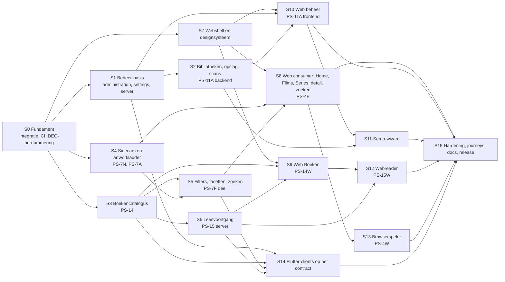

# I. Master implementation plan

Zesentwintig slices (S0 tot S25), elk zelfstandig groen te landen, als afhankelijkheidsgraaf. Een slice is een
serie commits op de integratiebranch met een eigen acceptatie en een eigen commitgrens. De
PS-nummers uit `docs/pleya-server-architecture.md` blijven de fasenamen; een slice zegt welke
fase hij dekt. Een volgende sessie voert dit document slice voor slice uit; wat ze niet hoeft te
doen is de architectuur opnieuw uitvinden.

## I.1 De graaf

Parallel mogelijk na S0: {S1, S3, S4, S7}. Na S1: S2. Na S3 en S4: S5, S6. Na S7 plus de
backend-slices: S8, S9, S10. S16 kan starten zodra S1 en S2 staan en groeit mee met S3, S5 en
S6. De kritieke lijn is S0 → S1 → S14 → S17 → S18 → S23 → S15; S22 (providers) is de
zwaarste losse slice en start zodra S4 staat. PS-12 (Plex-migratie) staat niet in de graaf: het
is een keuzefase na S15, met een eigen vrijgave.

## I.2 Slices

Elke slice heeft dezelfde velden. "Bestanden" noemt de plekken die zeker geraakt worden;
"Commitgrens" zegt wat één commit is, zodat een regressie terug te draaien is.

---

### S0 Fundament

**Scope.** Integratiebranch, conflictoplossing, DEC-hernummering, CI voor Go, web en protocol,
migratiefixture, fake-server-contracttest, vrijgave van PS-14 en PS-11A als besluit.
**Afhankelijk van.** Niets; blokkeert alles.
**Bestanden.** `.github/workflows/ci.yml` (drie jobs erbij), `docs/DECISIONS.md` (mapping),
`lib/media/server_capabilities.dart`, `lib/profiles/profile.dart` (+ `.freezed.dart`),
`lib/models/pleya_server/pleya_wire.dart`, `lib/database/app_database.dart` (+ `.g.dart`),
`lib/services/offline_watch_sync_service.dart` (replay-tak voor `removedFromContinueWatching`),
`pleya_verify/fixture_server/test/pleya_fake_server_contract_test.dart` (nieuw),
`pleya_server/internal/testsupport/fixtures/nas-schema7.sql` (nieuw, geanonimiseerde dump).
**Migraties.** Geen. **API.** Geen.
**Frontend.** Geen.
**Tests.** `scripts/ci_checks.sh` groen, volledige Flutter-suite groen, `scripts/codegen.sh` met
lege diff, `go vet` en `go test` met Postgres in CI, `bun run check`, `test`, `build`, e2e tegen de
wegwerpstack in CI, `check_protocol.sh` in CI, fake-server-contracttest groen.
**Docs.** Deel N stap 1 tot 5; `STATUS.md` op de integratiebranch.
**Acceptatie.** Eén groene CI-run op de integratiebranch met alle zes jobs; `git grep` vindt geen
verwijzing naar een hernummerd DEC-nummer in de oude vorm; de app start met een Pleya
Server-profiel op macOS en toont de drie hubs.
**Commitgrens.** (1) merge `main`, (2) conflictoplossing plus codegen, (3) DEC-hernummering,
(4) CI-workflows, (5) fixture en contracttest, (6) vrijgavebesluit PS-14 en PS-11A in de docs.

---

### S1 Beheer-basis (PS-11A backend, deel 1)

**Scope.** Klasse `admin` op nieuwe routes met tabelgedreven autorisatietest,
`server_settings` met `GET` en `PATCH /settings`, `GET /server` uitgebreid, `/server/environment`,
`/server/log`, `/server/connectivity-check`, `/server/rotate-signing-key`, `GET /stream-sessions`,
`GET /users/me`, foutcode `auth.permission_not_allowed`, `server_name` bij setup, capability
`administration`, recovery-middleware, lichaamslimiet, securityheaders op de API, API-tokens als
sessies (`POST/GET /auth/api-tokens`, RB-20) en de `admin_audit`-tabel met schrijfhaak in elke
beherende handler, de HttpOnly-refreshcookie plus origin-model voor de webclient (RB-29), en het
uitgebreide auditbereik uit VRAGENLIJST 23.
**Afhankelijk van.** S0.
**Bestanden.** `internal/settings/` (nieuw), `internal/api/handlers_settings.go`,
`handlers_server_admin.go` (nieuw), `server.go`, `wire.go`, `errors.go`, `handlers_auth.go`,
`internal/auth/store.go` (TTL's uit settings), `internal/logging/ring.go`, `authorize_test.go`.
**Migraties.** `0008_server_settings.sql` (plus `sessions.kind`, `sessions.scope`, `sessions.token_hash`, `sessions.expires_at` en `admin_audit`, deel J.6).
**API.** Venster 1 (deel J.2).
**Frontend.** Geen.
**Tests.** Per route drie rollen (owner 200, member 404, restricted 404); settings-validatie op
grenzen; hot reload van een TTL zonder herstart; log-redactie (token, DSN, pad) met de
bestaande redactievectoren; sleutelrotatie logt elke sessie uit (bestaande revocatietest
hergebruikt); `check_protocol.sh` groen na het sluiten van het venster.
**Docs.** DEC voor venster 1; protocoldoc hoofdstuk beheer; README-sectie instellingen.
**Acceptatie.** `curl` als owner kan servernaam en TTL wijzigen en ziet ze terug in `GET /server`
en in het gedrag (nieuw token heeft de nieuwe TTL); als member geeft elke nieuwe route 404.
**Commitgrens.** (1) recovery, limiet, headers, (2) settings-tabel en endpoints, (3) server-
endpoints, (4) stream-sessions en users/me, (5) capability en venster dicht.

---

### S2 Bibliotheken, opslag, scans (PS-11A backend, deel 2)

**Scope.** `libraries` schrijfbaar, `managed`, overname, `storage/roots`, scan starten, volgen,
annuleren, jobs lezen, retry, backoff op `probe_attempts`, `Library` op de lijn uitgebreid.
**Afhankelijk van.** S1.
**Bestanden.** `internal/api/handlers_admin_libraries.go`, `handlers_storage.go`,
`handlers_jobs.go` (nieuw), `internal/config/libraries.go`, `cmd/pleya-server/bootstrap.go`,
`scanwork.go`, `internal/jobs/jobs.go`, `internal/scanner/scanner.go` (annuleren, backoff),
`internal/mounts/`.
**Migraties.** `0009_libraries_managed.sql` (deel J.3).
**API.** Venster 2.
**Frontend.** Geen.
**Tests.** Migratietest op de NAS-fixture: dezelfde bibliotheken met dezelfde ids na 0009;
overnametest (herstart met de oude `.env`-regel geeft één bibliotheek); root buiten de mounts in
een `POST /libraries` geeft 400 `storage.root_not_offered` en raakt het bestandssysteem niet;
annuleren stopt een lopende scan binnen één walk-stap; retry zet `probe_attempts` terug;
`DELETE` zonder juiste `confirm` geeft 409; verwijderen laat bestanden staan (test telt
bestanden voor en na).
**Docs.** DEC venster 2; `pleya_server/README.md` de nieuwe weg naast de oude.
**Acceptatie.** PS-11A criteria 1, 2, 4, 5, 6, 7 met `curl`; criterium 3 zonder websocket (er is
geen realtime, dus alleen de pollweg).
**Commitgrens.** (1) migratie en `managed`, (2) CRUD, (3) storage, (4) scans en jobs, (5)
overname, (6) venster dicht.

---

### S3 Boekencatalogus (PS-14)

**Scope.** `books`-soort, `publications`, `publication_files`, EPUB-analyser, scannerdispatch,
`/ebooks`-resources, cover- en bestandsroute met sterke validator, `item_count` voor boeken,
`library.wrong_kind`, capability `ebooks`, soortwisseling geweigerd bij inhoud.
**Afhankelijk van.** S0 (en S2 voor `POST /libraries` met `kind: books`; zonder S2 via `.env`).
**Bestanden.** `internal/ebooks/` (nieuw: `epub.go`, `store.go`, `store_read.go`),
`internal/api/handlers_ebooks.go` (nieuw), `internal/scanner/scanner.go`, `walk.go`,
`nameparse/classify.go`, `internal/catalog/store.go` (`item_count`), `handlers_library.go`
(`wrong_kind`), `wire.go`.
**Migraties.** `0010_books.sql`.
**API.** Venster 3, precies de vijf wijzigingen uit ps14 hoofdstuk 9.
**Frontend.** Geen.
**Tests.** Scannertests van vandaag (`scanner_test.go`, `library_test.go`, 921 regels)
ongewijzigd groen (het bewijs dat de wandeling niet gesplitst is); EPUB-fixtures in
`testdata/epub/` (met cover in de OPF, met `cover-image`-property, zonder cover, kapotte zip,
zonder OPF); `.epub` in een filmbibliotheek blijft ongekoppeld; `Range` en `If-Range` op de
bestandsroute (206 bij gelijke validator, 200 vanaf byte 0 bij afwijkende); `item_count`; 404
zonder recht; geen ffprobe-aanroep in een boekenbibliotheek (teller in de test).
**Docs.** DEC venster 3, DEC sterke validator (adresseert DEC-050), matrix hoofdstuk 11 bijwerken.
**Acceptatie.** Alle zeven PS-14-criteria uit het voorstel, gemeten op een boekenbibliotheek van
minstens 30 EPUB's op de NAS.
**Commitgrens.** (1) migratie, (2) analyser, (3) dispatch, (4) resources, (5) bytes en validator,
(6) venster dicht.

---

### S4 Sidecars en artworkladder (PS-7N, PS-7A)

**Scope.** `.nfo`-parser voor `summary`, `genres`, `content_rating`, cast en regie
(uitbreiding op PS-7N: cast en regie zijn twee velden uit dezelfde sidecar en de detailpagina
toont ze; het voorstel noemde alleen drie velden, dit is een bewuste verbreding die in de DEC
staat), dekkingsmeting met de 80%-poort per bibliotheek, artworkladder met cache en
single-flight, coverroute op de ladder, `refresh-metadata` per bibliotheek, YAML-correctie
Cache-Control.
**Afhankelijk van.** S0; S3 voor covers.
**Bestanden.** `internal/sidecar/` (nieuw), `internal/artwork/` (nieuw),
`internal/api/handlers_media.go`, `handlers_ebooks.go`, `internal/scanner/sidecars.go`,
`internal/catalog/store_write.go`, `wire.go`.
**Migraties.** `0011_item_metadata.sql`.
**API.** Additief zonder nieuwe resource (velden op `Item`, `?width=` bestaat al); wel de
capability `artwork_sizes` en het coverage-endpoint; landt in venster 2 of 3, welk het eerst
open is.
**Frontend.** Geen.
**Tests.** Parsertests met echte `.nfo`-varianten (Kodi-film, Kodi-aflevering, `tvshow.nfo`,
kapotte XML, ontbrekende `<plot>`); poort: een bibliotheek onder 80% krijgt geen velden en de
meting toont het; ladder: `width=300` geeft 480 en `Content-Length` kleiner dan het origineel;
single-flight (twee gelijktijdige misses, één schaalactie); decodeerfout geeft origineel; cache
overleeft een herstart; `ETag` sterk en stabiel per (id, generatie, trede).
**Docs.** DEC voor de verbreding van PS-7N; DEC PS-7A verplicht (RB-7).
**Acceptatie.** Op de NAS: Films en Series boven de 80% krijgen samenvattingen; een raster van
100 posters op 480 breed laadt onder 3 MB in totaal (gemeten met de bestaande
`measure-artwork.ts`).
**Commitgrens.** (1) parser, (2) meting en poort, (3) velden op de lijn, (4) ladder, (5) covers,
(6) beheerendpoints.

---

### S5 Filters, facetten, zoeken (PS-7F deel)

**Scope.** Filterparameters op `/libraries/{id}/items`, facetten, extra sorteringen,
FTS plus `pg_trgm` plus prefixmatch met één deterministische ranking over titel, serie, acteur en auteur voor `/search` en `/ebooks?q=`, genormaliseerde facetkeys, `/ebooks/authors`, capability `filters`.
**Afhankelijk van.** S3, S4.
**Bestanden.** `internal/catalog/store_read.go`, `cursor.go`, `handlers_library.go`,
`internal/ebooks/store_read.go`, `handlers_ebooks.go`.
**Migraties.** `0012_search_indexes.sql` (`CREATE EXTENSION IF NOT EXISTS pg_trgm`, GIN op
titels, index op `genres`, `year`, `unnest(authors)`).
**API.** Venster 4 deel 1.
**Frontend.** Geen.
**Tests.** Injectietest (`Drama'; DROP TABLE media_items; --` als genre: 200, nul resultaten,
tabel bestaat, één geparameteriseerde query in het log); `Rock 'n' Roll` levert zijn items;
facettellingen kloppen met de items; `EXPLAIN` op de NAS-bibliotheek toont de index; cursor
blijft stabiel onder een filter.
**Docs.** DEC venster 4; matrix G13 dicht.
**Acceptatie.** `/libraries/{films}/items?genre=Drama&watched=false&sort=-year` onder 100 ms op de
NAS met 461 films; zoeken op `sea` blijft 24 treffers zonder seizoenen.
**Commitgrens.** (1) migratie, (2) filters, (3) facetten, (4) boekenzoekweg, (5) venster.

---

### S6 Leesvoortgang (PS-15 server)

**Scope.** `reading_states` met een Readium Locator plus publicatie-digest (RB-12 bijgesteld), Readium Web Publication Manifest en resources op `/ebooks/{id}/manifest` en `/ebooks/{id}/resources/{path}`, `POST` en `GET /reading-state`, `reading_state` op `Publication`,
`in_progress`-lijst voor Verder lezen, toestelnaam bij "laatst gekeken", capability
`reading_state`, locator volgens RB-12.
**Afhankelijk van.** S3; het locatorbesluit (RB-12) als DEC vóór de eerste commit.
**Bestanden.** `internal/reading/` (nieuw, pure functie plus store, naar het voorbeeld van
`internal/watch/`), `handlers_reading.go`, `handlers_ebooks.go` (hydratie), `wire.go`.
**Migraties.** `0013_reading_states.sql`.
**API.** Venster 4 deel 2.
**Frontend.** Geen.
**Tests.** Revisieconflict (oudere `base_revision` verliest, antwoord draagt de actuele staat);
`finished` valt uit `in_progress`; locatorvorm gevalideerd (CFI-string, spine-index ≥ 0, fractie
0 tot 1); 404 zonder recht; hydratie in één query.
**Docs.** DEC locator (RB-12), DEC venster 4.
**Acceptatie.** Twee clients (curl als "iPhone" en "browser") zetten om de beurt een positie; de
tweede leest de eerste terug; de `in_progress`-lijst toont het boek met de laatste fractie.
**Commitgrens.** (1) migratie en pure functie, (2) endpoints, (3) hydratie en lijst, (4) venster.

---

### S7 Webshell en designsysteem

**Scope.** `(app)`- en `(admin)`-layouts, `TopNav`, `MobileHeader`, `TabBar` met capability-
slot, capsuleknop, nieuwe primitieven (`Chips`, `Skeleton`, `Field`, `Select`, `Panel`,
`DataTable`, `StatTile`, `Alert`, `ConfirmDialog`, `Steps`, `Choice`, `Toggle`, `StatusPill`),
`MediaCard` met alle staten uit scherm 16, `Hero` en `HubRail` op de nieuwe geometrie,
`srcset`-helper op de artworkladder, Nederlandse locale, Mijn Pleya-route als plek voor thema.
**Afhankelijk van.** S0 (en S4 voor `srcset`, met terugval op het origineel zolang de capability
uit staat).
**Bestanden.** `src/routes/+layout.svelte`, `(app)/+layout.svelte`, `(admin)/+layout.svelte`
(nieuw), `src/lib/components/*` (nieuw en herschreven), `src/styles/base.css`, `tokens.css`,
`src/lib/util/srcset.ts`, `src/lib/i18n/nl.json`.
**Migraties.** Geen. **API.** Geen.
**Tests.** Componenttests per primitief (vitest); `Navigation.test.ts` en `navItems.test.ts`
herschreven op vijf slots en capability; e2e: shell op vijf breedtes zonder horizontale
overloop, axe groen, tabbalk toont Boeken alleen met een boekenbibliotheek (fixture met en
zonder); screenshot per breedte naast de northstar als reviewbewijs.
**Docs.** `pleya_web/README.md` (shell, designsysteem, de auth-correctie uit A.4).
**Acceptatie.** De bestaande zeven routes werken in de nieuwe shell zonder functieverlies; de
screenshotset van `scripts/screenshots.ts` op vijf breedtes ligt naast beeld 01, 12, 14 en 15
zonder afwijking in compositie of maat.
**Commitgrens.** (1) tokens en base, (2) layouts en navigatie, (3) primitieven, (4) kaart en
hero, (5) locale, (6) bestaande routes gemigreerd.

---

### S8 Web consumer (PS-4E)

**Scope.** Home met zes rijen, Films- en Series-landing, complete catalogus met filters en
facetten, zoeken gesectioneerd, filmdetail en seriedetail herschreven, Mijn Pleya, staten.
**Afhankelijk van.** S7, S4, S5 (en S6 voor toestelnaam en Verder lezen; die rijen verschijnen
pas als de capability aanstaat).
**Bestanden.** `(app)/+page.svelte`, `films/`, `series/`, `items/[id]/` (gesplitst),
`search/`, `my/`, componenten `DetailHero`, `SeasonPicker`, `EpisodeList`, `TrackList`,
`FileFacts`, `EpisodeRow`, `FilterBar`, `FacetSheet`.
**Migraties.** Geen. **API.** Geen (consumeert S4, S5, S6).
**Tests.** Componenttests; e2e met een kijkstatus vooraf gezet via `POST /watch-state` (PS-4E
criterium 2); de netwerklaag doet geen `POST /watch-state` behalve `mark_watched` na een
expliciete klik (PS-4E criterium 3, aangepast: gezien markeren is een bewuste actie en geen
playbackrapportage); `flow.spec.ts` omgedraaid (Verder kijken verschijnt); axe op elke route.
**Docs.** `pleya_web/README.md`.
**Acceptatie.** PS-4E criteria 1, 2, 4, 5; beeld 01 tot 09, 11, 13 tot 15 naast de screenshots.
**Commitgrens.** (1) Home, (2) landings, (3) catalogus met filters, (4) zoeken, (5) detail, (6)
Mijn Pleya en staten.

---

### S9 Web Boeken (PS-14W)

**Scope.** Boeken-slot, landing, alle boeken met filters, detail, cover met fallback en
ambience, downloaden als blob, Verder lezen-rij en Nieuw in Boeken op Home, boeken en auteurs
in zoeken.
**Afhankelijk van.** S7, S3, S6.
**Bestanden.** `(app)/books/`, componenten `BookCard`, `BookCover`, `ContinueReadingCard`,
`BookHero`, `src/lib/api/ebooks.ts`, `reading.ts`, `util/ambience.ts`.
**Tests.** Componenttests (cover-fallback tekent titel en auteur); e2e tegen de stack met de
EPUB-fixtures uit S3: landing, detail, download (blob met juiste grootte), Verder lezen na een
`POST /reading-state`; axe.
**Acceptatie.** Beeld 04, 06, 10 naast de screenshots; H.6 voor het webgedeelte.
**Commitgrens.** (1) API-laag, (2) kaarten, (3) landing en catalogus, (4) detail en download,
(5) Home en zoeken.

---

### S10 Web beheer (PS-11A frontend)

**Scope.** Tien beheersecties plus de mobiele index, rolgate, polling van scans, bevestigingen.
**Afhankelijk van.** S7, S1, S2 (S4 voor metadata-sectie).
**Bestanden.** `(admin)/admin/**`, `src/lib/api/admin.ts`, `src/lib/stores/admin.svelte.ts`,
componenten `AdminNav`, `AdminLayout`, `LogView`, `KeyValue`.
**Tests.** e2e als member: elke `/admin`-route toont de 404-pagina en de netwerklaag bevat geen
beheeraanvraag; als owner: bibliotheek toevoegen, scan starten, voortgang zien, annuleren,
`.env`-bibliotheek overnemen; verwijderen weigert zonder exacte naam; instellingen opslaan en
terugzien; sleutelrotatie logt uit en de client landt op inloggen; axe op elke sectie.
**Acceptatie.** Beeld 20 tot 33 naast de screenshots; PS-11A stopcriterium zonder terminal.
**Commitgrens.** Eén commit per sectie, de layout eerst.

---

### S11 Setup-wizard

**Scope.** Vier stappen op één route, hervatbaar na herladen, overslaan van gedane stappen,
overnamevariant bij `.env`-bibliotheken.
**Afhankelijk van.** S10, S2.
**Bestanden.** `src/routes/setup/+page.svelte` (herschreven), `SetupWizard.svelte`.
**Tests.** e2e op een lege database: setupcode uit de containerlog (de stack print hem),
eigenaar, root, bibliotheek, scan, Home met titels (golden journey 1).
**Acceptatie.** Beeld 40 tot 44; PS-11A end-to-end-test uit het masterplan.
**Commitgrens.** (1) wizard-state, (2) stappen, (3) overname.

---

### S12 Webreader (PS-15W)

**Scope.** Spike met de Readium TypeScript Toolkit (chromeless `@readium/navigator`) tegen het manifest uit S6, één extra mockup (readerschil, thema's, inhoudsopgave), reader op `/books/[id]/read`, leespositie schrijven met `base_revision`, thema en
lettergrootte client-local.
**Afhankelijk van.** S9, S6, de mockupgoedkeuring.
**Tests.** Locator round-trip (openen op de positie uit `GET`, verder bladeren, `POST`, opnieuw
openen); toetsenbord (pijlen, spatie, Esc); axe in de readerschil.
**Acceptatie.** Golden journey 3 tot en met Verder lezen op een tweede client.
**Commitgrens.** (1) mockup en DEC engine, (2) schil, (3) voortgang.

---

### S13 Browserspeler (PS-4W)

**Scope.** Zoals PS-4W in het masterplan 16.3, ontdaan van de twee items die naar PS-4E gingen:
`/items/[id]/play` met eigen schil, native `<video>` op `/stream` met streamsessie (DEC-051),
bediening, toetsenbord, Media Session, ondertitelconversie naar WebVTT, kijkstatus als
gebeurtenis met `session_id` en `base_revision`, foutstaten voor niet-afspeelbaar. Eén extra
mockup vooraf.
**Afhankelijk van.** S8.
**Tests.** e2e met een MP4/H.264-fixture uit de stack: start, seek, pauze, hervatten na
herladen op `user_state.position_ms`; SRT naar VTT-conversie unit-getest; MKV geeft de melding
en geen aanvraag naar `/stream`.
**Acceptatie.** PS-4W criteria uit het masterplan.
**Commitgrens.** (1) mockup, (2) schil en `<video>`, (3) kijkstatus, (4) ondertitels.

---

### S14 Flutter-clients op het contract

**Scope.** `PleyaCapabilities` met de vijf nieuwe vlaggen, `PleyaLibraryKind.books` met
platformgedrag, `PleyaServerBooksSource`, filterstubs in `unsupported.dart` vervangen
(`fetchLibraryFiltersWithValues`, filterparameters, sorteringen), `refreshLibraryMetadata`
werkend, `_postJson`-fout dicht, artworkladder in de imagecache-URL, Verify-scenario voor de
boekenbron, de app toont de beheeringang uit `GET /server`.
**Afhankelijk van.** S1, S3, S5, S6.
**Bestanden.** `lib/models/pleya_server/pleya_wire.dart`, `lib/services/pleya_server_client.dart`,
`parts/browse.dart`, `parts/unsupported.dart`, `parts/ebooks.dart` (nieuw), `parts/artwork.dart`,
`lib/services/pleya_server_capabilities.dart`, `lib/services/pleya_server_mappers.dart`, tests in
`test/pleya_server/`.
**Tests.** Bestaande 214 Dart-tests groen; regressietest 5xx op `POST /watch-state` bereikt de
offline-wachtrij; capability-resolutie per vlag; mapper-tests boeken; Verify-scenario tegen de
bijgewerkte fake.
**Acceptatie.** Op macOS en iOS-simulator bladert de app door boeken van de NAS via de nieuwe
bron; filters op een Pleya Server-bibliotheek werken op tvOS (het G13-uitstel uit DEC-080 op
main vervalt).
**Commitgrens.** (1) wire en capabilities, (2) `_postJson`, (3) filters, (4) boekenbron, (5)
artwork, (6) Verify.

---

### S15 Hardening, journeys, docs, release

**Scope.** RB-17 (refresh-limiter, stream-session-opruiming), de golden journeys 1 tot 14 uit deel L
als geautomatiseerde runs, securityacceptatie uit deel K, documentatie uit deel M, de
PS-5-hardwareronde als releasevoorwaarde, release volgens deel N.
**Afhankelijk van.** Alles.
**Acceptatie.** Deel O.

---

### S16 MCP-beheerlaag (RB-19)

**Scope.** `/mcp` met Streamable HTTP in de binary, één tool per protocoloperatie (lezen voor
iedereen binnen zicht, beheren voor `owner` en `admin`, destructief met `confirm`), dezelfde
servicelaag als de handlers, toolbeschrijvingen gegenereerd uit `openapi.yaml`
(`operationId` en `description`), capability `mcp`, instelling `mcp_enabled`, auditlog per
mutatie, configuratieblok voor Claude Code in scherm 34, `GET /audit` voor beheer.
**Afhankelijk van.** S1 (tokens, audit), S2, S3, S5, S6 (de operaties die de tools afbeelden).
**Bestanden.** `internal/mcp/` (nieuw: transport, toolregister, mapping), `internal/api/server.go`
(route buiten `/pleya/v1`), `handlers_audit.go`, `scripts/gen-mcp-tools.sh` (genereert de
toollijst uit de YAML en faalt als een operatie zonder tool is of andersom).
**Migraties.** Geen (audit en tokens komen uit S1).
**API.** Geen protocolwijziging; `/mcp` staat buiten `openapi.yaml` en wordt beschreven in een
eigen hoofdstuk van de protocoldoc met de toollijst.
**Frontend.** Scherm 34 (S10 bouwt de pagina, S16 vult MCP-status en toollijst).
**Tests.** Per tool dezelfde drie-rollen-test als de HTTP-route (gedeelde tabel); een MCP-client-
test die `initialize`, `tools/list` en drie tools doorloopt met een API-token; een tool met een
titel die als instructie leest (`Ignore previous instructions…`) komt als tekst terug zonder
serverkant-prompt; destructieve tool zonder `confirm` geeft een fout en een auditregel
"geweigerd"; `mcp_enabled: false` geeft 404 op `/mcp` en de API werkt.
**Docs.** DEC RB-19 en RB-20, protocoldoc hoofdstuk MCP, operatorhandleiding "een agent koppelen".
**Acceptatie.** Claude Code met de configuratie uit scherm 34 kan een bibliotheek toevoegen,
een scan starten en volgen, een gebruiker aanmaken met rechten en een instelling wijzigen; als
lid met een leestoken ziet dezelfde agent alleen de catalogus; elke actie staat in de auditlog.
**Commitgrens.** (1) transport en register, (2) leestools, (3) beheertools, (4) audit en
scherm 34, (5) generator en contracttest.

### S17 PlaybackPlan (PS-6)

**Scope.** `POST /playback/plan` met de PS-5-capabilities; planner als pure functie met
tabeltests; versiekeuze goedkoopste passende; reden als `{code, params}`; capability
`playback_plan`; de app en het web sturen hun capabilities en volgen het plan.
**Afhankelijk van.** S14. **Migraties.** Geen. **API.** Venster 5 (deel J.8).
**Tests.** Tabel uit architectuur 10.5 (hard, zacht, score); een onbekende capability geeft het
gedrag van vóór PS-5. **Acceptatie.** PS-6 criteria uit hoofdstuk 23.
**Commitgrens.** (1) planner, (2) endpoint, (3) client, (4) venster.

### S18 Transcode (PS-8)

**Scope.** Remux en transcode als sessie (start, heartbeat, stop, opruimen), fMP4 en HLS,
hwaccel-detectie bij opstarten voor VAAPI, QSV en NVENC, kwaliteitsladder, maximum en quotum uit settings met grenzen, ondertitelmatrix (bitmap en niet-vertaalbare ASS ingebrand, tekst als WebVTT), `/transcode-sessions`
voor beheer, browserspeler met hls.js, scherm 28 en 20 uitgebreid; capability `transcode`.
**Afhankelijk van.** S17. **Migraties.** `0014_transcode_sessions.sql`. **API.** Venster 5.
**Tests.** Een MKV/HEVC-fixture speelt in Chromium via HLS; sessie ruimt op na een gesimuleerde
crash van de client; een derde sessie krijgt `playback.transcode_busy`; ffmpeg-argumenten zijn
een vaste lijst (test op afwezigheid van invoer in argv).
**Acceptatie.** PS-8 criteria. **Commitgrens.** (1) sessiemodel, (2) ffmpeg-supervisie, (3) HLS,
(4) hwaccel, (5) web, (6) beheer, (7) venster.

### S19 Verzamelingen en afspeellijsten (PS-9C)

**Scope.** Tabellen, CRUD, zichtbaarheid, volgorde, kaartmenu "Toevoegen aan", schermen 17 en 18,
app-implementatie van de bestaande `MediaServerClient`-members; capabilities `collections`,
`playlists`. **Afhankelijk van.** S1. **Migraties.** `0015_collections_playlists.sql`.
**API.** Venster 6. **Tests.** Zichtbaarheid per gebruiker (404 buiten zicht), herordenen
atomair, verwijderen van een item uit de catalogus laat de lijst consistent.
**Commitgrens.** (1) migratie, (2) endpoints, (3) web, (4) app, (5) venster.

### S20 Persoonlijke laag (PS-9P, PS-9T)

**Scope.** `play_history` uit de watch-state-events, favorieten, waarderingen,
spoorvoorkeuren; `/history`, `/favorites`, `/ratings`, `/track-preferences`; scherm 19;
"Bekeken door" op detail; app-members `setFavorite`, `rate`, spoorkeuze; capabilities.
**Afhankelijk van.** S6 (boeken in geschiedenis). **Migraties.** `0016_personal.sql`.
**API.** Venster 6. **Tests.** Eén geschiedenisrij per afspeelsessie; spoorkeuze reist tussen twee
clients; favorieten overleven een profielwissel.
**Commitgrens.** (1) migratie, (2) geschiedenis, (3) favorieten en waarderingen, (4) sporen,
(5) web en app, (6) venster.

### S21 Realtime (PS-11R)

**Scope.** `internal/events/` hub, `GET /events` websocket met volgnummers en `since=`, events
voor scanvoortgang, watch-state, leesvoortgang, sessies, meldingen; filter per zicht; web en app
abonneren met terugval op polling; capability `realtime`; realtime-status in Diagnostiek.
**Afhankelijk van.** S2, S6. **Migraties.** Geen. **API.** Venster 7 (websocket buiten de
YAML, beschreven in de protocoldoc). **Tests.** Gat dichten met `since=`; een lid ziet geen event
van een bibliotheek buiten zijn zicht; zonder websocket blijft alles werken (bestaande
polltests). **Commitgrens.** (1) hub, (2) events, (3) clients, (4) docs.

### S22 Metadata-providers (PS-7)

**Scope.** Providerabstractie, TMDB, kandidatenlaag, driestapsmatch met ambiguïteit,
providerronde als job met backoff, automatisch inladen van samenvatting, genres, kijkwijzer, cast,
regie, beoordelingen en artwork (poster, backdrop, logo) naar de cache op de ladder, correcties
(bevestigen, afwijzen, fix-match, artwork kiezen met pin, per-field overrides met provenance en reset), attributie op elk scherm, providerinstellingen
in `/settings` (API-sleutel als geheim, nooit teruggelezen), scherm 29 uitgebreid plus één
mockup voor match en artworkkeuze, extra's uit de bestandsboom; capabilities `metadata_provider`,
`ratings_external`. **Afhankelijk van.** S4. **Migraties.** `0017_metadata_candidates.sql`
(`metadata_candidates`, `metadata_corrections`, `artwork_candidates`, `external_ids`).
**API.** Venster 8. **Tests.** Matchtests met opgenomen providerantwoorden incl. ambigue gevallen;
een correctie overleeft drie rondes; canoniek record herbouwbaar uit kandidaten plus correcties;
een HTML-antwoord van de provider beschadigt geen record; SSRF-test op de hostlijst; rate-limit-
backoff. **Acceptatie.** PS-7 criteria 1 tot 4 op de NAS-bibliotheek met gerapporteerd
matchpercentage. **Commitgrens.** (1) abstractie en kandidaten, (2) TMDB, (3) match, (4) artwork,
(5) correcties en beheer, (6) attributie in web en app, (7) venster.

### S23 Downloads (PS-10)

**Scope.** `downloads` tabel, `POST /downloads`, bestand met digest (origineel of trede via S18),
opruimen, recht `download`, app-implementatie op de bestaande downloadwachtrij en sync-back,
downloads op Mijn Pleya (web toont wat de app heeft, downloadt zelf niet buiten boeken);
capability `downloads`. **Afhankelijk van.** S18. **Migraties.** `0018_downloads.sql`.
**API.** Venster 5. **Tests.** Digest klopt over het samengestelde bestand; hervatten alleen bij
gelijke digest; offline kijkstatus komt terug via `backlog`. **Acceptatie.** PS-10 criteria.
**Commitgrens.** (1) migratie en endpoint, (2) levering, (3) app, (4) venster.

### S24 Remote hardening en observability (PS-11)

**Scope.** Vertrouwde proxy's, `public_url` in gegenereerde URL's, subpad-montage, rate limits,
Prometheus op een configureerbare private bind (default loopback), aparte instellingen voor web-origin, externe base-URL en trusted proxies, CORS-beleid, publieke-endpointlijst als test, deploymentrecepten (tunnel, mesh-VPN,
eigen proxy). **Afhankelijk van.** S1. **Migraties.** Geen. **API.** Geen. **Tests.** Range-testset
door twee proxy-opstellingen; brute-force afgeremd zonder een geldige gebruiker uit te sluiten;
metric `delivery_mode` klopt met een gecontroleerde sessie. **Acceptatie.** PS-11 criteria 1 tot 4.

### S25 Back-up, restore, upgrade, faalpaden (PS-11B)

**Scope.** `internal/backup/`, back-updoel, tijdstip en retentie als instellingen (default `/backups`, 03:30, 14), failure-domain-waarschuwing, geplande en handmatige back-up inclusief config- en sleutelstate met verpakte secrets, hersteltest in een geïsoleerde tijdelijke database die migraties en kernqueries draait, restore met onderhoudsmodus en bevestiging, upgrade-guard (back-up vóór de
eerste migratie, weigering op een nieuwere database), de vier faalpaden met foutcodes en één
settest, scherm 35. **Afhankelijk van.** S2. **Migraties.** `0019_backups.sql` (registratie van
back-ups en hersteltests). **API.** Venster 7. **Tests.** Back-up terugzetten op een lege server
geeft dezelfde catalogus en kijkstatus; upgrade over twee schemaversies slaagt; terugrollen
weigert luid; elk faalpad geeft zijn code. **Acceptatie.** Matrix 5.13 rijen back-up, restore,
upgrade, terugrollen, faalpaden op `Productgereed`.

### PS-12 Plex-migratie: keuzefase, geen slice

Start pas na S15 en na een eigen vrijgave door Michel. Het ontwerp blijft hoofdstuk 19 en de
fasetabel in hoofdstuk 23; de droogloop met rapport is verplicht; Plex-ids komen in geen tabel.

## I.3 Wat een sessie per slice doet

0. Zet de taken van de slice in `docs/PLEYA-SERVER-MASTERLIST.md` op `[~]` bij het starten en op
   `[x]` met bewijs bij het afronden, in dezelfde commit als het werk.

1. Lees de slice, de RB-besluiten die hij noemt, en de PS-fase in
   `docs/pleya-server-architecture.md` (voor de acceptatiecriteria die daar staan).
2. Open het protocolvenster alleen als de slice er een heeft, met de lijst uit deel J, en sluit
   het in dezelfde slice.
3. Bouw in de commitgrenzen; elke commit laat `ci_checks.sh`, de Go-tests en de webtests groen.
4. Vergelijk elk nieuw webscherm met het northstar-beeld op de breedtes uit het manifest en
   leg de screenshot naast het beeld in de PR of het sessielogboek.
5. Sluit de slice met een Roadmap Drift Check (drie vragen uit 23.1) in `STATUS.md`.
