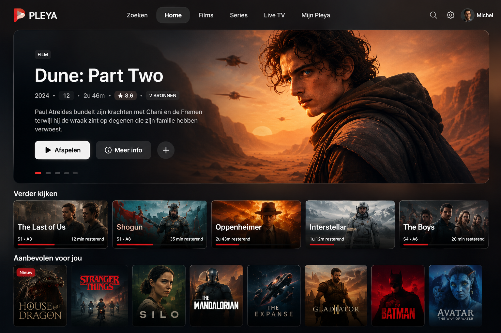
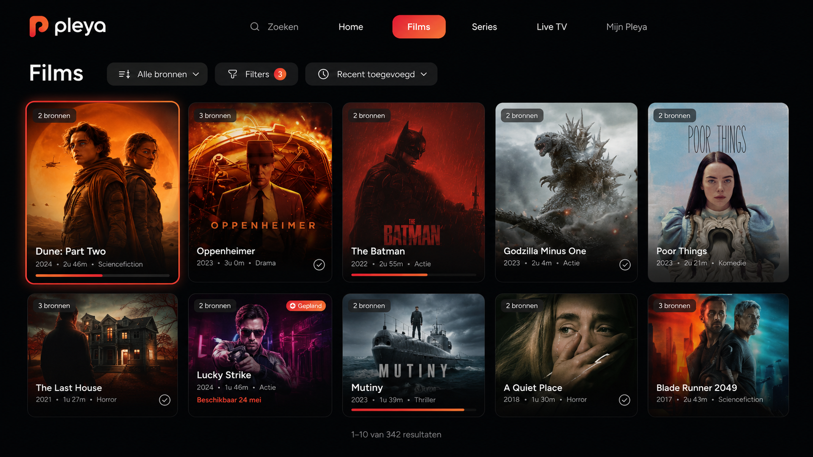
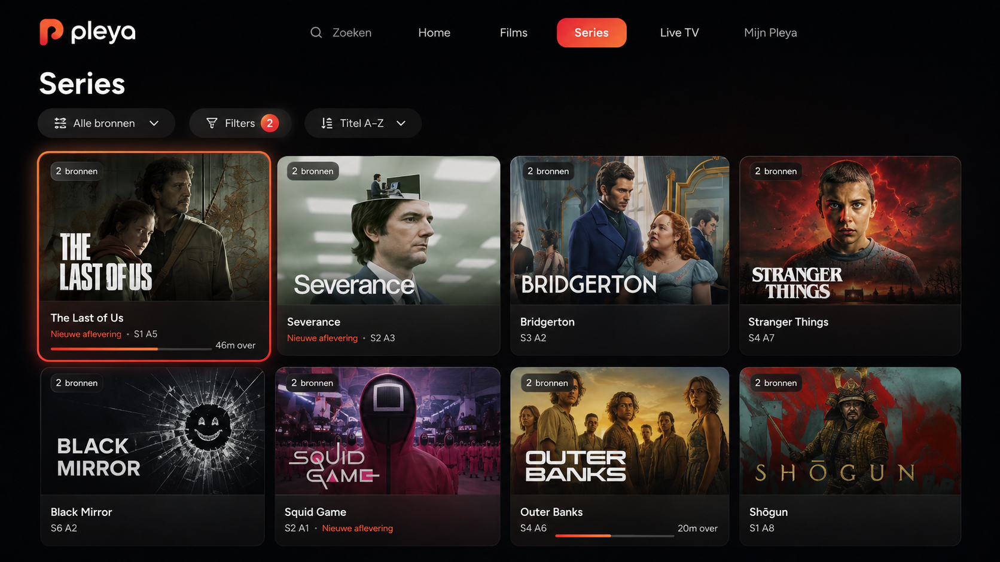
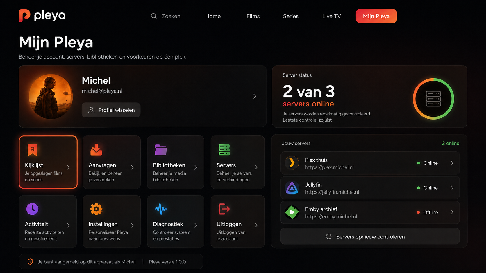

# Pleya Unified TV 2026: architectuurbaseline

**Status:** **architectuurbaseline goedgekeurd, uitvoering vrijgegeven per fase.** De hoofdrichting
ligt vast en wordt niet opnieuw geopend. Fase 0 is vrijgegeven; latere fasen volgen sequentieel na
hun eigen verificatiepoort.
**Datum:** 29 augustus 2026
**Auteur:** Michel Knoop
**Scope:** de volledige TV-ervaring voor alle D-pad-layouts die via `PlatformDetector.isTV()` lopen.
tvOS is het primaire bewijsplatform. Desktop en mobiel worden **niet** heringericht.

**Over de lengte.** Dit bestand staat ruim boven de 500 regels waar ontwikkeldocumentatie in dit
project normaal wordt gesplitst. Bewuste uitzondering, om dezelfde reden als
[docs/pleya-server-architecture.md](pleya-server-architecture.md): het is één samenhangend argument
dat je één keer lineair leest en daarna via de inhoudsopgave raadpleegt.

**De kernbeslissing.** We beginnen niet bij de nieuwe hero. Eerst bouwen we één serveronafhankelijke
cataloguslaag die alle concrete bronnen bewaart. Daarna bouwen we de nieuwe tv-interface erbovenop.
Anders ontstaat een mooie Home boven op een datamodel dat dubbele titels nog steeds weggooit,
willekeurig één server kiest en bij acties niet meer weet welke bron bedoeld werd.

De redesign is één programma met twee pijlers:

1. **Unified Catalog** — Films, Series, Search, Home en Verder kijken tonen één logische titel met
   één of meer concrete bronnen.
2. **Unified TV Experience** — een vaste horizontale tv-navigatie, een afgeronde cinematografische
   hero, normale contentrijen, duidelijke focusroutes en een volwaardige Mijn Pleya-sectie.

Dit is geen MVP. Bestaande functies blijven beschikbaar; er komt geen tijdelijke eindtoestand waarin
bibliotheken, aanvragen, kijklijst, filters of serverbeheer verdwijnen.

---

## Inhoud

1. [Bewezen uitgangssituatie](#1-bewezen-uitgangssituatie)
2. [Productscope](#2-productscope)
3. [Gewenste eindervaring](#3-gewenste-eindervaring)
4. [Harde architectuurbesluiten](#4-harde-architectuurbesluiten)
5. [Doelarchitectuur](#5-doelarchitectuur)
6. [Navigatiearchitectuur](#6-navigatiearchitectuur)
7. [Volledig TV-focuscontract](#7-volledig-tv-focuscontract)
8. [Designsysteem en layoutcontract](#8-designsysteem-en-layoutcontract)
9. [Nieuwe Home](#9-nieuwe-home)
10. [Films en Series](#10-films-en-series)
11. [Unified identiteit en deduplicatie](#11-unified-identiteit-en-deduplicatie)
12. [Globale multi-library pagination](#12-globale-multi-library-pagination)
13. [Watch-state en groepsacties](#13-watch-state-en-groepsacties)
14. [Source picker](#14-source-picker)
15. [Detailpagina en source switching](#15-detailpagina-en-source-switching)
16. [Search](#16-search)
17. [Home-rijen en aanbevelingen](#17-home-rijen-en-aanbevelingen)
18. [Mijn Pleya op TV](#18-mijn-pleya-op-tv)
19. [Live TV](#19-live-tv)
20. [Aanvragen en Kijklijst](#20-aanvragen-en-kijklijst)
21. [Offline, reconnect en gedeeltelijke fouten](#21-offline-reconnect-en-gedeeltelijke-fouten)
22. [Profiles en privacygrenzen](#22-profiles-en-privacygrenzen)
23. [Contextmenucontract](#23-contextmenucontract)
24. [Performancecontract](#24-performancecontract)
25. [Toegankelijkheid en lokalisatie](#25-toegankelijkheid-en-lokalisatie)
26. [Edge-case register](#26-edge-case-register)
27. [Implementatiefasen](#27-implementatiefasen)
28. [Testdataset](#28-testdataset)
29. [Visuele QA-scenario's](#29-visuele-qa-scenarios)
30. [Risico's en stopcriteria](#30-risicos-en-stopcriteria)
31. [Wat expliciet niet gedaan mag worden](#31-wat-expliciet-niet-gedaan-mag-worden)
32. [Finale Definition of Done](#32-finale-definition-of-done)
33. [Visuele referenties en acceptatiemapping](#33-visuele-referenties-en-acceptatiemapping)
34. [Themagezag](#34-themagezag)

---

## 1. Bewezen uitgangssituatie

Elk punt hieronder is op 29 augustus 2026 tegen de code geverifieerd; de vindplaats staat erbij.

Pleya heeft al een aparte TV-renderroute. De huidige TV-home gebruikt een vrijwel schermvullende
`TvSpotlightBackground` (`lib/widgets/tv_spotlight_background.dart`, 627 regels), met een contentrail
die onderaan rust en bij focus omhoog schuift (`_tvRailRevealed` + `AnimatedSlide` in
`lib/screens/discover_screen.dart`). De gefocuste kaart in die rail stuurt momenteel ook de spotlight
aan (`_spotlightItem`). De Play- en Meer info-knoppen gaan al via de bestaande centrale navigatie
naar de speler of detailpagina.

De bestaande `DataAggregationService` haalt al bibliotheken, Verder kijken, recente films, recente
series, hubs en zoekresultaten op bij meerdere servers. Het probleem is niet dat Pleya geen
multi-serverdata kent. Het probleem is dat de aggregatie bij duplicaten één `MediaItem` bewaart en de
andere varianten weggooit. Verder kijken gebruikt daarvoor een redelijk sterke
externe-ID-resolutie (`_deduplicateContinueWatching`, `data_aggregation_service.dart:297–429`),
terwijl recente films en series nog op `guid ?? globalKey` dedupliceren (r. 202).

De huidige bibliotheekinterface is fundamenteel per bron. `LibrariesScreen` selecteert precies één
`MediaLibrary`, en `LibraryBrowseTab` vraagt vervolgens pagina's op bij precies de client en library
van die bron (`lib/screens/libraries/tabs/library_browse_tab.dart:726`, via
`getMediaClientForLibrary`). Alleen de bibliotheekselector verbergen zou daarom geen correcte globale
Films- of Series-pagina opleveren.

Pleya heeft al een geschikte identiteitsbasis. `MediaIdentity` (`lib/media/media_identity.dart`) kent
GUID, IMDb/TMDB/TVDB, titel, jaar en type, geeft sterke identifiers voorrang en weigert bewust een
keuze te maken wanneer meerdere kandidaten ambigu blijven (`pickMatch`). Dat laatste moet een harde
invariant worden: een dubbele kaart is vervelend, twee verschillende films onterecht samenvoegen is
erger.

`MediaItem` (`lib/media/media_item.dart`) blijft vandaag één concreet serveritem met een eigen
backend, `serverId`, `libraryId`, artwork, media-versies en watch-state. Het is een freezed sealed
union met vier varianten (`plex`, `jellyfin`, `local`, `pleyaServer`). De centrale
`navigateToMediaItem`-route (`lib/utils/media_navigation_helper.dart`) verwacht terecht zo'n concreet
item en stuurt het vervolgens naar detail of playback. Dat is precies de grens die we moeten
behouden.

De huidige primaire navigatie kent Home, Bibliotheken, Live TV, Zoeken, Kijklijst, Aanvragen,
Downloads, Instellingen en Mijn Pleya (`enum NavigationTabId`, `lib/navigation/navigation_tabs.dart:98`).
Mijn Pleya is nu expliciet alleen mobiel (`showsHeaderAccountMenu({required bool isMobile}) => !isMobile`,
r. 91, vastgelegd in [DEC-023](DECISIONS.md#dec-023)); TV en desktop zijn ontworpen rond de zijbalk.
Films en Series zijn nog geen zelfstandige globale bestemmingen.

### 1.1 Twee randvoorwaarden die de repository oplegt

Deze staan niet in de oorspronkelijke planformulering maar zijn bindend:

1. **`test/pleya_server/pleya_server_aggregation_test.dart` grept de broncode** van
   `data_aggregation_service.dart` en `multi_server_provider.dart` op `MediaBackend.`,
   `is PlexClient`, `is JellyfinClient` en `is PleyaServerClient`, en faalt als die voorkomen.
   Backendspecifieke logica hoort dus in de nieuwe `unified_catalog/`-bestanden. Visibilityfiltering
   is backendneutraal en mag daar wél.
2. **`DataAggregationService._clientsFor()` vertrekt rechtstreeks vanaf
   `_serverManager.onlineClients`, die niet visibility-gefilterd is.** Profielzichtbaarheid zit
   alleen op `MultiServerProvider`. Hoofdstuk 22 eist "visibility vóór grouping"; dit is dus een
   bestaand latent lek dat fase 2 dichtzet, niet een nieuw te bouwen filter.

### 1.2 Bestaand werk dat hergebruikt wordt, niet gedupliceerd

- `MediaServerClient.findByIdentity(MediaIdentity) → MediaItem?` — de zuster van de
  `findAllByIdentity` uit hoofdstuk 12.8. `null` = niet hier, **throws** = kon niet kijken.
- `lib/services/watchlist/watchlist_availability_resolver.dart` — de coveragesemantiek is al af:
  `coverageComplete`, `maxConcurrent = 4`, positieve TTL 7 dagen, negatieve TTL 6 uur en **alleen
  gecachet bij volledige coverage**. Hoofdstukken 2, 12.8 en 20 delegeren hierop.
- `lib/media/library_query.dart` (`LibraryQuery`, `LibraryPage{items,totalCount,offset}`) en
  `lib/media/paged_media_list_state.dart` — de pagingprimitieven voor hoofdstuk 12.
- `lib/focus/` (`SelectKeyUpSuppressor`, `handleOneShotSelect`, `FocusMemoryTracker`,
  `SidebarFocusCoordinator`) — hoofdstuk 7 breidt dit uit, vervangt het niet.

---

## 2. Productscope

### In deze implementatie

De volledige TV-ervaring wordt vernieuwd voor alle D-pad-TV-layouts die nu via
`PlatformDetector.isTV()` lopen. tvOS is het primaire bewijsplatform. Android TV blijft functioneel
en krijgt dezelfde visuele basis, met platformafhankelijke Back-, Menu-, toetsenbord- en
downloadregels.

De implementatie omvat: nieuwe TV-topnavigatie; nieuwe Home met afgeronde billboard-carousel;
globale Films-pagina; globale Series-pagina; gegroepeerde multi-serverresultaten; bronkeuze bij
dubbele content; gegroepeerde Verder kijken-rij; gegroepeerde Search-resultaten; TV-versie van Mijn
Pleya; behoud van Live TV, Kijklijst, Aanvragen, Bibliotheken, Instellingen, serverbeheer,
activiteiten en profielen; volledige focus-, Back- en Menu-contracten; gedeeltelijk offline en
gedeeltelijk defecte servers; toegankelijkheid, lokalisatie en 4K-performance; visuele en
runtimeverificatie op echte Apple TV.

### Niet in deze implementatie

Expliciete grenzen, geen vergeten onderdelen:

- geen autoplay-video of trailers in de hero;
- geen wijziging van het Pleya Server-protocol;
- geen automatische cross-server failover tijdens playback;
- geen unified Collections of Playlists;
- geen samenvoeging van Live TV-kanalen;
- geen automatische bulkmutatie van meerdere servers zonder expliciete scope;
- geen redesign van iOS, iPadOS of macOS;
- geen verwijdering van de bestaande geavanceerde Bibliotheken-interface;
- geen permanente gebruikersinstelling om tussen oude en nieuwe TV-shell te wisselen.

De datafundering wordt wel platformneutraal gebouwd, zodat Films en Series later ook op andere
platforms kunnen worden gebruikt zonder opnieuw een deduplicatiearchitectuur te ontwerpen.

---

## 3. Gewenste eindervaring

### Primaire TV-navigatie

```
PLEYA     Zoeken     Home     Films     Series     [Live TV]     Mijn Pleya
```

Regels:

- Live TV verschijnt wanneer het actieve profiel een bekende Live TV-bron heeft.
- Mijn Pleya bestaat altijd.
- Downloads verschijnen niet op Apple TV, overeenkomstig het huidige platformcontract.
- Op Android TV mogen Downloads onder Mijn Pleya blijven staan waar ze ondersteund worden.
- Bibliotheken, Kijklijst, Aanvragen en Instellingen blijven echte routes, maar staan niet allemaal
  permanent in de topnavigatie.
- Profiel, verbindingen, serveractiviteiten en Now Watching worden niet stil verwijderd. Ze verhuizen
  naar Mijn Pleya.
- De topnavigatie blijft stabiel bij een tijdelijke serverstoring. Een offline server mag niet
  telkens navigatie-items laten verspringen.

### Hoofdjourney

1. Pleya start en bindt het actieve profiel.
2. Een gecachte Home-snapshot verschijnt direct.
3. Online servers leveren hun data in golven.
4. Duplicaten worden aan bestaande titelgroepen toegevoegd zonder kaarten te dupliceren.
5. Home toont één hero-titel per logisch werk.
6. De gebruiker navigeert naar Films.
7. Alle toegankelijke filmbibliotheken lopen door elkaar.
8. Een film die op drie servers staat verschijnt één keer met 3 bronnen.
9. Selecteren opent de bronselector.
10. De gebruiker kiest bijvoorbeeld NAS • Plex • Films 4K.
11. Pleya geeft exact dat concrete `MediaItem` door aan de bestaande detail- of playbackroute.
12. Na playback wordt de watch-state van de gekozen bron bijgewerkt en de gegroepeerde kaart opnieuw
    berekend.
13. Back brengt de gebruiker terug naar dezelfde kaart, dezelfde rij en dezelfde scrollpositie.

---

## 4. Harde architectuurbesluiten

Deze zes besluiten zijn vastgelegd in [DEC-063](DECISIONS.md#dec-063) en worden niet heropend.

### 4.1 MediaItem blijft één concrete bron

Een `MediaItem` wordt niet uitgebreid met `List<Server>` of een willekeurige "active server". Dat
voorkomt dat bestaande flows onduidelijk worden: playback heeft één concrete server nodig;
metadata-refresh raakt één concrete library; verwijderen raakt één concreet item; tracks en
media-versies horen bij één bron; play queues en volgende afleveringen zijn servergebonden;
watch-state events bevatten server- en itemidentiteit.

### 4.2 Een nieuwe projectielaag komt boven MediaItem

```dart
class UnifiedMediaSource {
  final String sourceKey;
  final MediaItem item;
  final ServerId serverId;
  final String serverName;
  final MediaBackend backend;
  final String? libraryId;
  final String? libraryTitle;
  final SourceAvailability availability;
  final ExternalIds externalIds;
}

class UnifiedMediaGroup {
  final String groupId;
  final CanonicalMediaIdentity identity;
  final List<UnifiedMediaSource> sources;
  final String representativeSourceKey;
  final UnifiedWatchState watchState;
  final SourceCoverageState coverage;
}
```

`UnifiedMediaGroup` is alleen een presentatie- en aggregatiemodel.

### 4.3 Eén centrale identiteitspijplijn

Home, Films, Series, Search, Verder kijken en Watchlist mogen geen afzonderlijke dedupalgoritmen
krijgen. Er komt één gedeelde service voor candidate bucketing, externe-ID-verrijking,
identiteitsbewijzen, conflictcontrole, grouping, bronresolutie en coverage.

### 4.4 Bronkeuze gebeurt vóór de bestaande route

```
UnifiedMediaGroup
        │
        ├─ één bron ──────────────────────┐
        │                                 │
        └─ meerdere bronnen ─ picker ─────┤
                                          ▼
                                      MediaItem
                                          │
                                  bestaande Pleya-flow
```

De speler blijft dus vrij van unified-cataloguslogica.

### 4.5 Bibliotheken blijft bestaan

Films en Series zijn de dagelijkse globale catalogus. Mijn Pleya ▸ Bibliotheken blijft de
geavanceerde bronweergave voor: één library selecteren; Recommended; Browse; Collections; Playlists;
backend-specifieke filters; folder browsing; metadata vernieuwen; scan/analyse/prullenbak waar
ondersteund; libraries tonen/verbergen en ordenen.

### 4.6 Writes zijn standaard brongebonden

Lezen mag gegroepeerd worden. Mutaties mogen nooit per ongeluk de representatieve artworkbron raken.
Afspelen: gekozen bron. Details: gekozen bron. Metadata-refresh: gekozen library. Verwijderen:
gekozen bron. Markeer bekeken: gekozen bron, of expliciet Alle bronnen. Verwijder uit Verder kijken:
expliciet logisch groepscontract, beschreven in hoofdstuk 13.

### 4.7 Geen willekeur op basis van responssnelheid

De eerste server die antwoordt wordt nooit automatisch de artworkbron, de playbackbron of de bron die
een destructive action ontvangt. Alle rangordes krijgen een deterministic tie-break op:

```
preferred source → online state → metadata completeness → artwork completeness
→ quality information → server name → server id → item id
```

---

## 5. Doelarchitectuur

```
                    Active profile
                          │
                          ▼
                MultiServerProvider
         visible / expected / online / auth
                          │
                          ▼
                 LibrariesProvider
               alle concrete libraries
                          │
                          ▼
                UnifiedCatalogService
          ┌───────────────┼────────────────┐
          │               │                │
     source paging   identity resolver   coverage
          │               │                │
          └───────────────┼────────────────┘
                          ▼
                UnifiedMediaGroup[]
                          │
         ┌────────────────┼──────────────────┐
         │                │                  │
       Home             Films             Series
         │                │                  │
         ├──────── Search ┤                  │
         │                │                  │
         └──────── Continue Watching ────────┘
                          │
                          ▼
             UnifiedActivationCoordinator
                          │
               één bron of source picker
                          │
                          ▼
                    concreet MediaItem
                          │
                          ▼
             bestaande details / playback
```

`MultiServerProvider` maakt vandaag al onderscheid tussen profielzichtbaarheid, verwachte servers,
werkelijk online servers en auth-fouten. De unified laag moet die bestaande waarheid consumeren en
mag zelf geen tweede serverstatussysteem introduceren.

---

## 6. Navigatiearchitectuur

### 6.1 Route-identiteit losmaken van platformchrome

De huidige `allNavigationTabs` wordt voor meerdere platforms tegelijk gebruikt. Dat wordt gesplitst:

```
Route registry
├─ alle bestaande schermroutes
├─ movies
└─ series

Mobile presentation   → bestaande bottom navigation + mobiele Mijn Pleya-projectie
Desktop presentation  → bestaande SideNavigationRail (ongewijzigd)
TV presentation       → Zoeken, Home, Films, Series, [Live TV], Mijn Pleya
```

Concreet: `NavigationTabId` krijgt `movies` en `series`; de routecatalogus blijft centraal; er komen
platformafhankelijke lijsten `mobilePrimaryDestinations`, `desktopSideDestinations` en
`tvPrimaryDestinations`; `myPleya` wordt zichtbaar op mobiel en TV, niet als duplicaat naast de
desktopzijbalk; `libraries`, `watchlist`, `requests` en `settings` blijven routes maar zijn op TV
onderliggende Mijn Pleya-routes.

### 6.2 Nieuwe TV-shell

```
TvRootShell
├─ TvTopNavigation
├─ SystemBannerSlot
├─ TvDestinationHost
│  ├─ Home
│  ├─ Movies
│  ├─ Series
│  ├─ Search
│  ├─ Live TV
│  └─ TvMyPleyaNavigator
└─ OverlaySheetHost
```

Desktop blijft de bestaande `SideNavigationRail` gebruiken.

### 6.3 Mijn Pleya krijgt een eigen geneste navigator

```
Mijn Pleya
   └─ Bibliotheken
       └─ Library detail
```

Back popt dan eerst naar Mijn Pleya. Dat is robuuster dan het hoofdtabblad naar settings schakelen en
daarna met projectieregels doen alsof Mijn Pleya geselecteerd is.

### 6.4 Compatibiliteitsadapter

`MainScreenFocusScope.selectLibrary` blijft werken. Wanneer een library-section-item wordt geopend:
de TV-shell selecteert Mijn Pleya; de Mijn Pleya-navigator opent Bibliotheken;
`LibrariesScreen.loadLibraryByKey()` ontvangt de bestaande global key; de gekozen library opent; Back
keert terug naar Mijn Pleya. De bestaande centrale media- en librarynavigatie hoeft daardoor niet
herschreven te worden.

---

## 7. Volledig TV-focuscontract

Focus wordt expliciet gestuurd, nooit overgelaten aan alleen geometrische Flutter-traversal.

### 7.1 Rootfocus

```
Top navigation → Hero actions of page header → First content row or grid → Next rows
```

### 7.2 Topnavigatie

- Links/rechts beweegt tussen zichtbare bestemmingen.
- Geen wrap van laatste naar eerste item.
- Down gaat naar de primaire focus van het huidige scherm.
- Select op de reeds actieve bestemming: scrollt het scherm naar boven; herstelt de primaire focus;
  start geen automatische netwerkrefresh.
- Een nieuw Live TV-item krijgt een stabiele ID en vervangt geen focusnode van een bestaand item.

### 7.3 Home

- Down vanaf topnav gaat naar Afspelen/Hervatten.
- Rechts gaat van Play naar Meer info.
- Rechts vanaf Meer info wisselt handmatig naar de volgende hero-slide.
- Links vanaf Play wisselt naar de vorige slide.
- Down vanaf beide CTA's gaat naar de eerste kaart van de eerste rij.
- Up vanaf de eerste rij gaat terug naar de laatst gebruikte hero-CTA.
- Up vanaf hero gaat naar de actieve topnavbestemming.
- **Rijfocus verandert de featured hero niet.**

### 7.4 Films en Series

```
Topnav → Filter / Source / Sort controls → Grid
```

- Down vanaf topnav focust de eerste headeractie.
- Down vanaf header gaat naar het laatst gefocuste griditem.
- Up vanaf de eerste gridrij gaat naar de dichtstbijzijnde headeractie.
- Up vanaf header gaat naar topnav.
- Play/Pause mag als zichtbare snelkoppeling het filterpaneel openen, maar filters blijven ook met
  een normale focusbare knop bereikbaar.

### 7.5 Back en Menu

Volgorde:

1. Bronselector of overlay open: sluit overlay.
2. Geneste Mijn Pleya-route open: pop die route.
3. Detailpagina of speler open: bestaande route pop.
4. Rootcontent gefocust: verplaats focus naar topnav.
5. Topnav op root gefocust: laat het bestaande tvOS-system-navigation-contract beslissen.

De huidige tvOS-engine claimt remote presses voordat UIKit zijn responder chain krijgt (zie
`CLAUDE.md` en [DEC-019](DECISIONS.md#dec-019)). KeyDown/KeyUp-suppressie en het native
toetsenbordpad moeten daarom volgens de bestaande repositoryregels worden gebruikt en op echte
hardware worden bewezen. Het bestaande predicaat is `shouldPassTvosMenuToSystem(...)` in
`lib/screens/main_screen.dart:176`.

### 7.6 Focusgeheugen

```dart
TvDestinationFocusMemory {
  destinationId; focusedElementId; rowId; groupId; scrollOffset;
}
```

Regels: terug uit details → dezelfde kaart; terug uit player → dezelfde kaart; source picker
annuleren → dezelfde kaart of CTA; group krijgt een extra bron → geen remount en geen focussprong;
kaart verdwijnt door filter/verwijdering → eerstvolgende buur; profielwissel → geheugen volledig
wissen; filter- of sorteermutatie → grid naar boven, focus blijft op de actie totdat nieuwe data
gereed is.

---

## 8. Designsysteem en layoutcontract

Alle getallen hieronder zijn **logische referentiematen op een 1920×1080 TV-surface**, geen letterlijke
Flutter logical pixels. [DEC-028](DECISIONS.md#dec-028) zette de Apple TV render scale op 1.85,
waardoor het effectieve canvas ongeveer 1038×584 is. Nieuwe TV-layoutwaarden lopen dus door het
bestaande `TvLayoutConstants`-schaalcontract en worden op de werkelijke viewport/constraints
berekend. Geen losse magic numbers per widget.

Er komt één `TvUnifiedLayout` of een uitbreiding van `MonoTokens` met: `topNavHeight`, `topNavInset`,
`billboardHeight`, `billboardRadius`, `billboardContentInset`, `billboardTextWidth`, `contentRowGap`,
`sourcePickerWidth`, `sourceRowHeight`, `pageHeaderHeight`.

### 8.1 Overscan en safe area

- Horizontale veilige inset: basis 72.
- Geen tekst of focusring binnen de buitenste 56 pixels.
- Eerste en laatste kaart krijgen extra uitwendige ruimte voor de 1.05-focusscale.
- Focusglow mag niet door een `ClipRect` van de rij worden afgesneden.

### 8.2 Kleuren

- OLED/thema-achtergrond blijft leidend.
- Artwork-scrims gebruiken de themakleur, niet hardcoded zwart.
- Pleya-rood en amber worden gebruikt voor: progress; badges; actieve navigatiemarkering; subtiele
  branddetails.
- **De primaire Play-knop wordt geen rode knop.** Zie hoofdstuk 34.
- Focus blijft een duidelijke lichte TV-focusbehandeling volgens het bestaande `FocusTheme`.
- Licht thema krijgt een sterkere lichte artwork-wash en donkere tekst.
- Geselecteerd en gefocust zijn twee verschillende staten
  ([DEC-053](DECISIONS.md#dec-053)).

### 8.3 Typografie op 1080-referentie

Topnav 22–24 semibold; hero titeltekstfallback 58–68 (max twee regels); clearlogo max ±520×150; hero
metadata 20–22; hero synopsis 22–24 (max drie regels); CTA-label 21–23; rijheading 25–28; card title
18–21; paginaheading Films/Series 38–44; source picker titel 32–38; source picker primaire regel
23–26; secundaire regel 17–20.

Tekst schaalt via centraal TV-token. Geen lokale `TextStyle`-kopieën.

### 8.4 Motion

Focus: bestaande snelle duur, circa 150–200 ms. Hero crossfade 280–320 ms. Topnav-focus 150–180 ms.
Source picker open/sluit 200–240 ms. Geen twee grote fullscreenanimaties tegelijk.

Bij Reduce Motion: geen auto-rotatie; geen Ken Burns; geen schuiftransities; crossfades worden
instant of zeer kort; focus blijft zichtbaar maar zonder bewegende scale waar nodig.

---

## 9. Nieuwe Home

### 9.1 Schermopbouw

```
[vaste topnavigatie]
╭──────────────────────────────────────────────────────────────╮
│  CLEARLOGO / TITEL                       CINEMATIC ARTWORK    │
│  2026 • 16 • 1u 43m • 2 bronnen                              │
│  Korte synopsis, maximaal drie regels.                       │
│  [ ▶ Afspelen ]   [ ⓘ Meer info ]                            │
╰──────────────────────────────────────────────────────────────╯
Verder kijken
[ wide card ][ wide card ][ wide card ][ wide card ]
Topkeuzes voor jou
[ poster ][ poster ][ poster ][ poster ][ poster ]
Recent uitgebracht
...
```

### 9.2 Billboardmaat

Links en rechts 72; gap onder topnav 16–20; hoogte doel 500–540 op 1080; clamp ongeveer 46–56% van de
bruikbare schermhoogte; hoekradius 24–28; contentinset links 56–64; tekstkolom max circa 600;
artworkonderwerp bij voorkeur rechts. De eerste volledige contentrij blijft direct zichtbaar; van de
tweede rij mag een kleine preview zichtbaar zijn.

### 9.3 Ambient background

Buiten de hero komt een subtiele donkere kleurtint uit het actieve artwork: decodeer een miniatuur
van ongeveer 32×18; bepaal een gedempte dominante kleur; cache op artwork-key; meng op lage alpha met
de achtergrond; geen live fullscreen-blur; op reduced-performance-tier een vaste themagradient.

### 9.4 Artworkfallbacks

**Landscape-art aanwezig:** scherp; `BoxFit.cover`; alignment uit hero-artheuristiek; gecontroleerde
horizontale en verticale scrim.

**Alleen square-art:** gecontroleerde crop; geen extreme face zoom; eventueel iets smaller in de
rechterhelft.

**Alleen poster:** poster scherp rechts; dezelfde poster als zeer sterk geblurde, donkere fill
erachter; geen gigantische scherp gecropte poster.

**Geen artwork:** Pleya-gradient; posterplaceholder of titeltypografie; hero blijft bruikbaar en
leesbaar.

**Clearlogo ontbreekt:** titeltekstfallback; maximaal twee regels; dynamische lettergrootte met
ondergrens; nooit buiten de tekstkolom.

Uit [DEC-057](DECISIONS.md#dec-057) worden hergebruikt: `BillboardArtKind`, de artworkselectie- en
fallbacksemantiek, en **de request-ratio-invariant** — de serveraanvraag heeft dezelfde aspect ratio
als de daadwerkelijk scherpe artworklaag, zodat er niet eerst server-side en daarna nog eens
Flutter-side gecropt wordt. De TV-billboard wordt **niet** blind aan `homeHeroArtGeometry()`
gekoppeld: die helper bevat expliciete iPhone/iPad-concepten (narrow-box islands, safe-area anchors,
mobile hero sizing). Indien nodig wordt de gedeelde brede-billboardgeometrie geëxtraheerd naar een
generieke helper, blijft de bestaande mobile geometrie byte-identiek, en krijgt de TV-billboard zijn
eigen constraint-gebaseerde geometry.

### 9.5 Featured selectie

De hero bevat alleen films of series, geen losse afleveringen. Kandidaatbronnen, in volgorde:
persoonlijke Top Picks met geschikt artwork; recent uitgebrachte films; recent toegevoegde series;
redactionele of backend-featuredhubs; fallback op recente film/serie.

Selectieregels: 5 tot 8 unieke `UnifiedMediaGroup`s; geen dubbele bronnen als losse slides; geen
unreleased titel door foute toekomstige metadata; geen item zonder bruikbare titel; stabiele volgorde
tijdens een sessie; een bron die offline gaat verwijdert de slide niet zolang een andere bron
bruikbaar blijft; als alle bronnen wegvallen verdwijnt de slide pas bij een veilige refreshgrens en
niet terwijl de gebruiker de CTA focust.

### 9.6 Carouselcontract

Automatische wissel: 8 seconden. De timer begint pas nadat de actieve artworklaag gereed is. Iedere
gebruikersinteractie pauzeert. De timer blijft gepauzeerd zolang: een hero-CTA focus heeft; een
contentrij focus heeft; een overlay open is; een source picker open is; de app niet actief is; Home
niet op scrollpositie nul staat. Na echte inactiviteit mag de carousel hervatten. Handmatige
navigatie met links/rechts reset de timer.

**Geen permanente reeks kleine webachtige dots.** Tijdens handmatig wisselen verschijnt optioneel een
korte segmentindicator, die na twee seconden verdwijnt.

Alleen actief, vorig en volgend full-resolution artwork worden warm gehouden. Hero-tekst wisselt niet
voordat het nieuwe artwork minimaal een placeholder heeft. Geen autoplay-audio.

### 9.7 Late hero-data

Een hero mag niet boven een al gefocuste rij ingevoegd worden en zo de layout verplaatsen. Tijdens de
initiële Home-load wordt de billboardruimte gereserveerd totdat de featured-query gereed is. Een
snapshot kan de ruimte direct vullen. Als de gebruiker al naar een rij is genavigeerd voordat de
netwerkhero arriveert, wordt de nieuwe hero pas toegepast wanneer Home weer bovenaan staat, er geen
actieve interactie is, of de gebruiker Home opnieuw opent. Als geen kandidaten bestaan, klapt de
gereserveerde ruimte gecontroleerd weg.

---

## 10. Films en Series

### 10.1 Doel

Films toont standaard alle zichtbare filmlibraries van alle toegestane servers. Series toont alle
zichtbare serielibraries. Server en library zijn filters, niet de primaire informatiearchitectuur.

### 10.2 Layout

```
Films                    [Alle bronnen] [Filters 2] [Titel A–Z]
[poster] [poster] [poster] [poster] [poster] [poster]
[poster] [poster] [poster] [poster] [poster] [poster]
```

Geen grote hero op deze pagina's. Vaste topnav. Een compacte sticky page header. Grid met 6–7 kolommen
afhankelijk van dichtheid. Bestaande TV-cardscale en focusring. Posters 2:3. Titels maximaal twee
regels. Jaar optioneel onder titel. Progress en watched-status blijven zichtbaar. Nieuw-badge blijft
bestaan. Multi-sourcebadge alleen bij meer dan één bekende bron.

### 10.3 Multi-sourcebadge

```
┌───────────────┐
│    POSTER     │
│          2▣   │
└───────────────┘
Dune
2021
```

Alleen bij `sources.length > 1`. Kleine donkere/transparante capsule. Label bijvoorbeeld "2 bronnen".
Geen serverlogo's op de poster. Bij onvolledige coverage wordt niet gelogen met een exact totaal:
twee bekende bronnen mogen als "2 bronnen" worden getoond; een algemene partial-coverage-indicator
staat in de page header of source picker.

### 10.4 Filters

Globale filters die betrouwbaar backendneutraal te berekenen zijn: genre; releasejaar of bereik;
bekeken; niet bekeken; actief bezig; server; library; eventueel content rating wanneer semantiek
bewezen gelijk is.

Niet direct globaal maken: folder mode; backend-specifieke labels; Plex-agentfilters;
backend-specifieke collections; filters waarvan één backend een fundamenteel andere betekenis
gebruikt. Die blijven in Mijn Pleya ▸ Bibliotheken.

### 10.5 Sorteringen

Eerste betrouwbare set: Titel A–Z; Titel Z–A; Recent toegevoegd; Oudst toegevoegd; Nieuwste release;
Oudste release; Recent bekeken.

Rating-sortering komt pas beschikbaar als de scoresemantiek van alle deelnemende backends gelijk
wordt behandeld. Een Plex audience rating en een Jellyfin community rating mogen niet blind in één
schaal worden gegooid.

### 10.6 TV-filterpaneel

Opent als groot side panel of centrale overlay. Titel: Filters. Secties: Status; Genre; Jaar;
Servers; Bibliotheken. Actieve keuzes zijn visueel geselecteerd én focusbaar. Sticky footer: Wissen;
Toepassen. Wijzigingen worden pas toegepast bij Toepassen, zodat de grid niet na elke remote-klik
herlaadt en focus steelt. Menu sluit zonder toepassen. Actieve filtercount verschijnt op de
Filter-knop. Een bron/library die niet meer bestaat wordt bij openen automatisch uit de opgeslagen
selectie verwijderd. De zichtbare knop blijft de primaire route; Play/Pause is hooguit een
snelkoppeling.

### 10.7 Counts

Een exact totaal wordt pas getoond wanneer alle relevante bronstreams uitgeput zijn. Tijdens paging:
"126 titels geladen", of helemaal geen count.

Niet doen: `Server A total + Server B total = totaal`. Dat zou duplicaten dubbel tellen.

---

## 11. Unified identiteit en deduplicatie

### 11.1 Identiteitsbewijzen

**Sterk bewijs.** Films: TMDB; IMDb; stabiele catalogus-GUID. Series: TVDB; TMDB; IMDb; stabiele
catalogus-GUID. Afleveringen: sterke episode-ID, anders sterke serie-identiteit plus seizoen- en
afleveringsnummer. Seizoenen: sterke serie-identiteit plus seizoennummer.

**Zwak bewijs.** Genormaliseerde titel; jaar; mediatype. Zwak bewijs mag alleen gebruikt worden
wanneer de kandidaatset ondubbelzinnig is en er geen conflicterend sterk bewijs bestaat.

### 11.2 Tweefasenaanpak

**Fase A, goedkope buckets:** `kind + normalized title + year`. Voor afleveringen:
`episode + normalized show title + season index + episode index`. Items die niet in een mogelijke
duplicate bucket vallen krijgen geen extra externe-ID-call.

**Fase B, alleen duplicate buckets verrijken:** externe IDs ophalen met bounded concurrency;
resultaten cachen; sterke tokens genereren; conflictcontrole; groepen vormen.

Dit voorkomt duizenden losse metadatarequests bij een grote catalogus.

### 11.3 Identity tokens

```
movie:tmdb:438631
movie:imdb:tt1160419
show:tvdb:371980
show:tmdb:95396
movie:guid:plex://movie/...
episode:tvdb:1234567
```

### 11.4 Conflictregels

Niet samenvoegen wanneer: media kinds verschillen; dezelfde sterke namespace verschillende IDs
bevat; titel en jaar gelijk zijn maar sterke IDs botsen; meerdere kandidaten op dezelfde server even
plausibel zijn; een aflevering geen bruikbare episode-identiteit of indexen heeft; de GUID
serverlokaal of `agents.none://` is; twee remakes alleen dezelfde titel delen; een ontbrekend jaar de
fallback ambigu maakt.

### 11.5 Connected components met conflictbewaking

Een item kan zowel IMDb als TMDB hebben. Twee groepen kunnen daardoor via meerdere tokenpaden
verbonden raken. De grouping engine moet daarom niet één willekeurige stringkey kiezen, maar een
identity graph of union-find gebruiken: alle sterke tokens verzamelen; componenten verbinden bij
gedeeld sterk bewijs; voor merge controleren of geen namespaceconflict ontstaat; conflicts als
ambiguous registreren; ambigu component niet samenvoegen.

### 11.6 Fallback op titel en jaar

Alleen toegestaan wanneer: kind exact gelijk is; normalized title exact gelijk is; beide jaren bekend
en gelijk zijn; iedere deelnemende bron maximaal één kandidaat heeft; er geen conflicterend sterk ID
bestaat. **Geen merge op alleen titel.**

### 11.7 Editions en versies

Director's Cut en Theatrical Cut met dezelfde sterke filminhoud horen bij één titelgroep. Ze blijven
afzonderlijke `UnifiedMediaSource`s. De source picker toont de edition. Meerdere `MediaVersion`s
binnen één `MediaItem` zijn géén meerdere bronnen; de bestaande speler/version-flow blijft daarvoor
verantwoordelijk. Watchprogress wordt niet automatisch tussen sterk afwijkende editions gekopieerd.

### 11.8 Series en episodes

Series groepeert op series-identiteit. Verder kijken groepeert op exacte aflevering:
`show identity + season + episode`. Nooit: alle afleveringen van dezelfde serie als één Continue
Watching-item.

Specials: seizoen 0 wordt expliciet ondersteund; ontbrekende indexen vereisen een sterk episode-ID;
dubbele afleveringcodes worden zonder sterk bewijs niet samengevoegd; verschillende cuts of runtimes
blijven bronvarianten.

### 11.9 Stable group IDs

Een groep krijgt twee identiteiten: `canonicalIdentityKey`, inhoudelijk en verbeterbaar; en
`groupId`, stabiel zolang de provider leeft. Wanneer later een sterk ID arriveert mag de inhoudelijke
identiteit verbeteren, verandert de UI-key niet tijdens de sessie, blijven focus, scrollpositie en
hero-index stabiel, en mag bij een volgende koude start de persistente canonical key worden gebruikt.

---

## 12. Globale multi-library pagination

Dit is een kernonderdeel. Pagina 1 van drie servers ophalen, concatenaten en sorteren is fout.

### 12.1 Per-library cursor

```dart
class UnifiedSourceCursor {
  final String libraryGlobalKey;
  int offset;
  List<MediaItem> buffer;
  bool exhausted;
  int? sourceTotal;
  Object? lastError;
  AbortController? inFlight;
}
```

### 12.2 K-way merge

Iedere deelnemende library levert dezelfde neutrale sorteerquery. Voorbeeld titel oplopend:

```
Library A: Avatar, Dune, Oppenheimer
Library B: Alien, Dune, Heat
Library C: Arrival, Heat, Silo
```

De coordinator vergelijkt steeds de kop van iedere buffer en produceert: Alien, Arrival, Avatar,
Dune (als één groep met twee bronnen), Heat (als één groep met twee bronnen), Oppenheimer, Silo.

### 12.3 Pagingdoel is aantal groepen

Wanneer de UI twintig nieuwe kaarten nodig heeft, moet de service doorgaan totdat hij twintig nieuwe
groepen heeft geproduceerd of alle bronnen uitgeput zijn. Twintig source-items kunnen immers maar
twaalf groepen opleveren door duplicates.

### 12.4 Sort key per groep

Titel: canonical normalized title. Toegevoegd: hoogste `addedAt` van deelnemende bronnen.
Releasedatum: canonical/representatieve releasedatum. Recent bekeken: meest recente geldige
watch-state. Fallbacktie-break: stable group ID.

### 12.5 Late duplicate

Wanneer een tweede kopie pas op pagina vijf van een andere server verschijnt: geen nieuwe kaart; bron
wordt aan bestaande groep toegevoegd; source badge wordt bijgewerkt; kaart behoudt `groupId`; focus
springt niet; sortpositie verandert alleen wanneer de groepssortkey werkelijk verandert; zichtbare
kaarten worden tijdens actieve navigatie niet plots opnieuw geordend; een noodzakelijke reorder wordt
toegepast na scroll-idle of volgende refresh.

### 12.6 Concurrency

Maximaal 3–4 gelijktijdige librarypages. Per-server timeout volgens bestaande
`MediaServerTimeouts`. Een langzame server blokkeert niet de eerste gezonde resultaten. De page
header toont partial coverage. Een server die later antwoordt wordt in-place gemerged.

### 12.7 Buffercaps

Alleen bronbuffers rond de actieve paginggrens bewaren. Gegroepeerde resultaten blijven in de
provider. Artwork wordt niet voor alle geladen items geprefetcht; alleen huidige viewport plus kleine
marge. Een filter- of querywissel annuleert oude requests met generation IDs en abort controllers.

### 12.8 Targeted source resolution

De bronnen die tijdens paging zijn gezien zijn niet per definitie alle bronnen van een titel. Bij
activering start daarom `resolveAllSourcesForGroup(identity)`. Die vraagt iedere relevante,
bereikbare server gericht om alle ondubbelzinnige matches. Daarvoor wordt de backendneutrale client
uitgebreid met:

```dart
Future<List<MediaItem>> findAllByIdentity(MediaIdentity identity);
```

Standaardimplementatie kan de bestaande single-matchfunctie (`findByIdentity`) wrappen. Plex en
Jellyfin krijgen een echte all-matchoverride. Pleya Server, local en share hoeven geen
protocolwijziging te krijgen. Backends zonder sterke identity-capability geven leeg of alleen reeds
bekende bronnen terug. Resultaten worden gecachet. Negatieve resultaten worden alleen gecachet bij
volledige coverage. Ambigue kandidaten tellen niet als gevonden bron.

---

## 13. Watch-state en groepsacties

### 13.1 Bronstate blijft intact

Per source bewaren: `viewOffsetMs`; `durationMs`; `viewCount`; `lastViewedAt`; actuele store-patch;
removed-from-continue-status.

### 13.2 Representatieve voortgang

Gebruik niet blind de hoogste voortgang. Volgorde: bestaande watch-state
ownership/conflict-resolutie; nieuwste betrouwbare `lastViewedAt`; actieve progress boven een oudere
watched-state; bij gelijkwaardige timestamps de gekozen of laatst gebruikte bron; pas als laatste
fallback de hoogste bruikbare progress.

Bij afwijkende runtimes: percentage wordt alleen vergeleken binnen runtimecompatibele bronnen; bij
editions met een groot runtimeverschil blijft progress brongebonden; de source picker toont iedere
bron apart.

### 13.3 Verder kijken

Een kaart wordt gesorteerd op de nieuwste geldige bronrecency. Bij openen: één bron met progress →
direct; meerdere bronnen → picker; de bron met de nieuwste progress krijgt "Laatst bekeken" en
initiële focus.

### 13.4 Verwijder uit Verder kijken

De tekst verwijst naar de logische titel, dus het gedrag moet ook logisch zijn:

1. Pleya probeert de titel uit Verder kijken te verwijderen bij alle online bronnen die aan deze
   Continue Watching-groep bijdragen.
2. Succesvolle bronnen verdwijnen direct uit de groep.
3. Voor onbereikbare bronnen wordt een lokale suppressie opgeslagen.
4. Bij reconnect probeert Pleya de suppressie opnieuw server-side uit te voeren.
5. Gedeeltelijke fout toont één duidelijke melding: "Verwijderd op 2 van 3 bronnen. De laatste bron
   wordt opnieuw geprobeerd zodra deze online is."
6. De kaart keert niet onmiddellijk terug door een trage serverresponse.

### 13.5 Markeer bekeken en onbekeken

In een globaal contextmenu: Markeer als bekeken, daarna bronkeuze — één concrete bron, of "Alle
bronnen", expliciet. Geen impliciete mutatie van alle bronnen. Mislukte subset resulteert in een
partial-resultmelding. In de geavanceerde libraryweergave blijft de actie rechtstreeks die library
betreffen.

### 13.6 Verwijderen van media

Destructieve mediaverwijdering wordt niet op een unified card aangeboden zonder bronselectie. Veilige
plaats: source picker of broncontextmenu, of de bestaande Bibliotheken-route. De representative
source mag nooit stilzwijgend verwijderd worden.

### 13.7 Playbackreturn

Na terugkeer uit de speler: gekozen concrete source refreshen; group watch-state opnieuw berekenen;
Verder kijken opnieuw projecteren; source badge en progress aanpassen; focus op dezelfde `groupId`
houden.

---

## 14. Source picker

### 14.1 Presentatie

Een gecentreerde TV-modal binnen de profielnavigator: scrim over achtergrond; breedte circa
900–1040; hoogte dynamisch, maximaal veilige viewport; hoekradius 20–24; links kleine poster of
backdropthumbnail; rechts titel, jaar en intent; daaronder verticale lijst met bronnen.

**Geen handmatig root-`OverlayEntry`.** `CLAUDE.md` waarschuwt expliciet dat root-overlaycontexten
buiten `ProfileNavigationScope` navigeren en als gevolg een zwart foutscherm kunnen opleveren
(`StateError: ProfileNavigationScope is required for profile routes`). De picker gebruikt dus een
context onder de profielnavigator en sluit eventuele previews voordat hij een route opent.

### 14.2 Kopieën

Play-intent: "Dune / Kies waar je wilt afspelen". Details-intent: "Dune / Kies een bron voor de
details". Series: "Severance / Kies een server voor deze serie". Partial coverage: "2 bronnen
gevonden / 1 server kon niet worden gecontroleerd".

### 14.3 Bronrij

```
● NAS                                 Laatst gebruikt
  Plex • Films 4K
  2160p • HDR10 • Dolby Atmos          Hervatten op 42:18
```

Mogelijke informatie: servernaam; backend (alleen wanneer onderscheid nuttig is); librarynaam;
edition title; resolutie; HDR; audioformaat; progress; online/offline/auth; "Laatst gebruikt"; "Meest
recent bekeken". Ontbrekende metadata wordt weggelaten. Geen rijen vol "Onbekend".

### 14.4 Focus

Laatst gebruikte online bron krijgt voorkeur; anders de bron met meest recente progress; anders beste
online bron volgens deterministic ranking. Menu annuleert; annuleren herstelt exacte kaart of CTA.
Gaat een bron offline terwijl de modal openstaat: rij wordt disabled; focus gaat naar dichtstbijzijnde
online rij; bij geen online bron naar "Servers beheren" of "Sluiten". Een nieuwe bron die tijdens
resolving verschijnt wordt onderaan toegevoegd zonder de huidige focus te verplaatsen; sortering
wordt bij een volgende opening opnieuw netjes toegepast.

### 14.5 Snelle opening

De picker opent direct met bekende bronnen. Op de achtergrond: broncoverage wordt verrijkt; source
metadata wordt aangevuld; een spinnerregel zegt "Meer bronnen controleren…"; de gebruiker mag een
reeds bekende online bron direct kiezen; kiezen annuleert resterende niet-essentiële lookups.

### 14.6 Eén bron

Bij precies één bekende, online en volledige bron: picker overslaan, bestaande flow gebruiken. Bij
één online bron plus onbereikbare verwachte servers: direct gebruiken is toegestaan; geen nutteloze
modal met één bruikbare optie; de globale header kan partial coverage aangeven.

### 14.7 Alle bronnen offline

```
Geen bron is momenteel bereikbaar.
[ Servers beheren ]   [ Sluiten ]
```

Auth-error krijgt een andere tekst dan netwerkoffline: "Opnieuw aanmelden vereist".

### 14.8 Bronvoorkeur

Pleya onthoudt per profiel en canonical title de laatst gekozen source. Alleen om vooraf focus te
zetten. Meerdere bronnen blijven de picker openen. Verwijderde of offline voorkeur valt terug naar de
beste online bron. De voorkeursmap krijgt een LRU-cap om onbeperkte groei te voorkomen. Profiel
verwijderen wist de voorkeuren.

---

## 15. Detailpagina en source switching

De detailpagina blijft brongebonden, maar ontvangt optioneel een `UnifiedMediaRouteContext`. Wanneer
meer dan één bron bestaat:

```
Bron: NAS • Films 4K              [ Wijzigen ]
```

Regels: Wijzigen opent dezelfde source picker in detailsmodus. Nieuwe bron vervangt de concrete
metadata binnen een nieuwe detailroute of veilige route-replacement. Geen half gemergede detailpagina
met seasons van server A en metadata van server B. Bij series wordt het hele seizoen-/afleveringspad
van de gekozen bron gebruikt. De huidige selectie wordt onthouden voor latere Play. Back na
bronwijziging keert niet door alle eerder gekozen bronnen heen: de route wordt vervangen, niet
gestapeld.

Playback blijft op de gekozen bron. Wanneer playbackinitialisatie mislukt en alternatieve bronnen
bestaan:

```
Deze bron kon niet worden afgespeeld.
[ Andere bron kiezen ]   [ Sluiten ]
```

Geen stille fallback, omdat een andere bron een andere edition, trackset of progress kan hebben.

**Volgende aflevering.** Een gekozen seriesource blijft sticky voor de afspeelsessie. Next Episode
komt van dezelfde server en queue. Pleya springt niet stil naar een andere server. Wanneer de gekozen
bron geen volgende aflevering heeft en een andere bron exact die aflevering wel heeft, kan na het
einde een expliciet aanbod verschijnen: "Volgende aflevering is beschikbaar op NAS. Overschakelen?"
Alleen bij een sterke episode-identiteitsmatch. Afwijzen beëindigt de sessie normaal.

---

## 16. Search

### 16.1 Resultaatprojectie

Search blijft alle online servers bevragen, maar de titelresultaten gaan door dezelfde grouping
engine. Resultaatsecties: Films; Series; Afleveringen; Collecties; Playlists; Personen, wanneer
bestaand. Alleen films, series en exact identificeerbare afleveringen worden unified. Collecties en
playlists blijven concrete serveritems en tonen waar nodig servernaam.

### 16.2 Gedrag

Zoeken naar "Dune":

```
Dune (2021)              3 bronnen
Dune (1984)              1 bron
```

Niet: `Dune - NAS` / `Dune - Plex Familie` / `Dune - Jellyfin`.

### 16.3 Keyboard

Topnav Zoeken opent Search. Select op het zoekveld opent het bestaande native tvOS-toetsenbord.
Dictatie en iPhone-continuity blijven werken via het huidige native pad. Resultatenquery's worden
gecanceld wanneer tekst verandert. Sluiten van het toetsenbord herstelt focus naar de zoekknop of het
eerste resultaat. Back sluit eerst het toetsenbord, daarna Search naar topnav. Android TV behoudt zijn
bestaande eigen keyboard/speechroute.

---

## 17. Home-rijen en aanbevelingen

### 17.1 Globale Pleya-rijen

Altijd serveronafhankelijk: Verder kijken; Recent uitgebracht; Recent toegevoegde series; Topkeuzes;
"Omdat je keek naar…"; Verborgen parels; lokale aanbevelingsrijen.

### 17.2 Backendhubs

Niet twee hubs samenvoegen omdat de vertaalde titel gelijk klinkt. Een `UnifiedHubKey` gebruikt:
backendidentifier; semantic type; libraryscope; recommendation reason; eventueel server scope. Alleen
aantoonbaar gelijke semantiek wordt samengevoegd.

### 17.3 Samengevoegde ranking

Scores van Plex, Jellyfin en de lokale recommendation engine zijn niet automatisch vergelijkbaar.
Voor samengevoegde hubs: weighted round-robin of fair interleave; daarna dedup op
`UnifiedMediaGroup`; geen bron mag de hele rij domineren door simpelweg hogere numerieke ratings te
gebruiken; sourcevolgorde is deterministic.

### 17.4 Verschillende rijen

Dezelfde titel mag voorkomen in Verder kijken, Topkeuzes en "Omdat je keek naar X". Dedup geldt
binnen één semantisch oppervlak, niet over de hele Home. Anders worden relevante aanbevelingen
onverklaarbaar weggefilterd.

### 17.5 Home-layoutinstellingen

De bestaande hide/reorder-logica blijft werken op stabiele unified row IDs. Servernamen verdwijnen
van globale row titles. Een echt server-specifieke hub krijgt bijvoorbeeld "Aanbevolen door Plex
Familie", of een subtiele server-subtitle, maar alleen wanneer die broncontext inhoudelijk relevant
is.

---

## 18. Mijn Pleya op TV

De huidige `MyPleyaScreen` is mobiel ontworpen en vermeldt expliciet dat TV hem niet gebruikt
([DEC-023](DECISIONS.md#dec-023)). Voor deze redesign komt een aparte adaptieve TV-uitwerking in
plaats van de mobiele lijst simpelweg op te schalen. [DEC-063](DECISIONS.md#dec-063) vervangt
uitsluitend het TV/tvOS-deel van DEC-023; mobiel en desktop blijven ongewijzigd.

### 18.1 Rootlayout

```
Mijn Pleya
[ avatar ] Michel
3 servers • 2 online
[ Profiel wisselen ]

Mijn content
[ Kijklijst ] [ Aanvragen ] [ Downloads op ondersteunde TV ]

Bibliotheken en bronnen
[ Bibliotheken ] [ Servers ] [ Activiteit ]

Pleya
[ Instellingen ] [ Logs en diagnose ] [ Over Pleya ]
[ Uitloggen ]
```

### 18.2 Functiemapping

| Huidige TV-functie | Nieuwe plek |
| --- | --- |
| Home | Topnav Home |
| Bibliotheken | Mijn Pleya ▸ Bibliotheken |
| Live TV | Topnav, conditioneel |
| Zoeken | Topnav Zoeken |
| Kijklijst | Mijn Pleya ▸ Kijklijst |
| Aanvragen | Mijn Pleya ▸ Aanvragen |
| Downloads | Mijn Pleya, alleen ondersteunde TV-platforms |
| Instellingen | Mijn Pleya ▸ Instellingen |
| Profiel wisselen | Mijn Pleya-header |
| Uitloggen | Mijn Pleya |
| Serververbindingen | Mijn Pleya ▸ Servers |
| Serveractiviteiten | Mijn Pleya ▸ Activiteit |
| Now Watching | Mijn Pleya ▸ Activiteit |
| Companion Remote | Mijn Pleya ▸ Activiteit of Verbindingen |
| Bibliotheken verbergen/ordenen | Mijn Pleya ▸ Bibliotheken |
| Logs/diagnostiek | Mijn Pleya ▸ Instellingen/Diagnose |

### 18.3 Conditionele onderdelen

Kijklijst verschijnt wanneer er een bron of snapshot bestaat. Aanvragen verschijnt wanneer Seerr
geconfigureerd is. Downloads verschijnt niet op Apple TV. Server Activities verschijnt alleen wanneer
een relevante Plex-bron aanwezig is. Now Watching kan ook met andere ondersteunde bronnen
verschijnen. Mijn Pleya zelf verdwijnt nooit.

### 18.4 Serverstatus

Eén server offline bij meerdere gezonde servers veroorzaakt geen blokkerende Home-banner. Mijn Pleya
toont "2 van 3 servers online". Bij auth-fout: "NAS Plex vereist opnieuw aanmelden". Een klein
statuspunt bij Mijn Pleya mag aandacht vragen, maar mag geen permanente grote rode melding over
content leggen.

---

## 19. Live TV

Live TV blijft een eigen route. Film/serie-unification raakt Live TV niet. Meerdere DVR's en servers
blijven door de bestaande Live TV-laag behandeld. Bekende Live TV-capability wordt per profiel
onthouden, zodat het navigatie-item niet bij iedere tijdelijke netwerkdip verdwijnt.

Offline bekende Live TV: item blijft staan; de pagina toont dat de bron niet bereikbaar is; CTA naar
Servers. Wanneer capability echt uit het profiel verwijderd wordt: item verdwijnt bij een veilige
navigatiegrens; als de gebruiker Live TV open heeft, gaat Pleya naar Home met een korte melding. Een
laat ontdekte Live TV-bron voegt het item toe zonder bestaande focusnodes te vervangen.

---

## 20. Aanvragen en Kijklijst

### Aanvragen

Blijft volledig bereikbaar onder Mijn Pleya. Bestaande filters, zoekfunctie en aanvraagstatussen
blijven. Availability gebruikt uiteindelijk dezelfde unified identity/source resolver. Titel op een
van de bronnen betekent al beschikbaar. Wanneer een verwachte server offline is en geen match is
gevonden: coverage blijft onvolledig; de aanvraag wordt niet zonder waarschuwing als zeker ontbrekend
behandeld. Requestfilters gebruiken dezelfde zichtbare TV-filtercomponent en blijven met de remote
bereikbaar.

### Kijklijst

Eén logisch watchlistitem per identiteit. Availability kan meerdere concrete sources bevatten.
Selecteren gebruikt de source picker bij meerdere bronnen. Een niet-beschikbare titel houdt de
bestaande aanvraagroute. Bij partial coverage blijft zichtbaar dat niet iedere server kon worden
gecontroleerd. De korte Mijn Pleya-preview doet geen massale eager source-resolutie.

**Afbakening tegen [DEC-020](DECISIONS.md#dec-020).** Dat besluit blijft volledig intact: een
watchlist-item verwijderen gaat door álle `WatchlistMembership`s **zonder bronkeuze**, inclusief het
bestaande compensatie- en partial-failuregedrag. De source picker geldt uitsluitend voor
availability, openen, details en afspelen. Watchlist-memberships en playback-sources zijn
verschillende concepten en mogen niet door elkaar gehaald worden.

---

## 21. Offline, reconnect en gedeeltelijke fouten

### 21.1 Geen servers geconfigureerd

```
Nog geen mediaserver verbonden
Verbind Plex, Jellyfin of Pleya Server om te beginnen.
[ Server toevoegen ]
```

Topnav blijft minimaal Home en Mijn Pleya tonen.

### 21.2 Alle servers offline, snapshot beschikbaar

Snapshotcontent blijft zichtbaar. Cards krijgen geen grote offlinebadge. Header toont compacte
status. Selecteren opent de source picker met offline bronnen. Play is disabled. Servers beheren
beschikbaar. Geen eindeloze spinner.

### 21.3 Alle servers offline, geen snapshot

Full-page offline state. Home, Films en Series blijven routes. Mijn Pleya en instellingen blijven
bereikbaar. Zoeken toont direct dat een verbinding nodig is.

### 21.4 Eén van meerdere servers offline

Gezonde content blijft volledig bruikbaar. Bestaande gecachte bronnen van de offline server kunnen
als offline in een group blijven. Geen volledige page error. Header toont partial coverage. De source
picker disablet alleen die bron.

### 21.5 Auth-error

Auth is niet hetzelfde als offline. Row status: "Opnieuw aanmelden vereist". De server telt niet als
gecontroleerd. Negative availability wordt niet gecachet. De CTA linkt diep naar die verbinding.
Gezonde bronnen blijven werken.

### 21.6 Server komt later online

Alleen de nieuwe server/libraries worden opgehaald. Nieuwe bronnen worden aan groups toegevoegd.
Unieke titels worden op de correcte sortpositie ingevoegd. Bestaande content blijft staan. Geen
full-page loading. Focus blijft op dezelfde group. De hero wisselt niet onder de gebruiker. Source
coverage wordt opnieuw berekend.

### 21.7 Server valt weg tijdens interactie

**Tijdens gridfocus:** kaart blijft staan als snapshot/source bekend is; online status wijzigt; geen
focusverlies. **Tijdens source picker:** rij disabled; focus veilig verplaatsen. **Tijdens detail
load:** bestaande foutafhandeling; bij alternatieve bronnen knop "Andere bron kiezen". **Tijdens
playerstart:** geen stille fallback; alternatief aanbieden.

### 21.8 Server verwijderd

Source wordt uit groups gehaald. Group blijft bij andere sources. Lege group verdwijnt bij een
veilige refreshgrens. Geopende source picker update. Last-source preference wordt ongeldig gemaakt.
Geen stale navigation naar een verwijderd `serverId:itemId`.

### 21.9 Server hernoemd

Source keys blijven op server ID gebaseerd. Alleen het displaylabel wijzigt. Groups, focus en
voorkeuren blijven intact.

---

## 22. Profiles en privacygrenzen

Bronnen worden **vóór** grouping gefilterd op: actief profiel; zichtbare servers; zichtbare
libraries; backendcapability; contenttype.

Een verborgen of niet-toegestane bron mag nooit door een group zichtbaar lekken. Voorbeeld: staat
Dune op een zichtbare Plex-server én in een verborgen Jellyfin-library, dan is het resultaat "Dune,
1 bron". De verborgen library verschijnt niet in de count, de picker, gebruikersdiagnostiek of de
artworkselectie.

Profielwissel: sluit de source picker; sluit geneste Mijn Pleya-routes; dispose unified providers;
annuleert requests; wist focusgeheugen; verwijdert oude artwork/compositie uit beeld; laadt de
profielspecifieke snapshot; gaat naar Home; laat geen frame met content van het vorige profiel
achter.

Caches met groepsprojecties zijn profielgebonden. Een technische external-ID-cache per serveritem mag
gedeeld worden, maar alleen wanneer die geen profielspecifieke toegangsinformatie bevat. Geen tokens,
signed artwork-URL's of credentials worden in unified snapshots opgeslagen.

---

## 23. Contextmenucontract

**Veilige groepsacties:** Afspelen/Hervatten (via source picker); Meer info (via source picker);
Toevoegen aan Kijklijst; Verwijderen uit Kijklijst; Verwijder uit Verder kijken (volgens het
all-contributing-sources-contract); Bron wijzigen.

**Acties die bronkeuze vereisen:** Markeer bekeken; Markeer onbekeken; Rate; Download (waar
ondersteund); toevoegen aan serverplaylist; verwijderen van servercontent; metadata bewerken.

**Acties die alleen in Bibliotheken thuishoren:** scan library; analyseer; prullenbak leegmaken;
metadata-refresh op hele library; folder browsing; collectionbeheer; playlistbeheer.

Een destructive action mag nooit rechtstreeks op `representativeSource` worden uitgevoerd.

---

## 24. Performancecontract

### 24.1 Hero

Maximaal drie grote hero-images resident; miniatuurpalet gecachet; geen live blur over fullscreen 4K;
crossfade houdt maximaal twee hero-stacks tegelijk vast; `RepaintBoundary` rond artwork; tekst en
acties apart van artwork; reduced tier zonder Ken Burns; geen rebuild van contentrows bij
timerprogress.

### 24.2 Catalogus

External IDs alleen voor mogelijke duplicates; maximaal vier identitylookups tegelijk; paged
bronbuffers; geen volledige bibliotheek in RAM; image prefetch alleen viewport plus kleine marge;
providerselectors en `ValueNotifier`s om brede rebuilds te voorkomen; groepsupdates keyed op
`groupId`.

### 24.3 Interactiontargets

Na nulmeting in fase 0 worden harde regressiegrenzen vastgezet voor: time-to-first-snapshot;
time-to-first-network-content; focusrespons; hero transition frame cost; scroll/rasterjank; geheugen
na vijftig hero-wissels; geheugen na langdurig scrollen door Movies; source picker open-tijd.

Richtwaarden: een bekende source picker opent visueel binnen één interactieframe plus animatie;
netwerkresolutie blokkeert de modal niet; geen langdurige spinner voor één trage server; geen
blijvende geheugengroei bij carouselrotatie; geen zichtbare posterflush of zwarte framewisseling.

---

## 25. Toegankelijkheid en lokalisatie

### VoiceOver/semantics

Hero: "Dune, film uit 2021, gedeeltelijk bekeken, beschikbaar via 3 bronnen. Afspelen, knop. Meer
info, knop." Card: "Dune, 2021, 42 procent bekeken, 3 bronnen." Source row: "NAS, Plex, Films 4K,
2160p HDR, online, hervatten op 42 minuten."

Decoratieve backdrops en clearlogo's worden uitgesloten van dubbele semantiek.

### Tekstschaal

Topnav mag niet buiten beeld lopen. Hero title maximaal twee regels. Synopsisregelcount wordt
verlaagd voordat de hele infokolom wordt verkleind. Metadata mag afkappen maar geen CTA wegdrukken.
Source rows mogen hoger worden binnen een clamp.

### Lange talen

Visual sweeps minimaal voor Nederlands, Duits, Frans, Spaans, Fins of vergelijkbaar lang, en een
RTL-locale indien Pleya die ondersteunt.

Fallbackvolgorde bij te brede topnav: spacing reduceren binnen veilige ondergrens; Search als icon
plus semantics; Mijn Pleya als avatar plus semantics; labels beperkt autosizen; **nooit een
horizontaal scrollende primaire topnav.**

### RTL

Tekstkolom en scrim spiegelen; CTA-volgorde logisch spiegelen; artworkpixel zelf niet spiegelen;
source metadata alignment aanpassen; links/rechts voor de carousel blijft gekoppeld aan de visuele
richting.

### Contrast

Hero-tekst tegen werkelijke artworkcompositie testen; focused/unfocused CTA; disabled offline source;
partial coverage; light en OLED; selected topnav zonder focus.

---

## 26. Edge-case register

179 cases in tien categorieën (A. Server/topologie, B. Library, C. Identity, D. Series/episode,
E. Pagination, F. Source picker, G. Watch-state, H. Hero, I. Navigatie, J. Accessibility/layout).
Het afvinkbare register — elke case met zijn testvindplaats en status — staat in
[docs/qa/tvos-unified-edge-cases.md](qa/tvos-unified-edge-cases.md), zodat de lijst en de dekking op
één plek blijven in plaats van uit elkaar te lopen.

Iedere rij krijgt een unit-, widget-, integratie- of hardwaretest. Een nieuw ontdekte situatie zonder
expliciet gedrag wordt een releaseblocker: eerst het gedrag hier of in een DEC vastleggen, dan pas een
rij in het register aanpassen. Categorieën volgen geen vaste fase-toewijzing, behalve waar dit document
dat expliciet zegt — register C is minimaal vereist in fase 1 (hoofdstuk 27).

---

## 27. Implementatiefasen

Strikt sequentieel. Een fase gaat pas door als zijn eigen gates groen zijn. Legt een fase een
fundamenteel probleem bloot, dan stopt het werk daar en wordt dat gerapporteerd, in plaats van
downstream code op een gebroken fundament te stapelen.

**Commitgrens.** Eén branch (`claude/netflix-redesign-b4x21v`), harde commitgrens per fase. Tijdelijke
WIP-commits mogen tijdens het werk, maar worden gesquasht tot de betreffende fasecommit voordat de
volgende fase begint, zodat iedere fase afzonderlijk inspecteerbaar en revertbaar blijft.

**Runtime handshake fase 5–10.** Nadat alle in-container gates groen zijn, stopt het werk vóór de
volgende fase en wordt exact de benodigde Mac/Apple TV-verificatiechecklist opgeleverd. Pas na een
expliciete runtime-go geldt de fase als volledig geverifieerd. Voor de pure datafasen 1–4 geldt dit
niet.

### Fase 0: baseline, contract en tijdelijke ontwikkelpoort

**Doel.** Geen productiegedrag veranderen. Eerst de bestaande waarheid en regressiegrenzen vastleggen.

**Werk.** Dit architectuurdocument; [DEC-063](DECISIONS.md#dec-063) met de harde besluiten;
debug-only ontwikkelpoort `tvUnifiedExperience`; golden-**infrastructuur** en baselines van
**bestaande** surfaces; focusbaseline; performancebaseline; multi-server fixture; de visuele
acceptatiemapping uit hoofdstuk 33.

Tests vastzetten voor: huidige MainScreen-navigatie; tvOS Menu-pass-through; bestaande Home-focus;
huidige DataAggregation call counts; Libraries per-librarygedrag; profile switch; late serverconnect.

**Definition of Done.** Working tree schoon; bestaande tests groen; nulmeting opgeslagen; product- en
architectuurbesluiten goedgekeurd; geen user-facing instelling toegevoegd.

> **Fase 0 bouwt geen schermen vooruit.** Nieuwe eindschermgoldens worden pas toegevoegd in de fase
> waarin dat scherm ontstaat: Movies/Series in fase 5; Homeprojectie in fase 6; topnav/Mijn Pleya in
> fase 7; definitieve billboard Home in fase 8; offline/auth/integratiestates in fase 9. Een scherm
> mag nooit in fase 0 vooruitgebouwd worden om een golden te kunnen produceren.

### Fase 1: unified identity foundation

**Nieuwe bestanden.**

```
lib/media/unified/canonical_media_identity.dart
lib/media/unified/identity_evidence.dart
lib/media/unified/unified_media_source.dart
lib/media/unified/unified_media_group.dart
lib/media/unified/unified_watch_state.dart
lib/services/unified_catalog/identity_resolver.dart
lib/services/unified_catalog/grouping_service.dart
```

**Wijzigen.** `lib/services/data_aggregation_service.dart`; bestaande external-ID-helpers; eventueel
`media_identity.dart`, zonder het bestaande ambiguitycontract te verzwakken.

**Werk.** Huidige Continue Watching-identitylogica extraheren; title bucketing centraliseren; stabiele
GUID-validatie centraliseren; external-ID-tokenization centraliseren; graph grouping met
conflictcontrole; deterministic group IDs; representative-source-selectie.

**Fase 1 blijft volledig visibility-agnostisch en puur.** De eligible-source boundary komt in fase 2.

**Tests.** `test/media/canonical_media_identity_test.dart`,
`test/services/unified_grouping_service_test.dart`. Minimaal alle identitycases uit register C.

**Definition of Done.** Bestaande Continue Watching-uitvoer byte-equivalent waar bronnen nog als
representative worden geprojecteerd; grouping bewaart alle sources; geen extra ID-call voor
niet-duplicate buckets; ambiguïteit resulteert nooit in automatische merge.

### Fase 2: all-source resolver en coverage

**Wijzigen.** `lib/media/media_server_client.dart`; Plex-clientimplementatie;
Jellyfin-clientimplementatie; lokale/Pleya Server-defaults; `ApiCache`; Watchlist availability
resolver.

**Toevoegen.** `lib/services/unified_catalog/source_resolver.dart`,
`lib/media/unified/source_coverage_state.dart`.

**Werk.** `findAllByIdentity`; per-server all-matchlookup; bounded fan-out; expected versus checked
coverage; positive/negative caching; auth/offlineonderscheid; metadata-invalidatie; Watchlist resolver
laten delegeren naar dezelfde identitykern.

**Plus, verplicht in deze fase:** de profielvisibility-boundary wordt gesloten vóór de eerste unified
fan-out. Geen item van een profielverborgen server bereikt ooit identity/grouping. Dit dicht het gat
uit hoofdstuk 1.1 punt 2. Visibilityfiltering is backendneutraal en botst dus niet met de bestaande
backend-neutraliteitstest.

**Definition of Done.** Dezelfde film op drie servers levert drie concrete sources; offline verwachte
server maakt coverage incompleet; incomplete negative wordt niet gecachet; hidden/profile-inaccessible
sources worden nooit teruggegeven; geen Pleya Server-protocolwijziging.

### Fase 3: unified catalogus en correcte pagination

**Toevoegen.**

```
lib/services/unified_catalog/unified_catalog_query.dart
lib/services/unified_catalog/source_cursor.dart
lib/services/unified_catalog/catalog_service.dart
lib/providers/unified_catalog_provider.dart
lib/services/unified_catalog/unified_catalog_snapshot.dart
```

**Werk.** Movie/show libraryselectie; hidden-libraryfiltering; k-way merge; group-aware paging; source
failures; late-server delta merge; sort/filter; snapshots; query cancellation; focusstabiele group IDs.

**Tests.** `test/services/unified_catalog_service_test.dart`,
`test/providers/unified_catalog_provider_test.dart`.

**Definition of Done.** Paginaresultaat globaal correct; duplicates tellen één keer; één serverfout
laat gezonde resultaten staan; late source voegt zich bij bestaande group; geen exact totaal voordat
streams compleet zijn; geen volledige catalogus vooraf in RAM.

### Fase 4: activation coordinator en source picker

**Toevoegen.**

```
lib/services/unified_catalog/unified_activation_coordinator.dart
lib/widgets/tv/tv_media_source_picker.dart
lib/screens/tv/tv_media_source_picker_route.dart
lib/media/unified/unified_route_context.dart
```

**Wijzigen.** Media card activation; optionele detailroutecontext; select tracing; watch-state
refreshcallbacks.

**Werk.** Play/details-intents; source metadata; offline/auth states; partial coverage; last-source
preference; focusrestore; source switch op detail; alternate source na playbackinit failure.

**Definition of Done.** Eén source gebruikt de bestaande route direct; meerdere sources openen de
picker; gekozen `serverId:itemId` is exact de route-input; cancel herstelt focus; geen
root-overlaycontext; geen playerwijziging buiten het foutalternatief.

### Fase 5: Films en Series GUI

**Toevoegen.**

```
lib/screens/tv/tv_unified_catalog_screen.dart
lib/screens/tv/tv_movies_screen.dart
lib/screens/tv/tv_series_screen.dart
lib/widgets/tv/tv_unified_media_grid.dart
lib/widgets/tv/tv_unified_media_card.dart
lib/widgets/tv/tv_catalog_filter_panel.dart
lib/widgets/tv/tv_catalog_sort_panel.dart
```

**Werk.** Page header; filters; sort; grid; source badge; loading/empty/partial/error states; TV-focus;
persisted queryvoorkeuren; image prefetch.

**Definition of Done.** Alle films en series uit alle zichtbare libraries; correcte grouping; volledige
remote-navigatie; visuele tests; geavanceerde Libraries blijft onaangetast.

### Fase 6: Home-, Search- en Continue Watching-projectie

**Toevoegen.**

```
lib/services/unified_catalog/home_projection_service.dart
lib/media/unified/unified_media_hub.dart
lib/services/unified_catalog/featured_selector.dart
```

**Wijzigen.** `DiscoverProvider`; `DiscoverScreen`, alleen TV-pad; Search TV-pad; Verder kijken;
recommendations/hub dedup; snapshotversie; TV-cards en contextmenus.

**Werk.** Groups in Home-rijen; globale row semantics; sourcepreserving Continue Watching; mixed
featured selector; Search grouping; activation via de coordinator.

**Definition of Done.** Geen duplicate titel in één Home-rij; geen duplicate hero-slide; Search toont
één resultaatgroep; mobile/desktop blijven functioneel; rowfocus verandert de hero niet meer.

### Fase 7: TV-root-shell en Mijn Pleya

**Toevoegen.**

```
lib/navigation/tv/tv_destination.dart
lib/navigation/tv/tv_navigation_coordinator.dart
lib/screens/tv/tv_root_shell.dart
lib/widgets/tv/tv_top_navigation.dart
lib/screens/tv/tv_my_pleya_screen.dart
lib/screens/tv/tv_my_pleya_navigator.dart
```

**Wijzigen.** `main_screen.dart`; `navigation_tabs.dart`; `main_screen_scope.dart`; tvOS system
navigation; route mapping; profile selection.

**Werk.** Platformpresentaties splitsen; topnav; nested Mijn Pleya; full feature mapping;
Back/Menu-contract; Live TV-state; desktop sidebar behouden.

**Definition of Done.** Iedere huidige TV-functie heeft een bereikbare nieuwe plek; geen unsupported
Downloads op Apple TV; desktopzijbalk ongewijzigd; topnavfocus stabiel; system Menu alleen op de
juiste rootgrens.

### Fase 8: nieuwe rounded billboard Home

**Toevoegen.**

```
lib/widgets/tv/tv_hero_billboard_carousel.dart
lib/widgets/tv/tv_hero_billboard_card.dart
lib/widgets/tv/tv_hero_artwork.dart
lib/widgets/tv/tv_ambient_background.dart
lib/widgets/tv/tv_content_feed.dart
lib/widgets/tv/tv_content_row.dart
```

**Refactor.** Uit `TvSpotlightBackground` hergebruiken of extraheren: artwork URL-resolutie;
posterfallback; clearlogo; metadata; spoilerlogic; scrimtokens; reduced-performancegedrag.

**Verwijderen uit de nieuwe TV-home.** Fullscreen spotlight als complete Home; `_tvRailRevealed`;
rail-overlay via `AnimatedSlide`; rowfocus die `_spotlightItem` vervangt; sidebar
bleed-afhankelijkheid op Home.

**Definition of Done.** Rounded hero; eerste row volledig zichtbaar; pinned topnav; onafhankelijke
featured carousel; smooth crossfade; geen focus- of artworkjank; light/OLED/reduced motion bewezen.

### Fase 9: functionele integratie en uitzonderingen

**Werk.** Watchlist activation; Requests availability; detail source switch; contextmenu-scopes;
all-source Continue removal; profile delete/cache cleanup; auth banners; server management deep links;
next-episode-other-source-aanbod; Android TV-regressies; VoiceOver; RTL; alle locales; long-title
sweeps.

**Definition of Done.** Edge-case register volledig afgevinkt; geen functie zonder nieuwe route; geen
destructive action op representative source; geen profiel- of hidden-librarylek.

### Fase 10: productieharding en oude pad verwijderen

**Verificatie.**

```bash
scripts/check_flutter_version.sh
scripts/codegen.sh
flutter analyze
flutter test test/media/canonical_media_identity_test.dart
flutter test test/services/unified_grouping_service_test.dart
flutter test test/services/unified_catalog_service_test.dart
flutter test test/providers/unified_catalog_provider_test.dart
flutter test test/widgets/tv_media_source_picker_test.dart
flutter test test/navigation/tv_top_navigation_test.dart
flutter test
scripts/ci_checks.sh
```

Codegen is verplicht bij gewijzigde Freezed/i18n-modellen en analyzerwarnings gelden als fouten.

**Runtimebewijs.** tvOS-simulator; echte Apple TV; Apple TV met meerdere echte servers; Plex plus
Jellyfin; server offline tijdens sessie; auth-error; 4K-output; Reduce Motion; native keyboard en
dictatie; langdurig gridscrollen; vijftig hero-wissels; playerstart vanaf iedere surface.

**Daarna.** Interne TestFlight; screenshotvergelijking; focus trace; performancevergelijking met de
nulmeting; oude TV-homepad verwijderen; debugflag verwijderen; tijdelijke compatibiliteitscode
verwijderen; release notes en DEC bijwerken.

De oude en nieuwe TV-shell blijven dus niet permanent naast elkaar bestaan.

---

## 28. Testdataset

Eén canonieke multi-serverfixture die door service-, provider-, widget- en Verify-tests wordt gedeeld.

**Server A, Plex.** Dune 2021, TMDB 438631, 4K HDR, 42 minuten progress; Dune 1984; Severance seizoen
1 en 2; film Collision 2020, TMDB A; Theatrical edition; Live TV.

**Server B, Jellyfin.** Dune 2021, dezelfde TMDB, 1080p, andere progress; Oppenheimer; Severance
alleen seizoen 1; Collision 2020, TMDB B; Director's Cut; geen Live TV.

**Server C.** Dune 2021, offline; Silo; hidden library; auth-errorvariant.

Daarmee bewijzen we: sterke merge; remakes; conflicterende IDs; editions; afwijkende progress;
afwijkende episodecoverage; hidden sources; partial coverage; Live TV-conditionering; source picker;
late reconnect.

---

## 29. Visuele QA-scenario's

Minimaal de volgende deterministische scenario's:

```
tvos.home.unified.single-server        tvos.movies.unified.empty-filter
tvos.home.unified.multi-server         tvos.series.unified.duplicate-coverage
tvos.home.unified.no-clearlogo         tvos.source-picker.two-sources
tvos.home.unified.poster-fallback      tvos.source-picker.many-sources
tvos.home.unified.light                tvos.source-picker.partial-offline
tvos.home.unified.reduce-motion        tvos.source-picker.auth-error
tvos.movies.unified.default            tvos.search.unified-duplicates
tvos.movies.unified.filters            tvos.my-pleya.full
tvos.movies.unified.partial-server     tvos.my-pleya.no-seerr
tvos.navigation.live-tv-late           tvos.navigation.focus-sweep
```

Iedere scenario-uitvoer bevat: screenshot; gefocust element; route/destination; group ID; gekozen
source ID waar relevant; servercoverage; foutstatus; focuspad.

**Hybride uitvoering.** Deze scenario's krijgen een deterministische Flutter golden/widget-harness die
op Linux en CI draait en geometrie, compositie en regressies bewaakt. Die harness is **niet** de
pixelwaarheid voor tvOS: font rasterization, render scale, HDR en platformrendering verschillen.
Daarnaast blijft verplicht: `scripts/tvos_sim.sh` op Mac; echte Apple TV; echte Siri Remote;
4K-output; overscan; focus/Back/Menu; native keyboard en dictatie; motion; performance en geheugen.
Een groene golden vervangt nooit een ontbrekende fysieke Apple TV-verificatie.

---

## 30. Risico's en stopcriteria

| Risico | Mitigatie | Stopcriterium |
| --- | --- | --- |
| **False merge** — twee verschillende titels worden één kaart | strong-ID-prioriteit, conflictgraph, conservatieve fallback, ambiguity never resolves | één bewezen false positive blokkeert release |
| **Verkeerde globale sortering** — eenvoudige concatenatie levert foute pagevolgorde | per-library cursors en k-way merge | een pagingfixture waarbij een later item vóór een eerder item hoort maar verkeerd staat |
| **Verkeerde serveractie** — representative source wordt per ongeluk verwijderd, bekeken of afgespeeld | unified activation coordinator en brongebonden actioncontract | iedere actiontrace met een ander `serverId:itemId` dan gekozen |
| **Focusregressie** — elementen zichtbaar maar onbereikbaar, of Menu verlaat de app te vroeg | expliciete coordinator, contracttests, echte remote | iedere rootroute zonder deterministisch pad naar topnav en terug |
| **Performance** — hero en meerdere paged servers veroorzaken texture- of rebuildjank | drie hero-assets, bounded concurrency, selectors, buffers, nulmeting | zichtbare stutter op echte Apple TV of blijvende geheugengroei |
| **Profiellekkage** — verborgen of ontoegankelijke bron verschijnt via duplicate group | visibility vóór grouping, profielgebonden projecties en snapshots | ieder source item buiten actieve zichtbaarheid in group/picker/artwork |
| **Permanent dubbele architectuur** — oude sidebarhome en nieuwe topnavhome blijven beide onderhouden | tijdelijke debugpoort met verplichte verwijderfase | releasebuild bevat nog een eindgebruikersschakelaar tussen beide shells |

---

## 31. Wat expliciet niet gedaan mag worden

1. `MediaItem` veranderen in een multi-serverobject.
2. Pagina 1 van alle servers concatenaten en sorteren.
3. Dedupliceren op alleen titel.
4. Duplicate sources weggooien.
5. De eerste antwoordende server automatisch kiezen.
6. Root-`OverlayEntry` gebruiken voor de source picker.
7. Bibliotheken verwijderen.
8. Collections en Playlists kunstmatig globaal samenvoegen.
9. Rowfocus de featured hero laten vervangen.
10. Netflix-rood of Netflix-naamgeving kopiëren.
11. De speler automatisch naar een andere source laten overspringen.
12. Een destructive action op de representative artworksource uitvoeren.
13. Verborgen libraries in de sourcecount meenemen.
14. Een onvolledige negative availability cachen.
15. Exacte cataloguscounts tonen voordat dedup/paging compleet is.
16. De nieuwe interface alleen in de simulator goedkeuren.
17. Een zichtbare functie uitsluitend achter een verborgen remote-shortcut zetten.
18. Nieuwe Pleya Server-protocolvelden bouwen om deze client-UX sneller af te krijgen.
19. Desktop of mobiel onbedoeld meenemen in de nieuwe information architecture.
20. De tijdelijke oude en nieuwe TV-shell beide permanent behouden.

---

## 32. Finale Definition of Done

De redesign is pas voltooid wanneer al het volgende waar is:

- Home gebruikt een afgeronde cinematografische hero onder een horizontale topnav.
- Featured carousel en contentrowfocus zijn onafhankelijk.
- Films toont alle zichtbare films door elkaar.
- Series toont alle zichtbare series door elkaar.
- Een logische titel verschijnt maximaal één keer per grid, row, searchsectie of herocarousel.
- Alle bekende concrete bronnen blijven onder de groep bewaard.
- Bronkeuze toont server, library, online state, edition en beschikbare qualityinformatie.
- De gekozen bron wordt exact aan de bestaande detail- of playbackroute doorgegeven.
- Een alternatieve bron kan vanuit details worden gekozen.
- Verkeerde of ambiguë identity wordt niet samengevoegd.
- Hidden libraries en profielverborgen servers lekken nergens.
- Late servers mergen zonder full-screen reload of focussprong.
- Eén defecte server blokkeert geen gezonde content.
- Offline, auth en partial coverage hebben verschillende UI.
- Verder kijken gebruikt correcte episode-identiteit en bronstate.
- Search dedupliceert dezelfde titels.
- Kijklijst en Requests blijven functioneel en source-aware.
- Live TV blijft bereikbaar en conditioneel correct.
- Bibliotheken, Collections, Playlists en adminacties blijven bereikbaar.
- Mijn Pleya bevat alle functies die uit de sidebar verdwijnen.
- Downloads blijft op Apple TV verborgen.
- Iedere rootroute heeft een bewezen focuspad naar topnav en terug.
- Menu/Back respecteert modal, nested route, rootfocus en tvOS-systeemniveau.
- Source picker herstelt focus correct.
- Light, OLED, Reduce Motion, VoiceOver, lange teksten en RTL zijn getest.
- 4K-performance is op echte Apple TV bewezen.
- Analyzer, codegen, targeted tests, volledige tests en CI zijn groen.
- De oude TV-shell en ontwikkelpoort zijn vóór productie verwijderd.
- Er zijn geen bekende onbehandelde rijen meer in het edge-case register.

Dat is de releasegrens. Alles daaronder is nog geen volwaardige Pleya Unified TV-implementatie.

---

## 33. Visuele referenties en acceptatiemapping

De goedgekeurde mockups staan als versiebare assets in `docs/assets/tvos-unified/`. Ze bepalen
**compositie en information hierarchy**. `MonoTokens`, `FocusTheme`, de branding-assets en de
bestaande componentcontracts bepalen **kleur, focus en exacte componentstijl**.

> **Een image-generation-artefact dat botst met de codebase is nooit een ontwerpbesluit.** De
> conflictentabel in 33.6 is daarom bindend: waar mockup en code botsen, wint de code.

### 33.1 home-reference.png



**BINDEND:** information hierarchy; compacte top-navigation met de volgorde Zoeken · Home · Films ·
Series · Live TV · Mijn Pleya; de hero als grote afgeronde billboard ín de pagina, niet
schermvullend; content direct onder de billboard; de eerste contentrij volledig zichtbaar; de
"2 BRONNEN"-indicator in de hero-metadata; wide cards met resterende tijd in Verder kijken;
posterrij eronder; **witte primaire Afspelen-CTA**; rode progressbalken.

**RICHTINGGEVEND:** exacte artworkinhoud; filmtitels; het aantal zichtbare kaarten; de "+"-knop naast
de CTA's (watchlist-toevoeging is toegestaan maar niet in hoofdstuk 9.1 gespecificeerd); de
zoek-/instellingen-/avatarcluster rechts in de topnav.

**NIET BINDEND:** gegenereerde pixelkleuren; verzonnen logo-details; fictieve metadata; **de vijf
permanente carousel-dots linksonder** — hoofdstuk 9.6 verbiedt een permanente reeks dots expliciet
en staat alleen een tijdelijke segmentindicator toe die na twee seconden verdwijnt.

**CODE IS LEIDEND VOOR:** `MonoTokens`; CTA shape; focus treatment; spacing tokens; het werkelijke
Pleya branding-asset.

### 33.2 movies-reference.png



**BINDEND:** paginakop "Films" met de drie headeracties Alle bronnen · Filters · sortering; de
filtercount-badge op de Filter-knop; postergrid 2:3; de "N bronnen"-badge linksboven op de kaart;
titel, jaar, runtime en genre onder de kaart; watched-vinkje; progressbalk; geen hero op deze pagina.

**RICHTINGGEVEND:** vijf kolommen (hoofdstuk 10.2 noemt 6–7 afhankelijk van dichtheid); exacte
filmselectie; de exacte plaatsing van het watched-vinkje.

**NIET BINDEND:** de oranje/rode focusring om de gefocuste kaart — zie 33.6; de rode actieve
navigatiepil (toegestaan, maar de exacte tint volgt `kAccent`); de exacte count-formulering
"1–10 van 342 resultaten" — zie 33.6; de badges "Gepland" en "Beschikbaar 24 mei" — zie 33.6.

**CODE IS LEIDEND VOOR:** `FocusTheme` focusring; `MonoTokens`; cardscale; `TvLayoutConstants`.

### 33.3 series-reference.png



**BINDEND:** dezelfde structuur als Films met een eigen sorteerset; "N bronnen"-badge; de
"Nieuwe aflevering"-markering; S/A-aanduiding onder de titel; resterende tijd bij een serie met
progress; landscape-kaarten met clearlogo in plaats van 2:3-posters is **richtinggevend**, niet
bindend — hoofdstuk 10.2 specificeert posters 2:3 voor beide pagina's.

**NIET BINDEND:** de oranje focusring; de exacte serieselectie.

**Openstaand punt.** De mockup toont Series met brede clearlogo-kaarten, hoofdstuk 10.2 met
2:3-posters. Dit is een echte inhoudelijke afwijking en moet vóór fase 5 beslist worden; hij is
bewust niet stilzwijgend opgelost.

### 33.4 source-picker-reference.png


**BINDEND:** gecentreerde modal met scrim; kop "Kies een bron voor <titel>"; subkop "Beschikbaar op N
servers"; per bronrij backend · library, resolutie · HDR · audio, en rechts de progressstatus; de
"Laatst gebruikt"-markering; een offline bron als **disabled** rij met "Niet beschikbaar"; de
"Onthoud mijn keuze"-optie; een Sluiten-knop; de bronchips onder de CTA's op de achterliggende
detailweergave.

**RICHTINGGEVEND:** exacte rijhoogte; iconografie per backend; de plaatsing van de radioknop.

**NIET BINDEND:** de oranje focusring en oranje checkmark — zie 33.6; **de rode Afspelen-knop op de
achtergrond** — die is wit in `home-reference.png` en wit is de norm, zie hoofdstuk 34; **"Emby" als
backend** — zie 33.6.

### 33.5 my-pleya-reference.png



**BINDEND:** paginakop met profielkaart en "Profiel wisselen"; het serverstatusblok "2 van 3 servers
online"; een tegelraster voor Kijklijst, Aanvragen, Bibliotheken, Servers, Activiteit, Instellingen,
Diagnostiek en Uitloggen; de serverlijst rechts met per server een online/offline-indicator; "Servers
opnieuw controleren"; **Downloads ontbreekt**, wat correct is voor Apple TV.

**RICHTINGGEVEND:** de tweekolomsindeling; de ringmeter bij het serverstatusblok; de voettekst met
versienummer.

**NIET BINDEND:** de meerkleurige tegelicoontjes, met name het **paarse** map-icoon voor
Bibliotheken — het contract verbiedt paarse styling expliciet en hoofdstuk 8.2 staat rood/amber
alleen spaarzaam toe; de oranje focusring; **"Emby archief" als server** — zie 33.6.

**Ontbreekt nog t.o.v. hoofdstuk 18.1:** "Over Pleya". Toe te voegen in fase 7.

### 33.6 Conflictregister mockup versus code

| # | Mockup toont | Code/plan zegt | Wint | Vindplaats |
| --- | --- | --- | --- | --- |
| 1 | Oranje/rode focusring (movies, series, source picker, my-pleya) | Focusring is **altijd crisp wit**, "pinned so it never drifts on palette changes" | **Code** | `lib/focus/focus_theme.dart:16-19` |
| 2 | Rode Afspelen-knop (source picker) | Primaire Play-CTA is wit; `home-reference.png` toont hem ook wit | **Code/plan** | hoofdstuk 8.2, 34 |
| 3 | **Emby** als backend (source picker, my-pleya) | Pleya kent Plex, Jellyfin, Pleya Server, local en Pleya Share. Er is geen Emby-backend | **Code** | `MediaBackend`, `lib/media/media_item.dart` |
| 4 | Paars/blauw/groen tegelicoon (my-pleya) | Mono-thema; rood/amber spaarzaam; geen paarse styling | **Code/plan** | hoofdstuk 8.2, 34 |
| 5 | "1–10 van 342 resultaten" | Geen exact totaal voordat alle bronstreams uitgeput zijn; wél "N titels geladen" | **Plan** | hoofdstuk 10.7 |
| 6 | Vijf permanente carousel-dots (home) | Geen permanente reeks dots; alleen tijdelijke segmentindicator | **Plan** | hoofdstuk 9.6 |
| 7 | "Gepland" / "Beschikbaar 24 mei" in het filmgrid | Niet gespecificeerd in hoofdstuk 1–32. Aanvragen blijft onder Mijn Pleya (hoofdstuk 2, 20) | **Open** | te beslissen vóór fase 5 |

Punt 3 verdient nadruk: waar de mockups "Emby" tonen, is de bedoelde derde backend in de canonieke
fixture (hoofdstuk 28) **Pleya Server** of **Pleya Share**. Een `UnifiedMediaGroup` mag zo'n bron wel
als single-source tonen, maar hij wordt niet cross-server gemerged met Plex of Jellyfin — zie
hoofdstuk 11 en [DEC-063](DECISIONS.md#dec-063).

---

## 34. Themagezag

De actuele tokens uit `lib/theme/mono_theme.dart` zijn canoniek:

```
kAccent          #E5140F   (mono_theme.dart:8)    brand red
kAccentAlt       #FFB020   (mono_theme.dart:12)   brand amber
bg               #141414   (mono_theme.dart:57)
surface          #1F1F1F   (mono_theme.dart:58)
surfaceElevated  #2F2F2F   (mono_theme.dart:59)
```

Regels:

- rood→amber gradient **alleen** voor brandmomenten;
- wit als primaire tekst;
- **de primaire Play-CTA is wit**, geen rode knop;
- **de tvOS-focusring is altijd wit** — code-afgedwongen in `lib/focus/focus_theme.dart:16-19`;
- rood en amber spaarzaam: logo, progress, badges, selection highlights en de actieve
  navigatiemarkering. Nooit als algemene knop- of paginafill.

**Geen paarse styling**, geen volledig rode CTA-set, geen verticale sidebar op TV en geen andere
information architecture dan hoofdstuk 3 en 6 beschrijven.

### 34.1 Verhouding tot DEC-002

[DEC-002](DECISIONS.md#dec-002) noemt nog `#F42B1F` (`kAccent`) en `#F68F16` (`kAccentAlt`). De code
is doorgelopen naar `#E5140F` en `#FFB020` zonder dat DEC-002 is bijgewerkt.
[DEC-063](DECISIONS.md#dec-063) supersedet daarom **uitsluitend het kleurwaardedeel** van DEC-002.
Het Pleya-brandprincipe uit DEC-002 — kleuren gesampled uit het logo, rood plus amber, spaarzaam
toegepast, BuildMind-paars en -blauw bewust niet in de app-UI — blijft geldig.

### 34.2 Bestaande design debt op een TV-oppervlak

`lib/widgets/video_controls/tv_info_panel/tv_panel_widgets.dart:15` hardcodeert
`Color(0xFFF42B1F)`, net naast `kAccent`. Dit staat al bekend als R11 in
[docs/pleya-server-architecture.md](pleya-server-architecture.md) hoofdstuk 24.3 en wordt in deze
redesign niet stilzwijgend meegenomen. Wordt die widget in fase 8 of 9 geraakt, dan wordt het
expliciet gemeld en samen met de webclient rechtgezet, niet eenzijdig.
