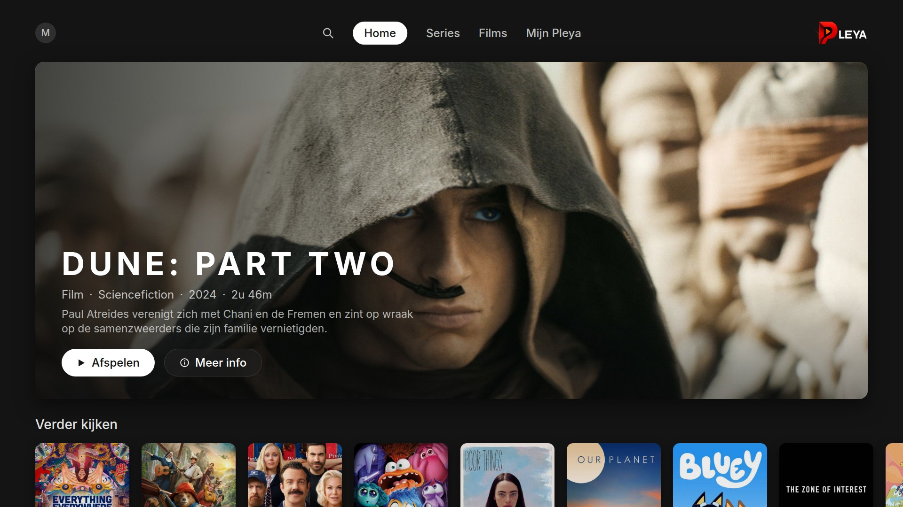
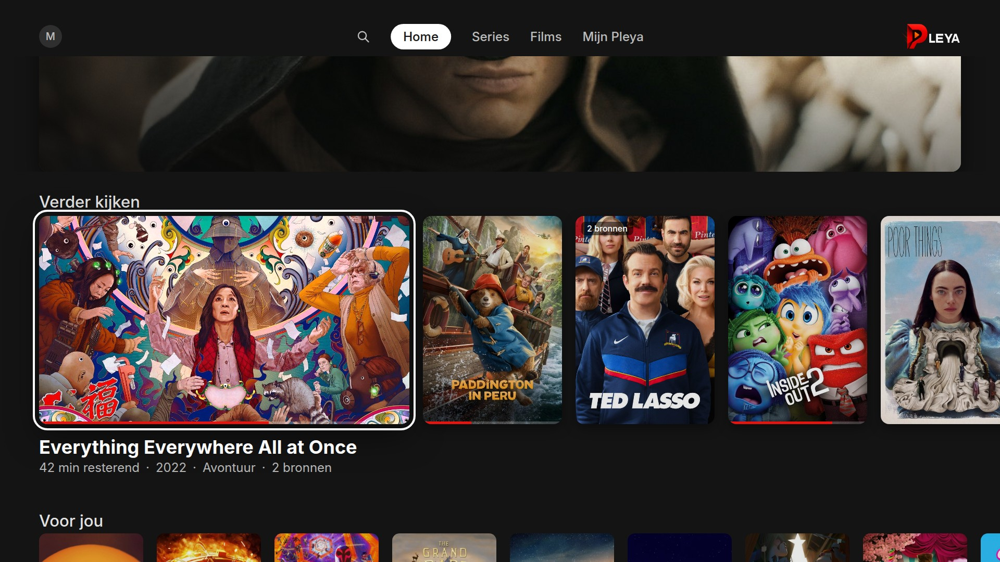
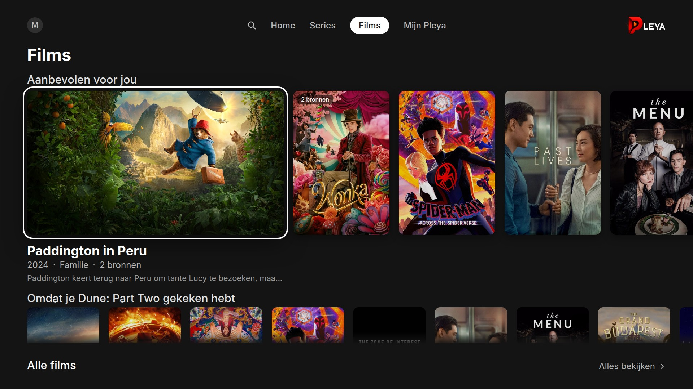
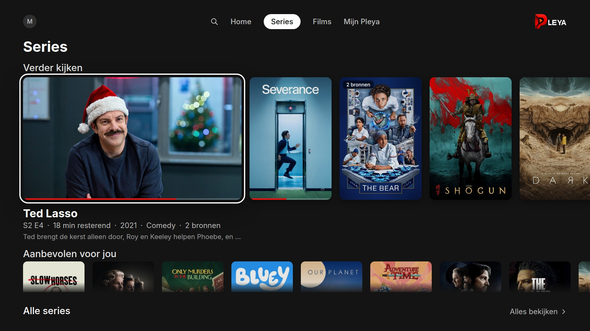
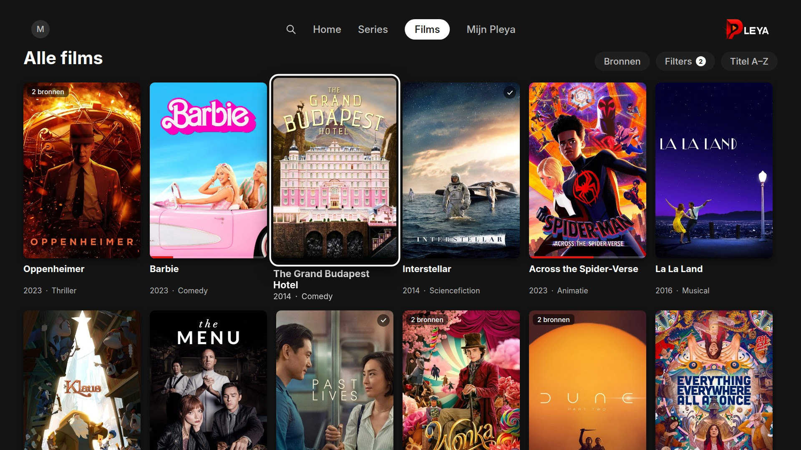
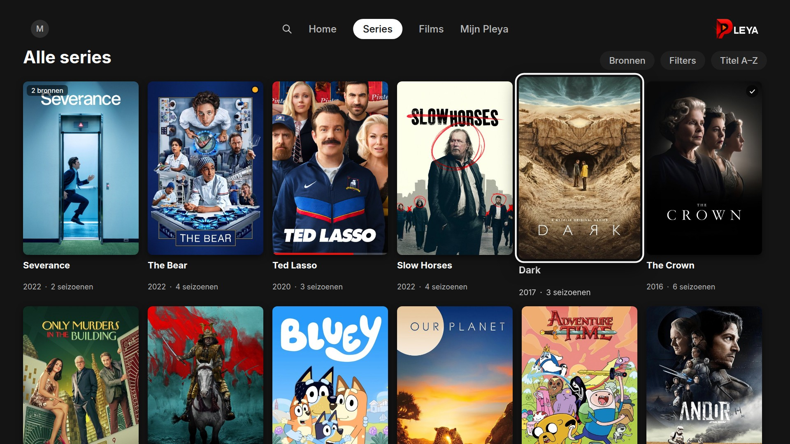
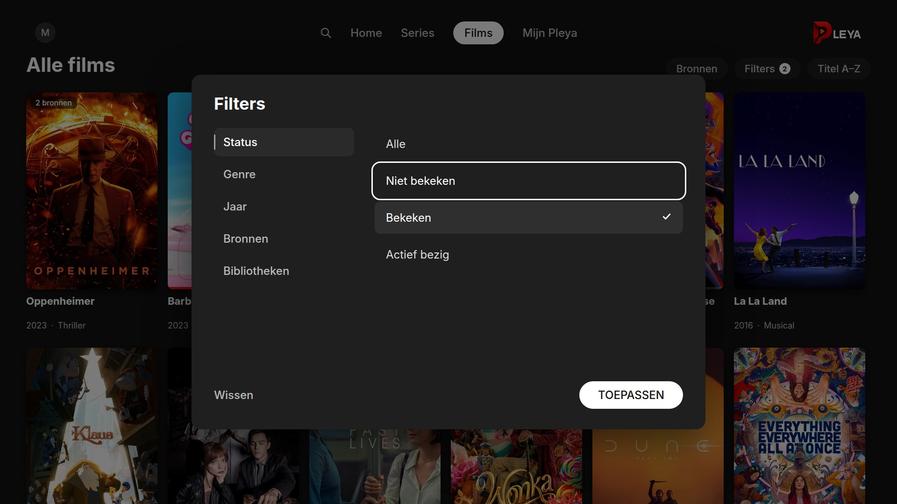
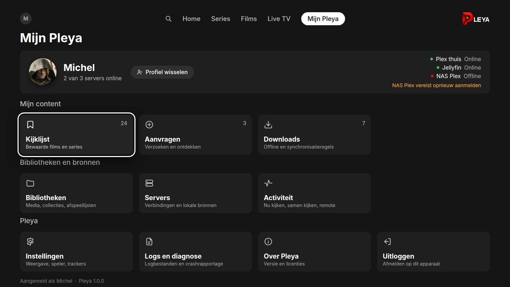
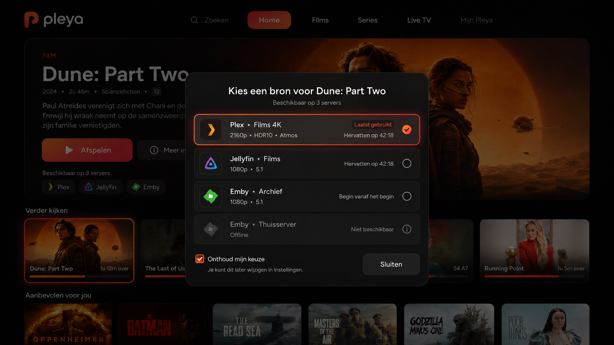

# Pleya Unified TV 2026: architectuurbaseline

**Status:** **architectuurbaseline goedgekeurd, uitvoering vrijgegeven per fase.** De hoofdrichting
ligt vast en wordt niet opnieuw geopend. Fase 0 is vrijgegeven; latere fasen volgen sequentieel na
hun eigen verificatiepoort.
**Datum:** 29 augustus 2026
**Auteur:** Michel Knoop
**Scope:** de volledige TV-ervaring voor alle D-pad-layouts die via `PlatformDetector.isTV()` lopen.
tvOS is het primaire bewijsplatform. Desktop en mobiel worden **niet** heringericht.

**Over de lengte.** Dit bestand staat ruim boven de 500 regels waar ontwikkeldocumentatie in dit
project normaal wordt gesplitst. Bewuste uitzondering, om dezelfde reden als
[docs/pleya-server-architecture.md](pleya-server-architecture.md): het is één samenhangend argument
dat je één keer lineair leest en daarna via de inhoudsopgave raadpleegt.

**De kernbeslissing.** We beginnen niet bij de nieuwe hero. Eerst bouwen we één serveronafhankelijke
cataloguslaag die alle concrete bronnen bewaart. Daarna bouwen we de nieuwe tv-interface erbovenop.
Anders ontstaat een mooie Home boven op een datamodel dat dubbele titels nog steeds weggooit,
willekeurig één server kiest en bij acties niet meer weet welke bron bedoeld werd.

De redesign is één programma met twee pijlers:

1. **Unified Catalog** — Films, Series, Search, Home en Verder kijken tonen één logische titel met
   één of meer concrete bronnen.
2. **Unified TV Experience** — een vaste horizontale tv-navigatie, een afgeronde cinematografische
   hero, normale contentrijen, duidelijke focusroutes en een volwaardige Mijn Pleya-sectie.

Dit is geen MVP. Bestaande functies blijven beschikbaar; er komt geen tijdelijke eindtoestand waarin
bibliotheken, aanvragen, kijklijst, filters of serverbeheer verdwijnen.

---

## Inhoud

1. [Bewezen uitgangssituatie](#1-bewezen-uitgangssituatie)
2. [Productscope](#2-productscope)
3. [Gewenste eindervaring](#3-gewenste-eindervaring)
4. [Harde architectuurbesluiten](#4-harde-architectuurbesluiten)
5. [Doelarchitectuur](#5-doelarchitectuur)
6. [Navigatiearchitectuur](#6-navigatiearchitectuur)
7. [Volledig TV-focuscontract](#7-volledig-tv-focuscontract)
8. [Designsysteem en layoutcontract](#8-designsysteem-en-layoutcontract)
9. [Nieuwe Home](#9-nieuwe-home)
10. [Films en Series](#10-films-en-series)
11. [Unified identiteit en deduplicatie](#11-unified-identiteit-en-deduplicatie)
12. [Globale multi-library pagination](#12-globale-multi-library-pagination)
13. [Watch-state en groepsacties](#13-watch-state-en-groepsacties)
14. [Source picker](#14-source-picker)
15. [Detailpagina en source switching](#15-detailpagina-en-source-switching)
16. [Search](#16-search)
17. [Home-rijen en aanbevelingen](#17-home-rijen-en-aanbevelingen)
18. [Mijn Pleya op TV](#18-mijn-pleya-op-tv)
19. [Live TV](#19-live-tv)
20. [Aanvragen en Kijklijst](#20-aanvragen-en-kijklijst)
21. [Offline, reconnect en gedeeltelijke fouten](#21-offline-reconnect-en-gedeeltelijke-fouten)
22. [Profiles en privacygrenzen](#22-profiles-en-privacygrenzen)
23. [Contextmenucontract](#23-contextmenucontract)
24. [Performancecontract](#24-performancecontract)
25. [Toegankelijkheid en lokalisatie](#25-toegankelijkheid-en-lokalisatie)
26. [Edge-case register](#26-edge-case-register)
27. [Implementatiefasen](#27-implementatiefasen)
28. [Testdataset](#28-testdataset)
29. [Visuele QA-scenario's](#29-visuele-qa-scenarios)
30. [Risico's en stopcriteria](#30-risicos-en-stopcriteria)
31. [Wat expliciet niet gedaan mag worden](#31-wat-expliciet-niet-gedaan-mag-worden)
32. [Finale Definition of Done](#32-finale-definition-of-done)
33. [Visuele referenties en acceptatiemapping](#33-visuele-referenties-en-acceptatiemapping)
34. [Themagezag](#34-themagezag)

---

## 1. Bewezen uitgangssituatie

Elk punt hieronder is op 29 augustus 2026 tegen de code geverifieerd; de vindplaats staat erbij.

Pleya heeft al een aparte TV-renderroute. De huidige TV-home gebruikt een vrijwel schermvullende
`TvSpotlightBackground` (`lib/widgets/tv_spotlight_background.dart`, 627 regels), met een contentrail
die onderaan rust en bij focus omhoog schuift (`_tvRailRevealed` + `AnimatedSlide` in
`lib/screens/discover_screen.dart`). De gefocuste kaart in die rail stuurt momenteel ook de spotlight
aan (`_spotlightItem`). De Play- en Meer info-knoppen gaan al via de bestaande centrale navigatie
naar de speler of detailpagina.

De bestaande `DataAggregationService` haalt al bibliotheken, Verder kijken, recente films, recente
series, hubs en zoekresultaten op bij meerdere servers. Het probleem is niet dat Pleya geen
multi-serverdata kent. Het probleem is dat de aggregatie bij duplicaten één `MediaItem` bewaart en de
andere varianten weggooit. Verder kijken gebruikt daarvoor een redelijk sterke
externe-ID-resolutie (`_deduplicateContinueWatching`, `data_aggregation_service.dart:297–429`),
terwijl recente films en series nog op `guid ?? globalKey` dedupliceren (r. 202).

De huidige bibliotheekinterface is fundamenteel per bron. `LibrariesScreen` selecteert precies één
`MediaLibrary`, en `LibraryBrowseTab` vraagt vervolgens pagina's op bij precies de client en library
van die bron (`lib/screens/libraries/tabs/library_browse_tab.dart:726`, via
`getMediaClientForLibrary`). Alleen de bibliotheekselector verbergen zou daarom geen correcte globale
Films- of Series-pagina opleveren.

Pleya heeft al een geschikte identiteitsbasis. `MediaIdentity` (`lib/media/media_identity.dart`) kent
GUID, IMDb/TMDB/TVDB, titel, jaar en type, geeft sterke identifiers voorrang en weigert bewust een
keuze te maken wanneer meerdere kandidaten ambigu blijven (`pickMatch`). Dat laatste moet een harde
invariant worden: een dubbele kaart is vervelend, twee verschillende films onterecht samenvoegen is
erger.

`MediaItem` (`lib/media/media_item.dart`) blijft vandaag één concreet serveritem met een eigen
backend, `serverId`, `libraryId`, artwork, media-versies en watch-state. Het is een freezed sealed
union met vier varianten (`plex`, `jellyfin`, `local`, `pleyaServer`). De centrale
`navigateToMediaItem`-route (`lib/utils/media_navigation_helper.dart`) verwacht terecht zo'n concreet
item en stuurt het vervolgens naar detail of playback. Dat is precies de grens die we moeten
behouden.

De huidige primaire navigatie kent Home, Bibliotheken, Live TV, Zoeken, Kijklijst, Aanvragen,
Downloads, Instellingen en Mijn Pleya (`enum NavigationTabId`, `lib/navigation/navigation_tabs.dart:98`).
Mijn Pleya is nu expliciet alleen mobiel (`showsHeaderAccountMenu({required bool isMobile}) => !isMobile`,
r. 91, vastgelegd in [DEC-023](DECISIONS.md#dec-023)); TV en desktop zijn ontworpen rond de zijbalk.
Films en Series zijn nog geen zelfstandige globale bestemmingen.

### 1.1 Twee randvoorwaarden die de repository oplegt

Deze staan niet in de oorspronkelijke planformulering maar zijn bindend:

1. **`test/pleya_server/pleya_server_aggregation_test.dart` grept de broncode** van
   `data_aggregation_service.dart` en `multi_server_provider.dart` op `MediaBackend.`,
   `is PlexClient`, `is JellyfinClient` en `is PleyaServerClient`, en faalt als die voorkomen.
   Backendspecifieke logica hoort dus in de nieuwe `unified_catalog/`-bestanden. Visibilityfiltering
   is backendneutraal en mag daar wél.
2. **`DataAggregationService._clientsFor()` vertrekt rechtstreeks vanaf
   `_serverManager.onlineClients`, die niet visibility-gefilterd is.** Profielzichtbaarheid zit
   alleen op `MultiServerProvider`. Hoofdstuk 22 eist "visibility vóór grouping"; dit is dus een
   bestaand latent lek dat fase 2 dichtzet, niet een nieuw te bouwen filter.

### 1.2 Bestaand werk dat hergebruikt wordt, niet gedupliceerd

- `MediaServerClient.findByIdentity(MediaIdentity) → MediaItem?` — de zuster van de
  `findAllByIdentity` uit hoofdstuk 12.8. `null` = niet hier, **throws** = kon niet kijken.
- `lib/services/watchlist/watchlist_availability_resolver.dart` — de coveragesemantiek is al af:
  `coverageComplete`, `maxConcurrent = 4`, positieve TTL 7 dagen, negatieve TTL 6 uur en **alleen
  gecachet bij volledige coverage**. Hoofdstukken 2, 12.8 en 20 delegeren hierop.
- `lib/media/library_query.dart` (`LibraryQuery`, `LibraryPage{items,totalCount,offset}`) en
  `lib/media/paged_media_list_state.dart` — de pagingprimitieven voor hoofdstuk 12.
- `lib/focus/` (`SelectKeyUpSuppressor`, `handleOneShotSelect`, `FocusMemoryTracker`,
  `SidebarFocusCoordinator`) — hoofdstuk 7 breidt dit uit, vervangt het niet.

---

## 2. Productscope

### In deze implementatie

De volledige TV-ervaring wordt vernieuwd voor alle D-pad-TV-layouts die nu via
`PlatformDetector.isTV()` lopen. tvOS is het primaire bewijsplatform. Android TV blijft functioneel
en krijgt dezelfde visuele basis, met platformafhankelijke Back-, Menu-, toetsenbord- en
downloadregels.

De implementatie omvat: nieuwe TV-topnavigatie; nieuwe Home met afgeronde billboard-carousel;
globale Films-pagina; globale Series-pagina; gegroepeerde multi-serverresultaten; bronkeuze bij
dubbele content; gegroepeerde Verder kijken-rij; gegroepeerde Search-resultaten; TV-versie van Mijn
Pleya; behoud van Live TV, Kijklijst, Aanvragen, Bibliotheken, Instellingen, serverbeheer,
activiteiten en profielen; volledige focus-, Back- en Menu-contracten; gedeeltelijk offline en
gedeeltelijk defecte servers; toegankelijkheid, lokalisatie en 4K-performance; visuele en
runtimeverificatie op echte Apple TV.

### Niet in deze implementatie

Expliciete grenzen, geen vergeten onderdelen:

- geen autoplay-video of trailers in de hero;
- geen wijziging van het Pleya Server-protocol;
- geen automatische cross-server failover tijdens playback;
- geen unified Collections of Playlists;
- geen samenvoeging van Live TV-kanalen;
- geen automatische bulkmutatie van meerdere servers zonder expliciete scope;
- geen redesign van iOS, iPadOS of macOS;
- geen verwijdering van Bibliotheken als bestemming; de bladerinterface erin is per DEC-092 vervangen door bronbeheer (4.5);
- geen permanente gebruikersinstelling om tussen oude en nieuwe TV-shell te wisselen.

De datafundering wordt wel platformneutraal gebouwd, zodat Films en Series later ook op andere
platforms kunnen worden gebruikt zonder opnieuw een deduplicatiearchitectuur te ontwerpen.

---

## 3. Gewenste eindervaring

### Primaire TV-navigatie

```
PLEYA     Zoeken     Home     Films     Series     [Live TV]     Mijn Pleya
```

Regels:

- Live TV verschijnt wanneer het actieve profiel een bekende Live TV-bron heeft.
- Mijn Pleya bestaat altijd.
- Downloads verschijnen niet op Apple TV, overeenkomstig het huidige platformcontract.
- Op Android TV mogen Downloads onder Mijn Pleya blijven staan waar ze ondersteund worden.
- Bibliotheken, Kijklijst, Aanvragen en Instellingen blijven echte routes, maar staan niet allemaal
  permanent in de topnavigatie.
- Profiel, verbindingen, serveractiviteiten en Now Watching worden niet stil verwijderd. Ze verhuizen
  naar Mijn Pleya.
- De topnavigatie blijft stabiel bij een tijdelijke serverstoring. Een offline server mag niet
  telkens navigatie-items laten verspringen.

### Hoofdjourney

1. Pleya start en bindt het actieve profiel.
2. Een gecachte Home-snapshot verschijnt direct.
3. Online servers leveren hun data in golven.
4. Duplicaten worden aan bestaande titelgroepen toegevoegd zonder kaarten te dupliceren.
5. Home toont één hero-titel per logisch werk.
6. De gebruiker navigeert naar Films.
7. Alle toegankelijke filmbibliotheken lopen door elkaar.
8. Een film die op drie servers staat verschijnt één keer met 3 bronnen.
9. Selecteren opent de bronselector.
10. De gebruiker kiest bijvoorbeeld NAS • Plex • Films 4K.
11. Pleya geeft exact dat concrete `MediaItem` door aan de bestaande detail- of playbackroute.
12. Na playback wordt de watch-state van de gekozen bron bijgewerkt en de gegroepeerde kaart opnieuw
    berekend.
13. Back brengt de gebruiker terug naar dezelfde kaart, dezelfde rij en dezelfde scrollpositie.

---

## 4. Harde architectuurbesluiten

Deze zes besluiten zijn vastgelegd in [DEC-063](DECISIONS.md#dec-063) en worden niet heropend.

### 4.1 MediaItem blijft één concrete bron

Een `MediaItem` wordt niet uitgebreid met `List<Server>` of een willekeurige "active server". Dat
voorkomt dat bestaande flows onduidelijk worden: playback heeft één concrete server nodig;
metadata-refresh raakt één concrete library; verwijderen raakt één concreet item; tracks en
media-versies horen bij één bron; play queues en volgende afleveringen zijn servergebonden;
watch-state events bevatten server- en itemidentiteit.

### 4.2 Een nieuwe projectielaag komt boven MediaItem

```dart
class UnifiedMediaSource {
  final String sourceKey;
  final MediaItem item;
  final ServerId serverId;
  final String serverName;
  final MediaBackend backend;
  final String? libraryId;
  final String? libraryTitle;
  final SourceAvailability availability;
  final ExternalIds externalIds;
}

class UnifiedMediaGroup {
  final String groupId;
  final CanonicalMediaIdentity identity;
  final List<UnifiedMediaSource> sources;
  final String representativeSourceKey;
  final UnifiedWatchState watchState;
  final SourceCoverageState coverage;
}
```

`UnifiedMediaGroup` is alleen een presentatie- en aggregatiemodel.

### 4.3 Eén centrale identiteitspijplijn

Home, Films, Series, Search, Verder kijken en Watchlist mogen geen afzonderlijke dedupalgoritmen
krijgen. Er komt één gedeelde service voor candidate bucketing, externe-ID-verrijking,
identiteitsbewijzen, conflictcontrole, grouping, bronresolutie en coverage.

### 4.4 Bronkeuze gebeurt vóór de bestaande route

```
UnifiedMediaGroup
        │
        ├─ één bron ──────────────────────┐
        │                                 │
        └─ meerdere bronnen ─ picker ─────┤
                                          ▼
                                      MediaItem
                                          │
                                  bestaande Pleya-flow
```

De speler blijft dus vrij van unified-cataloguslogica.

### 4.5 Bibliotheken is bronbeheer

Films en Series zijn de dagelijkse globale catalogus, en bladeren per bibliotheek gebeurt dáár:
Alle films en Alle series met de bibliotheek als bronfilter (10.4). Mijn Pleya ▸ Bibliotheken is
de beheerweergave van de bronnen: per server de bibliotheken, met soort, aantal, zichtbaar of
verborgen en volgorde, en per bibliotheek de acties Openen in catalogus, metadata vernieuwen,
scannen, verbergen, en waar de backend het draagt mappen bladeren, analyseren en prullenbak
legen. De pagina heeft geen eigen Aanbevolen of Bladeren. Collecties en Afspeellijsten zijn eigen
ingangen in Mijn Pleya, over alle bronnen heen, met het collectie- en afspeellijstdetail van
hoofdstuk 31.8 als bestemming.

> Gewijzigd door [DEC-092](DECISIONS.md#dec-092). Tot 4 september 2026 stond hier "Bibliotheken
> blijft bestaan" als geavanceerde bronweergave met één library kiezen, Recommended, Browse,
> Collections en Playlists. Dat contract bouwde een tweede bladerinterface naast de catalogus die
> 10.4 al met server en library als globale filters bedient.

### 4.6 Writes zijn standaard brongebonden

Lezen mag gegroepeerd worden. Mutaties mogen nooit per ongeluk de representatieve artworkbron raken.
Afspelen: gekozen bron. Details: gekozen bron. Metadata-refresh: gekozen library. Verwijderen:
gekozen bron. Markeer bekeken en onbekeken: alle bronnen (hoofdstuk 13.5, DEC-071). Rate: alle
bronnen (hoofdstuk 13.8, DEC-075); een bron die op dat moment onbereikbaar is wordt gemeld, niet
vastgehouden, want een cijfer heeft geen wachtrij. Verwijder uit Verder kijken: expliciet logisch
groepscontract, beschreven in hoofdstuk 13.

Het onderscheid dat deze paragraaf maakt is niet "brongebonden versus groepsbreed" maar "per ongeluk
versus expliciet". Een groepsactie die in hoofdstuk 13 als zodanig is vastgelegd is geen uitzondering
op de regel hierboven; wat de regel verbiedt is dat een schrijfactie zonder contract op één bron
landt omdat die toevallig de representatieve was.

> Gewijzigd door [DEC-071](DECISIONS.md#dec-071) en [DEC-075](DECISIONS.md#dec-075). Tot 1 september
> 2026 stond hier "Markeer bekeken: gekozen bron, of expliciet Alle bronnen", en Rate stond er als
> brongebonden actie in hoofdstuk 23.

### 4.7 Geen willekeur op basis van responssnelheid

De eerste server die antwoordt wordt nooit automatisch de artworkbron, de playbackbron of de bron die
een destructive action ontvangt. Alle rangordes krijgen een deterministic tie-break op:

```
preferred source → online state → metadata completeness → artwork completeness
→ quality information → server name → server id → item id
```

---

## 5. Doelarchitectuur

```
                    Active profile
                          │
                          ▼
                MultiServerProvider
         visible / expected / online / auth
                          │
                          ▼
                 LibrariesProvider
               alle concrete libraries
                          │
                          ▼
                UnifiedCatalogService
          ┌───────────────┼────────────────┐
          │               │                │
     source paging   identity resolver   coverage
          │               │                │
          └───────────────┼────────────────┘
                          ▼
                UnifiedMediaGroup[]
                          │
         ┌────────────────┼──────────────────┐
         │                │                  │
       Home             Films             Series
         │                │                  │
         ├──────── Search ┤                  │
         │                │                  │
         └──────── Continue Watching ────────┘
                          │
                          ▼
             UnifiedActivationCoordinator
                          │
               één bron of source picker
                          │
                          ▼
                    concreet MediaItem
                          │
                          ▼
             bestaande details / playback
```

`MultiServerProvider` maakt vandaag al onderscheid tussen profielzichtbaarheid, verwachte servers,
werkelijk online servers en auth-fouten. De unified laag moet die bestaande waarheid consumeren en
mag zelf geen tweede serverstatussysteem introduceren.

---

## 6. Navigatiearchitectuur

### 6.1 Route-identiteit losmaken van platformchrome

De huidige `allNavigationTabs` wordt voor meerdere platforms tegelijk gebruikt. Dat wordt gesplitst:

```
Route registry
├─ alle bestaande schermroutes
├─ movies
└─ series

Mobile presentation   → bestaande bottom navigation + mobiele Mijn Pleya-projectie
Desktop presentation  → bestaande SideNavigationRail (ongewijzigd)
TV presentation       → Zoeken, Home, Films, Series, [Live TV], Mijn Pleya
```

Concreet: `NavigationTabId` krijgt `movies` en `series`; de routecatalogus blijft centraal; er komen
platformafhankelijke lijsten `mobilePrimaryDestinations`, `desktopSideDestinations` en
`tvPrimaryDestinations`; `myPleya` wordt zichtbaar op mobiel en TV, niet als duplicaat naast de
desktopzijbalk; `libraries`, `watchlist`, `requests` en `settings` blijven routes maar zijn op TV
onderliggende Mijn Pleya-routes.

### 6.2 Nieuwe TV-shell

```
TvRootShell
├─ TvTopNavigation
├─ SystemBannerSlot
├─ TvDestinationHost
│  ├─ Home
│  ├─ Movies
│  ├─ Series
│  ├─ Search
│  ├─ Live TV
│  └─ TvMyPleyaNavigator
└─ OverlaySheetHost
```

Desktop blijft de bestaande `SideNavigationRail` gebruiken.

### 6.3 Mijn Pleya krijgt een eigen geneste navigator

```
Mijn Pleya
   └─ Bibliotheken
       └─ Library detail
```

Back popt dan eerst naar Mijn Pleya. Dat is robuuster dan het hoofdtabblad naar settings schakelen en
daarna met projectieregels doen alsof Mijn Pleya geselecteerd is.

### 6.4 Compatibiliteitsadapter

`MainScreenFocusScope.selectLibrary` blijft werken. Wanneer een library-section-item wordt geopend:
de TV-shell selecteert Mijn Pleya; de Mijn Pleya-navigator opent Bibliotheken;
`LibrariesScreen.loadLibraryByKey()` ontvangt de bestaande global key; de gekozen library opent; Back
keert terug naar Mijn Pleya. De bestaande centrale media- en librarynavigatie hoeft daardoor niet
herschreven te worden.

---

## 7. Volledig TV-focuscontract

Focus wordt expliciet gestuurd, nooit overgelaten aan alleen geometrische Flutter-traversal.

### 7.1 Rootfocus

```
Top navigation → Hero actions of page header → First content row or grid → Next rows
```

### 7.2 Topnavigatie

- Links/rechts beweegt tussen zichtbare bestemmingen.
- Geen wrap van laatste naar eerste item.
- Down gaat naar de primaire focus van het huidige scherm.
- Select op de reeds actieve bestemming: scrollt het scherm naar boven; herstelt de primaire focus;
  start geen automatische netwerkrefresh.
- Een nieuw Live TV-item krijgt een stabiele ID en vervangt geen focusnode van een bestaand item.

### 7.3 Home

- Down vanaf topnav gaat naar Afspelen/Hervatten.
- Rechts gaat van Play naar Meer info.
- Rechts vanaf Meer info wisselt handmatig naar de volgende hero-slide.
- Links vanaf Play wisselt naar de vorige slide.
- Down vanaf beide CTA's gaat naar de eerste kaart van de eerste rij.
- Up vanaf de eerste rij gaat terug naar de laatst gebruikte hero-CTA.
- Up vanaf hero gaat naar de actieve topnavbestemming.
- **Rijfocus verandert de featured hero niet.** Geleverd in fase 8: de actieve slide is privéstate van `TvHeroBillboardCarousel` en een contentrij heeft geen parameter waarmee hij hem kan bereiken ([DEC-070](DECISIONS.md#dec-070) punt 2). `_setSpotlightDebounced` bestaat niet meer.

### 7.4 Films en Series

```
Topnav → Filter / Source / Sort controls → Grid
```

- Down vanaf topnav focust de eerste headeractie.
- Down vanaf header gaat naar het laatst gefocuste griditem.
- Up vanaf de eerste gridrij gaat naar de dichtstbijzijnde headeractie.
- Up vanaf header gaat naar topnav.
- Play/Pause mag als zichtbare snelkoppeling het filterpaneel openen, maar filters blijven ook met
  een normale focusbare knop bereikbaar.

### 7.5 Back en Menu

Volgorde:

1. Bronselector of overlay open: sluit overlay.
2. Geneste Mijn Pleya-route open: pop die route.
3. Detailpagina of speler open: bestaande route pop.
4. Rootcontent gefocust: verplaats focus naar topnav.
5. Topnav op root gefocust: laat het bestaande tvOS-system-navigation-contract beslissen.

De huidige tvOS-engine claimt remote presses voordat UIKit zijn responder chain krijgt (zie
`CLAUDE.md` en [DEC-019](DECISIONS.md#dec-019)). KeyDown/KeyUp-suppressie en het native
toetsenbordpad moeten daarom volgens de bestaande repositoryregels worden gebruikt en op echte
hardware worden bewezen. Het bestaande predicaat is `shouldPassTvosMenuToSystem(...)` in
`lib/screens/main_screen.dart:176`.

### 7.6 Focusgeheugen

```dart
TvDestinationFocusMemory {
  destinationId; focusedElementId; rowId; groupId; scrollOffset;
}
```

Regels: terug uit details → dezelfde kaart; terug uit player → dezelfde kaart; source picker
annuleren → dezelfde kaart of CTA; group krijgt een extra bron → geen remount en geen focussprong;
kaart verdwijnt door filter/verwijdering → eerstvolgende buur; profielwissel → geheugen volledig
wissen; filter- of sorteermutatie → grid naar boven, focus blijft op de actie totdat nieuwe data
gereed is.

---

## 8. Designsysteem en layoutcontract

Alle getallen hieronder zijn **logische referentiematen op een 1920×1080 TV-surface**, geen letterlijke
Flutter logical pixels. [DEC-028](DECISIONS.md#dec-028) zette de Apple TV render scale op 1.85,
waardoor het effectieve canvas ongeveer 1038×584 is. Nieuwe TV-layoutwaarden lopen dus door het
bestaande `TvLayoutConstants`-schaalcontract en worden op de werkelijke viewport/constraints
berekend. Geen losse magic numbers per widget.

Er komt één `TvUnifiedLayout` of een uitbreiding van `MonoTokens` met: `topNavHeight`, `topNavInset`,
`billboardHeight`, `billboardRadius`, `billboardContentInset`, `billboardTextWidth`, `contentRowGap`,
`sourcePickerWidth`, `sourceRowHeight`, `pageHeaderHeight`.

### 8.1 Overscan en safe area

- Horizontale veilige inset: basis 72.
- Geen tekst of focusring binnen de buitenste 56 pixels.
- Eerste en laatste kaart krijgen extra uitwendige ruimte voor de 1.05-focusscale.
- Focusglow mag niet door een `ClipRect` van de rij worden afgesneden.

### 8.2 Kleuren

- OLED/thema-achtergrond blijft leidend.
- Artwork-scrims gebruiken de themakleur, niet hardcoded zwart.
- Pleya-rood en amber worden gebruikt voor: progress; badges; actieve navigatiemarkering; subtiele
  branddetails.
- **De primaire Play-knop wordt geen rode knop.** Zie hoofdstuk 34.
- Focus blijft een duidelijke lichte TV-focusbehandeling volgens het bestaande `FocusTheme`.
- Licht thema krijgt een sterkere lichte artwork-wash en donkere tekst.
- Geselecteerd en gefocust zijn twee verschillende staten
  ([DEC-053](DECISIONS.md#dec-053)).

### 8.3 Typografie op 1080-referentie

Topnav 22–24 semibold; hero titeltekstfallback 58–68 (max twee regels); clearlogo max ±520×150; hero
metadata 20–22; hero synopsis 22–24 (max drie regels); CTA-label 21–23; rijheading 25–28; card title
18–21; paginaheading Films/Series 38–44; source picker titel 32–38; source picker primaire regel
23–26; secundaire regel 17–20.

Tekst schaalt via centraal TV-token. Geen lokale `TextStyle`-kopieën.

### 8.4 Motion

Focus: bestaande snelle duur, circa 150–200 ms. Hero crossfade 280–320 ms. Topnav-focus 150–180 ms.
Source picker open/sluit 200–240 ms. Geen twee grote fullscreenanimaties tegelijk.

Bij Reduce Motion: geen auto-rotatie; geen Ken Burns; geen schuiftransities; crossfades worden
instant of zeer kort; focus blijft zichtbaar maar zonder bewegende scale waar nodig.

---

## 9. Nieuwe Home

### 9.1 Schermopbouw

```
[vaste topnavigatie]
╭──────────────────────────────────────────────────────────────╮
│  CLEARLOGO / TITEL                       CINEMATIC ARTWORK    │
│  2026 • 16 • 1u 43m • 2 bronnen                              │
│  Korte synopsis, maximaal drie regels.                       │
│  [ ▶ Afspelen ]   [ ⓘ Meer info ]                            │
╰──────────────────────────────────────────────────────────────╯
Verder kijken
[ wide card ][ wide card ][ wide card ][ wide card ]
Topkeuzes voor jou
[ poster ][ poster ][ poster ][ poster ][ poster ]
Recent uitgebracht
...
```

### 9.2 Billboardmaat

Links en rechts 72; gap onder topnav 16–20; hoogte doel 500–540 op 1080; clamp ongeveer 46–56% van de
bruikbare schermhoogte; hoekradius 24–28; contentinset links 56–64; tekstkolom max circa 600;
artworkonderwerp bij voorkeur rechts. De eerste volledige contentrij blijft direct zichtbaar; van de
tweede rij mag een kleine preview zichtbaar zijn.

### 9.3 Ambient background

Buiten de hero komt een subtiele donkere kleurtint uit het actieve artwork: decodeer een miniatuur
van ongeveer 32×18; bepaal een gedempte dominante kleur; cache op artwork-key; meng op lage alpha met
de achtergrond; geen live fullscreen-blur; op reduced-performance-tier een vaste themagradient.

### 9.4 Artworkfallbacks

**Landscape-art aanwezig:** scherp; `BoxFit.cover`; alignment uit hero-artheuristiek; gecontroleerde
horizontale en verticale scrim.

**Alleen square-art:** gecontroleerde crop; geen extreme face zoom; eventueel iets smaller in de
rechterhelft.

**Alleen poster:** poster scherp rechts; dezelfde poster als zeer sterk geblurde, donkere fill
erachter; geen gigantische scherp gecropte poster.

**Geen artwork:** Pleya-gradient; posterplaceholder of titeltypografie; hero blijft bruikbaar en
leesbaar.

**Clearlogo ontbreekt:** titeltekstfallback; maximaal twee regels; dynamische lettergrootte met
ondergrens; nooit buiten de tekstkolom.

Uit [DEC-057](DECISIONS.md#dec-057) worden hergebruikt: `BillboardArtKind`, de artworkselectie- en
fallbacksemantiek, en **de request-ratio-invariant** — de serveraanvraag heeft dezelfde aspect ratio
als de daadwerkelijk scherpe artworklaag, zodat er niet eerst server-side en daarna nog eens
Flutter-side gecropt wordt. De TV-billboard wordt **niet** blind aan `homeHeroArtGeometry()`
gekoppeld: die helper bevat expliciete iPhone/iPad-concepten (narrow-box islands, safe-area anchors,
mobile hero sizing). Indien nodig wordt de gedeelde brede-billboardgeometrie geëxtraheerd naar een
generieke helper, blijft de bestaande mobile geometrie byte-identiek, en krijgt de TV-billboard zijn
eigen constraint-gebaseerde geometry.

### 9.5 Featured selectie

> **Geamendeerd op 31 augustus 2026, [DEC-067](DECISIONS.md#dec-067).** De kandidaatketen hieronder
> beschreef Top Picks, recent toegevoegde series en hubs als vulling zodra er "te weinig" recente
> films waren. Dat is vervangen door de bindende regel eronder: recente films zijn de exclusieve
> bron zolang de gededupliceerde pool niet leeg is. Behandel de oude formulering niet opnieuw als
> contract.

De hero bevat alleen films of series, geen losse afleveringen.

**Bron: recent uitgebrachte films, exclusief.** Zolang de pool van geschikte, gededupliceerde
recent uitgebrachte films niet leeg is bevat de hero uitsluitend die films, op releasedatum geordend,
in de volgorde die `DiscoverProvider.latestMovies` al oplevert (besluit Michel, 30 augustus 2026: de
hero blijft de etalage van wat nieuw uit is, niet van wat het aanbevelingsmodel kiest). Deduplicatie
mag het aantal slides verkleinen — twaalf concrete films die tot vijf logische titels samenvallen
geven vijf slides — en dat gat wordt **niet** gevuld met Top Picks, gepersonaliseerde hubs, recent
toegevoegde series of andere rijen. Er is geen ondergrens waar naartoe wordt aangevuld. Pas wanneer
de pool echt leeg is geldt het bestaande fallbackgedrag van vandaag: `DiscoverScreen` toont zijn
Continue Watching- of hub-item als billboard. Dat is bestaand gedrag, geen nieuwe fallbacksemantiek.

Wil fase 8 alsnog gemengde hero-kandidaten, dan is dat een nieuw expliciet productbesluit, geen
implementatiedetail.

Selectieregels: ten hoogste 8 unieke `UnifiedMediaGroup`s (de bovengrens van de oude 5-tot-8-band; de
ondergrens is geen quotum, zie hierboven); geen dubbele bronnen als losse slides; geen unreleased
titel door foute toekomstige metadata; geen item zonder bruikbare titel; stabiele volgorde tijdens
een sessie; een bron die offline gaat verwijdert de slide niet zolang een andere bron bruikbaar
blijft; als alle bronnen wegvallen verdwijnt de slide pas bij een veilige refreshgrens en niet
terwijl de gebruiker de CTA focust.

**Eén lijst, voor weergave én activatie.** `TvHomeProjectionProvider.heroGroups` bepaalt welke slides
bestaan, in welke volgorde, en bij welke `UnifiedMediaGroup` iedere zichtbare slide hoort. De
bestaande hero-presentatie rendert per groep een *representatieve* concrete `MediaItem` — backdrop,
clearlogo, titel, metadata — maar die representant is presentatie en beslist nooit de activatie
(hoofdstuk 4.4/4.6).

### 9.6 Carouselcontract

Automatische wissel: 8 seconden. De timer begint pas nadat de actieve artworklaag gereed is. Iedere
gebruikersinteractie pauzeert. De timer blijft gepauzeerd zolang: een hero-CTA focus heeft; een
contentrij focus heeft; een overlay open is; een source picker open is; de app niet actief is; Home
niet op scrollpositie nul staat. Na echte inactiviteit mag de carousel hervatten. Handmatige
navigatie met links/rechts reset de timer.

> **Uitvoering, fase 8, [DEC-070](DECISIONS.md#dec-070) punt 1.** De pauzelijst hierboven en de
> eerste zin kunnen niet allebei letterlijk gelden: hoofdstuk 7.1 legt de rustfocus van Home op een
> hero-CTA, dus "een hero-CTA focus heeft" zou de rotatie permanent uitzetten. De laatste zin is de
> doorslag: een interactie stopt de rotatie en start een inactiviteitsvenster van dezelfde acht
> seconden, en pas daarna hervat hij. De overige toestanden blijven onvoorwaardelijke pauzes. Focus
> op de topnavigatie is er géén, die staat buiten de feed, en een kijker die op de balk staat
> terwijl het billboard doorloopt is het geval dat deze alinea beschrijft. Onder Reduce Motion
> roteert de carousel helemaal niet.

**Geen permanente reeks kleine webachtige dots.** Tijdens handmatig wisselen verschijnt optioneel een
korte segmentindicator, die na twee seconden verdwijnt.

Alleen actief, vorig en volgend full-resolution artwork worden warm gehouden. Hero-tekst wisselt niet
voordat het nieuwe artwork minimaal een placeholder heeft. Geen autoplay-audio.

### 9.7 Late hero-data

Een hero mag niet boven een al gefocuste rij ingevoegd worden en zo de layout verplaatsen. Tijdens de
initiële Home-load wordt de billboardruimte gereserveerd totdat de featured-query gereed is. Een
snapshot kan de ruimte direct vullen. Als de gebruiker al naar een rij is genavigeerd voordat de
netwerkhero arriveert, wordt de nieuwe hero pas toegepast wanneer Home weer bovenaan staat, er geen
actieve interactie is, of de gebruiker Home opnieuw opent. Als geen kandidaten bestaan, klapt de
gereserveerde ruimte gecontroleerd weg.

---

## 10. Films en Series

> **Geamendeerd op 30 augustus 2026, [DEC-064](DECISIONS.md#dec-064).** Films en Series zijn
> **twee niveaus**, geen één pagina. De oorspronkelijke 10.2 beschreef Films/Series als één
> gridpagina; dat is nu uitsluitend het tweede niveau. Behandel de oude formulering niet
> opnieuw als blocker, zie 10.2a/10.2b.

### 10.1 Doel

Films toont standaard alle zichtbare filmlibraries van alle toegestane servers. Series toont alle
zichtbare serielibraries. Server en library zijn filters, niet de primaire informatiearchitectuur.

Dat doel wordt op twee niveaus geleverd:

| Niveau | Route | Karakter | Fase |
|---|---|---|---|
| **Landing** | `Films` / `Series` | Row-based discovery, focus verandert de compositie | 6 |
| **Complete catalogus** | `Films ▸ Alle films` / `Series ▸ Alle series` | Stabiel postergrid met filters en sortering | 5 |

Discovery en catalogus worden **niet** door elkaar gehaald. Discovery is geen grid; de catalogus
is geen expanderende discovery-rail. Die scheiding is hard.

### 10.2a Landing — discovery (fase 6)

> **Geamendeerd op 31 augustus 2026, [DEC-068](DECISIONS.md#dec-068).** De route naar de complete
> catalogus staat niet meer als rij onderaan de pagina, maar als compacte actie **naast de
> paginatitel**, en is de enige launcher op de landing. De schets hieronder is bijgewerkt.

```
Films   Alle films ›
Aanbevolen voor jou
[═════ EXPANDED FOCUS ═════][klein][klein][klein]
Recent toegevoegd
[═════ EXPANDED FOCUS ═════][klein][klein][klein]
```

Row-based. Het gefocuste item wordt breder en toont pas dan zijn rijkere context; buren blijven
zichtbaar; metadata verschijnt voornamelijk bij focus; landscape/wide presentatie waar de artwork
dat toelaat.

**Minimale chrome.** Geen permanente `[Alle bronnen] [Filters] [Sorteren]` boven de eerste rail —
de landing is content-first. Een compacte refinement-actie mag hier later alléén bij aantoonbaar
productbewijs bijkomen, niet als standaard.

Rows komen uit de fase-6 projectielaag. Een TV-widget mag **nooit** zelf een pseudo-discoveryhub uit
de complete catalogus construeren.

**"Alles bekijken" is een eerste-klas route**, remote-first bereikbaar — geen minuscuul tekstlinkje
waar focus moeilijk komt.

### 10.2b Complete catalogus — "Alles bekijken" (fase 5)

```
Films                       Niet bekeken · Sciencefiction · Titel A–Z
▏[poster] [poster] [poster] [poster] [poster] [poster]
[poster] [poster] [poster] [poster] [poster] [poster]
```

> Gewijzigd door [DEC-093](DECISIONS.md#dec-093). Tot 4 september 2026 stonden Bronnen, Filters en
> Sortering als drie capsules rechtsboven naast de kop. Ze zitten nu in een rail links van het
> raster die dicht is zolang de focus in het raster zit en opent op LEFT vanaf kolom 0; dicht blijven
> zes kolommen staan met een stille streep aan de linkerrand, open schuift het raster naar vijf
> kolommen en toont de rail per regel icoon, label en huidige waarde, met de keuzes als tags en
> Wissen eronder. RIGHT of Menu sluit de rail en de focus keert terug op dezelfde kaart. De actieve
> keuzes staan dicht als niet-bedienbare tags rechtsboven, de sortering gestippeld. Mockup 28 D1 en
> D2 zijn bindend voor de positie; northstar 05, 06 en mockup 14 lopen daarop achter.

Geen grote hero op deze pagina. Vaste topnav. Een compacte sticky page header. Grid met 6–7 kolommen
afhankelijk van dichtheid. Bestaande TV-cardscale en focusring. Posters 2:3. Titels maximaal twee
regels. Jaar optioneel onder titel. Progress en watched-status blijven zichtbaar. Nieuw-badge blijft
bestaan. Multi-sourcebadge alleen bij meer dan één bekende bron.

Focus is hier **ruimtelijk stabiel**: witte ring, kleine scale, lift en schaduw — géén expanded
landscape-transformatie. Dat is precies wat snel door een grote bibliotheek bladeren mogelijk maakt.

### 10.3 Multi-sourcebadge

```
┌───────────────┐
│    POSTER     │
│          2▣   │
└───────────────┘
Dune
2021
```

Alleen bij `sources.length > 1`. Kleine donkere/transparante capsule. Label bijvoorbeeld "2 bronnen".
Geen serverlogo's op de poster. Bij onvolledige coverage wordt niet gelogen met een exact totaal:
twee bekende bronnen mogen als "2 bronnen" worden getoond; een algemene partial-coverage-indicator
staat in de page header of source picker.

### 10.4 Filters

Globale filters die betrouwbaar backendneutraal te berekenen zijn: genre; releasejaar of bereik;
bekeken; niet bekeken; actief bezig; server; library; eventueel content rating wanneer semantiek
bewezen gelijk is.

Niet direct globaal maken: folder mode; backend-specifieke labels; Plex-agentfilters;
backend-specifieke collections; filters waarvan één backend een fundamenteel andere betekenis
gebruikt. Die blijven in Mijn Pleya ▸ Bibliotheken.

### 10.5 Sorteringen

Eerste betrouwbare set: Titel A–Z; Titel Z–A; Recent toegevoegd; Oudst toegevoegd; Nieuwste release;
Oudste release; Recent bekeken.

Rating-sortering komt pas beschikbaar als de scoresemantiek van alle deelnemende backends gelijk
wordt behandeld. Een Plex audience rating en een Jellyfin community rating mogen niet blind in één
schaal worden gegooid.

### 10.6 TV-filterpaneel

Opent als groot side panel of centrale overlay. Titel: Filters. Secties: Status; Genre; Jaar;
Servers; Bibliotheken. Actieve keuzes zijn visueel geselecteerd én focusbaar. Sticky footer: Wissen;
Toepassen. Wijzigingen worden pas toegepast bij Toepassen, zodat de grid niet na elke remote-klik
herlaadt en focus steelt. Menu sluit zonder toepassen. Actieve filtercount verschijnt op de
Filter-knop. Een bron/library die niet meer bestaat wordt bij openen automatisch uit de opgeslagen
selectie verwijderd. De rij Filters in de rail van 10.2b is de primaire route; Play/Pause is hooguit
een snelkoppeling (DEC-093).

### 10.7 Counts

Een exact totaal wordt pas getoond wanneer alle relevante bronstreams uitgeput zijn. Tijdens paging:
"126 titels geladen", of helemaal geen count.

Niet doen: `Server A total + Server B total = totaal`. Dat zou duplicaten dubbel tellen.

---

## 11. Unified identiteit en deduplicatie

### 11.1 Identiteitsbewijzen

**Sterk bewijs.** Films: TMDB; IMDb; stabiele catalogus-GUID. Series: TVDB; TMDB; IMDb; stabiele
catalogus-GUID. Afleveringen: sterke episode-ID, anders sterke serie-identiteit plus seizoen- en
afleveringsnummer. Seizoenen: sterke serie-identiteit plus seizoennummer.

**Zwak bewijs.** Genormaliseerde titel; jaar; mediatype. Zwak bewijs mag alleen gebruikt worden
wanneer de kandidaatset ondubbelzinnig is en er geen conflicterend sterk bewijs bestaat.

### 11.2 Tweefasenaanpak

**Fase A, goedkope buckets:** `kind + normalized title + year`. Voor afleveringen:
`episode + normalized show title + season index + episode index`. Items die niet in een mogelijke
duplicate bucket vallen krijgen geen extra externe-ID-call.

**Fase B, alleen duplicate buckets verrijken:** externe IDs ophalen met bounded concurrency;
resultaten cachen; sterke tokens genereren; conflictcontrole; groepen vormen.

Dit voorkomt duizenden losse metadatarequests bij een grote catalogus.

### 11.3 Identity tokens

```
movie:tmdb:438631
movie:imdb:tt1160419
show:tvdb:371980
show:tmdb:95396
movie:guid:plex://movie/...
episode:tvdb:1234567
```

### 11.4 Conflictregels

Niet samenvoegen wanneer: media kinds verschillen; dezelfde sterke namespace verschillende IDs
bevat; titel en jaar gelijk zijn maar sterke IDs botsen; meerdere kandidaten op dezelfde server even
plausibel zijn; een aflevering geen bruikbare episode-identiteit of indexen heeft; de GUID
serverlokaal of `agents.none://` is; twee remakes alleen dezelfde titel delen; een ontbrekend jaar de
fallback ambigu maakt.

### 11.5 Connected components met conflictbewaking

Een item kan zowel IMDb als TMDB hebben. Twee groepen kunnen daardoor via meerdere tokenpaden
verbonden raken. De grouping engine moet daarom niet één willekeurige stringkey kiezen, maar een
identity graph of union-find gebruiken: alle sterke tokens verzamelen; componenten verbinden bij
gedeeld sterk bewijs; voor merge controleren of geen namespaceconflict ontstaat; conflicts als
ambiguous registreren; ambigu component niet samenvoegen.

### 11.6 Fallback op titel en jaar

Alleen toegestaan wanneer: kind exact gelijk is; normalized title exact gelijk is; beide jaren bekend
en gelijk zijn; iedere deelnemende bron maximaal één kandidaat heeft; er geen conflicterend sterk ID
bestaat. **Geen merge op alleen titel.**

### 11.7 Editions en versies

Director's Cut en Theatrical Cut met dezelfde sterke filminhoud horen bij één titelgroep. Ze blijven
afzonderlijke `UnifiedMediaSource`s. De source picker toont de edition. Meerdere `MediaVersion`s
binnen één `MediaItem` zijn géén meerdere bronnen; de bestaande speler/version-flow blijft daarvoor
verantwoordelijk. Watchprogress wordt niet automatisch tussen sterk afwijkende editions gekopieerd.

### 11.8 Series en episodes

Series groepeert op series-identiteit. Verder kijken groepeert op exacte aflevering:
`show identity + season + episode`. Nooit: alle afleveringen van dezelfde serie als één Continue
Watching-item.

Specials: seizoen 0 wordt expliciet ondersteund; ontbrekende indexen vereisen een sterk episode-ID;
dubbele afleveringcodes worden zonder sterk bewijs niet samengevoegd; verschillende cuts of runtimes
blijven bronvarianten.

### 11.9 Stable group IDs

Een groep krijgt twee identiteiten: `canonicalIdentityKey`, inhoudelijk en verbeterbaar; en
`groupId`, stabiel zolang de provider leeft. Wanneer later een sterk ID arriveert mag de inhoudelijke
identiteit verbeteren, verandert de UI-key niet tijdens de sessie, blijven focus, scrollpositie en
hero-index stabiel, en mag bij een volgende koude start de persistente canonical key worden gebruikt.

---

## 12. Globale multi-library pagination

Dit is een kernonderdeel. Pagina 1 van drie servers ophalen, concatenaten en sorteren is fout.

### 12.1 Per-library cursor

```dart
class UnifiedSourceCursor {
  final String libraryGlobalKey;
  int offset;
  List<MediaItem> buffer;
  bool exhausted;
  int? sourceTotal;
  Object? lastError;
  AbortController? inFlight;
}
```

### 12.2 K-way merge

Iedere deelnemende library levert dezelfde neutrale sorteerquery. Voorbeeld titel oplopend:

```
Library A: Avatar, Dune, Oppenheimer
Library B: Alien, Dune, Heat
Library C: Arrival, Heat, Silo
```

De coordinator vergelijkt steeds de kop van iedere buffer en produceert: Alien, Arrival, Avatar,
Dune (als één groep met twee bronnen), Heat (als één groep met twee bronnen), Oppenheimer, Silo.

### 12.3 Pagingdoel is aantal groepen

Wanneer de UI twintig nieuwe kaarten nodig heeft, moet de service doorgaan totdat hij twintig nieuwe
groepen heeft geproduceerd of alle bronnen uitgeput zijn. Twintig source-items kunnen immers maar
twaalf groepen opleveren door duplicates.

### 12.4 Sort key per groep

Titel: canonical normalized title. Toegevoegd: hoogste `addedAt` van deelnemende bronnen.
Releasedatum: canonical/representatieve releasedatum. Recent bekeken: meest recente geldige
watch-state. Fallbacktie-break: stable group ID.

### 12.5 Late duplicate

Wanneer een tweede kopie pas op pagina vijf van een andere server verschijnt: geen nieuwe kaart; bron
wordt aan bestaande groep toegevoegd; source badge wordt bijgewerkt; kaart behoudt `groupId`; focus
springt niet; sortpositie verandert alleen wanneer de groepssortkey werkelijk verandert; zichtbare
kaarten worden tijdens actieve navigatie niet plots opnieuw geordend; een noodzakelijke reorder wordt
toegepast na scroll-idle of volgende refresh.

### 12.6 Concurrency

Maximaal 3–4 gelijktijdige librarypages. Per-server timeout volgens bestaande
`MediaServerTimeouts`. Een langzame server blokkeert niet de eerste gezonde resultaten. De page
header toont partial coverage. Een server die later antwoordt wordt in-place gemerged.

### 12.7 Buffercaps

Alleen bronbuffers rond de actieve paginggrens bewaren. Gegroepeerde resultaten blijven in de
provider. Artwork wordt niet voor alle geladen items geprefetcht; alleen huidige viewport plus kleine
marge. Een filter- of querywissel annuleert oude requests met generation IDs en abort controllers.

### 12.8 Targeted source resolution

De bronnen die tijdens paging zijn gezien zijn niet per definitie alle bronnen van een titel. Bij
activering start daarom `resolveAllSourcesForGroup(identity)`. Die vraagt iedere relevante,
bereikbare server gericht om alle ondubbelzinnige matches. Daarvoor wordt de backendneutrale client
uitgebreid met:

```dart
Future<List<MediaItem>> findAllByIdentity(MediaIdentity identity);
```

Standaardimplementatie kan de bestaande single-matchfunctie (`findByIdentity`) wrappen. Plex en
Jellyfin krijgen een echte all-matchoverride. Pleya Server, local en share hoeven geen
protocolwijziging te krijgen. Backends zonder sterke identity-capability geven leeg of alleen reeds
bekende bronnen terug. Resultaten worden gecachet. Negatieve resultaten worden alleen gecachet bij
volledige coverage. Ambigue kandidaten tellen niet als gevonden bron.

---

## 13. Watch-state en groepsacties

### 13.1 Bronstate blijft intact

Per source bewaren: `viewOffsetMs`; `durationMs`; `viewCount`; `lastViewedAt`; actuele store-patch;
removed-from-continue-status.

### 13.2 Representatieve voortgang

Gebruik niet blind de hoogste voortgang. Volgorde: bestaande watch-state
ownership/conflict-resolutie; nieuwste betrouwbare `lastViewedAt`; actieve progress boven een oudere
watched-state; bij gelijkwaardige timestamps de gekozen of laatst gebruikte bron; pas als laatste
fallback de hoogste bruikbare progress.

Bij afwijkende runtimes: percentage wordt alleen vergeleken binnen runtimecompatibele bronnen; bij
editions met een groot runtimeverschil blijft progress brongebonden; de source picker toont iedere
bron apart.

### 13.3 Verder kijken

Een kaart wordt gesorteerd op de nieuwste geldige bronrecency. Bij openen: één bron met progress →
direct; meerdere bronnen → picker; de bron met de nieuwste progress krijgt "Laatst bekeken" en
initiële focus.

### 13.4 Verwijder uit Verder kijken

De tekst verwijst naar de logische titel, dus het gedrag moet ook logisch zijn:

1. Pleya probeert de titel uit Verder kijken te verwijderen bij alle online bronnen die aan deze
   Continue Watching-groep bijdragen.
2. Succesvolle bronnen verdwijnen direct uit de groep.
3. Voor onbereikbare bronnen wordt een lokale suppressie opgeslagen.
4. Bij reconnect probeert Pleya de suppressie opnieuw server-side uit te voeren.
5. Gedeeltelijke fout toont één duidelijke melding: "Verwijderd op 2 van 3 bronnen. De laatste bron
   wordt opnieuw geprobeerd zodra deze online is."
6. De kaart keert niet onmiddellijk terug door een trage serverresponse.

### 13.5 Markeer bekeken en onbekeken

In een globaal contextmenu: Markeer als bekeken geldt **altijd voor alle bronnen van de titel**. Er
wordt geen bronkeuze gevraagd. Bekeken is bekeken: kijkstatus is de ene eigenschap die dit product al
over bronnen heen samenvoegt (één `UnifiedWatchState` per groep, één vinkje op de kaart, G4/G5 die
hem uit alle memberships samen afleiden), dus een schrijfactie die per server vraagt, vraagt naar een
onderscheid dat de rest van de app niet maakt. Hetzelfde geldt voor Markeer als onbekeken.

Een bron die op dat moment niet bereikbaar is wordt **vastgehouden, niet overgeslagen**: de bestaande
kijkstatuswachtrij krijgt een `watched`/`unwatched`-rij en de reconnect-sync schrijft hem alsnog weg.
Dat is wat de belofte waarmaakt in plaats van hem stilletjes te breken. De partial-resultmelding
blijft bestaan voor wat écht mislukte (een server die antwoordde en weigerde), met de eerlijke noemer
van hoofdstuk 13.4 punt 5.

In de geavanceerde libraryweergave blijft de actie rechtstreeks die library betreffen.

> Gewijzigd door [DEC-071](DECISIONS.md#dec-071). Tot 1 september 2026 luidde dit hoofdstuk
> "daarna bronkeuze, één concrete bron, of 'Alle bronnen', expliciet. Geen impliciete mutatie van
> alle bronnen." Zie de DEC voor waarom dat is omgedraaid.

### 13.8 Rate

Waarderen geldt **voor alle bronnen van de titel**, vanaf elk oppervlak waar je kunt waarderen. Er
wordt geen bronkeuze gevraagd. Een cijfer beschrijft de film, niet het bestand: dezelfde titel met
een 7 op de ene server en niets op de andere is geen keuze die iemand maakte, het is welke kaart hij
toevallig opende.

De waarderingssheet blijft aan één bron gebonden, want die bron bepaalt wat er getekend wordt
(sterren of duimpjes) en welke servernaam onder "Opgeslagen" staat. Dat is geen scope-keuze: de
schrijfactie gaat er hoe dan ook overal heen. Op TV, waar nog niets gebonden is, kiest het menu bij
voorkeur een bron die een getal bewaart. Op de detailpagina blijft het de bron van de pagina zelf,
want de chip, de "Bron: …"-regel en de sheet horen over dezelfde server te praten (hoofdstuk 4.1 en
15).

**Onbereikbaar wordt gemeld, niet vastgehouden.** Anders dan bij 13.4 en 13.5 is er geen wachtrij om
in te vallen: de offline-wachtrij kent alleen progress, watched, unwatched en de Verder
kijken-verwijdering, en geen van die rijen draagt een waarde. Een membership die niet bereikbaar is
telt dus mee in de noemer en verder niet: "Gelukt op 1 van 2 bronnen", zonder de retry-belofte die
13.4 punt 5 wél mag doen. De melding komt één keer, nadat de sheet dicht is, en alleen als er iets
miste.

**De afbeelding naar een binaire backend is lossy, en dat werkt door.** Jellyfin kent alleen
like/dislike, dus 7/10 wordt daar een like. Wordt die like later vanaf een Jellyfin-gebonden sheet
aangetikt, dan schrijft die 10.0, en die 10 reist mee naar de Plex-kopie over de 7 heen. Een gemengde
groep schuift daardoor richting 10 of 0 bij elke bewerking vanaf een binaire bron. Bewust
geaccepteerd, met de voorkeur voor een numerieke bron op TV als demping; een merge-regel die dit
tegenhoudt is een eigen productbesluit.

**Wat hier nog niet staat.** Er is geen samengevoegd cijfer in de interface. De groep draagt geen
ratingtegenhanger van `UnifiedWatchState`, dus de detailchip toont het cijfer van de bron waar die
pagina aan gebonden is. Het cijfer staat overal, het wordt nergens samengevoegd getoond.

> Toegevoegd door [DEC-075](DECISIONS.md#dec-075).

### 13.6 Verwijderen van media

Destructieve mediaverwijdering wordt niet op een unified card aangeboden zonder bronselectie. Veilige
plaats: source picker of broncontextmenu, of de bestaande Bibliotheken-route. De representative
source mag nooit stilzwijgend verwijderd worden.

### 13.7 Playbackreturn

Na terugkeer uit de speler: gekozen concrete source refreshen; group watch-state opnieuw berekenen;
Verder kijken opnieuw projecteren; source badge en progress aanpassen; focus op dezelfde `groupId`
houden.

---

## 14. Source picker

### 14.1 Presentatie

Een gecentreerde TV-modal binnen de profielnavigator: scrim over achtergrond; **visuele breedte
overeenkomstig de 900–1040px-referentie op 1920×1080-output** — vertaal dit via `TvLayoutConstants`
en de actuele viewport-constraints naar de werkelijke tvOS logical viewport (DEC-028 zet de render
scale op 1.85, dus circa 1038×584 logical) en houd duidelijke veilige buitenmarges; hoogte dynamisch,
maximaal veilige viewport; hoekradius 20–24 op diezelfde referentieschaal; links kleine poster of
backdropthumbnail; rechts titel, jaar en intent; daaronder verticale lijst met bronnen.

`resolveOverlaySheetGeometry` bezit deze vertaling voor álle TV-panels: de referentiematen staan daar
als fracties van het 1920×1080-vlak en worden met de levende viewport vermenigvuldigd. Op het
canonieke canvas is dat rekenkundig gelijk aan `referentie / 1.85`, en op elk ander oppervlak
(simulator, 720p-uitvoer, de Linux-goldenharness) degradeert het correct. Dit is bewust *niet*
`TvLayoutConstants.scaleForHeight`: die schaal is geklemd op `[0.85, 1.35]` juist omdat 10-voets
*typografie* niet lineair met het canvas mag krimpen. Doosgeometrie wel, tekst niet.

**Geen handmatig root-`OverlayEntry`.** `CLAUDE.md` waarschuwt expliciet dat root-overlaycontexten
buiten `ProfileNavigationScope` navigeren en als gevolg een zwart foutscherm kunnen opleveren
(`StateError: ProfileNavigationScope is required for profile routes`). De picker gebruikt dus een
context onder de profielnavigator en sluit eventuele previews voordat hij een route opent.

### 14.2 Kopieën

Play-intent: "Dune / Kies waar je wilt afspelen". Details-intent: "Dune / Kies een bron voor de
details". Series: "Severance / Kies een server voor deze serie". Partial coverage: "2 bronnen
gevonden / 1 server kon niet worden gecontroleerd".

### 14.3 Bronrij

```
● NAS                                 Laatst gebruikt
  Plex • Films 4K
  2160p • HDR10 • Dolby Atmos          Hervatten op 42:18
```

Mogelijke informatie: servernaam; backend (alleen wanneer onderscheid nuttig is); librarynaam;
edition title; resolutie; HDR; audioformaat; progress; online/offline/auth; "Laatst gebruikt"; "Meest
recent bekeken". Ontbrekende metadata wordt weggelaten. Geen rijen vol "Onbekend".

### 14.4 Focus

Laatst gebruikte online bron krijgt voorkeur; anders de bron met meest recente progress; anders beste
online bron volgens deterministic ranking. Menu annuleert; annuleren herstelt exacte kaart of CTA.
Gaat een bron offline terwijl de modal openstaat: rij wordt disabled; focus gaat naar dichtstbijzijnde
online rij; bij geen online bron naar "Servers beheren" of "Sluiten". Een nieuwe bron die tijdens
resolving verschijnt wordt onderaan toegevoegd zonder de huidige focus te verplaatsen; sortering
wordt bij een volgende opening opnieuw netjes toegepast.

### 14.5 Snelle opening

De picker opent direct met bekende bronnen. Op de achtergrond: broncoverage wordt verrijkt; source
metadata wordt aangevuld; een spinnerregel zegt "Meer bronnen controleren…"; de gebruiker mag een
reeds bekende online bron direct kiezen; kiezen annuleert resterende niet-essentiële lookups.

### 14.6 Eén bron

Bij precies één bekende, online en volledige bron: picker overslaan, bestaande flow gebruiken. Bij
één online bron plus onbereikbare verwachte servers: direct gebruiken is toegestaan; geen nutteloze
modal met één bruikbare optie; de globale header kan partial coverage aangeven.

### 14.7 Alle bronnen offline

```
Geen bron is momenteel bereikbaar.
[ Servers beheren ]   [ Sluiten ]
```

Auth-error krijgt een andere tekst dan netwerkoffline: "Opnieuw aanmelden vereist".

### 14.8 Bronvoorkeur

Pleya onthoudt per profiel en canonical title de laatst gekozen source. Alleen om vooraf focus te
zetten. Meerdere bronnen blijven de picker openen. Verwijderde of offline voorkeur valt terug naar de
beste online bron. De voorkeursmap krijgt een LRU-cap om onbeperkte groei te voorkomen. Profiel
verwijderen wist de voorkeuren.

#### 14.8a Voorkeursserver per profiel

> **Contractwijziging, vastgesteld tijdens fase 4.** Dit supersedeert **uitsluitend** de regel dat
> iedere bronvoorkeur alleen de initiële pickerfocus mag zetten. Er bestaan vanaf nu twee
> voorkeuren met verschillend gezag. Een DEC-nummer is nog niet toegekend.

| | scope | sleutel | mag zelf kiezen |
| --- | --- | --- | --- |
| **voorkeursserver** | profiel | stabiele `serverId` | **ja** |
| laatst gekozen source (14.8) | profiel + `CanonicalMediaIdentity.bucketKey` | `bucketKey` | nee — alleen focus |

De reden is de ervaring, niet de opslag: wie één hoofdserver draait hoort niet bij iedere
gedupliceerde titel dezelfde vraag te krijgen, terwijl "de bron die ik voor déze film toevallig
koos" een te zwak signaal is om een vraag mee over te slaan.

**De voorkeursserver is één instelling per profiel en geldt voor álle content.** Hij wordt
opgeslagen als `profileScope -> serverId` en dus uitdrukkelijk **niet** als
`CanonicalMediaIdentity -> serverId`, `groupId -> serverId` of `itemId -> serverId`. Er komt geen
enkele regel per film, serie of aflevering bij; het is één waarde die iedere `UnifiedMediaGroup`
binnen dat profiel beantwoordt. `PreferredServerStore.read()` neemt daarom geen identity-argument —
er is niets om er een mee te sleutelen.

Met `preferredServerId = NAS` op het profiel Michel:

| Titel | Bronnen | Uitkomst |
| --- | --- | --- |
| Film A | NAS + Zolder | NAS, direct |
| Film B | NAS + Jellyfin | NAS, direct |
| Serie C | NAS + Zolder | NAS, direct |
| Film D | alleen Zolder | Zolder, direct |
| Film E | NAS offline, alleen Zolder online | Zolder, direct |
| Film F | NAS offline, Zolder + Server 3 online | picker |

Een voorkeursserver die offline is, een auth-error geeft, verborgen is of deze titel niet bezit,
wordt **voor die ene activatie** genegeerd; de voorkeur zelf blijft staan en geldt onverminderd voor
de volgende titel. Heeft dezelfde logische titel meerdere copies op de voorkeursserver, dan kiest de
deterministische rangorde van 4.7 welke — nooit responsvolgorde, nooit toeval; een andere copy of
edition kiest de gebruiker desgewenst via `Wijzigen`.

**Activatievolgorde.**

```
1. expliciet gekozen source binnen de huidige flow  → die source
2. voorkeursserver heeft een bruikbare source       → beste source op die server, direct
3. precies één bruikbare source                     → direct (14.6)
4. meerdere bruikbaar, voorkeur niet toepasbaar     → picker
```

Regel 1 vraagt geen aparte code: een detailroute is al brongebonden, dus Afspelen daar gebruikt de
concrete `MediaItem` van die pagina, en Next Episode blijft op diezelfde server.

Een voorkeursserver die offline is, een auth-error geeft, verborgen is voor het profiel of geen
source in deze groep heeft, wordt niet gekozen; activatie valt dan terug op regel 3 en 4. De sleutel
is altijd de stabiele `serverId` en nooit de servernaam: namen zijn bewerkbaar en kunnen botsen
(case A7), dus een naam-gesleutelde voorkeur zou stil op een andere machine gaan wijzen.

**Expliciete bronkeuze omzeilt de voorkeursserver.** `Wijzigen` (hoofdstuk 15) en
`Andere bron kiezen` (hoofdstuk 15, na een mislukte playbackstart) zijn expliciete
source-selection-intents en openen altijd de picker, óók wanneer een voorkeursserver bestaat — een
staande default mag geen vraag beantwoorden die de gebruiker net stelde.

**En na zo'n keuze wint hij binnen die flow.** Kiest de gebruiker op de detailpagina van Dune via
`Wijzigen` voor Zolder, dan is die detailpagina Zolder: Afspelen gebruikt Zolder, en Next Episode
binnen diezelfde afspeelsessie blijft op Zolder. Pleya springt daar niet stil terug naar NAS. Dat
volgt uit de vorm en niet uit een extra regel: de detailroute is brongebonden en draagt één concreet
`MediaItem` (hoofdstuk 4.1), dus er is geen tweede kandidaat om naar terug te vallen. De globale
voorkeur is pas weer aan zet bij een *nieuwe* normale activatie — vanuit Home, Films, Series of
Search.

**In de picker** wordt de voorkeursserver herkenbaar maar rustig gemarkeerd (`Voorkeursserver`),
zichtbaar anders dan `Laatst gebruikt`. De picker biedt daarnaast een expliciete actie om de
gefocuste server tot voorkeursserver te maken; die actie kiest niets, hij verzet alleen de markering.
De definitieve instelling krijgt later een vaste plek onder Mijn Pleya → Instellingen → Afspelen
(hoofdstuk 18), met de keuzes "Automatisch / geen voorkeur" plus iedere voor het profiel zichtbare
server, en als uitleg: "Gebruik deze server standaard wanneer dezelfde content op meerdere servers
beschikbaar is." Fase 4 bouwt daarvan het model, het storagecontract en het coordinatorgedrag; het
scherm zelf hoort bij de fase die Mijn Pleya verbouwt.

Profiel verwijderen wist ook deze voorkeur (hoofdstuk 22).

---

## 15. Detailpagina en source switching

De detailpagina blijft brongebonden, maar ontvangt optioneel een `UnifiedMediaRouteContext`. Wanneer
meer dan één bron bestaat:

```
Bron: NAS • Films 4K              [ Wijzigen ]
```

Regels: Wijzigen opent dezelfde source picker in detailsmodus. Nieuwe bron vervangt de concrete
metadata binnen een nieuwe detailroute of veilige route-replacement. Geen half gemergede detailpagina
met seasons van server A en metadata van server B. Bij series wordt het hele seizoen-/afleveringspad
van de gekozen bron gebruikt. De huidige selectie wordt onthouden voor latere Play. Back na
bronwijziging keert niet door alle eerder gekozen bronnen heen: de route wordt vervangen, niet
gestapeld.

Playback blijft op de gekozen bron. Wanneer playbackinitialisatie mislukt en alternatieve bronnen
bestaan:

```
Deze bron kon niet worden afgespeeld.
[ Andere bron kiezen ]   [ Sluiten ]
```

Geen stille fallback, omdat een andere bron een andere edition, trackset of progress kan hebben.

**Volgende aflevering.** Een gekozen seriesource blijft sticky voor de afspeelsessie. Next Episode
komt van dezelfde server en queue. Pleya springt niet stil naar een andere server. Wanneer de gekozen
bron geen volgende aflevering heeft en een andere bron exact die aflevering wel heeft, kan na het
einde een expliciet aanbod verschijnen: "Volgende aflevering is beschikbaar op NAS. Overschakelen?"
Alleen bij een sterke episode-identiteitsmatch. Afwijzen beëindigt de sessie normaal.

---

## 16. Search

### 16.1 Resultaatprojectie

Search blijft alle online servers bevragen, maar de titelresultaten gaan door dezelfde grouping
engine. Resultaatsecties: Films; Series; Afleveringen; Collecties; Playlists; Personen, wanneer
bestaand. Alleen films, series en exact identificeerbare afleveringen worden unified. Collecties en
playlists blijven concrete serveritems en tonen waar nodig servernaam.

### 16.2 Gedrag

Zoeken naar "Dune":

```
Dune (2021)              3 bronnen
Dune (1984)              1 bron
```

Niet: `Dune - NAS` / `Dune - Plex Familie` / `Dune - Jellyfin`.

### 16.3 Keyboard

Topnav Zoeken opent Search. Select op het zoekveld opent het bestaande native tvOS-toetsenbord.
Dictatie en iPhone-continuity blijven werken via het huidige native pad. Resultatenquery's worden
gecanceld wanneer tekst verandert. Sluiten van het toetsenbord herstelt focus naar de zoekknop of het
eerste resultaat. Back sluit eerst het toetsenbord, daarna Search naar topnav. Android TV behoudt zijn
bestaande eigen keyboard/speechroute.

---

## 17. Home-rijen en aanbevelingen

### 17.1 Globale Pleya-rijen

Altijd serveronafhankelijk: Verder kijken; Recent uitgebracht; Recent toegevoegde series; Topkeuzes;
"Omdat je keek naar…"; Verborgen parels; lokale aanbevelingsrijen.

### 17.2 Backendhubs

Niet twee hubs samenvoegen omdat de vertaalde titel gelijk klinkt. Een `UnifiedHubKey` gebruikt:
backendidentifier; semantic type; libraryscope; recommendation reason; eventueel server scope. Alleen
aantoonbaar gelijke semantiek wordt samengevoegd.

### 17.3 Samengevoegde ranking

Scores van Plex, Jellyfin en de lokale recommendation engine zijn niet automatisch vergelijkbaar.
Voor samengevoegde hubs: weighted round-robin of fair interleave; daarna dedup op
`UnifiedMediaGroup`; geen bron mag de hele rij domineren door simpelweg hogere numerieke ratings te
gebruiken; sourcevolgorde is deterministic.

### 17.4 Verschillende rijen

Dezelfde titel mag voorkomen in Verder kijken, Topkeuzes en "Omdat je keek naar X". Dedup geldt
binnen één semantisch oppervlak, niet over de hele Home. Anders worden relevante aanbevelingen
onverklaarbaar weggefilterd.

### 17.5 Home-layoutinstellingen

De bestaande hide/reorder-logica blijft werken op stabiele unified row IDs. Servernamen verdwijnen
van globale row titles. Een echt server-specifieke hub krijgt bijvoorbeeld "Aanbevolen door Plex
Familie", of een subtiele server-subtitle, maar alleen wanneer die broncontext inhoudelijk relevant
is.

---

## 18. Mijn Pleya op TV

De huidige `MyPleyaScreen` is mobiel ontworpen en vermeldt expliciet dat TV hem niet gebruikt
([DEC-023](DECISIONS.md#dec-023)). Voor deze redesign komt een aparte adaptieve TV-uitwerking in
plaats van de mobiele lijst simpelweg op te schalen. [DEC-063](DECISIONS.md#dec-063) vervangt
uitsluitend het TV/tvOS-deel van DEC-023; mobiel en desktop blijven ongewijzigd.

### 18.1 Rootlayout

```
Mijn Pleya
[ avatar ] Michel
3 servers • 2 online
[ Profiel wisselen ]

Mijn content
[ Kijklijst ] [ Aanvragen ] [ Downloads op ondersteunde TV ]

Bibliotheken en bronnen
[ Bibliotheken ] [ Servers ] [ Activiteit ]

Pleya
[ Instellingen ] [ Logs en diagnose ] [ Over Pleya ]
[ Uitloggen ]
```

### 18.2 Functiemapping

| Huidige TV-functie | Nieuwe plek |
| --- | --- |
| Home | Topnav Home |
| Bibliotheken (beheer per server, DEC-092) | Mijn Pleya ▸ Bibliotheken |
| Bladeren per bibliotheek | Alle films of Alle series met de bibliotheek als bronfilter |
| Collecties | Mijn Pleya ▸ Collecties |
| Afspeellijsten | Mijn Pleya ▸ Afspeellijsten |
| Live TV | Topnav, conditioneel |
| Zoeken | Topnav Zoeken |
| Kijklijst | Mijn Pleya ▸ Kijklijst |
| Aanvragen | Mijn Pleya ▸ Aanvragen |
| Downloads | Mijn Pleya, alleen ondersteunde TV-platforms |
| Instellingen | Mijn Pleya ▸ Instellingen |
| Profiel wisselen | Mijn Pleya-header |
| Uitloggen | Mijn Pleya |
| Serververbindingen | Mijn Pleya ▸ Servers |
| Serveractiviteiten | Mijn Pleya ▸ Activiteit |
| Now Watching | Mijn Pleya ▸ Activiteit |
| Companion Remote | Mijn Pleya ▸ Activiteit of Verbindingen |
| Bibliotheken verbergen/ordenen | Mijn Pleya ▸ Bibliotheken |
| Logs/diagnostiek | Mijn Pleya ▸ Instellingen/Diagnose |

### 18.3 Conditionele onderdelen

Kijklijst verschijnt wanneer er een bron of snapshot bestaat. Aanvragen verschijnt wanneer Seerr
geconfigureerd is. Downloads verschijnt niet op Apple TV. Server Activities verschijnt alleen wanneer
een relevante Plex-bron aanwezig is. Now Watching kan ook met andere ondersteunde bronnen
verschijnen. Mijn Pleya zelf verdwijnt nooit.

### 18.4 Serverstatus

Eén server offline bij meerdere gezonde servers veroorzaakt geen blokkerende Home-banner. Mijn Pleya
toont "2 van 3 servers online". Bij auth-fout: "NAS Plex vereist opnieuw aanmelden". Een klein
statuspunt bij Mijn Pleya mag aandacht vragen, maar mag geen permanente grote rode melding over
content leggen.

---

## 19. Live TV

Live TV blijft een eigen route. Film/serie-unification raakt Live TV niet. Meerdere DVR's en servers
blijven door de bestaande Live TV-laag behandeld. Bekende Live TV-capability wordt per profiel
onthouden, zodat het navigatie-item niet bij iedere tijdelijke netwerkdip verdwijnt.

Offline bekende Live TV: item blijft staan; de pagina toont dat de bron niet bereikbaar is; CTA naar
Servers. Wanneer capability echt uit het profiel verwijderd wordt: item verdwijnt bij een veilige
navigatiegrens; als de gebruiker Live TV open heeft, gaat Pleya naar Home met een korte melding. Een
laat ontdekte Live TV-bron voegt het item toe zonder bestaande focusnodes te vervangen.

---

## 20. Aanvragen en Kijklijst

### Aanvragen

Blijft volledig bereikbaar onder Mijn Pleya. Bestaande filters, zoekfunctie en aanvraagstatussen
blijven. Availability gebruikt uiteindelijk dezelfde unified identity/source resolver. Titel op een
van de bronnen betekent al beschikbaar. Wanneer een verwachte server offline is en geen match is
gevonden: coverage blijft onvolledig; de aanvraag wordt niet zonder waarschuwing als zeker ontbrekend
behandeld. Requestfilters gebruiken dezelfde zichtbare TV-filtercomponent en blijven met de remote
bereikbaar.

### Kijklijst

Eén logisch watchlistitem per identiteit. Availability kan meerdere concrete sources bevatten.
Selecteren gebruikt de source picker bij meerdere bronnen. Een niet-beschikbare titel houdt de
bestaande aanvraagroute. Bij partial coverage blijft zichtbaar dat niet iedere server kon worden
gecontroleerd. De korte Mijn Pleya-preview doet geen massale eager source-resolutie.

**Afbakening tegen [DEC-020](DECISIONS.md#dec-020).** Dat besluit blijft volledig intact: een
watchlist-item verwijderen gaat door álle `WatchlistMembership`s **zonder bronkeuze**, inclusief het
bestaande compensatie- en partial-failuregedrag. De source picker geldt uitsluitend voor
availability, openen, details en afspelen. Watchlist-memberships en playback-sources zijn
verschillende concepten en mogen niet door elkaar gehaald worden.

---

## 21. Offline, reconnect en gedeeltelijke fouten

### 21.1 Geen servers geconfigureerd

```
Nog geen mediaserver verbonden
Verbind Plex, Jellyfin of Pleya Server om te beginnen.
[ Server toevoegen ]
```

Topnav blijft minimaal Home en Mijn Pleya tonen.

### 21.2 Alle servers offline, snapshot beschikbaar

Snapshotcontent blijft zichtbaar. Cards krijgen geen grote offlinebadge. Header toont compacte
status. Selecteren opent de source picker met offline bronnen. Play is disabled. Servers beheren
beschikbaar. Geen eindeloze spinner.

### 21.3 Alle servers offline, geen snapshot

Full-page offline state. Home, Films en Series blijven routes. Mijn Pleya en instellingen blijven
bereikbaar. Zoeken toont direct dat een verbinding nodig is.

### 21.4 Eén van meerdere servers offline

Gezonde content blijft volledig bruikbaar. Bestaande gecachte bronnen van de offline server kunnen
als offline in een group blijven. Geen volledige page error. Header toont partial coverage. De source
picker disablet alleen die bron.

### 21.5 Auth-error

Auth is niet hetzelfde als offline. Row status: "Opnieuw aanmelden vereist". De server telt niet als
gecontroleerd. Negative availability wordt niet gecachet. De CTA linkt diep naar die verbinding.
Gezonde bronnen blijven werken.

### 21.6 Server komt later online

Alleen de nieuwe server/libraries worden opgehaald. Nieuwe bronnen worden aan groups toegevoegd.
Unieke titels worden op de correcte sortpositie ingevoegd. Bestaande content blijft staan. Geen
full-page loading. Focus blijft op dezelfde group. De hero wisselt niet onder de gebruiker. Source
coverage wordt opnieuw berekend.

### 21.7 Server valt weg tijdens interactie

**Tijdens gridfocus:** kaart blijft staan als snapshot/source bekend is; online status wijzigt; geen
focusverlies. **Tijdens source picker:** rij disabled; focus veilig verplaatsen. **Tijdens detail
load:** bestaande foutafhandeling; bij alternatieve bronnen knop "Andere bron kiezen". **Tijdens
playerstart:** geen stille fallback; alternatief aanbieden.

### 21.8 Server verwijderd

Source wordt uit groups gehaald. Group blijft bij andere sources. Lege group verdwijnt bij een
veilige refreshgrens. Geopende source picker update. Last-source preference wordt ongeldig gemaakt.
Geen stale navigation naar een verwijderd `serverId:itemId`.

### 21.9 Server hernoemd

Source keys blijven op server ID gebaseerd. Alleen het displaylabel wijzigt. Groups, focus en
voorkeuren blijven intact.

---

## 22. Profiles en privacygrenzen

Bronnen worden **vóór** grouping gefilterd op: actief profiel; zichtbare servers; zichtbare
libraries; backendcapability; contenttype.

Een verborgen of niet-toegestane bron mag nooit door een group zichtbaar lekken. Voorbeeld: staat
Dune op een zichtbare Plex-server én in een verborgen Jellyfin-library, dan is het resultaat "Dune,
1 bron". De verborgen library verschijnt niet in de count, de picker, gebruikersdiagnostiek of de
artworkselectie.

Profielwissel: sluit de source picker; sluit geneste Mijn Pleya-routes; dispose unified providers;
annuleert requests; wist focusgeheugen; verwijdert oude artwork/compositie uit beeld; laadt de
profielspecifieke snapshot; gaat naar Home; laat geen frame met content van het vorige profiel
achter.

Caches met groepsprojecties zijn profielgebonden. Een technische external-ID-cache per serveritem mag
gedeeld worden, maar alleen wanneer die geen profielspecifieke toegangsinformatie bevat. Geen tokens,
signed artwork-URL's of credentials worden in unified snapshots opgeslagen.

---

## 23. Contextmenucontract

**Veilige groepsacties:** Afspelen/Hervatten (via source picker); Meer info (via source picker);
Toevoegen aan Kijklijst; Verwijderen uit Kijklijst; Verwijder uit Verder kijken (volgens het
all-contributing-sources-contract); Markeer bekeken en Markeer onbekeken (volgens hoofdstuk 13.5);
Rate (geldt voor alle bronnen; wat onbereikbaar is wordt gemeld, hoofdstuk 13.8); Bron wijzigen.

**Acties die bronkeuze vereisen:** Download (waar ondersteund); toevoegen aan serverplaylist;
verwijderen van servercontent; metadata bewerken.

**Acties die alleen in Bibliotheken thuishoren:** scan library; analyseer; prullenbak leegmaken;
metadata-refresh op hele library; folder browsing. Collectionbeheer en playlistbeheer horen bij hun
eigen ingangen in Mijn Pleya (4.5, DEC-092).

Een destructive action mag nooit rechtstreeks op `representativeSource` worden uitgevoerd.

> Gewijzigd door [DEC-071](DECISIONS.md#dec-071) en [DEC-075](DECISIONS.md#dec-075). Markeer
> bekeken/onbekeken en Rate stonden hierboven onder "Acties die bronkeuze vereisen"; ze zijn
> groepsacties geworden met een expliciet contract in hoofdstuk 13.5 en 13.8. De zin hierboven is
> daardoor niet zwakker geworden maar zwaarder: er wordt nu geen enkele vraag meer gesteld die een
> verkeerd antwoord op kan vangen.

---

## 24. Performancecontract

### 24.1 Hero

Maximaal drie grote hero-images resident; miniatuurpalet gecachet; geen live blur over fullscreen 4K;
crossfade houdt maximaal twee hero-stacks tegelijk vast; `RepaintBoundary` rond artwork; tekst en
acties apart van artwork; reduced tier zonder Ken Burns; geen rebuild van contentrows bij
timerprogress.

### 24.2 Catalogus

External IDs alleen voor mogelijke duplicates; maximaal vier identitylookups tegelijk; paged
bronbuffers; geen volledige bibliotheek in RAM; image prefetch alleen viewport plus kleine marge;
providerselectors en `ValueNotifier`s om brede rebuilds te voorkomen; groepsupdates keyed op
`groupId`.

### 24.3 Interactiontargets

Na nulmeting in fase 0 worden harde regressiegrenzen vastgezet voor: time-to-first-snapshot;
time-to-first-network-content; focusrespons; hero transition frame cost; scroll/rasterjank; geheugen
na vijftig hero-wissels; geheugen na langdurig scrollen door Movies; source picker open-tijd.

Richtwaarden: een bekende source picker opent visueel binnen één interactieframe plus animatie;
netwerkresolutie blokkeert de modal niet; geen langdurige spinner voor één trage server; geen
blijvende geheugengroei bij carouselrotatie; geen zichtbare posterflush of zwarte framewisseling.

---

## 25. Toegankelijkheid en lokalisatie

### VoiceOver/semantics

Hero: "Dune, film uit 2021, gedeeltelijk bekeken, beschikbaar via 3 bronnen. Afspelen, knop. Meer
info, knop." Card: "Dune, 2021, 42 procent bekeken, 3 bronnen." Source row: "NAS, Plex, Films 4K,
2160p HDR, online, hervatten op 42 minuten."

Decoratieve backdrops en clearlogo's worden uitgesloten van dubbele semantiek.

### Tekstschaal

Topnav mag niet buiten beeld lopen. Hero title maximaal twee regels. Synopsisregelcount wordt
verlaagd voordat de hele infokolom wordt verkleind. Metadata mag afkappen maar geen CTA wegdrukken.
Source rows mogen hoger worden binnen een clamp.

### Lange talen

Visual sweeps minimaal voor Nederlands, Duits, Frans, Spaans, Fins of vergelijkbaar lang, en een
RTL-locale indien Pleya die ondersteunt.

Fallbackvolgorde bij te brede topnav: spacing reduceren binnen veilige ondergrens; Search als icon
plus semantics; Mijn Pleya als avatar plus semantics; labels beperkt autosizen; **nooit een
horizontaal scrollende primaire topnav.**

### RTL

Tekstkolom en scrim spiegelen; CTA-volgorde logisch spiegelen; artworkpixel zelf niet spiegelen;
source metadata alignment aanpassen; links/rechts voor de carousel blijft gekoppeld aan de visuele
richting.

**Focus volgt de geometrie, niet de logische volgorde** ([DEC-072](DECISIONS.md#dec-072), 1 september
2026). D-pad Links en Rechts verplaatsen de focus naar de focusbare control die na layout visueel
links respectievelijk rechts ligt — ook onder RTL, en dus ook wanneer de CTA-volgorde hierboven net
gespiegeld is. Semantics en focus zijn twee contracten: de lees- en semantische volgorde mag
spiegelen, de richtingstoetsen niet, want een afstandsbediening wijst naar wat de kijker ziet liggen.
Dit gaat uitsluitend over traversal tussen focusbare CTA-controls; de carouselrichting, slidevolgorde,
artworkrichting, autoplay en CTA-semantiek blijven ongewijzigd, en de rand van de rij blijft de plek
waar de carousel het overneemt.

### Contrast

Hero-tekst tegen werkelijke artworkcompositie testen; focused/unfocused CTA; disabled offline source;
partial coverage; light en OLED; selected topnav zonder focus.

---

## 26. Edge-case register

179 cases in tien categorieën (A. Server/topologie, B. Library, C. Identity, D. Series/episode,
E. Pagination, F. Source picker, G. Watch-state, H. Hero, I. Navigatie, J. Accessibility/layout).
Het afvinkbare register — elke case met zijn testvindplaats en status — staat in
[docs/qa/tvos-unified-edge-cases.md](qa/tvos-unified-edge-cases.md), zodat de lijst en de dekking op
één plek blijven in plaats van uit elkaar te lopen.

Iedere rij krijgt een unit-, widget-, integratie- of hardwaretest. Een nieuw ontdekte situatie zonder
expliciet gedrag wordt een releaseblocker: eerst het gedrag hier of in een DEC vastleggen, dan pas een
rij in het register aanpassen. Categorieën volgen geen vaste fase-toewijzing, behalve waar dit document
dat expliciet zegt — register C is minimaal vereist in fase 1 (hoofdstuk 27).

---

## 27. Implementatiefasen

Strikt sequentieel. Een fase gaat pas door als zijn eigen gates groen zijn. Legt een fase een
fundamenteel probleem bloot, dan stopt het werk daar en wordt dat gerapporteerd, in plaats van
downstream code op een gebroken fundament te stapelen.

**Commitgrens.** Eén branch (`claude/netflix-redesign-b4x21v`), harde commitgrens per fase. Tijdelijke
WIP-commits mogen tijdens het werk, maar worden gesquasht tot de betreffende fasecommit voordat de
volgende fase begint, zodat iedere fase afzonderlijk inspecteerbaar en revertbaar blijft.

**Runtime handshake fase 5–10 — gecorrigeerd op 31 augustus 2026.** Dit stond hier eerst als: het
werk stopt vóór de volgende fase, er wordt een Mac/Apple TV-verificatiechecklist opgeleverd, en pas
na een expliciete runtime-go geldt de fase als volledig geverifieerd. Die formulering liep uit de pas
met de uitvoeringspolicy die al elders in deze repo vastligt: `docs/qa/tvos-unified-edge-cases.md`
legt hardwaregebonden rijen (J2 4K-output, J4 overscan, J8 VoiceOver, J9 Reduce Motion) expliciet
neer als debt dat bij **de eindacceptatie na fase 10A** hoort en *niet* bij de gate van een fase. Twee
plekken die iets anders zeiden over hetzelfde onderwerp is documentatiedrift, geen tweede besluit, en
dit is de tekstuele correctie daarvan — geen nieuwe productbeslissing en geen DEC.

Wat er nu geldt:

- Een fase wordt afgesloten op **automatisch bewijs**: de in-container gates, widget-, focus- en
  goldentests, en de deterministische renders. Groen daarop is de gate.
- De verificatiechecklist blijft bestaan, maar als **hardware-debt-checklist**: wat alleen op een
  echte Mac/Apple TV vast te stellen is, wordt per fase geregistreerd in plaats van afgewacht.
- Er is **geen tussentijdse fysieke Apple TV-, simulator- of TestFlight-acceptatie door Michel in
  fase 0–9**. De fysieke runtime-go gebeurt één keer, bij de eindacceptatie na fase 10A, en geldt dan
  voor de hele TV-UI tegelijk — dezelfde afspraak die het edge-caseregister al hanteert.
- Tot die run kan de roadmap maximaal als **automatisch bewezen** gelden. Een fase die daarop groen
  staat gaat door; ze heet niet "op hardware bewezen", en dat onderscheid blijft in de fasecommit en
  in het register staan.

Voor de pure datafasen 1–4 was hardwarebewijs sowieso niet aan de orde.

### Fase 0: baseline, contract en tijdelijke ontwikkelpoort

**Doel.** Geen productiegedrag veranderen. Eerst de bestaande waarheid en regressiegrenzen vastleggen.

**Werk.** Dit architectuurdocument; [DEC-063](DECISIONS.md#dec-063) met de harde besluiten;
debug-only ontwikkelpoort `tvUnifiedExperience`; golden-**infrastructuur** en baselines van
**bestaande** surfaces; focusbaseline; performancebaseline; multi-server fixture; de visuele
acceptatiemapping uit hoofdstuk 33.

Tests vastzetten voor: huidige MainScreen-navigatie; tvOS Menu-pass-through; bestaande Home-focus;
huidige DataAggregation call counts; Libraries per-librarygedrag; profile switch; late serverconnect.

**Definition of Done.** Working tree schoon; bestaande tests groen; nulmeting opgeslagen; product- en
architectuurbesluiten goedgekeurd; geen user-facing instelling toegevoegd.

> **Fase 0 bouwt geen schermen vooruit.** Nieuwe eindschermgoldens worden pas toegevoegd in de fase
> waarin dat scherm ontstaat: Movies/Series in fase 5; Homeprojectie in fase 6; topnav/Mijn Pleya in
> fase 7; definitieve billboard Home in fase 8; offline/auth/integratiestates in fase 9. Een scherm
> mag nooit in fase 0 vooruitgebouwd worden om een golden te kunnen produceren.

### Fase 1: unified identity foundation

**Nieuwe bestanden.**

```
lib/media/unified/canonical_media_identity.dart
lib/media/unified/identity_evidence.dart
lib/media/unified/unified_media_source.dart
lib/media/unified/unified_media_group.dart
lib/media/unified/unified_watch_state.dart
lib/services/unified_catalog/identity_resolver.dart
lib/services/unified_catalog/grouping_service.dart
```

**Wijzigen.** `lib/services/data_aggregation_service.dart`; bestaande external-ID-helpers; eventueel
`media_identity.dart`, zonder het bestaande ambiguitycontract te verzwakken.

**Werk.** Huidige Continue Watching-identitylogica extraheren; title bucketing centraliseren; stabiele
GUID-validatie centraliseren; external-ID-tokenization centraliseren; graph grouping met
conflictcontrole; deterministic group IDs; representative-source-selectie.

**Fase 1 blijft volledig visibility-agnostisch en puur.** De eligible-source boundary komt in fase 2.

**Tests.** `test/media/canonical_media_identity_test.dart`,
`test/services/unified_grouping_service_test.dart`. Minimaal alle identitycases uit register C.

**Definition of Done.** Bestaande Continue Watching-uitvoer byte-equivalent waar bronnen nog als
representative worden geprojecteerd; grouping bewaart alle sources; geen extra ID-call voor
niet-duplicate buckets; ambiguïteit resulteert nooit in automatische merge.

### Fase 2: all-source resolver en coverage

**Wijzigen.** `lib/media/media_server_client.dart`; Plex-clientimplementatie;
Jellyfin-clientimplementatie; lokale/Pleya Server-defaults; `ApiCache`; Watchlist availability
resolver.

**Toevoegen.** `lib/services/unified_catalog/source_resolver.dart`,
`lib/media/unified/source_coverage_state.dart`.

**Werk.** `findAllByIdentity`; per-server all-matchlookup; bounded fan-out; expected versus checked
coverage; positive/negative caching; auth/offlineonderscheid; metadata-invalidatie; Watchlist resolver
laten delegeren naar dezelfde identitykern.

**Plus, verplicht in deze fase:** de profielvisibility-boundary wordt gesloten vóór de eerste unified
fan-out. Geen item van een profielverborgen server bereikt ooit identity/grouping. Dit dicht het gat
uit hoofdstuk 1.1 punt 2. Visibilityfiltering is backendneutraal en botst dus niet met de bestaande
backend-neutraliteitstest.

**Definition of Done.** Dezelfde film op drie servers levert drie concrete sources; offline verwachte
server maakt coverage incompleet; incomplete negative wordt niet gecachet; hidden/profile-inaccessible
sources worden nooit teruggegeven; geen Pleya Server-protocolwijziging.

### Fase 3: unified catalogus en correcte pagination

**Toevoegen.**

```
lib/services/unified_catalog/unified_catalog_query.dart
lib/services/unified_catalog/source_cursor.dart
lib/services/unified_catalog/catalog_service.dart
lib/providers/unified_catalog_provider.dart
lib/services/unified_catalog/unified_catalog_snapshot.dart
```

**Werk.** Movie/show libraryselectie; hidden-libraryfiltering; k-way merge; group-aware paging; source
failures; late-server delta merge; sort/filter; snapshots; query cancellation; focusstabiele group IDs.

**Tests.** `test/services/unified_catalog_service_test.dart`,
`test/providers/unified_catalog_provider_test.dart`.

**Definition of Done.** Paginaresultaat globaal correct; duplicates tellen één keer; één serverfout
laat gezonde resultaten staan; late source voegt zich bij bestaande group; geen exact totaal voordat
streams compleet zijn; geen volledige catalogus vooraf in RAM.

### Fase 4: activation coordinator en source picker

**Toevoegen.**

```
lib/services/unified_catalog/unified_activation_coordinator.dart
lib/services/unified_catalog/preferred_server_store.dart      (14.8a)
lib/widgets/tv/tv_media_source_picker.dart
lib/widgets/tv/tv_source_row_descriptor.dart                  (14.3)
lib/widgets/tv/tv_unified_layout.dart                         (hoofdstuk 8)
lib/screens/tv/tv_media_source_picker_route.dart
lib/media/unified/unified_route_context.dart
```

**Wijzigen.** Media card activation; optionele detailroutecontext; select tracing; watch-state
refreshcallbacks.

**Werk.** Play/details-intents; source metadata; offline/auth states; partial coverage; last-source
preference; focusrestore; source switch op detail; alternate source na playbackinit failure.

**Definition of Done.** Eén source gebruikt de bestaande route direct; meerdere sources openen de
picker; gekozen `serverId:itemId` is exact de route-input; cancel herstelt focus; geen
root-overlaycontext; geen playerwijziging buiten het foutalternatief.

### Fase 5: Unified Complete Catalog — All Movies en All Series

> Geamendeerd op 30 augustus 2026 ([DEC-064](DECISIONS.md#dec-064)). Deze fase heette
> "Films en Series GUI" en gold als de eindbestemming van beide topnav-items. Ze levert nu
> het **tweede** niveau: `Films ▸ Alles bekijken` en `Series ▸ Alles bekijken` (hoofdstuk
> 10.2b). De discovery-landing is fase 6. Er volgt **geen** nieuwe fase-5-ontwerpronde.

**Toevoegen.**

```
lib/screens/tv/tv_unified_catalog_screen.dart
lib/screens/tv/tv_movies_screen.dart
lib/screens/tv/tv_series_screen.dart
lib/widgets/tv/tv_unified_media_grid.dart
lib/widgets/tv/tv_unified_media_card.dart
lib/widgets/tv/tv_catalog_filter_panel.dart
lib/widgets/tv/tv_catalog_sort_panel.dart
```

**Werk.** Page header; filters; sort; grid; source badge; loading/empty/partial/error states; TV-focus;
persisted queryvoorkeuren; image prefetch; source activation; querystate en restoration.

**Definition of Done.** Alle films en series uit alle zichtbare libraries; correcte grouping; volledige
remote-navigatie; visuele tests; geavanceerde Libraries blijft onaangetast.

**Acceptatiecriterium (geamendeerd).** De eis is *niet* dat deze pagina eruitziet als de
definitieve Netflix-achtige Films-pagina — dat is met de tweeniveaustructuur de verkeerde eis, en
hij verklaart waarom vroege fase-5-renders tegenvielen: discovery-rows (fase 6) en horizontale
rootnavigatie (fase 7) waren toen bewust nog niet gebouwd. De eis is dat *All Movies* en
*All Series* een **uitstekende premium TV-catalogusgrid** zijn: mooie posters, goede schaal,
witte focus, sterke filtermodal, geen databasegevoel, goede typografie, snelle remote-navigatie.
Expliciet **geen** expanded discovery-card in het grid.

### Fase 6: Unified Discovery — Home, Films/Series landing, Search en Continue Watching

> Uitgebreid op 30 augustus 2026 ([DEC-064](DECISIONS.md#dec-064)) met de Films- en
> Series-discoverylanding (hoofdstuk 10.2a) en de herbruikbare discovery-rail.

**Toevoegen.**

```
lib/services/unified_catalog/home_projection_service.dart
lib/media/unified/unified_media_hub.dart
lib/services/unified_catalog/featured_selector.dart
lib/screens/tv/tv_movies_landing_screen.dart
lib/screens/tv/tv_series_landing_screen.dart
lib/widgets/tv/tv_discovery_rail.dart
lib/widgets/tv/tv_expandable_media_tile.dart
lib/widgets/tv/tv_section_header.dart
lib/widgets/tv/tv_view_all_action.dart
```

**Wijzigen.** `DiscoverProvider`; `DiscoverScreen`, alleen TV-pad; Search TV-pad; Verder kijken;
recommendations/hub dedup; snapshotversie; TV-cards en contextmenus; `tv_movies_screen.dart` en
`tv_series_screen.dart` worden de *Alles bekijken*-bestemming achter de nieuwe landing.

**Werk.** Groups in Home-rijen; globale row semantics; sourcepreserving Continue Watching; mixed
featured selector; Search grouping; activation via de coordinator; Movies- en Series-landing­projectie;
`TvDiscoveryRail` met expanded-focuspresentatie; "Alles bekijken"-routes naar de fase-5-catalogus.

**Architectuurgrens.** Discovery-rows komen **uitsluitend** uit deze projectielaag. Een TV-widget mag
nooit zelf een pseudo-discoveryhub uit de complete catalogus construeren — dat zou een tweede
projectiearchitectuur naast deze zijn, en die scheiding is precies waarom deze fase bestaat.

**Definition of Done.** Geen duplicate titel in één discovery-rij op de Films- of Series-landing;
**geen duplicate hero-slide**; unified Continue Watching als geprojecteerde rij; Search toont één
resultaatgroep; mobile/desktop blijven functioneel; Films- en Series-landing tonen row-based
discovery met minimale chrome; de complete catalogus is remote-first bereikbaar vanaf beide landings.

> **Geamendeerd op 31 augustus 2026, [roadmap deviation proposal](tvos-unified-fase6-home-rows-deviation.md),
> goedgekeurd.** "Geen duplicate titel in één **Home**-rij" stond hier en is verplaatst naar fase 8.
> De Home-rijen worden getekend door `tv_browse_rail.dart`, dat fase 8 hoe dan ook vervangt door
> `tv_content_feed.dart`/`tv_content_row.dart`; die widget nu op de projectielaag zetten zou focus,
> scroll, long-press, contextmenu en activatie herbouwen in code die één fase later verdwijnt, exact
> het argument waarop de rowfocus-deferral al is geaccepteerd. De eis is verplaatst, niet geschrapt.
> Tot fase 8 kan één titel die op twee servers onder verschillende guids bestaat twee kaarten in één
> Home-rij innemen; dat is bestaand gedrag van vóór fase 6, nu met een datum eronder.

*Hero-data en -deduplicatie — geleverd in deze fase* ([DEC-067](DECISIONS.md#dec-067)).
`TvHomeProjectionProvider.heroGroups` is de ene geordende hero-lijst: `FeaturedSelector` over de
geprojecteerde `latestMovies`-rij, met de releasevolgorde exact behouden. Weergave en activatie
lezen diezelfde lijst, dus een titel die op twee servers staat neemt één rotatieslot in plaats van
twee, en de zichtbare slide en de groep die Play/Meer info activeert kunnen niet meer uiteenlopen.
Hubs vullen een niet-lege hero niet aan (hoofdstuk 9.5). Activation loopt voor iedere slide via de
fase-4-coördinator in plaats van de representative source direct af te spelen;
`featuredGroupFor` dekt daarnaast de billboards die géén hero-slide zijn (railfocus, en het
on-deck/hub-fallbackitem bij een lege hero).

*Rowfocus verandert de hero niet — bewust nog niet in deze fase.* Het bestaande
`_setSpotlightDebounced`-pad (`discover_screen.dart`) blijft in fase 6 ongewijzigd: dat gedrag zit
onder de spotlight-presentatie die fase 8 toch volledig vervangt (zie de "Verwijderen"-lijst
hieronder), dus loskoppelen in fase 6 zou tijdelijke code bouwen die één fase later weer verdwijnt.
Fase 6 verandert alleen waar de hero-DATA vandaan komt; fase 8 verandert de presentatie en maakt de
featured carousel pas onafhankelijk van railfocus (zie diens Definition of Done).

### Fase 7: TV-root-shell en Mijn Pleya

**Toevoegen.**

```
lib/navigation/tv/tv_destination.dart
lib/navigation/tv/tv_navigation_coordinator.dart
lib/screens/tv/tv_root_shell.dart
lib/widgets/tv/tv_top_navigation.dart
lib/screens/tv/tv_my_pleya_screen.dart
lib/screens/tv/tv_my_pleya_navigator.dart
```

**Wijzigen.** `main_screen.dart`; `navigation_tabs.dart`; `main_screen_scope.dart`; tvOS system
navigation; route mapping; profile selection.

**Werk.** Platformpresentaties splitsen; topnav; nested Mijn Pleya; full feature mapping;
Back/Menu-contract; Live TV-state; desktop sidebar behouden.

**Definition of Done.** Iedere huidige TV-functie heeft een bereikbare nieuwe plek; geen unsupported
Downloads op Apple TV; desktopzijbalk ongewijzigd; topnavfocus stabiel; system Menu alleen op de
juiste rootgrens.

> **Geleverd op 31 augustus 2026.** Twee dingen die tijdens de bouw beslissingen bleken in plaats
> van implementatiedetails staan in [DEC-069](DECISIONS.md#dec-069): nesten binnen een bestemming is
> een expliciete stapel en géén Flutter `Navigator` (anders vangt hij de media-detailroutes op en
> worden stap 2 en stap 3 van hoofdstuk 7.5 dezelfde pop), en Live TV-zichtbaarheid is een onthouden
> profielcapability die alleen door een sluitende meting ingetrokken wordt.
>
> Eén gevolg raakt de vorige fase en is geen scopeuitbreiding maar het naleven van hoofdstuk 33:
> de complete catalogus (`Alle films` / `Alle series`) opent nu als geneste route binnen de
> bestemming in plaats van als push op de profielnavigator. De gedeelde shell is *bindend op alle
> acht* referentiebeelden, en 33.5 en 33.6 tekenen die pagina's mét de topnav erboven; een fullscreen
> push had dat onmogelijk gemaakt. Inhoud, provider, paging en filters van fase 5 zijn ongewijzigd.
>
> **Niet in deze fase, bewust.** De nieuwe Home-compositie (hero-billboard, contentfeed, ambient)
> blijft fase 8; fase 7 zet de definitieve topnav boven de bestaande Home-presentatie. De fase-6
> Home-rij-debt (duplicate titel, activatie via de fase-4-coördinator) blijft staan waar het
> goedgekeurde [deviation proposal](tvos-unified-fase6-home-rows-deviation.md) hem heeft neergezet.
>
> **Gesloten op 31 augustus 2026, na reconciliatie.** Twee bevindingen uit de systeemaudit stonden
> eerst als debt geregistreerd (I22 en I23 in `docs/qa/tvos-unified-edge-cases.md`) en zijn bij het
> sluiten alsnog gerepareerd, omdat ze geen edge cases bleken maar hoofdstuk 7.4, 7.6 en 24: de
> complete catalogus is een geneste route, alleen de actieve bestemming bouwt die, en een
> bestemmingswissel gooide daardoor de geladen pagina's, de scrollpositie én de gefocuste kaart weg.
> Vóór fase 7 was die pagina een fullscreen push waaruit de balk niet te bereiken was, dus fase 7 is
> ook de fase die het scenario heeft laten bestaan. Hoofdstuk 7.6's focusgeheugen krijgt daarmee zijn
> eerste productieconsument; zie het sluitingsamendement onder [DEC-069](DECISIONS.md#dec-069).
> Home en Search hebben nu ook een productierender ín de shell
> (`test/goldens/tv_shell_home.png`, `tv_shell_search.png`), zodat de "gedeelde shell is bindend op
> alle acht" van hoofdstuk 33 niet meer op alleen de vier gefotografeerde oppervlakken rust.

### Fase 8: nieuwe rounded billboard Home

**Toevoegen.**

```
lib/widgets/tv/tv_hero_billboard_carousel.dart
lib/widgets/tv/tv_hero_billboard_card.dart
lib/widgets/tv/tv_hero_artwork.dart
lib/widgets/tv/tv_content_feed.dart
lib/widgets/tv/tv_content_row.dart
```

`lib/widgets/tv/tv_ambient_background.dart` stond hier ook, en is **niet geleverd**: hoofdstuk 9.3's
ambient tint is een eigen subsysteem (pixelpad, dominante-kleurextractie, cache, performance-tier)
dat bovendien niet tegen de bindende north star te accepteren is, want `01-home.jpg` toont een vlakke
grond rond de kaart. Verplaatst naar fase 9 met een
[roadmap deviation proposal](tvos-unified-fase8-ambient-background-deviation.md); hoofdstuk 9.3 zelf
is ongewijzigd.

**Refactor.** Uit `TvSpotlightBackground` hergebruiken of extraheren: artwork URL-resolutie;
posterfallback; clearlogo; metadata; spoilerlogic; scrimtokens; reduced-performancegedrag.

**Verwijderen uit de nieuwe TV-home.** Fullscreen spotlight als complete Home; `_tvRailRevealed`;
rail-overlay via `AnimatedSlide`; rowfocus die `_spotlightItem` vervangt; sidebar
bleed-afhankelijkheid op Home.

**Definition of Done.** Rounded hero; eerste row volledig zichtbaar; pinned topnav; onafhankelijke
featured carousel; smooth crossfade; geen focus- of artworkjank; light/OLED/reduced motion bewezen.
Rowfocus verandert de hero niet meer (hoofdstuk 7.3, 31.9) — dit is de fase die dat daadwerkelijk
waarmaakt, door `_spotlightItem`/`_setSpotlightDebounced` te vervangen; fase 6 leverde alleen de
onderliggende hero-data (`TvHomeProjectionProvider.heroGroups`) al featured-carousel-klaar. De
nieuwe carousel leest diezelfde lijst; hero-deduplicatie is in fase 6 gesloten
([DEC-067](DECISIONS.md#dec-067)) en hoeft hier niet opnieuw geleverd te worden.

**Geen duplicate titel in één Home-rij**, en **Home-rij-activatie via de fase-4-coördinator** in
plaats van `navigateToMediaItem`. Beide zijn op 31 augustus 2026 uit fase 6 hierheen verplaatst met
een goedgekeurd [roadmap deviation proposal](tvos-unified-fase6-home-rows-deviation.md): ze konden
alleen waargemaakt worden in `tv_browse_rail.dart`, en deze fase vervangt dat op Home door
`tv_content_feed.dart`/`tv_content_row.dart`. De databron ligt er al —
`TvHomeProjectionProvider.continueWatching` en `.hubs`, geprojecteerd en getest, tot dan zonder
productie-consument — dus de nieuwe feed leest die in plaats van `DiscoverProvider` rechtstreeks.
Gevolg voor de gebruiker: een multi-source titel in een Home-rij krijgt dan dezelfde source picker
als overal elders, in plaats van stilzwijgend één server.

**Gesloten op 31 augustus 2026**, met één geregistreerde uitzondering. Elk punt van de Definition of
Done hierboven is geleverd en bewezen, en de twee uit fase 6 verplaatste eisen zijn daarmee ook
gesloten (dat deviation proposal is bijgewerkt met de datum en de tests eronder). Wat *niet* geleverd
is, is de ambient background uit de **Toevoegen**-lijst — geen DoD-punt, wel een fase-onderdeel — en
dat staat hierboven met zijn eigen voorstel eronder. Wat deze fase daarnaast opleverde en niet in de lijst hierboven stond, staat in
[DEC-070](DECISIONS.md#dec-070): de uitvoering van 9.6's pauzecontract, de architectonische
onmogelijkheid van rowfocus-op-hero, en het verdwijnen van de overlaid Home-actiebalk (met Watch
Together en Pleya Remote naar Mijn Pleya, en de verversknop als geregistreerd fase-9-gat).
`TvHomeProjectionProvider.latestMovies` is erbij gekomen omdat de "Recent uitgebracht"-rij dezelfde
projectie moet lezen als de hero en niet dezelfde aftopping op acht mag erven.

Eén bevinding buiten de scope is meegenomen omdat Home hem blootlegde: `TvDiscoveryRail` liet RECHTS
voorbij de laatste tegel door de geometrische traversal vallen, wat op een gestapelde feed de eerste
tegel van de *volgende* rij is. De rij-uiteinden zijn nu harde stops, ook op de fase-6-landings.

**Bij het naverifiëren van de sluiting, op 1 september 2026, bleek Verder kijken hoofdstuk 11.8 niet
te volgen**, en dat is alsnog binnen deze fase gerepareerd. De identiteitslaag groepeerde een
aflevering op zijn *serie*: twee afleveringen van één serie die hetzelfde serie-brede tmdb/tvdb
oplosten werden één Continue Watching-kaart, terwijl 11.8 exacte-afleveringssemantiek voorschrijft
(`show identity + season + episode`). De correctie zit in `identity_resolver.dart` en
`identity_evidence.dart` — een aflevering scopet op `episode`, en een serie-brede externe id wordt
door de seizoen/aflevering-ordinaal genarrowd voordat hij bewijs wordt — en verder nergens: geen
MediaIdentity-herontwerp, geen adapterwijziging, geen andere source- of watch-state-semantiek. De
volledige redenering, de tests en de twee negatieve controles staan in
[het edge-caseregister](qa/tvos-unified-edge-cases.md), onder *"De tegenspraak tussen hoofdstuk 11.8
en rij D1 over Verder kijken is opgeheven"*. Rijen D3 en D4 sluiten daarmee, en de geregistreerde
uitzondering onder D1 vervalt.

### Fase 9: functionele integratie en uitzonderingen

**Werk.** Watchlist activation; Requests availability; detail source switch; contextmenu-scopes;
all-source Continue removal; profile delete/cache cleanup; auth banners; server management deep links;
next-episode-other-source-aanbod; Android TV-regressies; VoiceOver; RTL; alle locales; long-title
sweeps.

**Definition of Done.** Edge-case register volledig afgevinkt; geen functie zonder nieuwe route; geen
destructive action op representative source; geen profiel- of hidden-librarylek.

### Fase 10: productieharding en oude pad verwijderen

**Verificatie.**

```bash
scripts/check_flutter_version.sh
scripts/codegen.sh
flutter analyze
flutter test test/media/canonical_media_identity_test.dart
flutter test test/services/unified_grouping_service_test.dart
flutter test test/services/unified_catalog_service_test.dart
flutter test test/providers/unified_catalog_provider_test.dart
flutter test test/widgets/tv_media_source_picker_test.dart
flutter test test/navigation/tv_top_navigation_test.dart
flutter test
scripts/ci_checks.sh
```

Codegen is verplicht bij gewijzigde Freezed/i18n-modellen en analyzerwarnings gelden als fouten.

**Runtimebewijs.** tvOS-simulator; echte Apple TV; Apple TV met meerdere echte servers; Plex plus
Jellyfin; server offline tijdens sessie; auth-error; 4K-output; Reduce Motion; native keyboard en
dictatie; langdurig gridscrollen; vijftig hero-wissels; playerstart vanaf iedere surface.

**Daarna.** Interne TestFlight; screenshotvergelijking; focus trace; performancevergelijking met de
nulmeting; oude TV-homepad verwijderen; debugflag verwijderen; tijdelijke compatibiliteitscode
verwijderen; release notes en DEC bijwerken.

De oude en nieuwe TV-shell blijven dus niet permanent naast elkaar bestaan.

#### Fase 10A — afgerond op 1 september 2026

Fase 10 valt uiteen in **10A** (de automatiseerbare helft) en **Final** (de fysieke
Apple TV-acceptatie), zoals de fasetabel van
[docs/tvos-netflix-ia-plan.md](tvos-netflix-ia-plan.md) §14 hem al benoemt. 10A is gesloten op
automatisch bewijs; het **Runtimebewijs**-blok hierboven en de interne TestFlight horen bij Final en
zijn niet vooruitgehaald.

Wat 10A heeft opgeleverd:

- **De ontwikkelpoort is weg.** `DevFlags.tvUnifiedExperience` en zijn rij in de Debug-sectie van
  Instellingen zijn verwijderd, en `lib/config/` daarmee ook — het was het enige bestand erin. De
  poort was op dat moment al dood: niets buiten die instellingenrij las hem nog, want `MainScreen`
  kiest de TV-shell onvoorwaardelijk op een TV. Daarmee is hoofdstuk 32's regel "de oude TV-shell en
  ontwikkelpoort zijn vóór productie verwijderd" waar, en het stopcriterium van hoofdstuk 30
  ("releasebuild bevat nog een eindgebruikersschakelaar tussen beide shells") kan niet meer worden
  gehaald.
- **Eén rootnavigatie-autoriteit, nu bewaakt.** `test/architecture/tv_shell_single_authority_test.dart`
  legt vast dat er geen poort terugkomt, dat Instellingen geen schakelaar tussen de shells aanbiedt,
  en dat `MainScreen` de TV-tak vóór de zijbalktak beslist — met een negatieve controle die vastlegt
  dát die twee takken elkaar nog overlappen, zodat de volgorde-assertie niet stilzwijgend tandeloos
  kan worden.
- **Het oude TV-homepad was al verdwenen** in fase 8 (`_tvRailRevealed`, `TvSpotlightBackground`, de
  gedebouncede spotlight) en is nagelopen in plaats van opnieuw verwijderd. `tv_browse_rail.dart`
  blijft staan: dat is geen Home-pad meer, maar de rail die de detailpagina en het Recommended-tabblad
  gebruiken.
- **Hoofdstuk 29's automatiseerbare helft is dichtgelopen.** Vier scenario's hadden nog geen
  deterministische uitvoer: `home.unified.light`, `home.unified.poster-fallback`,
  `home.unified.single-server` en `home.unified.reduce-motion`, plus `my-pleya.full`. De eerste twee
  en `my-pleya.full` zijn goldens geworden; de laatste twee bewust **geen** — hun render kwam
  byte-identiek uit de bus met `home.unified.default`, en dit document eist bewijs, geen plaatje dat
  niet kan falen. Die twee zijn assertie geworden die dat wél kan.
- **Eén nieuwe registerrij, J18**, uit precies dat eerste lichte Home-beeld: het witte woordmerk
  verdwijnt op het lichte palet. Klasse C, want de remedie is een merkbeslissing die geen hoofdstuk
  vastlegt. Zie [docs/qa/tvos-unified-edge-cases.md](qa/tvos-unified-edge-cases.md).

Wat 10A **niet** heeft gedaan, en waarom niet: geen fysieke of simulatoracceptatie (Final), geen
visuele art direction (hoofdstuk 33 blijft bevroren), geen herwerk van fase 9, en J14 en J18 zijn niet
zelf ingevuld.

#### Fase 10A — hardeningsachterstand (open)

Eén punt dat bij het sluiten van fase 9 is gevonden en daar bewust **niet** is opgelost, omdat het
bundel- en repositoryhardening is en geen resterend productgedrag.

- **Broninvoer van de merkgenerator zit in de runtime-assetboom.** `pubspec.yaml` bundelt
  `assets/branding/` als map, dus alles erin gaat mee in elke Flutter-build. Drie bestanden daarin
  worden nergens getekend: `pleya_lettering.png` (~0,7 MB) en `pleya_mark.png` (~1,3 MB) zijn
  generatorinvoer, en `pleya_wordmark.png` (~0,6 MB) bestaat voor consumenten buiten de app, zoals de
  site. Samen zo'n 2,6 MB die op iedere target meereist zonder ooit gelezen te worden.
  [DEC-076](../DECISIONS.md#dec-076) benoemt dat voor de mark al en laat het bewust staan.
  Bij het oppakken: de broninvoer uit de runtime-assetboom halen (bijvoorbeeld naar
  `tools/branding/sources/`), de generator meeverhuizen, en **bewijzen** dat de gebouwde bundel ze
  niet meer bevat. Voorwaarde: geen enkele visuele uitvoer verandert — de gegenereerde assets blijven
  pixel voor pixel gelijk, wat met `gen_brand_assets.py` te controleren is omdat die alleen schrijft
  als de tekening verandert ([DEC-079](../DECISIONS.md#dec-079)).

---

## 28. Testdataset

Eén canonieke multi-serverfixture die door service-, provider-, widget- en Verify-tests wordt gedeeld.

**Server A, Plex.** Dune 2021, TMDB 438631, 4K HDR, 42 minuten progress; Dune 1984; Severance seizoen
1 en 2; film Collision 2020, TMDB A; Theatrical edition; Live TV.

**Server B, Jellyfin.** Dune 2021, dezelfde TMDB, 1080p, andere progress; Oppenheimer; Severance
alleen seizoen 1; Collision 2020, TMDB B; Director's Cut; geen Live TV.

**Server C.** Dune 2021, offline; Silo; hidden library; auth-errorvariant.

Daarmee bewijzen we: sterke merge; remakes; conflicterende IDs; editions; afwijkende progress;
afwijkende episodecoverage; hidden sources; partial coverage; Live TV-conditionering; source picker;
late reconnect.

---

## 29. Visuele QA-scenario's

Minimaal de volgende deterministische scenario's:

```
tvos.home.unified.single-server        tvos.movies.unified.empty-filter
tvos.home.unified.multi-server         tvos.series.unified.duplicate-coverage
tvos.home.unified.no-clearlogo         tvos.source-picker.two-sources
tvos.home.unified.poster-fallback      tvos.source-picker.many-sources
tvos.home.unified.light                tvos.source-picker.partial-offline
tvos.home.unified.reduce-motion        tvos.source-picker.auth-error
tvos.movies.unified.default            tvos.search.unified-duplicates
tvos.movies.unified.filters            tvos.my-pleya.full
tvos.movies.unified.partial-server     tvos.my-pleya.no-seerr
tvos.navigation.live-tv-late           tvos.navigation.focus-sweep
```

Iedere scenario-uitvoer bevat: screenshot; gefocust element; route/destination; group ID; gekozen
source ID waar relevant; servercoverage; foutstatus; focuspad.

**Hybride uitvoering.** Deze scenario's krijgen een deterministische Flutter golden/widget-harness die
op Linux en CI draait en geometrie, compositie en regressies bewaakt. Die harness is **niet** de
pixelwaarheid voor tvOS: font rasterization, render scale, HDR en platformrendering verschillen.
Daarnaast blijft verplicht: `scripts/tvos_sim.sh` op Mac; echte Apple TV; echte Siri Remote;
4K-output; overscan; focus/Back/Menu; native keyboard en dictatie; motion; performance en geheugen.
Een groene golden vervangt nooit een ontbrekende fysieke Apple TV-verificatie.

---

## 30. Risico's en stopcriteria

| Risico | Mitigatie | Stopcriterium |
| --- | --- | --- |
| **False merge** — twee verschillende titels worden één kaart | strong-ID-prioriteit, conflictgraph, conservatieve fallback, ambiguity never resolves | één bewezen false positive blokkeert release |
| **Verkeerde globale sortering** — eenvoudige concatenatie levert foute pagevolgorde | per-library cursors en k-way merge | een pagingfixture waarbij een later item vóór een eerder item hoort maar verkeerd staat |
| **Verkeerde serveractie** — representative source wordt per ongeluk verwijderd, bekeken of afgespeeld | unified activation coordinator en brongebonden actioncontract | iedere actiontrace met een ander `serverId:itemId` dan gekozen |
| **Focusregressie** — elementen zichtbaar maar onbereikbaar, of Menu verlaat de app te vroeg | expliciete coordinator, contracttests, echte remote | iedere rootroute zonder deterministisch pad naar topnav en terug |
| **Performance** — hero en meerdere paged servers veroorzaken texture- of rebuildjank | drie hero-assets, bounded concurrency, selectors, buffers, nulmeting | zichtbare stutter op echte Apple TV of blijvende geheugengroei |
| **Profiellekkage** — verborgen of ontoegankelijke bron verschijnt via duplicate group | visibility vóór grouping, profielgebonden projecties en snapshots | ieder source item buiten actieve zichtbaarheid in group/picker/artwork |
| **Permanent dubbele architectuur** — oude sidebarhome en nieuwe topnavhome blijven beide onderhouden | tijdelijke debugpoort met verplichte verwijderfase | releasebuild bevat nog een eindgebruikersschakelaar tussen beide shells |

---

## 31. Wat expliciet niet gedaan mag worden

1. `MediaItem` veranderen in een multi-serverobject.
2. Pagina 1 van alle servers concatenaten en sorteren.
3. Dedupliceren op alleen titel.
4. Duplicate sources weggooien.
5. De eerste antwoordende server automatisch kiezen.
6. Root-`OverlayEntry` gebruiken voor de source picker.
7. Bibliotheken verwijderen.
8. Collections en Playlists kunstmatig globaal samenvoegen.
9. Rowfocus de featured hero laten vervangen. (Bindend eindbeeld vanaf fase 8; hoofdstuk 27 fase 6 DoD.)
10. Netflix-rood of Netflix-naamgeving kopiëren.
11. De speler automatisch naar een andere source laten overspringen.
12. Een destructive action op de representative artworksource uitvoeren.
13. Verborgen libraries in de sourcecount meenemen.
14. Een onvolledige negative availability cachen.
15. Exacte cataloguscounts tonen voordat dedup/paging compleet is.
16. De nieuwe interface alleen in de simulator goedkeuren.
17. Een zichtbare functie uitsluitend achter een verborgen remote-shortcut zetten.
18. Nieuwe Pleya Server-protocolvelden bouwen om deze client-UX sneller af te krijgen.
19. Desktop of mobiel onbedoeld meenemen in de nieuwe information architecture.
20. De tijdelijke oude en nieuwe TV-shell beide permanent behouden.

---

## 32. Finale Definition of Done

De redesign is pas voltooid wanneer al het volgende waar is:

- Home gebruikt een afgeronde cinematografische hero onder een horizontale topnav.
- Featured carousel en contentrowfocus zijn onafhankelijk.
- Films toont alle zichtbare films door elkaar.
- Series toont alle zichtbare series door elkaar.
- Een logische titel verschijnt maximaal één keer per grid, row, searchsectie of herocarousel.
- Alle bekende concrete bronnen blijven onder de groep bewaard.
- Bronkeuze toont server, library, online state, edition en beschikbare qualityinformatie.
- De gekozen bron wordt exact aan de bestaande detail- of playbackroute doorgegeven.
- Een alternatieve bron kan vanuit details worden gekozen.
- Verkeerde of ambiguë identity wordt niet samengevoegd.
- Hidden libraries en profielverborgen servers lekken nergens.
- Late servers mergen zonder full-screen reload of focussprong.
- Eén defecte server blokkeert geen gezonde content.
- Offline, auth en partial coverage hebben verschillende UI.
- Verder kijken gebruikt correcte episode-identiteit en bronstate.
- Search dedupliceert dezelfde titels.
- Kijklijst en Requests blijven functioneel en source-aware.
- Live TV blijft bereikbaar en conditioneel correct.
- Bibliotheken, Collections, Playlists en adminacties blijven bereikbaar.
- Mijn Pleya bevat alle functies die uit de sidebar verdwijnen.
- Downloads blijft op Apple TV verborgen.
- Iedere rootroute heeft een bewezen focuspad naar topnav en terug.
- Menu/Back respecteert modal, nested route, rootfocus en tvOS-systeemniveau.
- Source picker herstelt focus correct.
- Light, OLED, Reduce Motion, VoiceOver, lange teksten en RTL zijn getest.
- 4K-performance is op echte Apple TV bewezen.
- Analyzer, codegen, targeted tests, volledige tests en CI zijn groen.
- De oude TV-shell en ontwikkelpoort zijn vóór productie verwijderd.
- Er zijn geen bekende onbehandelde rijen meer in het edge-case register.

Dat is de releasegrens. Alles daaronder is nog geen volwaardige Pleya Unified TV-implementatie.

---

## 33. Visuele referenties en acceptatiemapping

**De bindende referentieset is de northstar-set van 30-08-2026** in
`docs/assets/tvos-unified/northstar/` — acht schermen, door Michel goedgekeurd en bevroren
([DEC-065](DECISIONS.md#dec-065)). Ze bepalen **compositie en information hierarchy** voor fase
6–8. `MonoTokens`, `FocusTheme`, de branding-assets en de bestaande componentcontracts bepalen
**kleur, focus en exacte componentstijl**. De 2025-set (`home-reference.png` e.d.) is historisch;
de bestanden blijven staan omdat het conflictregister (33.10) er tekstueel naar verwijst.

Anders dan de 2025-set zijn de northstar-beelden geen image-generation-artefacten: ze zijn als
HTML tegen de echte tokens gebouwd en met headless Chromium op exact 1920×1080 geschoten, met
echt TMDb-artwork van echte titels. De getoonde titels en hun artwork zijn **niet bindend** —
de UI eromheen wél. Maten hieronder zijn 1920-referentiepixels (DEC-028: logical ≈ ref ÷ 1.57).

**Gedeelde shell (bindend op alle acht):** achtergrond `#141414`; topnav op y≈44..96 met de
cluster (zoekicoon 26 + items Inter 500/24, gap 40) horizontaal **gecentreerd**, profielchip
44 los uiterst links, en rechts het **wordmark-lockup** `assets/branding/pleya_wordmark.png`
(het P-merk als de letter P, gevolgd door LEYA) op navhoogte 52 — nooit het losse icoon met
tekst ernaast, nooit een geclipt/gevuld merk. Actieve bestemming = witte capsule met
`#141414`-tekst; navvolgorde Home · Series · Films · [Live TV] · Mijn Pleya (Series vóór
Films, DEC-064; Live TV conditioneel maar positioneel stabiel). Rood `#E5140F` uitsluitend
als progreslijn; amber alleen als klein semantisch punt; alle focus wit.

### 33.1 01-home.jpg



**BINDEND:** de featured card als afgeronde kaart ín de pagina (1770×718 op inset 75, radius 18,
~66% van de hoogte, beeldverhouding ~2.4:1) — nooit full bleed; scrim alleen lokaal linksonder;
titel/metaregel/synopsis (max 2 regels) linksonder met witte `▶ Afspelen`-capsule en donkere
`Meer info`; **geen broncount-badge in de hero**; geen dots of pijlen; daaronder alléén het
sectielabel "Verder kijken" met de bovenkanten van de 2:3-rij, afgesneden door de onderrand en
aflopend over de rechterrand. De hero is functioneel een carrousel van recent uitgebrachte films
(hoofdstuk 9.6-gedrag; de mockup toont één stand).

**RICHTINGGEVEND:** de crop/object-position van de backdrop; het aantal peek-kaarten.

**NIET BINDEND:** de getoonde titels en hun artwork; de metadata-inhoud.

**CODE IS LEIDEND VOOR:** `MonoTokens`; `FocusTheme`; de carrousel-timing (hoofdstuk 9.6).

### 33.2 02-home-rail-focus.jpg



**BINDEND:** de toestand één D-pad-stap omlaag: de hero schuift onder de topnav weg (onderste
strook met afgeronde onderhoeken zichtbaar, tekstblok gefaded), de CW-rail toont zijn volle
band (400) met het gefocuste item als 16:9 (711 breed, witte ring 4 met gap 8) naast 2:3-buren
(267), en daaronder titel (36) + metaregel (24) van alléén het gefocuste item; de volgende
sectiekop peekt onderaan. Focusverlies op de hero dooft zijn tekst; de topnav blijft staan.

**RICHTINGGEVEND:** exact hoeveel hero-strook zichtbaar blijft; de scroll-easing.

**NIET BINDEND:** titels/artwork.

**CODE IS LEIDEND VOOR:** `TvDiscoveryLayout` (band, breedtes, metablok); `FocusTheme`.

> **Afwijking, [DEC-087] (2026-09-02).** De drie absolute maten in de BINDEND-alinea hierboven
> (band 400, gefocust 16:9 op 711, 2:3-buren op 267) zijn superseded. `TvDiscoveryLayout.cardHeight`
> staat op 220, waarmee de band 200,5 logische pixels is, de gefocuste 16:9-kaart 332,4 en een
> 2:3-buur 124,7 op het canonieke 1038×584-canvas. De *verhoudingen* die deze referentie eigenlijk
> vastlegt veranderen niet: één hoogte, twee breedtes, buren die opzij schuiven, niets onder de rail
> dat beweegt. Wat verandert is hoeveel van de pagina één rij opeet (57% in plaats van 64%) en dat
> is precies waar deze referentie ("de volgende sectiekop peekt onderaan") om vraagt.
> `test/widgets/tv/tv_discovery_density_test.dart` meet het.

### 33.3 03-films-landing.jpg



**BINDEND:** geen hero en **geen filter-/sorteerchrome waar dan ook**; paginakop "Films" (47);
eerste rail met expanded focus: band 400, focused 16:9 ≈40% van de contentbreedte, **drie**
volle 2:3-buren + partial vierde over de rechterrand; metadata (titel 36 / metaregel 24 /
synopsis, ellipsized) alléén onder het gefocuste item, begrensd op zijn breedte; buren tonen
puur artwork met hooguit rode progreslijn of `2 bronnen`-capsule; tweede raillabel + duidelijk
peekende postertoppen (~20–25%) met fade; onderaan de view-all-regel "Alle films — Alles
bekijken ›" als rustige typografische regel, geen knop. **Railvolgorde is de canonieke
providervolgorde** (`tv_discovery_landing_provider.dart`): CW eerst wanneer gevuld, daarna de
aanbevelingsrijen in `DiscoverProvider`-volgorde met hun bestaande i18n-labels ("Aanbevolen
voor jou", "Omdat je … gekeken hebt", …) — nooit verzonnen raillabels.

**RICHTINGGEVEND:** welke rij bovenaan staat (hier is CW leeg, dus opent "Aanbevolen voor jou").

**NIET BINDEND:** titels/artwork; de synopsis-tekst.

**CODE IS LEIDEND VOOR:** `TvDiscoveryLayout`; de hub-projectie en rijvolgorde.

> **Afwijking 1, [DEC-087] (2026-09-02).** "band 400, focused 16:9 ≈40% van de contentbreedte,
> **drie** volle 2:3-buren + partial vierde" is superseded: de gefocuste kaart is ~34,5% van de
> bruikbare railbreedte met **vier** volle buren, en in ruststand staan er zes volle kaarten met een
> duidelijk zichtbare zevende (~84 px). De reden is dat beide helften van de dichtheidseis
> tegelijk moeten kloppen. Bij 270 haalde de ruststand er vijf en nam de gefocuste kaart 42% van de
> band: "bijna de helft", zoals de melding het noemde. Bij 200 zouden er zeven volle kaarten in
> ruststand staan, en dat is precies de catalogusgrid-indruk waar dit oppervlak tegen bestaat.
>
> **Afwijking 2, [DEC-086] (2026-09-02).** "CW eerst wanneer gevuld" geldt niet meer voor deze
> landing. `TvDiscoveryLandingProvider` projecteert Verder kijken niet langer; Home is de enige
> eigenaar. De railvolgorde is nu de canonieke providervolgorde zonder die eerste rij. Naast de
> herhaling die gemeld werd zat er een tweede, zwaardere reden onder: de CW-rij was nooit
> kind-gesplitst, dus de Films-landing opende met halfgekeken afleveringen en de Series-landing met
> films, het omgekeerde van wat de klassedoc van diezelfde provider belooft.

### 33.4 04-series-landing.jpg



**BINDEND:** zelfde systeem als 33.3 met CW bovenaan (series hebben vrijwel altijd een
resume-state); **het gefocuste CW-item draagt de episode-still van de concrete aflevering**
waar beschikbaar (serie-artwork is de fallback), met het canonieke metadataformaat
`S2 E4 · 18 min resterend · jaar · genre · 2 bronnen`; compacte buren blijven serieposters.

**RICHTINGGEVEND:** de contentmix (drama/comedy/animatie) — wel: géén kopie van de
Films-compositie met alleen andere labels.

**NIET BINDEND:** titels/artwork.

**CODE IS LEIDEND VOOR:** episode-still-resolutie via de bestaande clients; `TvDiscoveryLayout`.

> **Afwijking 1, [DEC-086] (2026-09-02).** "zelfde systeem als 33.3 **met CW bovenaan**" is
> superseded, om de reden die onder 33.3 staat. De Series-landing opent met een aanbevelingsrij.
> Verder kijken bestaat nog steeds, met dezelfde episode-still-resolutie en dezelfde
> exacte-aflevering-identiteit; het staat op Home.
>
> **Afwijking 2, [DEC-087] (2026-09-02).** Het canonieke metadataformaat
> `S2 E4 · 18 min resterend · jaar · genre · 2 bronnen` verliest zijn laatste deel en wint er voor
> een film één: het bronnenaantal staat al als `TvSourceCountBadge` op de kaart erboven, in dezelfde
> oogopslag, en een regel van deze grootte kan vier feiten dragen voordat hij als databaseregel gaat
> lezen. Een film krijgt in plaats daarvan zijn speelduur, wat het enige feit was dat de regel niet
> had. Hoofdstuk 13's eis dat een titel met meerdere bronnen dat zegt is ongewijzigd: de capsule
> zegt het.

### 33.5 05-alle-films.jpg



**BINDEND:** het bewust ándere interactiemodel: stabiel 6-koloms 2:3-grid (kaart 281×422,
gutter 22, inset 56), rij 1 volledig met footers, rij 2 door de onderrand gesneden; paginakop
"Alle films" (42) met rechts **rustige** controls `Bronnen · Filters (badge) · Titel A–Z` —
subtiel `#1F1F1F`, wit 72%, duidelijk ondergeschikt aan de kop, geen drie CTA-pillen; footers
titel (22, twee regels gereserveerd) + `jaar · genre` (18); states spaarzaam (`2 bronnen`
linksboven, wit vinkje rechtsboven, rode progreslijn onderaan). **Focus: witte ring rond het
artwork alléén, kleine scale (~1.05), lift en shadow — de footer krijgt géén fill en doet niet
mee als elevated paneel; geometrie verandert niet, geen enkele buurkaart verschuift.** Dit
vervangt de fase-5-focusstijl met kaartbrede ring en footerfill ([DEC-065](DECISIONS.md#dec-065)).

**RICHTINGGEVEND:** welke kaart de focus draagt; de verdeling van de states.

**NIET BINDEND:** titels/artwork; de badgeaantallen.

**CODE IS LEIDEND VOOR:** `TvCatalogGrid.forWidth`; `TvCatalogLayout`; `FocusTheme`.

### 33.6 06-alle-series.jpg



**BINDEND:** ruimtelijk identiek aan 33.5; footers tonen seizoenen waar bekend
(`2022 · 2 seizoenen`), anders `jaar · genre`; hooguit één klein amber punt als
nieuwe-afleveringstate, nooit gestapeld met andere badges.

**RICHTINGGEVEND / NIET BINDEND / CODE IS LEIDEND VOOR:** als 33.5.

### 33.7 07-filters.jpg



**BINDEND:** paneel `#1F1F1F` (≈1100×760, radius 20) boven het gedimde maar herkenbare grid;
tweekoloms met links de categorieën en rechts de opties; **drie duidelijk verschillende
sterktes**: actieve categorie = subtiele band (wit ~5%) met smalle witte indicatorstreep —
géén zware selected-rechthoek; selectie = elevated fill + wit vinkje; focus = witte ring, en
wit is gereserveerd voor het écht gefocuste control; footer met precies twee acties: `Wissen`
(rustige tekst) en `TOEPASSEN` (witte capsule). Geen checkboxes, geen settings-look.

**RICHTINGGEVEND:** de exacte paneelmaat; welke categorie actief is.

**NIET BINDEND:** de optieteksten buiten de bestaande i18n-strings.

**CODE IS LEIDEND VOOR:** `TvCatalogLayout`-filterpaneeltokens; de bestaande optiesets.

### 33.8 08-mijn-pleya.jpg



**BINDEND:** de hoofdstuk-18.1-structuur letterlijk: profielheader (avatar, naam, "N van M
servers online", `Profiel wisselen`-capsule, rechts de serverlijst met status-stippen en de
18.4-authfoutregel in amber — geen blokkerende rode banner) en daaronder de drie groepen
**Mijn content** (Kijklijst · Aanvragen · Downloads), **Bibliotheken en bronnen**
(Bibliotheken · Servers · Activiteit) en **Pleya** (Instellingen · Logs en diagnose · Over
Pleya · Uitloggen) als tegelrijen; tegels met icoon, titel, ondertitel en optionele count;
**menutegels schalen niet bij focus** — witte ring + lichtere fill volstaan; conditionele
tegels (18.3: Downloads niet op Apple TV, Aanvragen alleen met Seerr) vallen weg zonder gat
in de groepsstructuur.

**RICHTINGGEVEND:** de ondertitels per tegel; de counts; de voettekstregel.

**NIET BINDEND:** het avatar-artwork.

**CODE IS LEIDEND VOOR:** hoofdstuk 18.2-functiemapping; `nav_destinations.dart`-condities.

### 33.9 source-picker-reference.png (fase 4, van kracht)



**BINDEND:** gecentreerde modal met scrim; kop "Kies een bron voor <titel>"; subkop "Beschikbaar op N
servers"; per bronrij backend · library, resolutie · HDR · audio, en rechts de progressstatus; de
"Laatst gebruikt"-markering; een offline bron als **disabled** rij met "Niet beschikbaar"; de
"Onthoud mijn keuze"-optie; een Sluiten-knop; de bronchips onder de CTA's op de achterliggende
detailweergave.

**RICHTINGGEVEND:** exacte rijhoogte; iconografie per backend; de plaatsing van de radioknop.

**NIET BINDEND:** de oranje focusring en oranje checkmark — zie 33.10; **de rode Afspelen-knop op de
achtergrond** — die is wit in `home-reference.png` en wit is de norm, zie hoofdstuk 34; **"Emby" als
backend** — zie 33.10.

### 33.10 Conflictregister mockup versus code (voorheen 33.6)

> Dit register is geschreven tegen de 2025-referentieset en blijft van kracht: elk punt geldt
> onverkort voor de northstar-set, die er juist op gebouwd is. Het openstaande punt uit de oude
> 33.3 (Series met clearlogo-kaarten versus 2:3-posters) is beslist door
> [DEC-064](DECISIONS.md#dec-064)/[DEC-065](DECISIONS.md#dec-065): de complete catalogus toont 2:3,
> de landing toont 16:9 alléén op het gefocuste item.

| # | Mockup toont | Code/plan zegt | Wint | Vindplaats |
| --- | --- | --- | --- | --- |
| 1 | Oranje/rode focusring (movies, series, source picker, my-pleya) | Focusring is **altijd crisp wit**, "pinned so it never drifts on palette changes" | **Code** | `lib/focus/focus_theme.dart:16-19` |
| 2 | Rode Afspelen-knop (source picker) | Primaire Play-CTA is wit; `home-reference.png` toont hem ook wit | **Code/plan** | hoofdstuk 8.2, 34 |
| 3 | **Emby** als backend (source picker, my-pleya) | Pleya kent Plex, Jellyfin, Pleya Server, local en Pleya Share. Er is geen Emby-backend | **Code** | `MediaBackend`, `lib/media/media_item.dart` |
| 4 | Paars/blauw/groen tegelicoon (my-pleya) | Mono-thema; rood/amber spaarzaam; geen paarse styling | **Code/plan** | hoofdstuk 8.2, 34 |
| 5 | "1–10 van 342 resultaten" | Geen exact totaal voordat alle bronstreams uitgeput zijn; wél "N titels geladen" | **Plan** | hoofdstuk 10.7 |
| 6 | Vijf permanente carousel-dots (home) | Geen permanente reeks dots; alleen tijdelijke segmentindicator | **Plan** | hoofdstuk 9.6 |
| 7 | "Gepland" / "Beschikbaar 24 mei" in het filmgrid | Niet gespecificeerd in hoofdstuk 1–32. Aanvragen blijft onder Mijn Pleya (hoofdstuk 2, 20) | **Code/plan** | **Besloten 30-08-2026**, zie hieronder |
| 8 | De **"Onthoud mijn keuze"-optie** in de source picker | Hoofdstuk 14.8 onthoudt de laatst gekozen source *altijd*, zonder opt-in, en gebruikt hem alleen voor focus; 14.8a voegt daar een expliciete voorkeursserver-actie aan toe. Een derde, per-titel opt-in bestaat in geen van beide | **Code/plan** | **Besloten 30-08-2026**, zie hieronder |

Punt 3 verdient nadruk: waar de mockups "Emby" tonen, is de bedoelde derde backend in de canonieke
fixture (hoofdstuk 28) **Pleya Server** of **Pleya Share**. Een `UnifiedMediaGroup` mag zo'n bron wel
als single-source tonen, maar hij wordt niet cross-server gemerged met Plex of Jellyfin — zie
hoofdstuk 11 en [DEC-063](DECISIONS.md#dec-063).

**Punt 7 en 8 zijn op 30 augustus 2026 beslist** ([DEC-064](DECISIONS.md#dec-064)). Ze stonden
daarvóór als uitgesteld genoteerd; dat is nu vervangen door een besluit.

**Punt 7 — geen generieke beschikbaarheidsbadge.** "Gepland" en "Beschikbaar 24 mei" worden **niet**
generiek in Films/Series gebouwd. Aanvraagstatus blijft op de surfaces waar betrouwbare requestdata
bestaat; Aanvragen woont per hoofdstuk 2 en 20 onder Mijn Pleya. Dit volgt de regel dat Pleya geen
contentsemantiek presenteert die het niet betrouwbaar heeft: een releasedatum in een catalogus die
alleen weet wat er op de servers staat, is verzonnen precisie.

**Punt 8 — geen "Onthoud mijn keuze".** Er zijn precies twee bewaarcontracten rond bronkeuze, en er
komt geen derde bij:

| Contract | Betekenis | Scope |
|---|---|---|
| `preferredServerId` | Automatische bronselectie | Profielbreed |
| Last-used title source | Alleen de initiële focus in de picker | Per titel |

Een per-titel opt-in zou een derde bewaarplaats naast die twee zijn en verandert niets aan wat de
catalogus rendert. De source picker blijft op het fase-4-gedrag dat hoofdstuk 14.8 en 14.8a
vastleggen.

---

## 34. Themagezag

De actuele tokens uit `lib/theme/mono_theme.dart` zijn canoniek:

```
kAccent          #E5140F   (mono_theme.dart:8)    brand red
kAccentAlt       #FFB020   (mono_theme.dart:12)   brand amber
bg               #141414   (mono_theme.dart:57)
surface          #1F1F1F   (mono_theme.dart:58)
surfaceElevated  #2F2F2F   (mono_theme.dart:59)
```

Regels:

- rood→amber gradient **alleen** voor brandmomenten;
- wit als primaire tekst;
- **de primaire Play-CTA is wit**, geen rode knop;
- **de tvOS-focusring is altijd wit** — code-afgedwongen in `lib/focus/focus_theme.dart:16-19`;
- rood en amber spaarzaam: logo, progress, badges, selection highlights en de actieve
  navigatiemarkering. Nooit als algemene knop- of paginafill.

**Geen paarse styling**, geen volledig rode CTA-set, geen verticale sidebar op TV en geen andere
information architecture dan hoofdstuk 3 en 6 beschrijven.

### 34.1 Verhouding tot DEC-002

[DEC-002](DECISIONS.md#dec-002) noemt nog `#F42B1F` (`kAccent`) en `#F68F16` (`kAccentAlt`). De code
is doorgelopen naar `#E5140F` en `#FFB020` zonder dat DEC-002 is bijgewerkt.
[DEC-063](DECISIONS.md#dec-063) supersedet daarom **uitsluitend het kleurwaardedeel** van DEC-002.
Het Pleya-brandprincipe uit DEC-002 — kleuren gesampled uit het logo, rood plus amber, spaarzaam
toegepast, BuildMind-paars en -blauw bewust niet in de app-UI — blijft geldig.

### 34.2 Bestaande design debt op een TV-oppervlak

`lib/widgets/video_controls/tv_info_panel/tv_panel_widgets.dart:15` hardcodeert
`Color(0xFFF42B1F)`, net naast `kAccent`. Dit staat al bekend als R11 in
[docs/pleya-server-architecture.md](pleya-server-architecture.md) hoofdstuk 24.3 en wordt in deze
redesign niet stilzwijgend meegenomen. Wordt die widget in fase 8 of 9 geraakt, dan wordt het
expliciet gemeld en samen met de webclient rechtgezet, niet eenzijdig.
